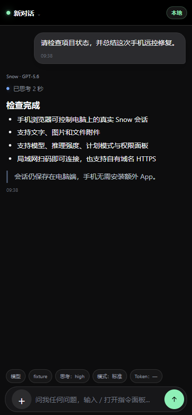
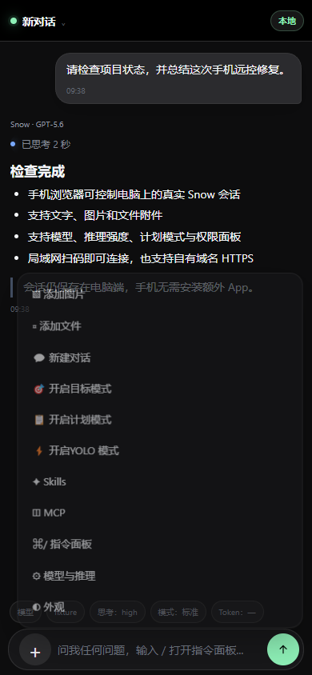

# Snow App 手机远控版：完整说明

[返回项目首页](./README.md) · [下载最新版](https://github.com/zerio1/snowapp-/releases/latest) · [公网部署指南](./docs/zh-CN/2-使用指南/23-手机公网远控.md)

<p align="center">
  
  
</p>

<p align="center">手机端真实界面：会话正文与完整功能菜单</p>

## 产品定位

这是 Snow App 的手机远控版本。电脑继续运行真实 Snow 会话，手机浏览器只通过受限接口查看状态并发出操作：

- 不需要安装 APK 或 iOS App；
- 不把 Snow 数据库、聊天记录或 API Key同步到第三方云服务；
- 局域网可以直接扫码；
- 离开同一 Wi-Fi 时，可以通过自己的 Linux 服务器、FRP 和 HTTPS 域名连接。

手机页面面向实际使用重新设计，不是桌面页面的缩小截图。它包含适合单手操作的会话选择、消息时间线、组合输入、附件、底部操作菜单、交互卡和主题系统。

## 手机远控能力

### 对话

- 查看当前工作区和真实会话消息
- 查看 Markdown、代码块、表格、引用、图片、文件和工具时间线
- 发送文字、图片与普通文件
- 停止正在生成的回复
- 在阅读历史时保持当前位置，并提示新消息
- 新建、切换、重命名、置顶和归档会话

### 模型与工作模式

- 模型和 Profile
- 推理强度与 Responses Fast Mode
- Plan、Goal、Worktree、Workflow、YOLO
- 上下文与 Token 使用摘要
- Snow 已注册的真实命令面板

### 设置与交互

- Skills 列表、搜索、详情和启停
- MCP 状态
- 权限、角色、代码变更、审查与代码库摘要
- 真实工具授权
- `askUserQuestion` 选项、自定义回答和取消
- 日间、夜间、跟随系统主题
- 窄屏、横屏、软键盘、安全区和中文组合输入适配

涉及桌面专属能力或敏感命令时，Snow 仍会保持原有安全确认，不会因为手机远控而自动放行。

## 局域网使用

1. 启动电脑端 Snow App。
2. 打开设置 →“手机远控”。
3. 页面显示“正在监听”和配对二维码后，让手机连接同一可信 Wi-Fi。
4. 扫码，或点击“复制地址”后发送到自己的手机。
5. 首次访问建立 HttpOnly 配对 Cookie 后，地址栏中的临时凭据会自动清除。

如果手机打不开：

- 确认 Snow App 仍在电脑上运行；
- 确认两台设备在同一局域网且路由器没有开启客户端隔离；
- 尝试设置页列出的另一个局域网地址；
- 不要把带配对凭据的完整地址公开发送给他人。

## 公网使用

只在离开同一 Wi-Fi 后仍需控制 Snow 时配置公网入口。

准备：

- Ubuntu 22.04/24.04、x86_64、独立公网 IPv4 的 Linux 服务器；
- 一个自己的域名；
- 可登录该服务器的 SSH 凭据。

设置页的“第一次公网部署”会引导完成：

1. 检查服务器和域名；
2. 生成固定子域名及 DNS 配置；
3. 部署固定版本的 FRP 与 Caddy；
4. 导入客户端配置并验证 HTTPS。

安装包内置 `frpc 0.71.0`，启动前会验证版本、文件大小和 SHA-256。FRP 数据端口只绑定服务器回环地址；外部访问通过 HTTPS 入口。配置验证失败时不会保存凭据，成功后才使用系统安全存储加密保存。

本项目不提供公共代理、中转服务、SaaS 或付费托管。

## 安全设计

```text
手机浏览器
  └─ HTTPS 或可信 LAN + 高熵配对凭据
      └─ Snow Main 内置最小 HTTP 服务
          └─ Renderer RemoteControlBridge
              └─ Snow 现有会话 Hook
```

- 默认生成至少 24 字节高熵凭据
- 一次性配对码、会话有效期、失败次数限制和撤销
- HttpOnly、SameSite Cookie；公网 Cookie 同时要求 Secure
- 无宽泛 CORS，CSP 与 `X-Frame-Options: DENY`
- 请求体和字段长度限制
- 活动会话、工作区、授权 ID、问题 ID 和 pending map 校验
- 图片魔数/MIME 检查、安全文件名和每会话附件数量限制
- 工具参数、输出、错误、角色和配置摘要经过限长与脱敏
- 不开放 CDP，不直接解析 Snow SQLite
- 不向手机返回 API Key、SSH 密码、Cookie、私钥、完整环境变量或内部堆栈

点击“轮换凭据”后，已配对手机、旧链接和未发送附件会立即失效。

## 安装与升级

在 [Releases](https://github.com/zerio1/snowapp-/releases) 下载 Windows x64 安装版或便携版。

### 安装版

`Snow.App.Setup.<version>.exe`

- 显示“仅为我安装 / 为所有用户安装”选择页；
- 默认“仅为我安装”，不会主动请求管理员权限；只有选择所有用户时才提权；
- 升级前先请求新版 Snow 正常清理退出，再自动关闭不支持该信号的旧版进程并等待最多 15 秒；
- 保留应用用户数据，不通过升级删除会话和设置。

### 便携版

`Snow.App.<version>.exe`

无需安装，适合临时测试。不要让安装版和便携版同时运行，否则单实例锁只会保留其中一个。

### Windows 安全提示

当前公开构建未购买商业 Authenticode 证书。请只从本仓库 Release 下载，并核对发布说明中的 SHA-256。

若非常旧的安装仍提示无法关闭：

1. 在系统托盘右键 Snow App；
2. 选择“退出”，而不是只关闭窗口；
3. 确认任务管理器中没有 `Snow App.exe`；
4. 重新运行新版安装器。

不要直接删除 `D:\snowapp\Snow App` 或用户数据目录来处理升级错误。

## 源码开发

环境：

- Node.js 18+
- Rust stable 与 Cargo
- Windows：Visual Studio Build Tools C++ 工作负载

```powershell
npm install
npm run dev
```

验证：

```powershell
npm run check
npm run check:docs
npm run check:mobile
npm run test:remote-control
node --test --experimental-strip-types scripts/installer-upgrade.test.ts
```

Windows 打包：

```powershell
npm run build:win
```

产物位于 `dist/`。打包白名单明确排除 `native/target`、`.snow`、用户数据库、临时日志和历史发布目录。

## 上游项目、署名与许可

本仓库在 [MayDay-wpf/snow-app](https://github.com/MayDay-wpf/snow-app) 的 MIT 许可代码基础上继续开发。

手机远控产品体验参考并复现了 **GPT Mini by [CoimgRain](https://github.com/CoimgRain)**，原项目：[https://github.com/CoimgRain/Codex-Mini](https://github.com/CoimgRain/Codex-Mini)。本项目为独立衍生项目，不代表任何上游项目的官方合作或背书。

> **重要非商业声明：** GPT Mini 仅允许个人、学习、研究、评估等非商业用途使用。允许 fork、修改和继续公开发布，但必须保留对原项目和作者的清晰署名：**GPT Mini by [CoimgRain](https://github.com/CoimgRain)**，并附上原项目链接：[https://github.com/CoimgRain/Codex-Mini](https://github.com/CoimgRain/Codex-Mini)。未经作者事先书面授权，不得用于商业服务、付费托管、SaaS、中转服务、代部署收费、转售访问权或其他商业化用途。

许可证文件：

- [Snow App 上游 MIT License](./LICENSE)
- [Codex Mini Source-Available Non-Commercial License 1.0](./LICENSE-CODEX-MINI)
- [第三方署名与中文声明](./THIRD_PARTY_NOTICES.md)
