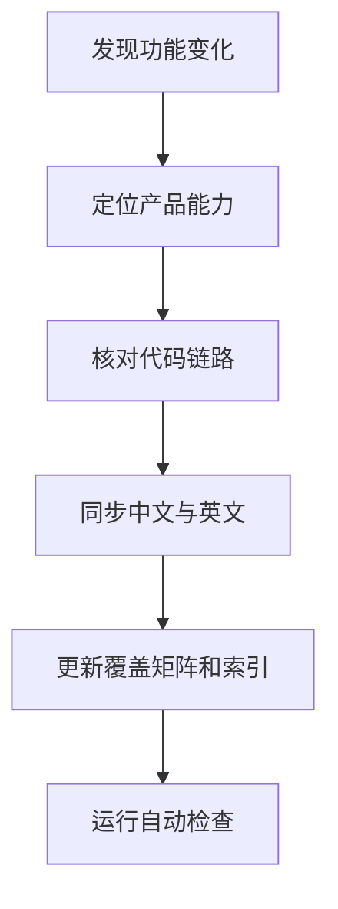
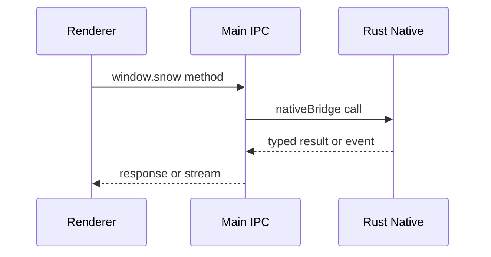
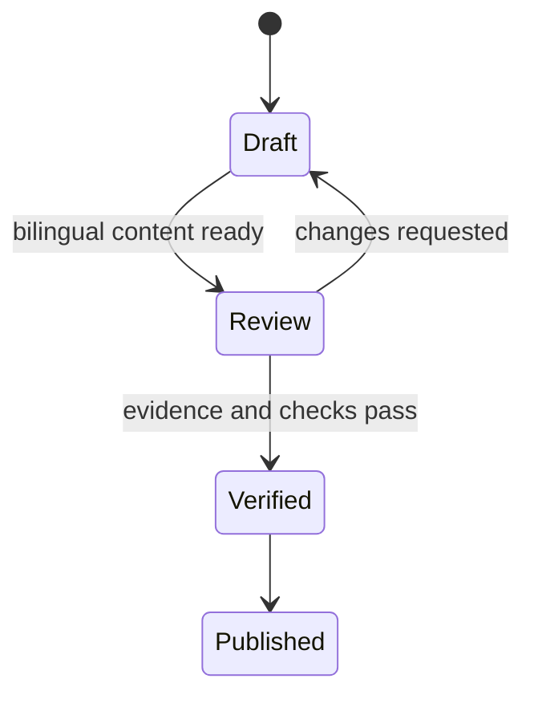
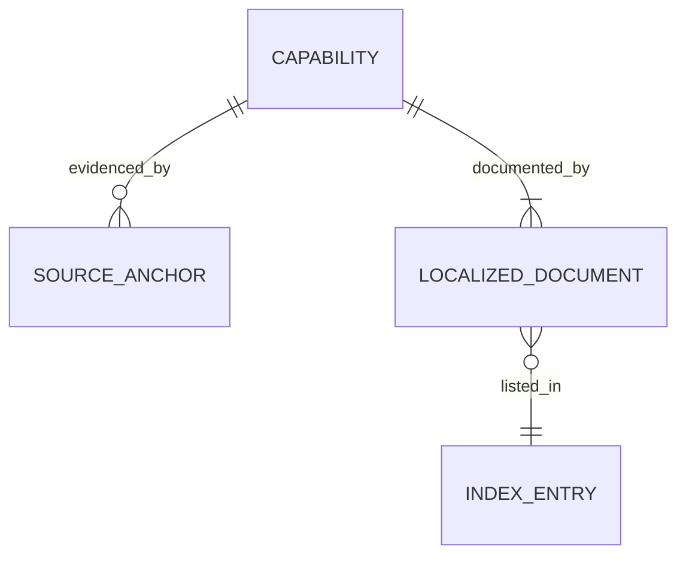
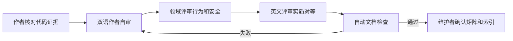

# 文档治理指南 / Documentation Governance Guide

> 本文是 Snow App 文档信息架构、双语维护、代码证据、图表源文件和评审门禁的规范。功能覆盖现状见 [功能文档覆盖审计](FEATURE_COVERAGE.md)。
> This document governs Snow App's documentation architecture, bilingual maintenance, code evidence, diagram sources, and review gates. See the [feature coverage audit](FEATURE_COVERAGE.md) for the current coverage inventory.

<a id="中文规范"></a>
## 中文规范

### 1. 信息架构

文档采用 Diátaxis 思路，但以产品可维护性为最终判据：

| 层级 | 目录或文件 | 读者问题 | 内容边界 |
| --- | --- | --- | --- |
| 总索引 | `docs/README.md` | “有哪些文档？” | 所有可发布 Markdown 的唯一导航入口；每个文档只能漏登为审计失败。 |
| 快速开始 | `docs/zh-CN/1-*.md` | “怎样第一次成功运行？” | 最短成功路径、必要前置条件、首个可验证结果。 |
| 使用指南 | `docs/zh-CN/2-使用指南/` | “怎样完成某个任务？” | 面向目标的步骤、前置条件、结果验证、失败恢复。 |
| 参考手册 | `docs/zh-CN/3-参考手册/` | “准确的字段、工具或路径是什么？” | 枚举、默认值、约束、作用域、兼容性和安全语义。 |
| 架构与开发 | `docs/zh-CN/4-架构与开发/` | “系统为何这样设计，如何安全修改？” | 分层、数据流、扩展链路、构建、测试和排障。 |
| 治理产物 | `docs/FEATURE_COVERAGE.md`, `docs/DOCUMENTATION_GUIDE.md` | “覆盖是否完整，如何持续维护？” | 跨语言共享的双语审计与流程规范。 |

英文树 `docs/en/` 与中文树按“分类编号/文档编号”一一映射，例如中文 `2-使用指南/9-*` 对应英文 `2-guides/9-*`。文件名可按语言自然表达，但编号、主题、产品行为和示例必须实质对等。

#### 内容归属规则

1. 首次成功路径写入快速开始，不在参考手册复制长步骤。
2. 用户任务写入使用指南；同一任务只有一个主文档，其他文档使用链接。
3. 字段、工具参数、路径和状态机写入参考手册；指南只保留完成任务所需的最小子集。
4. 跨进程链路、设计理由和贡献者流程写入架构与开发文档。
5. 新功能先在 `FEATURE_COVERAGE.md` 定位能力行，再决定新增专题还是聚合到现有文档。
6. `resources/skills/snow-app-docs/SKILL.md` 是文档消费入口，不替代 `docs/` 中的权威正文。

### 2. 证据优先级与代码锚点

文档结论按以下顺序取证：

1. 用户可达入口：路由、菜单、`SETTINGS_ITEMS`、命令注册表与 UI 条件。
2. 跨层合约：preload 类型/API、IPC handler、broker 和事件名。
3. 能力实现：Rust export、MCP 注册与条件暴露、存储 service、迁移。
4. 构建与平台资产：`scripts/`、`resources/` 和打包配置。
5. 现有文档只能用于发现线索；与代码冲突时必须回到代码核验并修正文档。

代码锚点使用仓库相对路径并放在反引号中：

- 推荐：`native/src/mcp/tools.rs::collect_all_mcp_tools`
- 推荐：`src/renderer/components/sidebar/settingsItems.ts` 中的 `SETTINGS_ITEMS`
- 不推荐：只有文件名 `tools.rs`，因为无法唯一定位。
- 不推荐：把易漂移的绝对行号作为唯一证据；行号可辅助，但必须同时给文件或符号。
- 禁止：根据相似命名推测接口、参数或默认值。

涉及跨层功能时，至少核对真正经过的链路：

```text
Renderer UI
  -> window.snow preload API
  -> Electron IPC handler or broker
  -> nativeBridge
  -> Rust export / MCP service
  -> storage or provider API
```

如果某层不参与，应明确说明原因，不能为满足模板虚构锚点。

### 3. 写作模板

#### 3.1 使用指南模板

```markdown
# <以用户目标命名>

> 适用版本、平台或作用域。

## 目标
完成后用户能观察到的结果。

## 前置条件
- 必需配置
- 权限或平台限制

## 操作步骤
1. 从真实 UI 入口开始。
2. 给出必要输入和选择。
3. 在副作用前标注确认与影响。

## 验证
说明成功状态、可见反馈或查询方式。

## 常见问题与恢复
列出稳定错误条件、无损恢复和需人工确认的破坏性操作。

## 实现锚点
- `path/to/file.ts::symbol`
```

#### 3.2 参考手册模板

```markdown
# <对象>参考

## 作用域与来源
配置文件、数据库、项目级或全局级来源。

## 字段或命令
| 名称 | 类型 | 必填 | 默认值 | 约束 | 生效时机 |
| --- | --- | --- | --- | --- | --- |

## 状态与错误
稳定状态、错误码、回退行为。

## 安全与兼容性
脱敏、确认、平台差异、弃用策略。

## 源码锚点
- `path/to/implementation.rs::symbol`
```

#### 3.3 架构文档模板

```markdown
# <子系统>架构

## 上下文与目标
## 职责与非职责
## 组件和边界
## 调用或数据流
## 状态、失败与恢复
## 安全、性能与平台权衡
## 扩展步骤与验证
## 源码锚点
```

#### 3.4 覆盖矩阵行模板

```markdown
| 功能中文名 / English capability | `source/path::symbol` | [中文文档](...) | [English docs](...) | C/A/R |
```

状态只能使用 `FEATURE_COVERAGE.md` 定义的有效值。覆盖行描述产品能力，不把每个内部函数拆成伪功能。

### 4. 双语同步

1. 中文与英文文档必须在同一功能变更中提交，不能先合入一种语言再补另一种。
2. 本地化文档按分类编号和文档编号配对；新增编号必须在两棵目录中各出现一次。
3. 双语要求**实质对等**，不是机械逐句翻译：前置条件、步骤、默认值、风险、平台差异、示例结果和源码锚点必须一致。
4. 代码、命令、路径、字段名和错误码保持原文；自然语言说明本地化。
5. 修改一侧标题或目录时，同步修正两侧交叉链接和 `docs/README.md` 索引。
6. 共享治理文档可像本文一样在同一文件内分为完整中文与英文部分，不再复制到语言目录。
7. 英文正文不得保留模板占位串或无说明的中文段落。合理的中文文件路径、代码、配置值和专有内容应放入代码围栏或行内代码；确需保留自然语言时，在该行加入 `<!-- docs-check: allow-cjk -->` 并说明原因。
8. 每次同步后运行 `node scripts/check-docs.cjs`。编号配对通过只证明文件存在，不替代人工的内容等价评审。

### 5. Mermaid 图规范

Mermaid 源码必须保存在 Markdown 的 `mermaid` fence 中，允许的图类型为：

| 类型 | 首行 | 用途 |
| --- | --- | --- |
| 流程图 | `flowchart TD` 或其他合法方向 | 用户步骤、决策、数据流。 |
| 时序图 | `sequenceDiagram` | 跨进程、网络和异步交互。 |
| 状态图 | `stateDiagram-v2` | 会话、任务、更新或迁移状态。 |
| ER 图 | `erDiagram` | 持久化实体与关系。 |

规则：

- 使用 fenced source，禁止用 PNG、JPEG、WebP、PDF 等二进制图替代 Mermaid 源码。
- fence 必须成对；首个非空、非注释行必须声明受支持类型。
- 新流程图使用 `flowchart`，不用旧式 `graph` 别名，保证检查器和渲染器语义一致。
- 节点名称简短，方向与页面宽度匹配；避免交叉线和超长节点。
- Mermaid 节点中不放 KaTeX；公式写在图前后正文。
- 中英文页面中的结构、状态和边必须一致；标签可以本地化。
- 图只表达关系，不替代必要的文本、表格、安全提示和可复制命令。









### 6. 功能变更 Definition of Done

功能变更只有在以下条目全部满足后才完成：

- [ ] 已从真实入口验证用户行为、权限边界、错误路径和平台差异。
- [ ] 实现链路类型完整；TypeScript 不使用 `any`，相关构建或测试通过。
- [ ] 中文和英文文档已按相同主题、编号和事实同步。
- [ ] 新增或改变设置页时，核对 21 页清单及 `FEATURE_COVERAGE.md`。
- [ ] 新增、删除、重命名或改变工具暴露条件时，核对 `builtin_services_in_order`、动态追加逻辑和双语内置工具参考。
- [ ] 新增配置字段、存储位置、状态或错误码时，更新相应参考手册。
- [ ] 新增文档已登记到 `docs/README.md`，相对链接均可解析。
- [ ] Mermaid 保留可评审源码，未用二进制图片替代。
- [ ] `node scripts/check-docs.cjs` 通过；若因并行集成阶段的索引尚未更新而失败，必须在交接中逐项列出，不得宣称检查通过。
- [ ] 涉及 `src/` 时运行 TypeScript 检查；涉及 `native/src/` 时运行 Rust 构建/检查并重启应用验证；纯文档与检查脚本变更至少运行文档检查器和脚本语法检查。

### 7. 评审流程



评审职责：

1. **作者**：提供源码锚点、范围说明、双语正文和验证结果。
2. **领域评审者**：验证功能行为、默认值、权限、失败恢复与平台差异。
3. **语言评审者**：验证英文自然度和双语实质对等，不只比较标题数量。
4. **维护者**：确认信息架构、覆盖矩阵、索引和自动检查结果。

评审记录至少回答：改了什么用户行为、代码证据在哪里、两种语言如何同步、如何验证、还有哪些明确的非目标。发现事实冲突时，以当前可达代码行为为准并在同一变更中修正文档。

<a id="english-guidelines"></a>
## English guidelines

### 1. Information architecture

Snow App uses a Diátaxis-inspired structure with product maintainability as the deciding rule:

| Layer | Directory or file | Reader question | Boundary |
| --- | --- | --- | --- |
| Master index | `docs/README.md` | “What documentation exists?” | The single navigation entry for every publishable Markdown file. An unlisted document is an audit failure. |
| Tutorial | `docs/en/1-*.md` | “How do I succeed on the first run?” | Shortest successful path, prerequisites, and first verifiable result. |
| How-to guides | `docs/en/2-guides/` | “How do I complete a task?” | Goal-oriented steps, prerequisites, verification, and recovery. |
| Reference | `docs/en/3-reference/` | “What exactly is this field, tool, or path?” | Enumerations, defaults, constraints, scopes, compatibility, and security semantics. |
| Architecture and development | `docs/en/4-architecture-and-development/` | “Why is the system designed this way, and how can it be changed safely?” | Layers, data flow, extension paths, builds, tests, and troubleshooting. |
| Governance artifacts | `docs/FEATURE_COVERAGE.md`, `docs/DOCUMENTATION_GUIDE.md` | “Is coverage complete, and how is it maintained?” | Shared bilingual audit and process rules. |

The English and Chinese trees map one-to-one by category number and document number. Names should be natural in each language, while numbering, topic, behavior, examples, and source evidence remain equivalent.

Content placement rules:

1. Put the shortest first-success path in the tutorial; do not duplicate long procedures in reference pages.
2. Put user tasks in how-to guides. Choose one canonical guide per task and link to it elsewhere.
3. Put fields, tool parameters, paths, and state machines in reference pages. Guides retain only the subset needed for the task.
4. Put cross-process flows, design rationale, and contributor workflows in architecture/development pages.
5. Locate the capability in `FEATURE_COVERAGE.md` before creating a dedicated page or aggregating it into an existing page.
6. `resources/skills/snow-app-docs/SKILL.md` is a documentation consumer entry point, not a replacement for authoritative content under `docs/`.

### 2. Evidence and code anchors

Use evidence in this order: reachable UI entries and registries; preload/IPC contracts; Rust exports, MCP exposure rules, storage services and migrations; build scripts and platform resources. Existing prose is a discovery aid, not stronger evidence than current reachable code.

Write repository-relative paths in inline code and include a symbol when one identifies the contract more precisely, for example `native/src/mcp/tools.rs::collect_all_mcp_tools`. Do not use a bare ambiguous filename, an unstable absolute line number as the only evidence, or a guessed interface. For cross-layer features, verify the actual renderer → preload → main → native → storage/provider path. If a layer is intentionally absent, document why instead of inventing an anchor.

### 3. Writing templates

A how-to guide contains: a user-goal title, applicability, prerequisites, numbered actions from a real UI entry, observable verification, recovery guidance, and implementation anchors. A reference page contains: scope/source, a field or command table with types/defaults/constraints/effect timing, states and errors, security/compatibility notes, and source anchors. An architecture page contains: context, responsibilities and non-responsibilities, components and boundaries, flow, state/failure/recovery, trade-offs, extension steps, verification, and anchors.

A coverage row uses this shape:

```markdown
| 中文功能名 / English capability | `source/path::symbol` | [中文文档](...) | [English docs](...) | C/A/R |
```

Only statuses defined by `FEATURE_COVERAGE.md` are valid. Rows represent product capabilities, not one synthetic feature per helper function.

### 4. Bilingual synchronization

1. Chinese and English changes ship together.
2. Pair localized files by category and document number, with exactly one file per language for each key.
3. Require substantive parity: prerequisites, steps, defaults, risks, platform differences, example outcomes, and source anchors must agree.
4. Preserve code, commands, paths, field names, and error codes; localize explanatory prose.
5. When titles or paths move, update cross-links and the master index in both languages.
6. Shared governance files may contain complete Chinese and English sections in one root-level file.
7. English prose must not contain template corruption or unexplained Chinese text. Put legitimate Chinese paths, values, and proper content in code spans/fences. For a necessary natural-language exception, add `<!-- docs-check: allow-cjk -->` on that line and explain why.
8. Run `node scripts/check-docs.cjs`. Numeric pairing proves file presence, not semantic equivalence; human review remains mandatory.

### 5. Mermaid source rules

Use fenced Mermaid source, never a binary PNG/JPEG/WebP/PDF replacement. Supported declarations are `flowchart <direction>`, `sequenceDiagram`, `stateDiagram-v2`, and `erDiagram`. Every fence must close, and its first meaningful line must declare a supported type. New flowcharts use `flowchart`, not the legacy `graph` alias. Keep labels short, avoid crossing edges, do not put KaTeX in nodes, and keep topology/state/edges equivalent across languages. A diagram supplements rather than replaces prose, security notes, tables, and copyable commands.

### 6. Feature-change Definition of Done

A feature change is complete only when:

- [ ] Reachable behavior, permissions, failure paths, and platform differences were verified from code.
- [ ] The implementation chain remains typed and the relevant build/tests pass.
- [ ] Chinese and English documentation are substantively synchronized under matching numeric keys.
- [ ] Settings-page changes reconcile the 21-page inventory and coverage matrix.
- [ ] Tool changes reconcile fixed registration, conditional/dynamic exposure, and both built-in tool references.
- [ ] New fields, paths, states, and error codes update the appropriate reference page.
- [ ] Every new document is in `docs/README.md`, and relative Markdown links resolve.
- [ ] Mermaid remains reviewable source rather than a binary substitute.
- [ ] `node scripts/check-docs.cjs` passes, or an integration-stage index failure is reported explicitly without claiming success.
- [ ] Validation matches the change: TypeScript checks for `src/`, Rust checks/build plus restart verification for `native/src/`, and at minimum the docs checker plus script syntax validation for docs-only changes.

### 7. Review workflow

The author supplies scope, source anchors, bilingual content, and validation. A domain reviewer checks behavior, defaults, permissions, failure recovery, and platform differences. A language reviewer checks natural English and substantive parity. A maintainer checks information architecture, the coverage matrix, the master index, and automated results. Reviews must answer what user behavior changed, where the evidence is, how both languages stayed aligned, how the result was verified, and what is explicitly out of scope. When prose and reachable code conflict, current code behavior wins and the documentation is corrected in the same change.
