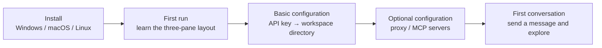

# 1-Getting Started

This guide walks you through installing Snow App, running it for the first time, completing the basic configuration, and having your first conversation with the AI.

## 1. Installation

### Windows

1. Download `Snow-App-Setup-<version>.exe`;
2. Run it and follow the installation wizard; you may choose the installation directory;
3. Launch Snow App from the Start menu or a desktop shortcut.

> A portable `Snow-App-<version>.exe` is also available and runs without installation.

### macOS

1. Download `Snow-App-<version>-<arch>.dmg` and drag the app into Applications;
2. If macOS reports that the app is damaged or cannot be opened, run:

```bash
sudo xattr -rd com.apple.quarantine /Applications/Snow\ App.app
```

### Linux

Download the AppImage or deb package for your distribution and install it using the appropriate system method.

## 2. First Run

After launch, the interface has three main areas:

| Area | Contents |
| --- | --- |
| **Sidebar** | Local and SSH projects/workspaces, conversations, memos, scheduled tasks, and settings |
| **Main area** | AI chat, terminal, Git, browser, codebase, and other views |
| **Right panel** | File reader with Markdown/image/Office previews, diff preview, and Git panels in multiple tabs |

See [Using Chat and the AI Assistant](2-guides/10-using-chat-and-ai.md) for a complete tour.

## 3. Basic Configuration

For a first-time setup, complete these steps in order:

1. **Configure API keys**: open Settings → API Settings and enter your model provider's key;
2. **Add a workspace directory**: use Sidebar → Add Directory and choose a local or SSH workspace;
3. **Optional — configure a proxy**: open Settings → Proxy & Browser if your network requires one;
4. **Optional — configure MCP servers**: open Settings → MCP Settings to add external tool services.



| Task | Guide |
| --- | --- |
| Configure MCP servers | [Configure MCP Servers](2-guides/1-configure-mcp.md) |
| Install and manage Skills | [Install and Manage Skills](2-guides/2-install-and-manage-skills.md) |
| Configure API keys and models | [Configure API Keys and Models](2-guides/3-configure-api-keys.md) |
| Configure proxy and network | [Configure Proxy and Network](2-guides/4-configure-proxy.md) |
| Configure Hooks and sub-agents | [Configure Hooks and Sub-agents](2-guides/5-configure-hooks-and-subagents.md) |

## 4. First Conversation

After configuring an API key and selecting a workspace, send this message from the main-area input:

```text
Hello! Please describe the structure of the current workspace and tell me which file is the largest.
```

You will see:

1. The AI streams its text response;
2. When needed, it calls tools to list directories, read file sizes, and inspect files, with each call shown as a live card;
3. The AI returns a final summary. You can copy it, view the raw Markdown, or roll back from the response boundary.

For a vision example, paste an image and ask, "What is in this image?" A configured vision model is required. You can also type `/` to open the command palette and try `/file-changes` to inspect files and diffs produced by the AI in the current conversation.

## 5. Next Steps

- Complete chat and AI assistant guide: [Using Chat and the AI Assistant](2-guides/10-using-chat-and-ai.md)
- Terminal and SSH: [Terminal and SSH Remote Management](2-guides/11-terminal-and-ssh.md)
- Git and code browsing: [Git Panel and Code Browsing](2-guides/12-git-and-code-browsing.md)
- Image generation: [Image Generation](2-guides/9-image-generation.md)
- Configuration format: [settings.json Reference](3-reference/1-settings-json-reference.md)
- All configuration-file fields: [Configuration File Field Reference](3-reference/3-config-file-field-reference.md)
- AI built-in tools: [Built-in Tools Reference](3-reference/2-builtin-tools-reference.md)
- Browser automation: [Browser Automation](2-guides/6-browser-automation.md)
- Codebase index and diagnostics: [Codebase Index and Diagnostics](2-guides/7-codebase-index-and-diagnostics.md)
