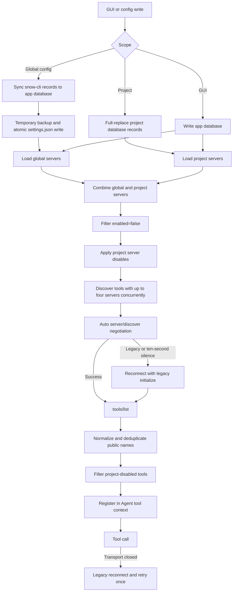

# 1-Configure MCP Servers

MCP (Model Context Protocol) servers provide external tools to the AI. Snow App supports local `stdio` and remote Streamable HTTP transports and combines global and project servers into the effective tool set for the current project.

## 1. Configuration entries and scopes

| Entry                                                          | Storage and activation semantics                                                                                                                              |
| -------------------------------------------------------------- | ------------------------------------------------------------------------------------------------------------------------------------------------------------- |
| **Settings → MCP Settings** (settings page id: `mcp-settings`) | Manages the app database directly; supports global/project servers, and server and tool toggles (global + project).                                           |
| Agent `config` service                                         | Global `settings.mcpServers` is synchronized into the app database and written to `~/.snow/settings.json`; project scope writes directly to the app database. |
| Manual `~/.snow/settings.json` editing                         | Changes only the Snow CLI shared file; run **Sync Snow CLI MCP settings** in MCP Settings afterward.                                                          |

Global servers are visible to every project. Project servers are **added to**, not name-based replacements for, global servers; their internal IDs are independent. When public server names conflict, Snow App normalizes them and appends a stable short hash. Always use **Fetch Tools** or the project tool list to obtain the actual full tool name.

## 2. Transports and fields

| Field       | `stdio`                                  | `http`                    | Meaning                                                    |
| ----------- | ---------------------------------------- | ------------------------- | ---------------------------------------------------------- |
| `type`      | `stdio` (`local` also connects as stdio) | `http`                    | Defaults to `stdio`                                        |
| `command`   | Required                                 | Ignored                   | Executable path or resolvable command                      |
| `args`      | Optional string array                    | Ignored                   | Passed to the child process item by item                   |
| `env`       | Optional string object                   | Ignored                   | Environment variables for the child process                |
| `url`       | Ignored                                  | Required                  | Streamable HTTP MCP endpoint                               |
| `headers`   | Ignored                                  | Optional string object    | HTTP headers, including authorization when required        |
| `enabled`   | Optional                                 | Optional                  | Defaults to `true`                                         |
| `timeoutMs` | Optional positive integer                | Optional positive integer | Total connection-and-discovery budget; default `120000` ms |

`timeoutMs` currently controls the **tool-discovery stage**: connecting and `tools/list` share one deadline. It is not a general timeout for every `tools/call`; a long-running server must implement its own cancellation or timeout.

### 2.1 stdio example

```json
{
  "type": "stdio",
  "command": "npx",
  "args": ["-y", "@example/mcp-server"],
  "env": {
    "EXAMPLE_REGION": "local"
  },
  "enabled": true,
  "timeoutMs": 120000
}
```

On Windows, enter normal paths in the GUI; in JSON, backslashes must be escaped as `\\`. Snow App resolves PATH for stdio processes using the terminal shell environment, but production configurations should prefer a verified absolute executable path.

### 2.2 HTTP example

```json
{
  "type": "http",
  "url": "https://mcp.example.com/mcp",
  "headers": {
    "Authorization": "Bearer <token>"
  },
  "enabled": true,
  "timeoutMs": 30000
}
```

Use trusted HTTPS endpoints only. An HTTP server can see tool arguments sent to it and can return content that enters model context.

## 3. Configure in Settings

1. Open **Settings → MCP Settings**;
2. Select Global or Project scope;
3. Click **Add Service** and choose `stdio` or `http`;
4. Fill the transport-specific required fields, `enabled`, and optional `timeoutMs`;
5. Save and click **Fetch Tools**;
6. Disable unneeded servers or individual tools in the project tool list;
7. Validate with one read-only call using minimal arguments.

JSON import accepts `{ "mcpServers": {...} }`, Claude-style `{ "servers": {...} }`, and a plain server map. Before importing, inspect unknown fields, commands, environment variables, headers, and destination URLs.

## 4. Configure through the Agent `config` service

### 4.1 Global configuration

```json
{
  "scope": "settings",
  "key": "mcpServers",
  "value": {
    "docs": {
      "type": "http",
      "url": "https://mcp.example.com/mcp",
      "headers": {},
      "enabled": true,
      "timeoutMs": 30000
    },
    "local-tools": {
      "type": "stdio",
      "command": "npx",
      "args": ["-y", "@example/mcp-server"],
      "env": {},
      "enabled": true,
      "timeoutMs": 120000
    }
  }
}
```

The actual order for writing global `settings.mcpServers` is:

1. Synchronize the server map into the app database;
2. Upsert records with `source=snow-cli` and IDs `global:<name>`;
3. Delete orphaned `global:*` records from that source when absent from the new map;
4. Leave UI-manual records from other sources untouched by that diff deletion;
5. Back up the previous `settings.json`, atomically replace the file, and remove this temporary backup after success.

The change therefore affects MCP discovery immediately. `value` is a **complete server map**. Do not send only the server you want to edit, or other global `snow-cli` entries will be removed by synchronization. Run `config-get`, modify the complete object, and then run `config-set`.

### 4.2 Project configuration

```text
config-get scope=settings key=mcpServers projectId=<projectId>
config-set scope=settings key=mcpServers projectId=<projectId> value={...complete map...}
```

With `projectId`, `value` **fully replaces that project's servers**: existing project entries are deleted before the new entries are inserted. Global servers remain and are combined with project servers. Project writes go directly to the app database and take effect immediately; do not treat `.config-backups` as persistent history for project MCP configuration.

`config-delete scope=settings key=mcpServers projectId=<projectId>` clears every MCP server owned by that project and requires explicit confirmation first.

## 5. Configuration, discovery, and call data flow



## 6. Protocol discovery and legacy fallback

Snow App uses the same lifecycle strategy for `stdio` and HTTP:

1. Auto mode prefers the stateless `2026-07-28` `server/discover` flow;
2. The SDK automatically downgrades on standard `Method Not Found` / `Unsupported Protocol Version` responses;
3. For other negotiation JSON-RPC errors or a connection closed during discovery, Snow App reconnects with legacy `initialize`;
4. If the `server/discover` probe itself fails at the transport level (for example a session-only `2024-11-05` server answers `discover` with HTTP 400/404/405 and a body that is not a valid JSON-RPC error), it is also treated as "no stateless discovery support" and falls back to legacy `initialize`;
5. If `server/discover` is **silent for 10 seconds**, it is also treated as a legacy server and reconnected;
6. After connection, Snow App calls `tools/list`;
7. If a tool call reports `Transport closed`, Snow App reconnects with the legacy handshake and retries once. If the retry fails, it preserves the original transport error for diagnosis.

Up to four servers are discovered concurrently. One server's failure is logged and skipped without preventing tools from other servers from registering.

## 7. Enablement conditions and tool disables

An effective tool must satisfy all of these conditions:

- The server configuration is not `enabled: false`;
- For a global external server, the current project has not disabled that server;
- The global scope has not disabled that tool (global tool toggle, effective for all projects);
- The current project has not disabled that exact full public tool name;
- A project-owned server is itself enabled. Project-owned servers do not use the global-server project toggle, but their individual tools can still be disabled.

A server appearing in Settings therefore does not guarantee that its tools enter the current Agent context. After changing global or project toggles, fetch tools again and use the actual full name in a sub-agent's `toolsJson` or a Skill's `allowed-tools`.

## 8. Tool-level toggles

The MCP Settings panel supports **tool-level toggles**: each server row shows a tool-count button; clicking it expands that server's tool list.

- Each tool can be enabled/disabled independently; **global-scope** toggles apply to every project, **project-scope** toggles apply only to the current project, and both share the same storage as the **Project MCP** popup in the chat composer;
- **Enable all / Disable all** batch buttons and search filtering by name/description are provided; clicking a tool row shows its details (full description and parameter schema);
- Disable semantics are a **blacklist**: everything is enabled by default and only disabled tools enter the blacklist;
- Server-level and tool-level toggles are an **AND** relationship: when a server is disabled, all of its tools are unavailable even if their tool-level toggles are still enabled.

Tool-level toggles (global and project) are managed by the MCP Settings panel and stored in the app database; they are **not written to settings.json** and are not configured through the `config` service (`config-list`/`config-get`/`config-set`) — UI only.

## 9. Privacy, credentials, and supply-chain risk

### 9.1 Credentials are not automatically safe

- `env` and `headers` are stored as configuration and sent to the external process or HTTP service;
- `config` guarantees masking for dedicated sensitive keys such as `apiKey` and `visionApiKey`, but `settings.mcpServers` as a whole is not a sensitive key. **Do not assume MCP `env` or `headers` are automatically hidden in config reads**;
- Never put tokens in documentation, chat, screenshots, repositories, or shareable project configuration. Prefer controlled environment injection, short-lived least-privilege tokens, and server-side secret management;
- Do not ask the agent to echo a credential to “verify” it. Use a read-only health check to verify authorization.

### 9.2 Tool-result privacy

Snow App masks a tool result only when privacy settings are enabled **and** that exact full tool name is selected in the tool-result masking list. API masking falls back to local rules on failure. An external MCP tool not selected there is not automatically masked. Limit query scope for database, filesystem, log, and SaaS tools and minimize sensitive data before it reaches model context.

### 9.3 Trust commands and servers

- A stdio command runs with the current user's permissions and can access files and networks available to that user;
- An HTTP service receives tool arguments and may log requests;
- Verify the publisher, package name, pinned version, source code, and data policy before installation or activation;
- Avoid untrusted `npx -y` packages, unknown scripts, and plaintext HTTP;
- Disable write/delete tools first and expose only the minimum set needed for the task.

## 10. Actual temporary-backup semantics

For global file-backed config writes, Snow App creates a pre-write backup under `~/.snow/.config-backups/` and atomically replaces the target file. **After a successful write, that backup is removed immediately**. It is a temporary write-safety net, not dependable version history. A failed or concurrent operation may leave a backup; cleanup keeps at most 10 leftovers per file.

Project MCP uses a database full-replace flow and should not rely on the file backup above. Before a major change, use `config-get` to preserve an approved, non-sensitive copy. Do not copy plaintext credentials into chat or documentation.

## 11. Troubleshooting

| Symptom                                              | Cause and fix                                                                                                                                                                                                                                         |
| ---------------------------------------------------- | ----------------------------------------------------------------------------------------------------------------------------------------------------------------------------------------------------------------------------------------------------- |
| stdio reports no command                             | `type` is `stdio` but `command` is empty; check executable resolution and JSON path escaping.                                                                                                                                                         |
| HTTP reports no URL                                  | `type` is `http` but `url` is empty; verify that the endpoint is MCP Streamable HTTP.                                                                                                                                                                 |
| `server/discover` times out                          | The client retries legacy after 10 seconds; if that also fails, inspect server logs, protocol support, and networking.                                                                                                                                |
| HTTP server answers `discover` with HTTP 400/404/405 | Common for session-only legacy servers (e.g. Chat2DB's embedded Spring MCP): treated as "no stateless discovery support" and automatically falls back to legacy `initialize`; if the fallback also fails, inspect server logs and auth configuration. |
| Discovery exceeds `timeoutMs`                        | Connection and `tools/list` share the budget; increase the positive value carefully or fix slow server startup.                                                                                                                                       |
| One server fails while others work                   | Discovery is isolated per server; diagnose only the failing server instead of restarting everything.                                                                                                                                                  |
| Tool list is empty                                   | Check server `enabled`, project server toggle, project tool disables, and the server's `tools/list` response.                                                                                                                                         |
| Tool name differs from config name                   | Names were normalized or hash-suffixed after a collision; use the public name returned by the UI/tool list.                                                                                                                                           |
| Other global entries disappear after one edit        | `settings.mcpServers` is a full map with diff synchronization; restore and write the complete object.                                                                                                                                                 |
| Global tools remain after editing project config     | Project servers are added to global servers; disable the global server in project tool settings.                                                                                                                                                      |
| `Transport closed`                                   | Snow App reconnects with legacy mode and retries once; persistent failures require child-process, server-log, or SDK investigation.                                                                                                                   |
| Credentials appear in a config read                  | MCP `env`/`headers` are not guaranteed to be masked; rotate exposed credentials and switch to secure injection.                                                                                                                                       |

## 12. References

- [settings.json reference](../3-reference/1-settings-json-reference.md)
- [Built-in tools reference](../3-reference/2-builtin-tools-reference.md)
