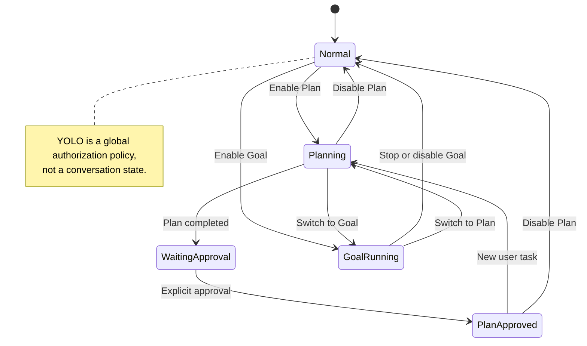
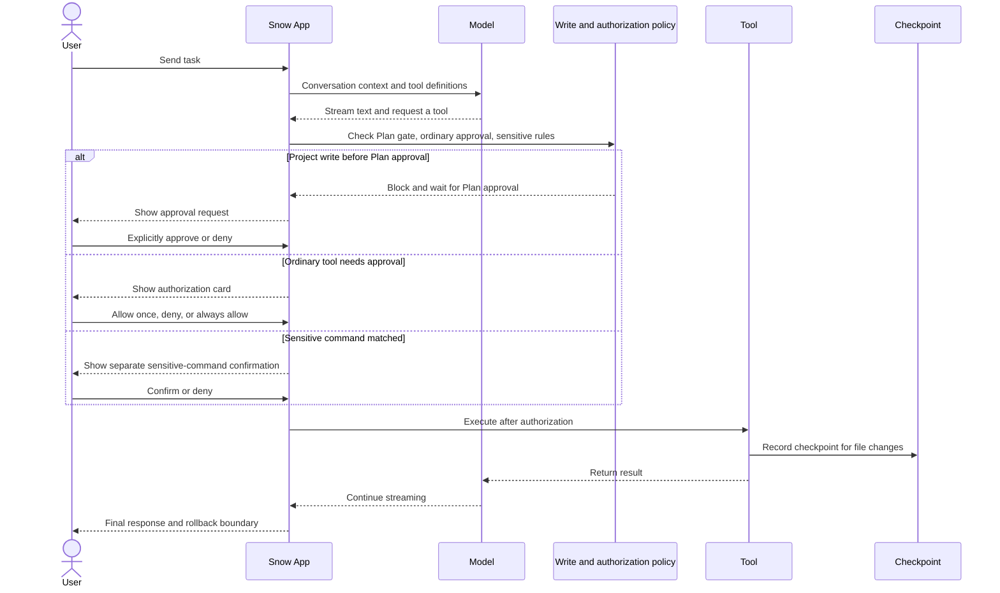

# 10-Using Chat and the AI Assistant

Snow App uses conversation as the main entry point for AI collaboration. In addition to streaming text, the AI can read and modify files, run commands, search the web, operate a browser, generate images, and call sub-agents within the active authorization boundaries. Every step appears as a tool card.

## 1. Interface and First Conversation

| Area              | Contents                                                                                                                |
| ----------------- | ----------------------------------------------------------------------------------------------------------------------- |
| Sidebar           | Local/SSH projects, conversations, memos, scheduled tasks, and settings                                                 |
| Main area         | AI chat, terminal, Git, browser, codebase, image library, and other views                                               |
| Right panel       | File reader, Markdown/Office/image previews, diffs, and Git panels in multiple tabs                                     |
| Top bar and input | Switch views/API profiles, choose a model and reasoning effort, enter `/` commands, mention `@` files, or attach images |

1. Select a project, then create or open a conversation;
2. Enter a task and send it; use `Shift+Enter` for a newline;
3. The AI streams its response and requests tool authorization when required;
4. Tool results return to the AI, which continues the response.

```text
Find the Python files in this project, inspect the key entry points, and summarize each file's purpose.
```

See [Configure API Keys and Models](3-configure-api-keys.md) for profile and model setup.

**Conversation model routing**: an ordinary conversation uses the model selected for that conversation. Snow App does not automatically switch between basic and advanced models based on prompt complexity. `advancedModel` is only the conversation profile's default advanced model, and `advancedModel` and `basicModel` never fall back to each other.

**Title routing**: the first generated conversation title uses `basicModel`; its provider, credentials, and profile follow the profile bound to that conversation. If the bound profile has been deleted, ordinary-conversation rules fall back to the current active profile.

### 1.1 Manage Local Projects and Workspaces

The **Projects** area in the left sidebar can either create a new directory on disk or register an existing one. These operations have different boundaries:

1. **Create a project**: select **Create project** from the plus menu, enter a name, and choose its parent directory. The main process creates the real project directory, registers it as a local workspace, and makes it active;
2. **Add an existing local directory**: select **Add local directory**, then use the directory picker or drop **exactly one folder** onto the dialog. Snow registers the existing path without copying its contents and makes the new entry active;
3. **Activate and reorder**: click a workspace, or choose **Set as active** from its ellipsis/context menu. Drag workspace rows to reorder them; the resulting `sortOrder` values are persisted;
4. **Rename and remove**: **Rename** changes only the display name inside Snow while preserving the `directoryId` and disk path. Confirming **Delete** removes the registration from the workspace list; it is distinct from deleting files or directories in the project explorer;
5. **Open details**: **Details** opens that workspace in the project explorer, even when it is not currently active. See [Git Panel and Code Browsing](12-git-and-code-browsing.md) for explorer operations.

SSH workspaces do not use the local picker/drop flow. Select **Add SSH directory** to open the separate connection wizard; see [Terminal and SSH](11-terminal-and-ssh.md) for credentials, remote paths, and reconnection behavior.

## 2. Conversations and Input

### 2.1 Conversation Actions

Use the conversation row's ellipsis button or right-click menu to pin/unpin, rename (also available by double-clicking the title), set an icon, export as Markdown/HTML/JSON/CSV, enter multi-select mode, or delete. Draft text and image chips are stored per conversation, restored when you switch back, and cleared after a successful send.

Single and batch deletion both require confirmation. Deleting a conversation also stops related streams, cascades to its sub-agent conversations, and clears its input draft. If a conversation references image-library items, the dialog shows a **Delete images too** option:

- It is **off by default**, so deleting a conversation keeps its library images;
- Physical image files and SQLite index rows are removed only when you explicitly select the option;
- Deleting an individual item in the image library is a separate action that removes its file and index entry and rewrites conversation messages that reference it.

#### Dragging a history conversation onto the composer as prefix context

**Drag a history conversation from the sidebar onto the chat composer** to attach it as **prefix context**, injected together with your **next message**:

- An **attachment bar** appears above the composer showing the attached conversations with an estimated character count; each attachment can be removed individually or folded into a summary row;
- Multiple attached conversations are concatenated in drag order before your current message;
- Injection budgets are configurable in settings: single-conversation budget defaults to `40000` characters, total budget to `60000` characters (range `1000–200000`); overflow is truncated;
- Dragging onto a composer that already has a draft works the same way; after a successful send the attachments are consumed and do not linger into later messages.

### 2.2 Cross-Project Notification Aggregation

The sidebar **Conversations** section normally shows only the **current project's** conversations. When conversations in **other projects** become active, they are aggregated into a **cross-project notification** block below the list, so background session state is not lost after switching projects:

- **Aggregated content**: conversations in other projects that are **streaming**, **need attention** (e.g. awaiting approval or a question), or **completed**, grouped by their project, newest update first within each group;
- **Status badges**: streaming conversations show an in-progress animation; conversations needing attention get an **attention-required** emphasis badge (the same indicator appears on entries in the conversation list);
- **Quick jump**: clicking a notification switches to that project and opens the conversation; it then appears in the current project's list as usual;
- **Name fallback**: when a project display name cannot be resolved, the last segment of its directory path is used.

### 2.3 Files and Images

- Type `@` to search workspace files. Browse into folders, use breadcrumbs to jump to a parent, or press the left arrow to go up one level;
- Type `@?<query>` for a **natural-language file search** (see [Git and Code Browsing](12-git-and-code-browsing.md));
- Type `@!<query>` to search and reference **enabled Skills**: selecting one inserts a Skill chip into the composer that is sent to the AI as-is, letting the AI read the Skill's name and description and load it on demand;
- Select or drag a whole directory when the AI should inspect its contents;
- Paste or drag one or more images into the input. If the main model has no vision support, the auxiliary vision model produces a text description while retaining a safe `upload/...` reference to the original for later image editing;
- See [Image Generation](9-image-generation.md) for generation and reference-image rules.

## 3. Complete Slash Command List

Type `/` to open the command palette. The current version has exactly ten commands:

| Command               | Behavior and availability                                                                                                 |
| --------------------- | ------------------------------------------------------------------------------------------------------------------------- |
| `/clear`              | Creates a new conversation; it is not `/new` and does not erase history inside the existing conversation                  |
| `/file-changes`       | Shows file changes and diffs for the current conversation; disabled until the conversation has been persisted             |
| `/mcp`                | Manages MCP servers for the current project; requires a selected project                                                  |
| `/role`               | Edits the current project's `ROLE.md`; requires a selected project                                                        |
| `/sensitive-commands` | Configures sensitive-command rules for the current project; requires a selected project                                   |
| `/permissions`        | Views/deletes the permanently authorized tools of the current project; requires a selected project, disabled in YOLO mode |
| `/skills`             | Manages Skills for the current project; requires a selected project                                                       |
| `/codebase`           | Manages the current project's codebase index; requires a selected project                                                 |
| `/review`             | Asks the AI to review Git changes in the current project; available only in a new conversation with a project directory   |
| `/compact`            | Compacts the current conversation; disabled when there are no messages or compaction is already running                   |

While the AI is running, `/compact`, `/role`, `/sensitive-commands`, `/skills`, `/codebase`, `/mcp`, and `/review` are disabled. `/file-changes` and `/clear` are not in that running-disabled set, but their own conditions still apply.

## 4. Plan, Goal, and YOLO

### 4.1 Plan Mode

Plan Mode separates investigation and planning from execution:

- Plan and Goal are mutually exclusive within a conversation. Their state is isolated and persisted per conversation, then restored when you switch back;
- Project writes are hard-gated during planning. Before approval, only plan documents inside the plan directory may be written; other project writes are blocked;
- After finishing the plan, the AI must call `app-control-requestApproval` separately. Words such as "approved" in ordinary chat text do not unlock writes;
- Explicit approval allows project writes only for the current conversation and task. A new user task resets that conversation's approval state;
- A sub-agent cannot approve its own plan. Its writes remain blocked while the parent conversation is unapproved.

### 4.2 Goal Mode

Goal Mode runs a continuing, goal-driven autonomous loop within its token budget and stop conditions. Adjust the per-conversation token budget from the plus menu (including an **Unlimited** option). Goal is mutually exclusive with Plan, and both the enabled state and budget are saved per conversation. The exact number of iterations is not fixed; execution also depends on the budget, model output, tool state, and user stop actions.

### 4.3 YOLO Mode

YOLO is a **global, persisted authorization policy**, not a conversation mode:

- It automatically approves ordinary tool calls and resolves currently pending non-sensitive approvals;
- Permanently approved tools can also pass without prompting;
- It **does not bypass sensitive-command rules**. If `bash-terminal-execute` matches the merged rules for the current project, Snow App asks for separate confirmation even with YOLO enabled;
- Interactive commands skip the separate sensitive-command dialog because the user enters each step in the interactive terminal;
- YOLO skips the ordinary `toolConfirmation` phase, but the pre-execution policy gate still applies.



## 5. Tool Authorization and Sensitive Commands

When YOLO is off and a tool is not permanently approved, Snow App displays an authorization card. You can:

- **Allow once**: authorize only this call;
- **Deny**: do not run the call; the denial is returned to the AI;
- **Always allow**: with a project, persist project-scoped approval; without a project, add approval only to the current app process.

No tool in the same batch starts until every authorization decision in that batch is complete. `user-interaction-askUserQuestion` enters its interactive flow directly instead of using the ordinary tool-approval card. Sensitive Bash commands always use a separate confirmation; ordinary permanent approval and YOLO cannot replace it.



## 6. Tool Cards and Message Actions

Tool cards cover command output, persistent terminals, file reads and diffs, search results, browser screenshots and network data, TODOs, image generation, sub-agents, and code diagnostics. After file changes, use `/file-changes` to inspect the conversation's changes together.

AI messages support copy, copy as Markdown, copy as plain text, raw Markdown view, stop, and rollback. Rendering supports tables, code blocks, KaTeX (`$...$` and `$$...$$`), and Mermaid diagrams.

## 7. Checkpoints and Message Rollback

Before rolling back from an AI message or compaction boundary, preview its diff. Choose one of two scopes:

- **Rollback conversation only**: remove the target boundary and subsequent messages, restoring the message timeline;
- **Rollback conversation and files**: also restore files recorded by the checkpoint and remove associated TODOs.

Recovery has limits. A missing or cleaned checkpoint, or an external change not covered by the checkpoint, cannot be guaranteed to restore. Rollback is not a substitute for a general backup.

## 8. Context Compaction

`/compact` switches the context sent to subsequent model calls to a handoff summary, reducing context usage. Continuing the conversation does not automatically expand the earlier context.

Compaction is **not absolutely irreversible**. The compaction message is a `context_compaction` boundary with a `checkpoint_id`, so it can be selected as a message rollback target. **Rollback conversation only** restores the message boundary; **Rollback conversation and files** also attempts to restore checkpointed files and remove associated TODOs. Recovery still depends on the checkpoint being present and covering the relevant changes, so verify the summary after compaction and preview the diff before rollback.

## 9. Scheduled Tasks and Memos

- Create scheduled tasks from the sidebar or with `app-control-createScheduledTask`. They may run once, at an interval, or daily at a fixed time. Tasks are saved in the local database and kept after restarting the app; executions missed while the app is closed are skipped;
- A scheduled task can use `model` to pin the advanced model for its main requests and `basicModel` to pin only its first conversation title. If `apiProfile` is specified but `model` is omitted, the advanced default comes only from that same profile's `advancedModel`; Snow never borrows the current conversation's model or another profile's model. An omitted `basicModel` comes from the profile bound to the task conversation and never affects main requests. An omitted or trim-empty `thinkingStrength` stores no snapshot and inherits the resolved profile's latest setting when the task fires;
- Create, edit, and delete memos from the sidebar. The AI can also create one with `app-control-createMemo`, list current-project memos with `app-control-listMemos`, read one with `app-control-getMemo`, and update its status with `app-control-updateMemoStatus`.
- The AI can use the global site-blocking tools for `proxy_browser_settings.blockedPatterns`: `app-control-getBlockedPatterns` reads the rules without arguments, and `app-control-updateBlockedPatterns` takes `{operation: "add" | "remove" | "replace", patterns: string[]}` to add, remove, or replace them. These rules are not project-scoped; updates validate JavaScript regexes and affect `websearch` filtering and `websearch-fetch` refusal.

## 10. Background Notifications, Tray, and Windows

- When no Snow window is focused in the foreground, **AI completion**, a **sensitive command awaiting confirmation**, or **`askUserQuestion` awaiting an answer** triggers a system notification. A focused app does not show a duplicate notification. Clicking a notification with a conversation target restores and focuses the window, validates that the target still exists, then switches to its workspace and conversation. If the original window was destroyed or its renderer refreshed, clicking the notification falls back to the main window or recreates it, buffers the activation target, and re-dispatches it after loading completes so the activation is not silently lost. If the platform does not support system notifications, Snow falls back to taskbar flashing or a macOS Dock bounce;
- Every platform's window-close path opens a confirmation dialog first. Cancel, choose **Minimize** to hide the app to the system tray without exiting, or confirm a full exit. Conversations, terminals, and in-process scheduled tasks continue while the window is hidden. On macOS, hiding also temporarily removes the Dock icon;
- Click the tray icon or choose **Open Snow App** to restore, show, and focus the main window. **Quit** in the tray menu exits the application directly. The tray tooltip periodically summarizes running conversations, active terminals, projects, pending memos, and today's token usage; the icon gains an activity indicator while conversations are running;
- The top bar can collapse the sidebar, collapse the right panel, or make the right panel full-screen. Drag either separator to resize its panel. Snow persists the main window's size, position, and maximized state for the next launch; a saved position that no longer lies on a visible display falls back to a safe location.

## 11. Troubleshooting

| Symptom                                     | Resolution                                                                                                                                                                                                                                                                                                                                                                                                                                                                                                                                                                                                                                          |
| ------------------------------------------- | --------------------------------------------------------------------------------------------------------------------------------------------------------------------------------------------------------------------------------------------------------------------------------------------------------------------------------------------------------------------------------------------------------------------------------------------------------------------------------------------------------------------------------------------------------------------------------------------------------------------------------------------------- |
| The AI has no tools                         | Check the API profile, model, and tool-specific configuration; image generation requires a separate channel                                                                                                                                                                                                                                                                                                                                                                                                                                                                                                                                         |
| Tools never start                           | Check for another pending approval in the same batch or a Plan write gate waiting for explicit approval                                                                                                                                                                                                                                                                                                                                                                                                                                                                                                                                             |
| YOLO still asks about a command             | The command matched a sensitive-command rule; this is expected safety behavior                                                                                                                                                                                                                                                                                                                                                                                                                                                                                                                                                                      |
| `/review` is unavailable                    | It requires a new conversation and a project directory                                                                                                                                                                                                                                                                                                                                                                                                                                                                                                                                                                                              |
| Earlier context disappears after compaction | The model context now uses the summary; roll back from the compaction boundary if needed                                                                                                                                                                                                                                                                                                                                                                                                                                                                                                                                                            |
| Images remain after deleting a conversation | Library images are kept by default; select **Delete images too** in the deletion dialog to remove them                                                                                                                                                                                                                                                                                                                                                                                                                                                                                                                                              |
| Work stops after closing the window         | Choose **Minimize** in the close dialog to hide to tray; **Quit** ends the process and clears scheduled tasks that exist only in memory                                                                                                                                                                                                                                                                                                                                                                                                                                                                                                             |
| Reading an established response body fails  | The Rust backend retries seamlessly within the API profile's `maxRetries` and existing cancellation-aware backoff. The message keeps showing the ordinary stream cursor during recovery, and content, reasoning, usage, response metadata, and tool fragments from the failed attempt are discarded. If retries are exhausted, Snow keeps an incomplete result and shows the existing interruption notice; explicit provider terminal states never enter transport retry. Unexpected EOF and idle timeout retain the existing partial-text threshold: a long partial result (roughly 1000+ characters with no tool state) may be kept as incomplete |

## 12. References

- [Built-in Tools Reference](../3-reference/2-builtin-tools-reference.md)
- [Configure API Keys and Models](3-configure-api-keys.md)
- [Image Generation](9-image-generation.md)
