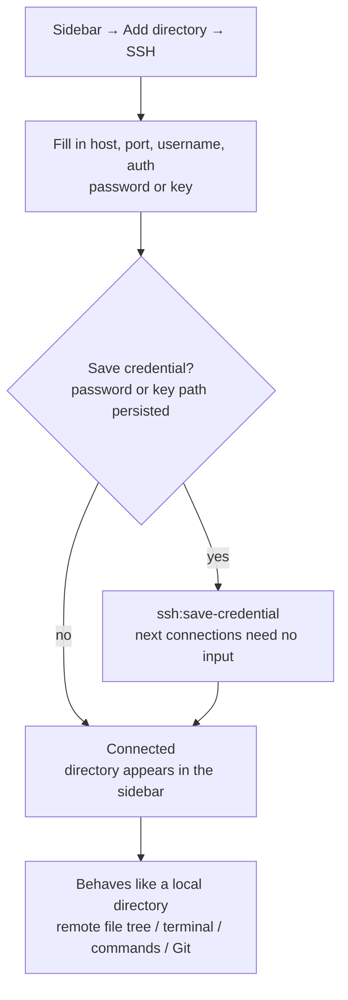

# 11-Terminal & SSH Remote Management

Snow App ships a built-in **terminal** (full PTY via node-pty + xterm.js) and
**SSH remote management**: local terminals can be opened in multiple tabs with
full interactivity; SSH directories mount as workspaces where files, terminal,
Git, and AI tools all operate through the remote channel — just like local.

## 1. Built-in Terminal

### 1.1 Opening a Terminal

| How | Action |
| --- | --- |
| New terminal | Right-click the right-panel tab bar → **New terminal** (multiple tabs) |
| In a directory | Right-click in the file viewer / Git panel / file list → **Open in terminal** (auto-cd) |
| From a project | Right-click a project tab in the top bar → Open terminal / browser / codebase |
| From chat | When the AI runs `bash-terminal-execute`, outputs offer "open in terminal" |

### 1.2 Basics

- **Multiple tabs**: each tab is an independent PTY session;
- **Copy / Paste**: select text → copy button; paste button (handles bracketed
  paste correctly);
- **Link clicks**: URLs in terminal output open in the built-in browser tab;
- **Colors**: `ls --color`, git diff, and CLI outputs stay readable;
- **Key bindings**: follow Windows terminal conventions (e.g. `Ctrl+C`).

### 1.3 Working with the AI

`bash-terminal-execute` runs one command per invocation; for **long-running
processes or interactive sessions** (e.g. `npm run dev`, vim, SSH login) the
AI uses an **interactive terminal session**:

- The AI opens a session and shows its live output in the conversation; you
  can type into it directly;
- Sessions are identified by UUID; the AI can `open` / `send` / `read` /
  `wait` / `resize` / `close` / `focus` / `list` multiple sessions;
- You can type passwords and confirmations into the session at any time.

## 2. SSH Remote Management

### 2.1 Adding an SSH Workspace

1. Sidebar → **Add directory → SSH**;
2. Fill in host, port, username, and auth (password or key);
3. Optionally **save the credential** (password or key path persisted via
   `ssh:save-credential`) so next connections need no input;
4. After connecting, the SSH directory appears in the sidebar and behaves
   exactly like a local one:
   - browse the remote file tree, open remote files in the reader;
   - open a terminal in the remote directory (remote shell);
   - filesystem tools read/write remote files; bash tools run remote commands;
   - open remote Git repositories (see below).

> `ssh://user@host:port/path` URLs are parsed and connected directly
> (`ssh:parse-url`); saved credentials can be listed/managed in the SSH
> management UI (`ssh:list-credentials`).

### 2.2 Remote Git

Remote workspaces support Git just like local ones:

- Repository discovery and status (auto-discovers `ssh://` repos);
- Diff previews of remote changes, commits, pull/push;
- **Remote Git polling**: repositories without file-system watchers refresh
  automatically every 10 seconds.

### 2.3 Remote Commands & Files

- **Remote commands**: AI commands in a remote workspace route through the
  SSH channel (`remoteWorkspaceCommand`), same UX as local
  `bash-terminal-execute`;
- **Remote file ops**: filesystem tools transparently route `ssh://` paths to
  remote implementations (read, edit, create, search);
- **Session reuse**: `Ctrl+click` on remote paths in chat reuses the SSH
  connection per workspace.

### 2.4 Troubleshooting

| Symptom | Cause & fix |
| --- | --- |
| Connection timeout/failure | Check host/port and proxy settings (see [4-configure-proxy](4-configure-proxy.md)) |
| Auth failure | Check username and password/key path; keys must be standard OpenSSH format |
| Remote Git stale | Remote repos rely on polling (10s); wait or trigger a refresh |
| Garbled CJK in terminal | Ensure the remote locale is UTF-8 (`export LANG=en_US.UTF-8`) |

## 3. References

- Terminal settings (shell path, font, etc.): Settings → Terminal
  (`app-control-openSettings page=terminal-settings`)
  - **Unified shell**: The shell path in Terminal settings is the single
    authority for every command execution — the AI's `bash-terminal-execute`,
    lifecycle Hooks scripts, the Git panel (WSL scenarios) and the integrated
    terminal in the right panel all use this shell. When left empty, the
    system default terminal is auto-detected (Windows: PowerShell → CMD →
    Git Bash → COMSPEC; macOS/Linux: zsh → bash → fish → sh → `$SHELL`),
    and the AI commands and the integrated terminal resolve to the same result.
  - **Path validation**: Saving a non-empty shell path validates file
    existence — invalid paths are rejected. `terminal-open` also fails
    immediately when given a non-existent shell path instead of silently
    falling back to the default shell.
  - The network proxy field has been removed from Terminal settings (for
    proxy in terminal commands, configure `HTTP_PROXY`/`HTTPS_PROXY`
    environment variables in your shell).
- Git panel: [12-git-and-code-browsing](12-git-and-code-browsing.md)
