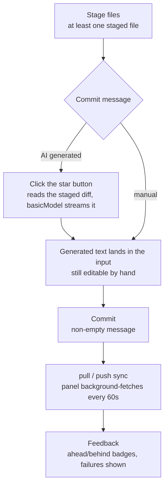

# 12-Git Panel & Code Browsing

This guide covers four code-related areas: the **Git panel** (repositories, branches, changes, commits, and synchronization), the **project explorer** (local/SSH trees and workspace search), the **right-panel file reader** (multi-tab viewing, editing, and in-file search), and the **codebase panel** (semantic search and the 3D relationship sphere).

## 1. Git Panel

### 1.1 Opening and Repository Selection

- Open the **Git tab** in the right panel. Repositories under the workspace are discovered automatically;
- Use the **repository selector** to switch the active repository. Its context menu can copy the repository path, reveal it in the file manager, or open a terminal there;
- Local and `ssh://` remote repositories use the same panel operations. See [Terminal and SSH](11-terminal-and-ssh.md) for SSH connection behavior.

### 1.2 Branches

The branch selector groups **local branches** and **remote branches** separately. Selecting another entry checks it out and refreshes status. **Create branch** validates the name, rejects duplicates, then creates and switches to the new branch. The branch button's context menu can also copy the current branch name, start branch creation, or refresh the list.

### 1.3 Changes, Staging, and Diffs

| Operation | Behavior |
| --- | --- |
| Inspect changes | The **Changes** view separates unstaged and staged files and shows added/modified/deleted status; click a file to open its corresponding diff |
| Select one or many | A normal click selects one item; `Ctrl/Cmd` adds/removes items and `Shift` selects a range within the same section |
| Stage/unstage | Act on selected items, or use the section action to stage all or unstage all |
| Discard changes | Request discard for one or more unstaged files; a confirmation dialog is required before the operation runs, then status refreshes |
| File shortcuts | Open a file in the file reader or open a terminal at its location; local paths can also be revealed in the file manager |

Use the toolbar to switch between **Changes** and **Graph**. Graph pages through commit history and renders commit relationships and branch/remote/tag decorations. Expanding a commit reveals **its file list and per-commit diff**:

- **View per-commit diff**: after expanding a commit, click a file entry to show that file's diff **within this commit** in the right panel (View File Diff in This Commit); the file being viewed is highlighted in the list;
- **Open in new tab**: the file entry's context menu supports **Open Diff in New Tab** (the tab opens in a loading state first, then fills in asynchronously) and **Copy File Path**;
- **Remote repository support**: per-commit diff viewing works for both local repositories and `ssh://` remote repositories (remote repos run through the SSH channel).

A manual refresh reloads both status and the graph when Graph is active.

### 1.4 Commits, AI Commit Messages, and Remote Sync

- **Commit prerequisites**: at least one file must be staged and the commit message must be non-empty; otherwise the commit button is disabled;
- **AI commit message**: staged files are also required. The sparkle button reads the **staged diff** and uses the current active API profile's `basicModel` to stream a proposed message directly into the input. While generation runs, the button becomes a stop control. Stopping or cancelling the stream preserves text already received so you can edit it manually;
- **Synchronization**: the toolbar provides pull, push, and manual status refresh. When the panel opens it also runs a background fetch immediately and repeats it every 60 seconds while the window is visible. Successful fetches refresh ahead/behind counts for both local and SSH repositories; unattended errors such as offline, authentication, or no remote are ignored;
- **Commit mode**: a drop-down next to the commit button switches between **Commit only** and **Commit and push**. The choice is persisted and restored after restart. In commit-and-push mode, push runs automatically after a successful commit and push failures are surfaced as errors while the commit stays intact;
- **Feedback**: ahead/behind counts appear at the top and a behind badge decorates pull. Pull/push failures are shown to the user, while background fetch never interrupts the panel.

> **AI collaboration**: after the AI changes files, use `/file-changes` in chat or the Git panel to inspect and stage them. Asking the AI to execute Git commands in a terminal is separate from using these panel controls and remains subject to tool authorization and sensitive-command policy.

### 1.5 Git Repository Settings

**Settings → Git Repository Settings** (settings page id: `git-settings`) configures repository status scanning and refresh behavior:

- **Scan depth**: directory depth for status scanning (default `1`, mirroring VSCode);
- **Ignored folders**: directories skipped by the change watcher;
- **Change-watcher debounce**: how long file changes are coalesced before refreshing status;
- **SSH poll interval**: status polling period for SSH repositories;
- **Status change limit**: local Git status is truncated at the configured limit with a warning shown in the Git panel, keeping huge repositories responsive;
- **Auto refresh**: whether repository status refreshes automatically.

## 2. Project Explorer and Workspace Search

Choose **Details** from a workspace's ellipsis/context menu to open that workspace in the project explorer:

- **Local and SSH trees**: both expand directories on demand, refresh, open text files in the right-panel reader, and rename or delete files/directories from the context menu. SSH operations run through the current remote session;
- **Multi-select in the file tree**: the local file tree supports `Ctrl/Cmd`-click toggling, `Shift` range selection, and `Ctrl+A` select-all for batch operations across multiple entries;
- **File/directory context menu**: local entries additionally support **Open in Terminal** (for a file, its containing directory), **Reveal in system file manager**, **Copy Path**, and an **Open with** submenu (open the directory with an installed IDE; detection matches the workspace-directory menu). SSH remote entries do not offer the file manager or IDE open actions;
- **Deletion boundary**: deleting in the explorer changes the real local or remote filesystem. It is different from removing a workspace registration from the project list, so verify the target first;
- **Local workspace search**: local workspaces show **Search files and content**, matching both file names and text contents. Click a result's file name to open the whole file, or click a matching line to open and briefly highlight that line. `Ctrl/Cmd` and `Shift` can select matching lines before dragging them into chat;
- **SSH search difference**: an SSH workspace still supports browsing, rename, delete, and file opening, but does not show this same **Search files and content** bar.

## 3. Right-Panel File Reader, Editing, and In-File Search

The right panel is a **multi-tab** file reader. It reads local files or remote files through an existing SSH session, and editable text can be changed and saved back to the corresponding local or remote path.

| File type | Support |
| --- | --- |
| Text/code | Syntax highlighting, line numbers, open at a target line, editing and saving, and in-file search |
| Markdown (`.md`) | Rendered preview for headings/tables/code/math/diagrams plus source mode; relative file links open in another tab; editing switches to source |
| Images | Preview; SVG has image/code dual modes |
| Office documents | Extracted text from PDF / Word / Excel / CSV and related formats |
| Binary | A **Binary file** placeholder, with no text editing |

Editing and search shortcuts:

- Enter edit mode with the edit button. `Ctrl/Cmd+S` saves and `Esc` exits; exiting with unsaved changes requires confirmation;
- When a file reader has focus, `Ctrl/Cmd+F` opens **in-file search** instead of global search. A Markdown preview switches to source mode automatically;
- Search has a match-case toggle. `Enter` goes to the next match, `Shift+Enter` to the previous match, and `Esc` closes search. Both view and edit modes navigate to the current match.

### Markdown Preview Tips

- **Wide tables** scroll horizontally instead of being clipped;
- **Math** uses `$...$` inline and `$$...$$` block syntax (KaTeX);
- **Diagrams** use a `mermaid` fenced code block and render interactively, with code/diagram switching and download;
- **View switching** uses the **Render preview / Source** toolbar controls; editing automatically selects source.

## 4. Global Search

Global search combines three kinds of objects:

1. **Conversations**, matched by title, summary, and searchable message content;
2. **Projects/workspaces**, matched by display name or path and activated when selected;
3. **All 26 settings pages**, matched by localized page name or settings-page id and opened directly when selected.

Results are grouped as conversations, projects, and settings. Use `Up` / `Down` to cycle through items and `Enter` to open the current result. Hovering or clicking with the mouse also updates/selects the current item.

## 5. Codebase Panel and Semantic Search

### 5.1 Enabling

Enable codebase indexing in **Settings → Codebase**
(`app-control-openSettings page=codebase-settings`) and configure an embedding
model; the first index may take a few minutes. Once enabled:

- `/codebase` in the chat input opens the project codebase panel;
- the AI gains the `codebase-search` tool (see
  [7-codebase-index-and-diagnostics](7-codebase-index-and-diagnostics.md));
- when **Agent Review** is enabled in codebase settings, its review loop uses the
  current active API profile's `basicModel`. Vector indexing continues to use the
  separately configured embedding model and does not participate in basic/advanced
  routing.

### 5.2 3D Similarity Sphere

The codebase panel includes a **3D sphere view**: each file is a node whose
distance reflects embedding similarity. Drag to rotate, zoom to inspect file
clusters and relationships (layout is computed on a Rust background thread,
so the UI stays responsive).

### 5.3 Natural-Language File Search

Type `@?<query>` in the chat input to start a **natural-language file
search**: the AI combines grep/filesystem tools to locate relevant files,
showing progress and results in real time. This file-search Agent uses the current
active API profile's `basicModel`; it does not switch to `advancedModel` based on
query complexity.

### 5.4 Codebase Panel (next to the input)

- **Scan preview**: shows file count/size before indexing to avoid indexing
  huge directories by accident;
- **Index stats**: file count, embedding progress; start/rebuild index as
  needed;
- **Embedding progress**: live progress; semantic search works as soon as it
  completes.

## 6. Open a Workspace in a Local IDE

A local workspace's directory menu can detect installed IDEs and pass the project directory to one of them:

1. In the left workspace list, open the ellipsis or context menu for a **local workspace**;
2. Expand **Open with**. Snow scans installed IDEs when this submenu is first needed;
3. Select an IDE. The menu item's title exposes the detected executable path;
4. If no candidate is found or launch fails, the menu reports the detection/opening error.

The known recognition table includes Visual Studio Code/Insiders, Cursor, Windsurf, Trae, Zed, Sublime Text, IntelliJ IDEA, WebStorm, PyCharm, GoLand, CLion, PhpStorm, RubyMine, Rider, DataGrip, Android Studio, Xcode, and Fleet. The actual list depends on the operating system, installation location, and whether Snow can find the executable. This entry is available only for non-SSH workspaces with a local directory path. Use a remote terminal or remote-development tooling for SSH workspaces; this menu cannot launch an SSH URI as a local project directory.

## 7. Troubleshooting

| Symptom | Cause & fix |
| --- | --- |
| Git panel shows no repos | Confirm `.git` exists under the workspace; remote repos need an SSH connection first |
| No IDE appears under Open with | Confirm the IDE is installed in a detectable system location; close and reopen the directory menu to retry its loading flow in the current session |
| IDE launch fails | Check the executable path shown by the menu item, project-directory permissions, and local security policy; SSH workspaces do not support this entry |
| Semantic search unavailable | Codebase index not enabled or not finished; check the embedding model config |
| 3D sphere lags | Layout already runs off-thread; for huge repos narrow the index with `fileGlob` |
| Preview vs source mismatch | Markdown preview goes through the renderer; the source view is authoritative |

## 8. References

- Codebase configuration: [7-codebase-index-and-diagnostics](7-codebase-index-and-diagnostics.md)
- Storage locations (index, Git state): [3-reference/4-data-storage-locations](../3-reference/4-data-storage-locations.md)
