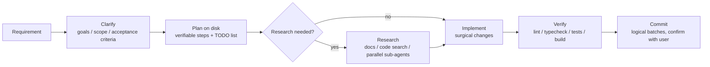

# 13 - AI Development Collaboration

> For AI agents working inside Snow App: how to pick and combine the built-in
> tools correctly for **coding, debugging, performance work, pixel-level UI
> fixes, new features, and learning new tools**.
> This is the *strategy* layer — tool mechanics live in
> [2-builtin-tools-reference](../3-reference/2-builtin-tools-reference.md).

---

## 1. Service Lifecycle Management (detach vs PTY)

### 1.1 The fundamental difference

| Dimension | `bash-terminal-execute` (one-shot) | `terminal-*` (persistent PTY) |
| --- | --- | --- |
| Lifecycle | Ends when the command ends; `detach:true` keeps it running in background | Tab stays alive across calls |
| Log access | detach writes `<workspace>/.snow/logs/<name>-<ts>.log`; read via `filesystem-read` | `terminal-read` reads the screen buffer; `terminal-wait` waits for idle |
| Interactivity | None (one-shot); `isInteractive:true` waits for input | Fully interactive: signals, passwords, keys |
| Best for | Build, test, lint, one-off scripts | **dev servers, long-running processes, anything you need to watch** |

### 1.2 Decision table (check before launching any process)

```
Before starting a process, ask: how long does it live, and how do I read its output?

① One-shot task (build / test / lint / single command)
   → bash-terminal-execute (foreground, wait for the result)

② Long-running service (dev server / cargo run / tauri dev)
   → prefer terminal-open + terminal-send, watch output with terminal-read
   → or bash-terminal-execute detach:true (get pid + logPath, poll with filesystem-read)

③ Service already running (whoever started it)
   → probe first: port occupancy / curl health / process list
   → reuse when possible: curl or browser straight to it, read its existing log file
   → only restart when you need interactive control or full live logs
   → ⚠️ A process the USER started (not the AI): never kill it! Read its log
     location or ask the user

④ Needs interaction (password / confirmation / signals)
   → terminal-open + terminal-send (PTY channel)
```

### 1.3 When to switch from "background (detach)" to a PTY tab

If the service is running from `detach:true` but debugging needs **live logs /
interactive control**:

```
1. Confirm the process was started by the AI (has logPath / pid), not by the user
2. Terminate gracefully: kill <pid> (locate via detach info)
3. terminal-open a new PTY → terminal-send to restart the service
4. terminal-read / terminal-wait for live logs → start debugging
```

> Principle: **probe first, reuse when possible; switch only when interaction or
> live logs are required; never touch user-started processes.**

---

## 2. Debugging Workflow & Tool Mapping

The 6-phase discipline (feedback loop → reproduce/minimise → ranked hypotheses →
instrument → fix + regression → cleanup/post-mortem) is **methodology**, not
framework-dependent — Snow App's built-in tools are enough to run it end to end.
Tool mapping per phase:

| Phase | Backend (Rust/Node) | Frontend (WebView) |
| --- | --- | --- |
| Feedback loop | `bash-terminal-execute` runs tests/repro; `terminal-*` starts services | `browser-create/navigate` loads the page; `browser-click/type` reproduces |
| Capture errors | `terminal-read` (PTY screen) / `filesystem-read` (detach log) / `grep-search` logs | `browser-devtools action=console` (JS errors); `action=network` (failed requests + bodies) |
| Locate code | `codelens-find_definition/references` from stack traces; `grep-search` / `codebase-search` | same + `browser-evaluate` for runtime state |
| Perf locating | layered timing / profiler / `EXPLAIN QUERY PLAN` | `browser-devtools action=trace` (long tasks); `action=network` (waterfall); `browser-evaluate` with `performance.now()` |
| Verify fix | `bash-terminal-execute` re-runs tests | `browser-wait` + `browser-screenshot` + re-check console |
| Parallel work | `sub-agents-activate` generic agents gather evidence (e.g. read-only "what is the correct usage of this API"), main session keeps the loop | same |

> Tip: if the project has Trellis installed (`.trellis/` exists), load the
> `diagnosing-bugs` skill for the full 6-phase discipline text and use
> `trellis-research` sub-agents for parallel evidence gathering; without Trellis,
> run the same methodology with the built-in tools above.

### 2.1 Automatic frontend/backend error capture (full loop)

```
You: "frontend error / backend 500 / slow"
  │
  ▼
① Auto-start: terminal-open → backend (cargo run) → frontend (pnpm dev)
  │
② Auto-reproduce: browser-navigate → page → click/type the user path
  │
③ Auto-capture (dual channel):
   backend  → terminal-read / detach logPath / grep logs
   frontend → browser-devtools console + network
  │
④ Auto-locate: codelens call-chain → find the bug point
  │
⑤ Auto-verify: write repro test → run → fix → re-run
  │
⑥ Post-mortem: record the root cause and lessons in the project docs
   (e.g. docs/ or notes) so the same class of bug does not recur
```

---

## 3. Pixel-Level Frontend UI Fixes

Locating visual/layout issues (alignment, spacing, overflow, style drift):

```
① Baseline screenshot: browser-screenshot (fullPage supported) → save "broken state"
② Quantify: browser-evaluate reads the numbers
     getBoundingClientRect()        → position / size / overflow
     getComputedStyle(el)           → effective styles (cascade result)
     document.querySelectorAll(...) → structure check
     performance.now() segments     → render cost (if perf-related)
③ Locate root cause:
     layout    → compare computed values vs design intent → find CSS source
     render    → browser-devtools action=trace (long tasks / reflow / repaint)
     network   → browser-devtools action=network (waterfall)
④ Fix: filesystem-replace_edit the styles/component
⑤ Re-verify: browser-wait for render → screenshot compare → browser-evaluate re-check
```

> Pixel work is about **numbers, not eyeballs** — evaluate returns coordinates /
> dimensions / styles; screenshot before and after; confirm with values.

---

## 4. Building New Features (built-in tools, framework-free)

A complete flow that needs no external framework (Trellis / task systems) — only
Snow App built-in tools and the official skill:



### 4.1 Clarify the requirement

- Confirm goal, scope, acceptance criteria, and priority one by one with
  `user-interaction-askUserQuestion`
- **Do not** start coding while the requirement is unclear — first pin down what
  "done" means
- When multiple valid approaches exist, present them all with tradeoffs and let
  the user decide

### 4.2 Plan on disk

- **Write the plan before the code**: break the requirement into verifiable
  steps, put them in a project document (e.g. `docs/plan-<feature>.md` or the
  project's convention), and track each step with `todo-todo-manage`
- Every step states its acceptance check: `change X → run Y to verify → done`
- Outputs land on disk: **conversations get compacted, files don't** — plans,
  decisions, and repro scripts all go into files

### 4.3 Research (when needed)

| Question type | Approach |
| --- | --- |
| Third-party library / API usage | `websearch-search/fetch`, ctx7, official docs; **never guess interfaces from memory** |
| Existing implementation / patterns in repo | `grep-search` / `codebase-search` (semantic) / `codelens-file_outline` |
| How existing code calls a function | `codelens-find_references` to trace call sites |
| Independent sub-questions in parallel | `sub-agents-activate` several agents at once, each summarizing its own finding |

### 4.4 Implement

- **Surgical changes**: touch only what you must; match existing style; do not
  "improve" unrelated code
- **Simplicity first**: minimum code that solves the problem; 50 lines beats 200
- **Parallel when file-disjoint**: dispatch multiple `sub-agents-activate` in the
  same turn, one module each, then the main session merges and checks (parallel
  only for independent parts; overlapping parts stay serial)

### 4.5 Verify (strong acceptance criteria)

- Verify every step with a runnable command: lint / typecheck / tests / build
- Frontend changes: `browser-create/navigate` → interact → `browser-screenshot`
  to confirm → `browser-devtools console` to confirm no errors
- Backend changes: `bash-terminal-execute` runs tests; start the service and curl
  the endpoint when needed
- **Report done only after everything passes**; fix until green

### 4.6 Commit

- Review the diff with the Git panel (or `bash-terminal-execute`), split into
  logical commits
- **Confirm with the user via `user-interaction-askUserQuestion` before any git
  write** — especially destructive ops (`git add -A` / `reset` / `checkout`)
  must state exactly what would be discarded
- Never push unless the user explicitly asks

> Tip: if the project has Trellis installed (`.trellis/` exists), this flow
> upgrades seamlessly: clarify → `trellis-brainstorm`; plan → `prd.md` /
> `design.md` / `implement.md`; before coding → `trellis-before-dev` reads
> project specs; implement → `trellis-implement`; verify → `trellis-check`;
> commit → Phase 3.4 batched commits (`product_auto_commit` runs automatically).
> Without Trellis, the built-in flow in this section is equivalent.

---

## 5. Learning a New Tool / Capability

When you meet an unfamiliar tool, MCP server, or capability:

```
① Read the tool description: every tool carries usage + params — start there
② Read the official docs: load the snow-app-docs skill → it reads ~/.snow/docs
   for the matching section (config: MCP/skills/hooks/api; reference: tools/fields/settings)
③ Smoke-test: try it once in a safe environment (bash command / browser page / example)
④ Ask when unsure: user-interaction-askUserQuestion (the only question channel)
```

> Never guess interfaces from model memory — consult authoritative docs
> (ctx7 / official docs / repo source) for third-party libraries and APIs; if a
> lookup fails, say why, then fall back.

---

## 6. Universal Discipline (every scenario)

1. **Decisions go through the tool**: user decisions → `user-interaction-askUserQuestion`
   (sole call of its turn); never end a turn with a text question
2. **Outputs land on disk**: repro scripts, timing harnesses, measurements go
   into files — conversations get compacted, files don't
3. **Sub-agent discipline**: no git writes, no re-dispatching; the dispatch
   prompt states the task goal, file scope, and prohibitions clearly
4. **Automate what can be automated**: background tasks, log capture, and test
   runs are unattended; stop only when a decision is needed
