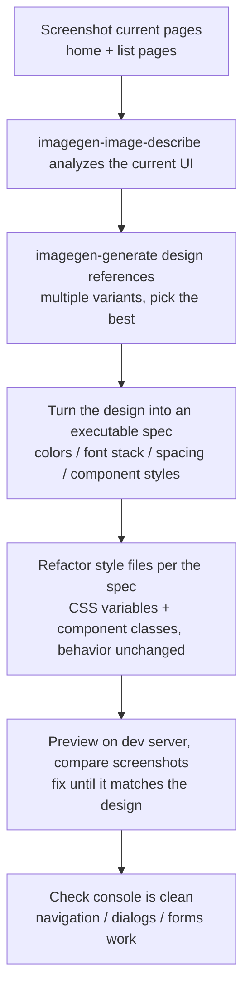

# 15-Frontend Design and Beautification Workflow (UI / UX)

Snow App combines **browser automation**, **AI image generation**, **vision-model analysis**, and the **filesystem** so an AI Agent can complete an end-to-end workflow spanning frontend development, page refinement, and UI/UX design.
This guide covers four common scenarios and provides prompt templates you can reuse directly.

## 1. Tool matrix

| Tool | Role in this workflow |
| --- | --- |
| `filesystem-*` | Read and write frontend code (`create` / `replace_edit` / `read` / `search`) |
| `bash-terminal-execute` | Start a dev server and run builds (`npm run dev`, and so on) |
| `browser-navigate` | Open a local dev server (`http://localhost:xxxx`) or a live page |
| `browser-screenshot` | Capture the current viewport or full page as the “before” reference |
| `browser-devtools` | Inspect the accessibility tree (`ax`), diagnose console errors, and review network requests |
| `browser-evaluate` | Run JavaScript in the page to test styles, inspect layout data, or verify interactions |
| `browser-click` / `browser-type` / `browser-hover` / `browser-wait` | Verify interactions by clicking, typing, hovering, and waiting for rendering |
| `imagegen-generate` | Generate mockups, icons, illustrations, and style references |
| `imagegen-image-describe` | **Visual understanding**: analyze a mockup and return an implementation-ready UI description |
| Image-generation library and albums | Organize generated mockups and assets into albums such as “Mockups” and “Icons” |
| `grep-search` / `codebase` | Locate project structure and existing style patterns |

> The `path` accepted by `imagegen-image-describe` can be an **absolute disk path** anywhere in the project, such as `C:/Users/xx/project/design/home.png`, or an `upload/`-relative path. Each image must be no larger than 20 MB and use an image format. The vision channel reuses the vision-model settings under Settings → API.

## 2. Scenario A: implement a frontend from a mockup

When the user provides a Figma export, Sketch image, or hand-drawn UI, the Agent can implement it as follows:

```text
1. Locate the mockup with filesystem-search / grep, or use the path supplied by the user.
2. Run imagegen-image-describe path=design/home.png.
   → Obtain a structured description: layout, color hex values, typography,
     spacing, and component inventory.
3. Use filesystem-create to implement index.html / App.tsx / styles.
4. Start the dev server with bash.
5. Open http://localhost:xxxx with browser-navigate.
6. Capture a screenshot and inspect browser-devtools ax to compare structure.
7. Correct differences with replace_edit, refresh, and verify again.
```

**Prompt template:**

```text
There is a homepage mockup at design/home.png in this project.
Please:
1. Analyze it with imagegen-image-describe, focusing on layout, colors,
   typography, spacing, and components.
2. Implement the page with the existing technology stack and put styles in styles.css.
3. Start the dev server, open the page in the browser, and compare a screenshot with the mockup.
4. Correct obvious differences in color, spacing, and structure, then capture a final screenshot.
```

## 3. Scenario B: beautify an existing page

Use this workflow for a visual redesign, refactor, or polish pass:

```text
1. Open the local or live page with browser-navigate.
2. Capture a full-page screenshot with browser-screenshot.
3. Analyze the current screenshot or a design reference with imagegen-image-describe.
4. Define concrete improvements: color consistency, spacing rhythm,
   component styling, and responsive behavior.
5. Edit CSS/components with replace_edit, refresh, and compare screenshots.
6. Optionally inject temporary styles with browser-evaluate to test an idea quickly.
```

**Prompt template:**

```text
Open http://localhost:3000 and capture a full-page screenshot. The current UI looks rough.
Please modernize it with a clean style and generous whitespace:
1. Inspect the current page with a screenshot and an ax snapshot.
2. Propose three concrete improvements to color, spacing, and component radius before editing.
3. Apply the changes, refresh, and provide a before/after screenshot comparison.
4. Verify with browser-evaluate that there are no console errors.
```

## 4. Scenario C: create a UI design from scratch

When no mockup exists, generate a visual direction first and then implement it:

```text
1. Generate a mockup with imagegen-generate.
   Describe the page type, style, and palette, for example:
   "modern SaaS dashboard landing page, light theme, indigo accent,
    16:9, clean typography, generous whitespace".
2. After selecting a result, analyze it with imagegen-image-describe and implement it.
3. If the result is not suitable, iterate with variants or regeneration.
4. Save the approved design to an album such as “Mockups” for future reference.
```

**Prompt template:**

```text
Design a homepage for an “AI coding assistant” product:
1. Generate two mockups with imagegen-generate: one dark, technical style and one light, minimal style.
2. Analyze the stronger option with imagegen-image-describe to extract implementation details.
3. Implement it in the project, open it in the browser, and verify it with a screenshot.
```

## 5. Scenario D: improve UX, accessibility, and perceived performance

Use browser inspection and interaction tools to evaluate user experience:

```text
1. Open the page with browser-navigate.
2. Capture the accessibility tree with browser-devtools action=ax.
3. Collect console errors with browser-devtools action=console.
4. Inspect failed or slow resources with browser-devtools action=network.
5. Exercise critical flows with click / type / hover / wait.
6. Produce a prioritized UX issue list covering accessibility, missing feedback,
   loading experience, and layout instability.
7. Fix issues one by one and re-verify them in the browser.
```

**Prompt template:**

```text
Run a UX review of http://localhost:3000:
1. Open the page and inspect its structure with an ax snapshot and screenshot.
2. Check console errors and failed network resources.
3. Verify the main interaction flows, including form submission, dialog toggling, and empty states.
4. Produce a severity-ranked issue list with reproduction steps.
5. Fix the three highest-priority issues and verify them again.
```

## 6. End-to-end redesign example

The following prompt combines all four scenarios:

```text
This project is a content-management dashboard that needs a complete UI refresh:
1. Capture the current home and list pages, then analyze them with imagegen-image-describe.
2. Generate several “modern SaaS admin” reference designs and select the best option.
3. Turn the selected design into an executable specification: primary and secondary hex colors,
   font stack, spacing scale, and styles for buttons, cards, tables, and the sidebar.
4. Refactor the styles with CSS variables and component classes without changing behavior.
5. Preview with the dev server, compare screenshots page by page, and correct mismatches.
6. Verify that the console is clean and navigation, dialogs, and forms still work.
```



## 7. Best practices

| Practice | Guidance |
| --- | --- |
| **Capture before editing** | Take a `browser-screenshot` before every visual change so the Agent and user share a baseline. |
| **Describe first, code second** | Have the vision model produce a design specification—hex values, spacing, and components—before writing code. |
| **Iterate in small steps** | Change one module, verify it with a screenshot, and then continue; this converges more reliably than a single large rewrite. |
| **Organize assets in albums** | Keep mockups, icons, and style references in separate albums so later tasks can reuse the approved direction. |
| **Wait before capturing** | For interactive pages, use `browser-wait` until rendering completes; use `fullPage=true` for a full-page capture. |
| **Configure the vision channel** | `imagegen-image-describe` requires a vision model in the main API settings and reports a configuration error when none is available. |
| **Separate design from implementation** | Treat the mockup as intent input; do not embed it into the final page when the design can be implemented with real layout, styles, and assets. |

## 8. Related documentation

- [6-Browser Automation](6-browser-automation.md) — complete browser-tool workflow
- [9-Image Generation](9-image-generation.md) — image-generation channels and parameters
- [Built-in Tools Reference](../3-reference/2-builtin-tools-reference.md) — `imagegen-image-describe` reference
