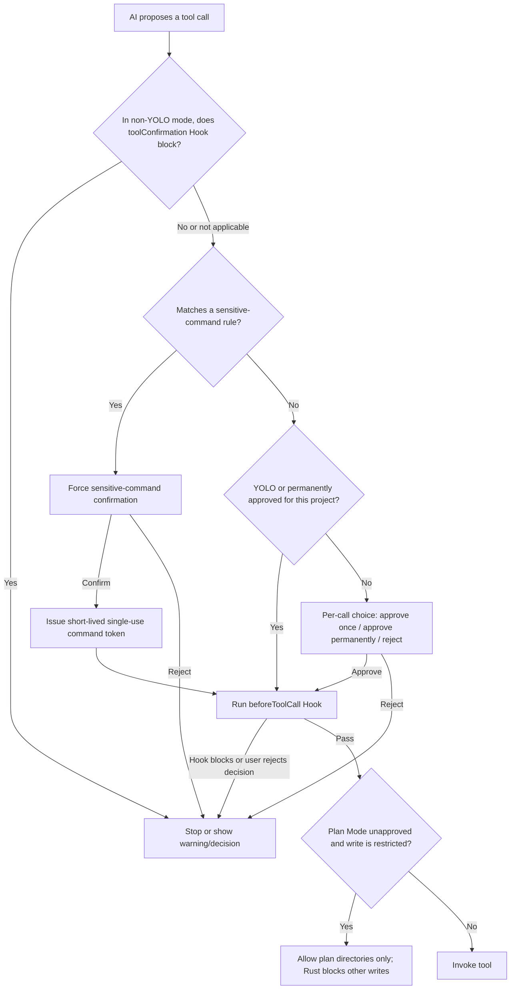

# 16-Security, Privacy, and Tool Authorization

Snow App connects AI suggestions, tool execution, local data, and external services in one desktop application. This guide explains the available security controls, the boundaries they actually protect, and the judgments that remain the user's responsibility.

> Security controls reduce risk; they do not certify a command, website, Plugin, Hook, or external MCP server as safe. Before deleting data, running scripts, uploading content, or importing sessions, always verify the target, arguments, and scope of impact.

## 1. Window isolation model

Different Snow windows use different policies. It is inaccurate to claim that every window is sandboxed.

| Window/content | `contextIsolation` | Node integration | Sandbox | Notes |
| --- | --- | --- | --- | --- |
| Snow main window | Enabled | Disabled | **Disabled** (`sandbox: false`) | Controlled native capabilities are exposed through preload / `contextBridge`; the main window permits `<webview>` |
| Built-in browser popup | Enabled | Disabled | **Enabled** | Created by the main process for guest `window.open` / `target=_blank` requests |
| System browser | Outside Snow's renderer | Not applicable | Not applicable | A normal `window.open` in the main window is denied and delegated to the system browser |

Main-window renderer code cannot use Node APIs directly. `contextIsolation` separates page and preload contexts, but the main window is explicitly not sandboxed; only predefined bridge APIs can ask the main process or Rust layer to act. The built-in `<webview>` and every remote page loaded in it form an additional trust boundary.

Browser popups share the opener webview's session and cookies and preserve `window.opener` and `postMessage` for OAuth. A popup may open another popup, which receives the same sandboxed, context-isolated, no-Node policy. Snow closes these popups with the main window so that orphan windows do not remain, particularly on macOS.

## 2. Privacy filtering

Privacy filtering is disabled by default (**Settings → Privacy**, settings page id: `privacy-settings`). When enabled, it processes only the **tool results** selected in settings. It is not global DLP for chat input, web pages, logs, Plugins, Hooks, or every network request.

The default selected tools are:

- `filesystem-read`
- `grep-search`
- `bash-terminal-execute`

The settings UI can additionally select `codebase-search`, `websearch-websearch-search`, and `websearch-websearch-fetch`. Results from unselected tools remain unchanged.

### 2.1 Local mode

Local mode applies regex and validation rules in the Rust MCP backend before the result crosses the NAPI boundary into Node/Electron. Rules cover private-key blocks, JWTs, common API keys, sensitive key-value pairs, `Authorization` values, URL query tokens, Chinese national ID numbers, and payment-card numbers.

Local mode does not call an external service, but rules can still produce false positives, false negatives, or leave contextual clues from which a secret can be inferred. Enabling filtering is not a reason to read unnecessary credential files or widen a tool's scope.

### 2.2 API mode and failure fallback

API mode sends the text to the configured privacy-filter HTTP API as JSON containing `text`, `aggregation_strategy: "simple"`, and `mask_token: "[{label}]"`. When an API key is configured, Snow attempts to send both `x-api-key` and Bearer `Authorization` headers. A successful response must contain `masked_text`.

The API endpoint therefore becomes another trusted party, and the text being filtered leaves the device. On an HTTP error, network failure, response parsing error, or missing `masked_text`, Snow **falls back to local rules** rather than passing the original text through. Only an exceptional failure of the local background task itself can return the original text, so data minimization and human review are still required for highly sensitive work.

## 3. Tool authorization flow

In normal mode, each tool call requests its own authorization. Rejecting one call in a parallel batch does not automatically reject the other calls. A user can approve once, reject, or—when a project is active—permanently approve the tool for that project.

`beforeToolCall` runs before actual execution even when YOLO auto-approves a tool. In non-YOLO mode, a `toolConfirmation` Hook also runs before the authorization UI. Because some paths continue with normal authorization if a Hook itself fails, a Hook must not be the sole security control.

## 4. Permanent project authorization

“Always approve” is bound to the active project/workspace `directoryId`:

- switching projects loads a different approved-tool set;
- without an active project, the choice is not persisted as cross-project approval, although the current call can proceed;
- a persistence failure does not roll back the already approved current call;
- approval is granted by tool name and does not understand the business risk of each argument set.

Permanently approve only narrow, auditable, recoverable capabilities. Terminal execution, file writes, browser-state restoration, and external MCP tools are generally better kept behind per-call review.

The **project authorization panel** next to the composer (or the `/permissions` command) lists the tools permanently authorized for the current project and lets you **delete** approvals no longer needed; the command is disabled in YOLO mode.

## 5. YOLO mode

YOLO is a persistent global setting. When enabled, ordinary tools can skip per-call authorization, and non-sensitive items already waiting in the authorization queue are approved. It is intended for controlled, recoverable, pre-reviewed environments—not conversations containing production credentials, personal data, or shared workspaces.

YOLO **does not bypass every security control**:

- a non-interactive Bash command that matches a sensitive-command rule still requires explicit confirmation;
- `beforeToolCall` Hooks still run;
- the Rust Plan Mode write boundary still runs;
- tool argument validation, project enablement, and sub-agent tool allowlists remain effective.

Interactive terminal commands are **checked by the sensitive-command gate too**: the `isInteractive` flag only controls how the terminal session is presented (input box, no timeout) and is no longer a bypass channel; legitimate interactive commands such as `npm init` or `git add -i` that match no rule are unaffected.

## 6. Sensitive-command rules

Sensitive commands are detected using enabled regular expressions (**Settings → Sensitive Commands**, settings page id: `sensitive-command-settings`; agents can also read/write them via `config-set settings sensitiveCommands`). Snow uses global rules plus the effective inherited/overridden project rules. An invalid regex is skipped so it cannot break all subsequent checks. A match exposes the rule ID, pattern, and description in the confirmation UI.

After confirmation, Snow issues a token for the **exact command text**. The token lasts about 60 seconds and is deleted when consumed; the Rust Bash executor checks the token, command, and expiry. It cannot authorize a different command or be reused.

Important limitations:

- rules catch only the textual patterns they cover; a dangerous unmatched command can still run;
- an invalid skipped regex provides no protection;
- argument composition, encoding, and indirect script calls can exceed the rule author's intent;
- interactive commands require the same authorization token (`isInteractive` is a presentation hint and never bypasses the check);
- the sensitive-command gate is an additional control, not proof that a shell command is safe.

## 7. Enforced Plan Mode boundary

Plan Mode is strictly isolated per conversation and mutually exclusive with Goal Mode in that conversation. Switching conversations does not clear approvals independently granted to other conversations. Turning Plan Mode off revokes that conversation's approval state.

Plan Mode is more than a prompt: every tool call passes `planMode` and `planApproved` to the Rust tool layer. Before approval:

- ordinary project-file writes through `filesystem-create` and `filesystem-replace_edit` are blocked;
- plan documents may be written under `.snow/plan` or `.trellis/tasks`;
- a sub-agent cannot request or grant approval for the main conversation;
- only a structured `approved=true` result from the dedicated approval tool marks the current conversation as approved.

Approval widens the write scope, but Plan Mode does not replace sensitive-command matching, tool authorization, Hooks, project permissions, or human review. Nor is it a complete sandbox for every possible tool side effect.

## 8. Plugins, Hooks, and external MCP servers

### 8.1 Plugins

Declarative marketplace components do not run installation scripts, but you should still install only from trusted sources. External Plugin runtime code executes in an isolated utility process and requires a risk confirmation before launch. Process isolation does not make code trustworthy or eliminate misuse of granted file, network, or tool permissions. Review the publisher, declared permissions, update channel, and maintenance status.

### 8.2 Hooks

Hooks can run shell commands, inject context, and change the tool-call flow. Command exit codes are generally interpreted as follows:

| Exit code | Outcome |
| --- | --- |
| `0` | Pass; stdout may become injected context |
| `1` | Soft warning; structured decision JSON may open a confirmation UI |
| `2+` | Block the current flow when that lifecycle point is blockable |

Fire-and-forget Hooks such as `onStop` and `onSessionStart` cannot truly block the originating flow; pending decisions are reduced to ordinary warnings. Treat every Hook script and dependency as a local automation program with its own supply-chain trust.

### 8.3 External MCP servers

An external MCP server may launch a local process over stdio or connect to an HTTP service. Its tool declarations, network endpoints, authentication, and side effects come from the external implementation. Snow's authorization controls whether Snow initiates a call; it does not prove that the service is internally safe or prevent it from retaining, forwarding, or misusing data within its granted reach.

See [Configure MCP Servers](1-configure-mcp.md) and [Configure Hooks and Sub-agents](5-configure-hooks-and-subagents.md).

## 9. Recommended security baseline

1. Leave YOLO off by default and retain per-call approval for writes, terminal commands, and external tools.
2. Permanently approve the smallest project-specific tool set and revoke approvals that are no longer needed.
3. Define specific, testable sensitive-command regexes for destructive operations while retaining human review.
4. Prefer local privacy filtering for highly sensitive projects; review an API endpoint's data policy before choosing API mode.
5. Do not give a page, Hook, Plugin, or MCP server credentials beyond the current task.
6. Read a Plan Mode plan before approval and continue reviewing high-impact operations afterward.
7. Verify the publisher, source, and permission changes before installing or updating third-party extensions.
8. Periodically review logs, project approvals, and enabled Hooks/MCP servers; disable suspicious components and rotate exposed credentials immediately.

## 10. Misconceptions and troubleshooting

| Misconception/symptom | Correct interpretation or action |
| --- | --- |
| “The main window is sandboxed” | Incorrect: it uses `sandbox: false`, while context isolation is enabled and Node integration is disabled |
| “Browser popups do not share login state” | OAuth popups share the opener webview's session and cookies |
| “A privacy API failure passes the original text through” | API failures fall back to local rules; local-task failures and rule misses still matter |
| “YOLO bypasses sensitive commands” | Matching non-interactive commands still require confirmation |
| “Permanent approval applies to every project” | Approval is bound to the active project/workspace |
| “Plan Mode is prompt-only” | The Rust layer blocks unapproved ordinary file creation and replacement edits |
| “A Plugin in a utility process is safe” | Isolation reduces blast radius; it does not guarantee provenance, logic, or data handling |

For browser credentials and login state, continue with [Browser Settings, Passwords, and Data Import](17-browser-settings-passwords-and-import.md). For the complete boundary matrix, see [Security and Trust Boundaries](../3-reference/5-security-and-trust-boundaries.md).
