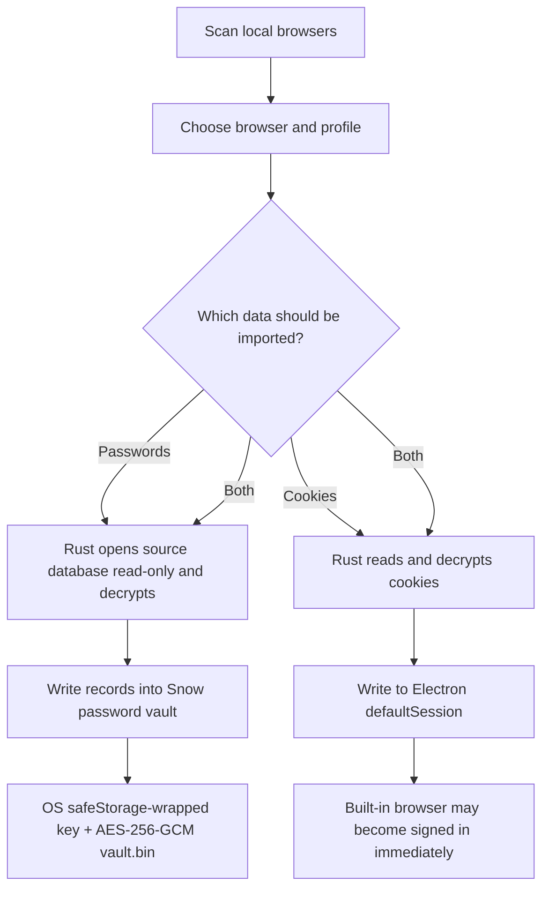

# 17-Browser Settings, Passwords, and Data Import

This guide covers the Snow built-in browser's homepage, password vault, automatic save/fill behavior, local-browser import, and login-state archives. Passwords, cookies, and localStorage can all grant account access, so use these features only on a trusted device and trusted OS user account.

## 1. Configure the homepage

Open **Settings → Browser Settings → Homepage** (settings page id: `browser-settings`; agents can open it with `app-control-openSettings page=browser-settings`. **Homepage/password management is UI-only** — agents can only open the page and guide the user; they cannot read or modify passwords):

1. Enter the address that new browser tabs should open;
2. press Enter or move focus out of the field to save;
3. leave it empty to open a blank page.

The default is `https://www.google.com`. Saving trims surrounding whitespace only; it does not automatically add `https://` or rewrite non-HTTP addresses. All built-in browser tabs share the same setting and module-level cache. Saving notifies every browser instance of the new value.

> If the page does not load, first enter a complete URL the browser can recognize, such as `https://example.com`.

## 2. Password vault

### 2.1 File locations

The password vault is stored at:

- `~/.snowapp/browser-passwords/vault.key`
- `~/.snowapp/browser-passwords/vault.bin`

`vault.key` is not a plaintext master key. It contains the random master key wrapped by Electron `safeStorage`. `vault.bin` contains the password-record collection encrypted as a whole.

### 2.2 Encryption and writes

1. A random 32-byte master key is generated on first use;
2. the OS protects that key through macOS Keychain, Windows DPAPI, or a Linux keyring;
3. the password collection is encrypted with AES-256-GCM using a 12-byte random IV, a 16-byte authentication tag, and ciphertext;
4. file permissions are set to `0600` on a best-effort basis;
5. updates are written to a temporary file and atomically replaced with `rename`;
6. if `safeStorage` is unavailable, Snow refuses to save instead of falling back to plaintext.

AES-GCM provides confidentiality and integrity detection, but security still depends on the current OS session, device security, and Electron's `safeStorage` backend. A program or person controlling the unlocked OS account may still access decrypted credentials through application functionality.

## 3. Automatic saving and filling

### 3.1 Automatic saving

When a login form is submitted or a login button is clicked, the webview preload attempts to identify the username and password:

- the password must not be empty;
- the same `origin + username` updates an existing record instead of adding unlimited duplicates;
- the same `origin + username + password` is not repeatedly saved in one page session;
- only values detected on the current page are saved, and custom login components are not guaranteed to be recognized.

### 3.2 Automatic filling

When an HTTP/HTTPS page contains an empty password field, Snow queries credentials for the page's real origin. The main process compares the request argument with the sender frame's origin and rejects cross-origin lookup. If an origin has multiple records, the most recently updated one is selected.

Snow tries immediately after DOM readiness, then every 800 ms for roughly 8 seconds. Complex Shadow DOM, nonstandard controls, cross-origin iframes, multi-step logins, dynamic secure keyboards, and sites that actively disable autofill may not work. Autofill is best-effort, not a compatibility promise for every site.

## 4. Search, reveal, and delete passwords

Under **Settings → Browser Settings → Passwords**:

- search by site or username;
- the list API returns metadata only, and passwords are masked by default;
- clicking the eye control decrypts that record by ID and caches the plaintext in the current settings UI state;
- delete an individual record; deletion rewrites the encrypted vault;
- hide any revealed password and lock the OS session before leaving the device.

Deleting a vault record does not log out of a website, remove cookies already written to the browser session, or modify the original Chrome/Edge/Chromium/Firefox profile.

## 5. Scan local browsers

Opening the settings page does not scan automatically. To import:

1. click **Scan Local Browsers**;
2. choose a detected browser;
3. choose a profile (commonly `Default` or `Profile N` for Chromium browsers);
4. independently select passwords and/or cookies;
5. start the import and review successful, total, and partially failed counts.

Snow detects Google Chrome, Microsoft Edge, Chromium, and Firefox. The scan can count records without decrypting all content; database reads and decryption occur during the actual import.

## 6. Importing Chromium passwords and cookies

### 6.1 Platform decryption paths

| Platform | Implementation and boundary |
| --- | --- |
| Windows | Reads the encrypted master key from `Local State`, decrypts it with the current Windows user's DPAPI, then decrypts records with AES-256-GCM |
| macOS | Reads “Chrome Safe Storage” or “Microsoft Edge Safe Storage” from Keychain, derives a key with PBKDF2-HMAC-SHA1, and uses AES-128-CBC; the 32-byte hash prefix used by cookie schema v24 / Chrome 133+ is removed |
| Linux | Chromium profiles can be detected, but the current implementation cannot obtain Chrome-family keys from GNOME Keyring/KWallet; Chrome passwords and encrypted cookies may not import, while Firefox is supported |

These capabilities require the current OS user to have access to the source browser's system credentials. Browser-version changes, enterprise policies, and alternative key backends can make individual records undecryptable.

### 6.2 SQLite locks and WAL boundary

The source database is opened read-only. When a running browser locks the file, Snow attempts an `immutable=1` fallback. That mode may not see recent WAL content that has not been checkpointed. If counts are incomplete, recent passwords are missing, or reads fail, fully close the source browser and scan/import again.

SQLite and cryptographic work runs in Rust `spawn_blocking` tasks so it does not block the Node event loop, although a large profile can still take time.

## 7. Firefox import

Firefox login data is decrypted with an NSS-related 3DES flow. If the profile uses a Firefox Primary Password, the current importer cannot unlock it directly. After assessing the risk, temporarily remove the Primary Password in Firefox, perform the import, and restore it immediately. Do not do this on a shared or untrusted device.

Firefox and Chromium have different cookie/login formats, and some versions, extensions, or enterprise configurations can cause records to be skipped. Treat `skipped` / `failed` counts as signals requiring review, not harmless warnings.

## 8. Where passwords and cookies go

| Data | Import destination | Subsequent behavior |
| --- | --- | --- |
| Passwords | Snow password vault | Filled by origin; viewable or deletable in settings |
| Cookies | Current Electron `defaultSession` | Sent to matching domains by the built-in browser and may sign an account in immediately |

Cookies are not stored in `vault.bin`. Importing cookies transfers a login session and can bypass password entry and parts of the normal login flow. Import only profiles you own and trust. If a device is lost, the wrong profile is imported, or the account behaves unexpectedly, revoke the session from the website's security page.

Import is a one-time copy, not continuous synchronization. Passwords and cookies later changed in the source browser are not synchronized automatically.

## 9. Partial failures and cookie constraints

Passwords are written to the vault one by one, with a failed save counted as `skipped`. Cookies are written individually to the Electron session, with failures counted as `failed`. Common causes include:

- a locked source database or recent WAL content that was not checkpointed;
- inaccessible OS keys or per-record decryption failures;
- expired cookies or invalid domains/paths;
- a `SameSite=None` plus non-Secure combination rejected by Chromium (Snow attempts to downgrade it to unspecified);
- browser-version, schema, or enterprise-policy differences.

Domain cookies retain the semantics represented by a leading dot so subdomains can use them. Total, successful, and failed counts can differ. Close the source browser, retry, and test critical sites by signing in or revisiting them.

## 10. Login-state archives versus the password vault

Browser automation tools can also save login-state files under:

- `~/.snow/browser-state/`
- automatic backups: `~/.snow/browser-state/backups/`

A state archive contains cookies and localStorage for the **current main-frame origin**. The whole file is encrypted by `safeStorage` and validated with an `SNOWSTATE` magic header, version, and schema. Names are restricted to `[A-Za-z0-9._-]{1,100}`. Snow backs up the current state before restoration:

- localStorage is injected only into an exactly matching origin;
- if CDP is unavailable, cookies can still be restored while localStorage is skipped with a warning;
- cookie restoration reports per-item successes and failures;
- cookie listings show only the first four characters and length by default; plaintext requires explicit `showValues=true`.

A login-state archive is not the password vault: the former restores cookie/localStorage sessions, while the latter stores website passwords for autofill. Deleting one does not automatically delete the other.

See [Browser Automation](6-browser-automation.md) for the related automation tools.

## 11. Backup, migration, and recovery boundaries

Both `vault.key` and login-state files are bound to the current OS user's `safeStorage` environment:

- copying only `vault.bin` is insufficient for decryption;
- copying `vault.key` together with `vault.bin` to another computer, OS user, or security-storage backend will usually still fail;
- if the key file is missing or cannot be decrypted, Snow generates a new key; the old `vault.bin` no longer matches and is read as an empty vault, but the mismatched original is not overwritten automatically;
- a login-state archive likewise is not a universally portable, cross-machine backup format.

An ordinary directory backup is not a reliable cross-machine password recovery plan. Before migration, use a portable method offered by the source browser or account, or plan to sign in and import again on the new device. Do not delete the old files until critical accounts have been verified in the new environment.

## 12. Security guidance and troubleshooting

| Symptom | Checks and action |
| --- | --- |
| Password cannot be saved | Check whether the OS keyring/Keychain/DPAPI is available and the desktop session is unlocked |
| Autofill does nothing | Confirm HTTP/HTTPS and the correct origin; complex iframe/Shadow DOM sites may be unsupported |
| Import count is below scan count | Close the source browser, retry, and inspect Primary Password, OS key, and failure counts |
| Imported cookies do not sign in | Check expiry, domain/path, Secure, and SameSite constraints, then revisit the site |
| Vault appears empty after migration | Check for a cross-user copy; do not overwrite the old vault, and export on the old device or sign in again |
| Cookie leakage is suspected | Revoke affected sessions from each website, remove Snow session data, and rotate passwords |

For window isolation, third-party tools, and user responsibility, read [Security, Privacy, and Tool Authorization](16-security-privacy-and-tool-authorization.md) and [Security and Trust Boundaries](../3-reference/5-security-and-trust-boundaries.md). For a storage-directory overview, see [Data Storage Locations](../3-reference/4-data-storage-locations.md).
