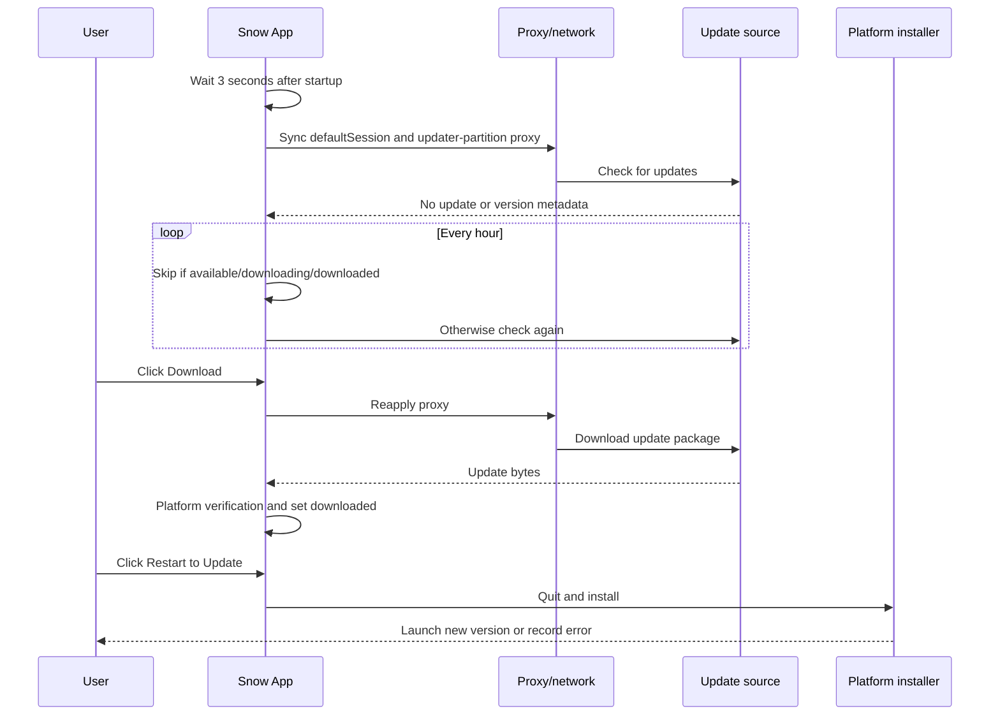

# 18-App Updates

Snow App checks for new versions automatically but does not silently download or install them. Both download and restart-to-install require explicit user actions. This guide describes the common update flow, proxy behavior, and the different Windows/Linux and macOS implementations and troubleshooting procedures.

## 1. Update entry point and status

Open Settings and scroll to the **About** area at the bottom of the Settings sidebar to view the current version and update status. **About** is a separate sidebar information area rather than one of the 26 settings pages. The UI can expose:

| State | Meaning |
| --- | --- |
| `available` | A version newer than the installed version was found |
| `version` | Available update version |
| `downloading` | The package is being downloaded |
| `progress` | Download progress |
| `downloaded` | Download and verification are complete; restart installation is available |
| `error` | Check, download, verification, or installation preparation failed |

Click **Check for Updates** to check immediately. After a new version is found, clicking the version/download control starts the download. After completion, clicking **Restart to Update** installs it. An update-triggered quit bypasses the ordinary close confirmation so it cannot block the installer.

## 2. Automatic check schedule

- After the main window is created and the updater is initialized, Snow starts the first asynchronous check after about **3 seconds**;
- while the application remains open, a timer fires every **hour**;
- if an update is already available, downloading, or downloaded, the hourly task skips the network check;
- automatic checking never starts an automatic download;
- a manual check can refresh status when needed.



## 3. Proxy behavior

Before each check and download, Snow reapplies its in-app proxy configuration:

- when the built-in proxy is enabled, it uses `http://host:port`;
- when disabled, it uses `mode: "system"`, following the system proxy rather than forcing a direct connection;
- `session.defaultSession` covers `net.fetch`, webviews, and the custom macOS updater;
- on Windows/Linux, `electron-updater` uses a separate uncached partition: `session.fromPartition("electron-updater", { cache: false })`.

The proxy synchronization function catches and logs its own failures, and the subsequent request may still continue. A proxy configuration failure therefore does not necessarily stop the check immediately. Troubleshooting must test proxy reachability, update-source availability, and logs together.

See [Configure Proxy and Network](4-configure-proxy.md) for general network settings.

## 4. Windows and Linux: `electron-updater`

Windows and Linux use the `electron-updater` flow:

- `autoDownload = false`: discovery waits for the user to start downloading;
- `autoInstallOnAppQuit = false`: an ordinary quit does not install automatically;
- checking, available, not available, download progress, downloaded, and error events drive status;
- after explicit restart confirmation, Snow calls `autoUpdater.quitAndInstall()`;
- development mode enables `forceDevUpdateConfig = true` and attempts a check, but the result still depends on development update configuration and the feed.

This documentation promises only the `electron-updater` behavior visible in the code. Package signing, notarization, repository permissions, and release-asset integrity depend on the actual distribution configuration and cannot be inferred from the client flow alone.

### Common Windows/Linux issues

| Symptom | Recommendation |
| --- | --- |
| Checking never finishes | Check system/in-app proxy, DNS, TLS, and update-source response |
| No update is reported after a release | Verify installed version, channel, platform/architecture assets, and release metadata |
| Download fails | Check the dedicated updater partition's proxy, available disk space, and network logs |
| Downloaded update will not install | Check installation-directory permissions, installer files, locking processes, and security software |
| Development behavior differs | Development checks depend on dev update config and do not reproduce every packaged-build condition |

## 5. macOS: custom full-ZIP update

The current macOS distribution has no code-signing certificate, so it does not use the signed `electron-updater` path. Instead, it uses a custom **unsigned full-ZIP self-replacement flow**. Its trust model is weaker than a platform-signed updater and depends mainly on HTTPS, the manifest source, and the SHA256 declared by that manifest.

> SHA256 proves only that the downloaded file matches the manifest. If an attacker can replace the manifest itself, they can replace both the URL and SHA256. Protect the release repository, manifest location, and network boundary.

An unpackaged macOS development build returns early from checking and does not support the subsequent download/install flow.

## 6. macOS manifest

The default manifest is:

```text
https://github.com/MayDay-wpf/snow-app/releases/latest/download/latest-mac.json
```

Override it with the `SNOW_UPDATE_MANIFEST_URL` environment variable. The request timeout is 20 seconds. A manifest must provide at least:

```json
{
  "version": "x.y.z",
  "files": {
    "arm64": {
      "url": "https://example.invalid/snow-app-arm64.zip",
      "sha256": "<64-character hexadecimal SHA256>",
      "size": 123456789
    },
    "x64": {
      "url": "https://example.invalid/snow-app-x64.zip",
      "sha256": "<64-character hexadecimal SHA256>",
      "size": 123456789
    }
  }
}
```

`files[process.arch]` must exist and include `url` and `sha256`; `size` is optional. A release must ensure that version, architecture key, asset URL, size, and hash exactly match the ZIP.

## 7. macOS download and verification

The download stream honors backpressure and performs these checks:

1. when HTTP `content-length` is present, compare it with received bytes;
2. when the manifest includes `size`, compare it with the actual file size;
3. asynchronously hash the entire ZIP through Rust `sha256File`;
4. compare the result with manifest `sha256`;
5. on any size or SHA256 mismatch, fail and delete the residual ZIP;
6. set `downloaded=true` only after all checks pass.

These checks detect truncation, cache damage, and disagreement with a trusted manifest. They do not replace code signing, notarization, or protection of release accounts.

## 8. macOS cache

The cache directory is `app.getPath("userData")/updates`. Principal files are:

- `snow-app-update-<version>-<arch>.zip`
- `latest-mac.json`
- `install-update.sh`

During a check, if the target ZIP already exists and its SHA256 matches, Snow marks it installable without downloading again. After a successful new package, other old-version ZIPs are removed. A cache hit still depends on SHA256, not merely a filename or size.

## 9. macOS installation script

After the user clicks **Restart to Update**, Snow writes `<userData>/updates/install-update.sh` and launches it as a detached `/bin/bash` process. `unref()` lets it continue after Snow exits. The script:

1. waits up to 90 seconds for the old Snow process to exit;
2. removes the old `.app` bundle;
3. extracts the full ZIP into the original installation directory;
4. runs `xattr -cr` to clear quarantine extended attributes;
5. launches the new version with `open`;
6. records completion or an error.

The original installation directory must be writable. Because the script deletes the old bundle before extraction, a power failure, disk error, permission change, or bad archive can leave the application unusable. Successful verification and a reliable recovery path remain important.

## 10. macOS logs

The installation-script log is:

```text
app.getPath("logs")/updater.log
```

It records updater start, relevant paths, exit waiting, old-bundle removal, unzip, `xattr`, launch, updater done, or `[ERROR]`. Check/download/application errors are also recorded through Snow's logging system.

Logs can include local paths and version details. Before attaching them to a report, inspect and redact usernames, directory layouts, internal URLs, or other sensitive values.

## 11. macOS troubleshooting order

Use this order to avoid unnecessary repeated downloads:

1. fetch the manifest and confirm valid JSON, `version`, and the current `process.arch` key;
2. verify that the manifest ZIP URL is reachable;
3. check in-app/system proxy, DNS, and TLS;
4. inspect the ZIP, manifest copy, and `install-update.sh` under `<userData>/updates/`;
5. inspect `app.getPath("logs")/updater.log` and application logs;
6. compare HTTP `content-length`, manifest `size`, and local file size;
7. independently calculate the local ZIP SHA256 and compare it with a trusted manifest;
8. verify that the installation directory is writable and disk space is sufficient;
9. determine whether the old process was still running after 90 seconds;
10. verify `/usr/bin/unzip`, `xattr`, and `open`, then inspect script errors.

If the old `.app` was removed and extraction failed, stop rerunning the script. Download a fresh installer from a trusted release source and preserve updater logs/cache evidence before recovery.

## 12. Security recommendations for users and publishers

### Users

- Use only the official or organization-approved update source.
- Review the target version and release notes, and save work before installation.
- macOS users should explicitly understand the unsigned self-replacement boundary.
- Do not substitute a ZIP from an unknown mirror after an update failure.
- If source compromise is suspected, stop updating until a trusted channel confirms recovery.

### Publishers

- Protect GitHub release accounts, tokens, and manifest write permissions.
- Generate and independently verify the correct size/SHA256 for every architecture.
- Upload ZIPs before publishing the manifest that references them to avoid transient inconsistency.
- Retain auditable build artifacts and hash records.
- When feasible, migrate to code signing, notarization, and the platform-standard update chain.

See [Security and Trust Boundaries](../3-reference/5-security-and-trust-boundaries.md) for how update security relates to the application's other trust domains.
