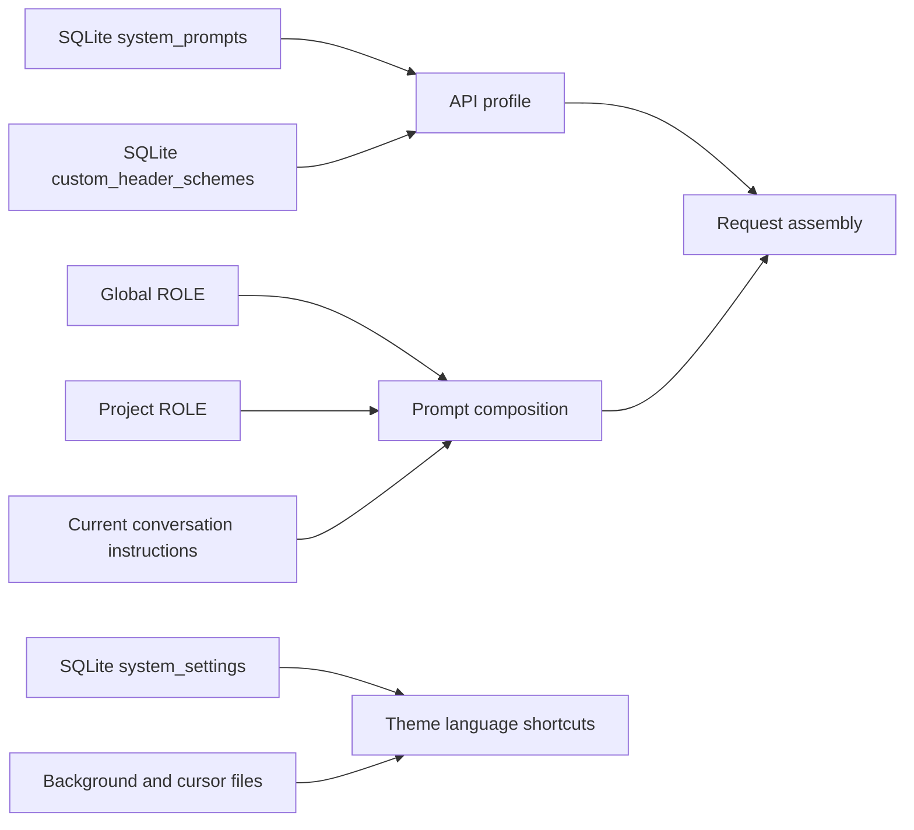

# 19-Personalization, Theme, and Shortcuts

> This guide explains Snow App's rule composition, request configuration, theme, language, and keyboard-shortcut behavior. The Settings sidebar currently contains 26 settings pages; this guide covers System Prompt (settings page id: `system-prompt-settings`), Personalization (`personalization-settings`), Custom Headers (`custom-headers-settings`), Theme Settings (`theme-settings`), and Keyboard Shortcuts (`keyboard-shortcuts-settings`). The language selector is a separate area below the settings list, not a twenty-seventh page.

## Configuration Flow and Effective Boundaries

The renderer accesses the main process or Rust storage layer through preload APIs and IPC. File-based rules live under `~/.snow/` or the workspace, while structured settings are primarily stored in `~/.snowapp/snowapp.db`. Changing a rule does not rewrite historical messages; it mainly affects subsequent prompt construction and the next conversation request.

## Personalization Rules

### Global ROLE

The global rules file is `~/.snow/ROLE.md`. The Personalization page reads and saves it through preload → IPC:

- if the file does not exist, the editor shows an empty draft;
- saving creates the `~/.snow/` directory when necessary;
- global rules apply to projects that allow global rules to be loaded;
- rule content can change model behavior and should be reviewed like code or configuration before saving.

### Project ROLE

Project rules live at `<workspace>/ROLE.md` and the editor only modifies the active project. Local and SSH workspaces are supported; the main process uses the remote-access path to read and write SSH workspace rules.

Whether a project loads global rules is controlled by `role.includeGlobalRules` in `<workspace>/.snow/settings.json`. The default is `true` when the field is absent.

### Load Order and Precedence

The composition order shown by the UI is:

1. global rules;
2. project rules;
3. current conversation instructions.

All enabled scopes are loaded. Later instructions take precedence only when instructions conflict; non-conflicting rules remain active together. After switching projects, verify that the editor is showing the intended workspace before saving.

## System Prompts and API Profiles

System-prompt templates are stored in the SQLite `system_prompts` table. They can be created, edited, enabled, disabled, and deleted, and Snow CLI configuration can be synchronized from `~/.snow/system-prompt.json`. Templates have either `global` or `project` scope.

An API profile's `systemPromptIdsJson` has three states:

| Value | Behavior |
|---|---|
| Empty string | Inherit globally enabled system prompts |
| `__DISABLED__` | Use no user-configured system-prompt template for this profile |
| JSON string array | Bind an explicit list of system-prompt IDs |

At runtime, effective user prompts map to each provider's protocol: a `system` message for Chat Completions, `instructions` for Responses, top-level `system` for Anthropic, and `systemInstruction` for Gemini. Whenever user prompts are present, they exclusively occupy that provider system field. Snow's built-in Agent prompt is not discarded; it is demoted to a leading `user` message. Without a user prompt, the built-in prompt remains in the provider system field. Consequently, `__DISABLED__` disables user templates rather than removing Snow's built-in Agent instructions.

Before disabling or deleting a template, check the profiles that use it. An explicit ID list is not equivalent to inheriting global prompts.

## Custom Request Headers

Header schemes are stored in the SQLite `custom_header_schemes` table. They can be created, edited, enabled, disabled, and deleted. Header names must be unique within a scheme, and Snow CLI configuration can be synchronized from `~/.snow/custom-headers.json`.

An API profile's `customHeaderSchemeId` also has three states:

| Value | Behavior |
|---|---|
| Empty string | Inherit the global header scheme |
| `__DISABLED__` | Add no custom headers |
| Scheme ID | Bind the specified header scheme |

Custom headers are injected after Snow sets authentication and protocol headers. Empty names/values are skipped, while an invalid HTTP header name or value fails the request. Reserved names are matched case-insensitively and cannot override application-managed values:

| Provider protocol | Headers a custom scheme cannot override |
|---|---|
| Chat Completions and Responses | `Authorization`, `Content-Type`, `Accept-Encoding` |
| Anthropic | The preceding three plus `X-API-Key` |
| Gemini | `Content-Type`, `Accept-Encoding`; the API key is in the URL query rather than an Authorization header |

> **Security warning:** Headers may contain API keys, bearer tokens, cookies, or other secrets. Do not share raw configuration files, the database, request logs, or screenshots that expose headers. Redact troubleshooting material first.

## Theme Settings

### Modes, Presets, and Custom Colors

Theme mode supports `system`, `light`, and `dark`. You can select a built-in preset or maintain separate light and dark palettes. Changes are previewed immediately and automatically saved with a 1,000 ms debounce; restoring defaults and applying AI-generated colors persist immediately.

The theme is stored as the `theme_settings` record in SQLite `system_settings`, including:

- `mode` and `presetId`;
- `custom.light` and `custom.dark` palettes;
- `background`;
- `fontFamily`;
- `streamCursor`.

The renderer also keeps a fast localStorage theme cache to reduce startup flashing. SQLite remains the persistent settings source.

### Background, Font, and Streaming Cursor

When you select a background image, Snow App copies it to `~/.snowapp/backgrounds/` and no longer continuously references the original file. The renderer reads the managed resource through the restricted `theme-bg://` protocol. Background settings include enabled state, opacity, and a blur value from 0 to 100.

The font can use the system default or a selected family. The streaming cursor supports:

- the default pulsing `dot`;
- a built-in `lucide` icon;
- a `custom` SVG.

Custom SVGs are copied to `~/.snowapp/stream-cursors/`. Cursor size is normalized to 8–48, with a default of 14. Invalid icon types or missing required paths fall back to the dot.

### AI Color Generation

AI color generation uses the background image as visual input. You must select an API profile whose advanced model supports vision. Applying the result writes the theme immediately. Because the background is sent to the selected model, review the provider's data-handling policy before using private images.

## Language

Snow App supports `en`, `zh-CN`, and `zh-TW`. The language selector is a separate area at the bottom of the Settings sidebar.

- Fast cache: renderer localStorage key `snow.locale`;
- persistent source: the `language` record in SQLite `system_settings`;
- without a localStorage cache, the app first reads the database;
- without a valid database value, it matches the browser language and falls back to English when no match exists.

`~/.snow/language.json` belongs to the Snow CLI/config tool configuration domain and is not the single source of truth for the current UI language.

## Desktop Pet

The "Desktop pet" page in the settings sidebar manages your desktop pet:
install pet packages (`.zip`) from Codex App, Petdex, or Snow App, pick the
active pet, and toggle between waking (showing on your desktop) and dismissing
(hiding) it. While awake, a slider adjusts the display size (0.5–2x, default
0.75). The pet reacts to your AI work in real time.

## Keyboard Shortcuts

### Default Bindings

`Mod` means the platform's primary modifier: Command on macOS and Control on other platforms.

| Action | Default key |
|---|---|
| Cancel the current session | `Escape` |
| Open search | `Mod+F` |
| Open memo | `Mod+B` |
| Open TODO | `Mod+T` |
| Cycle project | `Mod+Backtick` |
| Open project explorer | `Mod+D` |
| Cycle API profile | macOS `Ctrl+P`; other platforms `Alt+P` |

All seven shortcuts are enabled by default with `foregroundOnly=true`. Their JSON configuration is stored in the `keyboard_shortcuts` record in SQLite `system_settings`.

### Rebinding, Conflicts, and Scope

Each shortcut can be enabled independently, rebound, and reset. The page can also restore all default keys. While recording a normal action, `Esc` cancels recording; while recording “Cancel the current session,” `Esc` is a valid binding. Recording supports the **Shift modifier key** (for example `Cmd/Ctrl+Shift+P`), which is recognized and saved through event conversion, display, and matching logic.

The page reports binding conflicts but does not choose a resolution for you. At runtime, only the first matching action in action order is triggered. A local component may intercept an action—for example, a focused file viewer can use the search shortcut for in-file search.

The “Foreground only” value is persisted, but the current engine is based on renderer `document.keydown` events. Consequently, even when this option is off, shortcuts only work while the app is focused and able to receive keyboard events. They are not operating-system global shortcuts.

## Storage, Lifecycle, and Security Boundaries

| Data | Location | Lifecycle | Security boundary |
|---|---|---|---|
| Global ROLE | `~/.snow/ROLE.md` | Retained until the user overwrites or deletes it | Can affect every project that loads global rules |
| Project ROLE and switch | `<workspace>/ROLE.md`, `<workspace>/.snow/settings.json` | Retained with workspace files | Limited to the current project; SSH content uses the remote-access path |
| System prompts and header schemes | `~/.snowapp/snowapp.db` | Retained until UI deletion, database migration, or recovery | May contain instructions and secrets; database backups are sensitive too |
| Theme, language, and shortcuts | SQLite `system_settings` | Retained until changed, reset, or the database is replaced | localStorage is only a startup cache, not a replacement source of truth |
| Backgrounds and cursor SVGs | `~/.snowapp/backgrounds/`, `~/.snowapp/stream-cursors/` | Managed copies remain after the original is removed | `theme-bg://` exposes only controlled local resources |

For the full directory, backup, and restore boundaries, see [Data Storage Locations](../3-reference/4-data-storage-locations.md).

## Troubleshooting

### Why do old messages remain unchanged after I edit ROLE?

ROLE is read during subsequent prompt construction. It does not rewrite stored message history. Validate the change with the next request.

### Why does a shortcut not fire in another app after I turn off “Foreground only”?

The current engine uses renderer keyboard events, which stop when Snow App loses focus. The option does not currently register an operating-system global shortcut.

### Does deleting the original background image break the theme?

No. The selected file was copied to `~/.snowapp/backgrounds/`. Removing the managed application copy, however, makes that background unavailable.

### Why is an API profile not using the global prompt or headers?

Check whether the profile is set to `__DISABLED__` or has an explicit ID binding. Only an empty string means inherit the global configuration.
