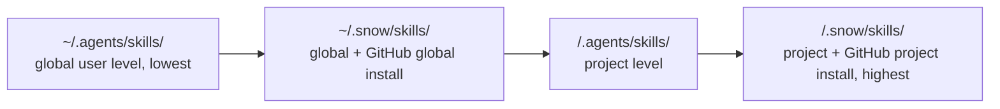

# 2-Install and Manage Skills

A Skill is an instruction package whose entry point is `SKILL.md`. Snow App scans Skill directories and dynamically registers the names and descriptions of enabled Skills with `skills-skill-execute`. When the agent selects one, Snow App loads its body, directory tree, and tool restrictions.

This guide covers scanning, installation, toggles, agent-based management, and uninstallation. To author a Skill from scratch, continue with [Create and Author Skills](21-create-and-author-skills.md).

Type `@!<query>` in the chat input to search **enabled Skills**; selecting one inserts a Skill chip into the composer that is sent to the AI as-is. The AI reads the Skill's name and description, then loads the `SKILL.md` body on demand. See [Using Chat and the AI Assistant](10-using-chat-and-ai.md) for Skill references.

## 1. Scan directories and override precedence

With a project context, Snow App scans in the following order. **A later Skill with the same ID replaces an earlier one**:

| Scan order | Directory                   | Scope                                     | Same-ID precedence             |
| ---------- | --------------------------- | ----------------------------------------- | ------------------------------ |
| 1          | `~/.agents/skills/`         | Global user                               | Lowest                         |
| 2          | `~/.snow/skills/`           | Global user; global GitHub install target | Higher than 1                  |
| 3          | `<project>/.agents/skills/` | Project                                   | Higher than global directories |
| 4          | `<project>/.snow/skills/`   | Project; project GitHub install target    | Highest                        |



Without a project context, only the two global directories are scanned. Scanning is recursive: every directory that contains `SKILL.md` is a Skill. **The Skill ID is the path relative to the scan root**, normalized to `/`. For example:

```text
<project>/.snow/skills/
└── team/
    └── release/
        ├── SKILL.md
        └── checklist.md
```

The Skill ID is `team/release`, not the frontmatter `name`. Directories whose names start with `.` and directories named `templates`, `examples`, or `node_modules` are not traversed.

> A same-ID override replaces the whole Skill—metadata, body, path, and tool restrictions are not merged. When troubleshooting, inspect the effective `path`, `location`, and `source` first.

## 2. Install from GitHub

### 2.1 Settings panel

1. Open **Settings → Skills Settings** (settings page id: `skills-settings`);
2. Enter a source under **Install from GitHub**;
3. Choose **Global** or **Project**. A project install requires an active project;
4. After installation, verify the ID, path, and toggle in the list.

Supported source formats:

- `https://github.com/owner/repo`
- `owner/repo`
- `owner/repo@branch`
- `owner/repo@branch:sub/dir`
- `https://github.com/owner/repo/tree/branch/sub/dir`

The repository's default branch is used when no branch is specified. The installer first checks whether the selected base directory itself contains `SKILL.md`. If not, it discovers `SKILL.md` only in its **immediate child directories**, which supports multi-Skill repositories. If the Skill is nested deeper, specify that subdirectory in the source URL.

A GitHub installation:

1. Downloads and extracts the repository archive;
2. Derives a safe installation ID from frontmatter `name`, falling back to the repository name;
3. Installs the complete Skill directory into `~/.snow/skills/<id>/` or `<project>/.snow/skills/<id>/`;
4. Records it in `~/.snow/skills-registry.json` for later identification and uninstallation;
5. Stages the previous directory before replacing a same-ID target and attempts rollback if the registry update fails.

New content is rescanned on the next Skill-list refresh or invocation; an app restart is not required.

## 3. Actual `SKILL.md` frontmatter

The field names currently recognized by Snow App are **`enable`** and **`allowed-tools`**:

```markdown
---
name: release-checker
description: Validate a release package and produce a concise checklist.
enable: true
allowed-tools:
  - filesystem-read
  - grep-search
---

# Release checker

Follow the repository release policy, inspect the requested artifacts, and report
blocking problems before suggestions.
```

| Field           | Required | Parsing semantics                                                                                                                                          |
| --------------- | -------- | ---------------------------------------------------------------------------------------------------------------------------------------------------------- |
| `name`          | No       | Display name; defaults to the final segment of the Skill ID. It also contributes to the installation ID for GitHub installs.                               |
| `description`   | No       | Registered in the Skill tool description so the agent can decide when to load it. State the trigger and expected output clearly.                           |
| `enable`        | No       | Boolean, default `true`. With `false`, the Skill is not registered or executable by default.                                                               |
| `allowed-tools` | No       | A YAML string array or comma-separated string. When non-empty, loading the Skill adds an “only these tools” restriction; an empty list means unrestricted. |

`enabled` and `allowed_tools` are **not Skill frontmatter fields** and do not have the intended effect. The config API's `value.enabled` below is valid; that API parameter ultimately writes the frontmatter field named `enable`.

Use exact Snow App tool names in `allowed-tools`, such as `filesystem-read` and `config-list`. This is an agent tool whitelist included with the loaded Skill prompt, not an operating-system sandbox. Follow least privilege and omit write, command, or network tools that the workflow does not need.

## 4. Toggles and project overrides

### 4.1 Settings panel

In **Settings → Skills Settings** (settings page id: `skills-settings`):

- The global view rewrites the top-level `enable` field of the effective `SKILL.md`;
- The project view stores a project override in the app database and does not edit the Skill file;
- When an override exists, the effective state is “project database override > effective Skill's `enable` value.”

### 4.2 Manage through the `config` service

Skills are not an arbitrary object-valued configuration file. The `config` service delegates its `skills` scope to the same Skills service used by the UI:

```text
config-list scope=skills projectId=<projectId>
config-get  scope=skills key=team/release projectId=<projectId>
config-set  scope=skills key=team/release projectId=<projectId> value={"enabled":false}
```

Important semantics:

- `config-list` returns `skills` and `githubInstalled`. In a project view, `defaultEnabled` is the frontmatter value and `enabled` is the effective value after the database override;
- A global toggle also uses `value={"enabled":...}`, but the service rewrites **`enable`** in the Skill file;
- With `projectId`, the service writes only a project database override, effective immediately;
- The config tool in the current conversation may auto-inject the active project ID. Use `currentProjectId` in the response to verify context, and pass an empty `projectId` when you explicitly need global configuration;
- Install with `value={"url":"owner/repo","location":"global"}`. For a project installation, use `location:"project"` and pass `projectId`. `key` is required for config API routing, while the actual installation ID is still derived from the installed content;
- Run `config-get` or `config-list` again after a change and verify the path and effective state.

## 5. Uninstallation boundaries

### 5.1 GitHub-installed Skills

The Settings-panel uninstall action and:

```text
config-delete scope=skills key=<skillId> projectId=<projectId> confirmed=true
```

only apply to GitHub installations recorded in `~/.snow/skills-registry.json`. Before an agent calls `config-delete`, it must show the scope, key, projectId, and impact and obtain explicit user confirmation.

Uninstallation removes the `~/.snow/skills/<id>` or `<project>/.snow/skills/<id>` directory identified by the registry record, then removes that record. To avoid ambiguity in registry lookup by ID, do not install two GitHub Skills with the same ID in global and project scopes. Inspect `githubInstalled` with `config-list scope=skills` first.

### 5.2 Manually placed or app-provided Skills

A Skill without a GitHub registry record cannot be removed through the config/UI GitHub-uninstall flow:

- For a manually placed Skill, delete the exact directory only after user confirmation;
- For an app-provided or deployment-copied Skill, do not assume it is uninstallable; prefer disabling it;
- A lower-precedence same-ID Skill still exists while shadowed and becomes visible again if the overriding directory is removed.

Directory deletion is destructive. An agent must confirm the exact path, source, and impact and must not infer a directory from the display name alone.

## 6. Troubleshooting

| Symptom                                       | Cause and fix                                                                                                        |
| --------------------------------------------- | -------------------------------------------------------------------------------------------------------------------- |
| Skill does not appear                         | Ensure the filename is exactly `SKILL.md`; check skipped directories; fix an unclosed `---` marker or invalid YAML.  |
| Toggle appears ineffective                    | Use frontmatter `enable`; then check for a project database override or a higher-precedence same-ID Skill.           |
| Agent does not select the Skill               | Add a specific `description`, confirm `enable: true`, and refresh the Skill list.                                    |
| A tool is rejected                            | Ensure `allowed-tools` contains the exact full tool name; `allowed_tools` is invalid.                                |
| GitHub source reports no Skill                | Neither the root nor an immediate child has `SKILL.md`; point a subdirectory URL at the correct level.               |
| Uninstall returns “not installed from GitHub” | The Skill has no registry record; verify its source and use the manual-directory workflow.                           |
| Edits do not take effect                      | Inspect the effective `path` through `config-list`, rule out same-ID shadowing, then load it again on the next turn. |
