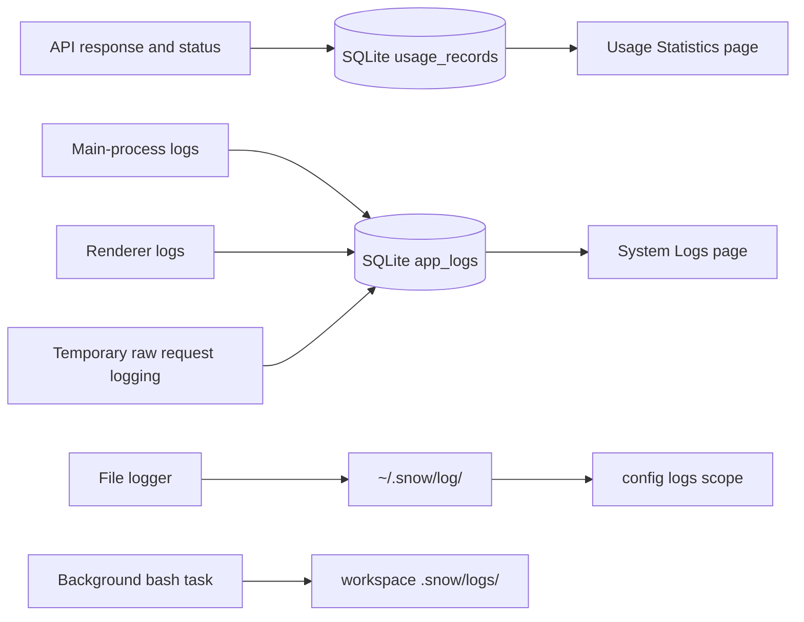

# 20-Usage Statistics and System Logs

> This guide explains the actual accounting rules in the Usage Statistics (settings page id: `usage-settings`) and System Logs (`system-logs`) settings pages, the three independent log sources, their lifecycles, and the security boundaries for troubleshooting.

## Data Flow Overview

Both `usage_records` and `app_logs` live in `~/.snowapp/snowapp.db`. File logs under `~/.snow/log/` and background-task output under `<workspace>/.snow/logs/` are not part of that database. Their cleanup operations are independent.

## Usage Statistics

### Recorded Fields

An accounting record may contain:

- conversation and response identifiers;
- model, API profile/configuration, and request method;
- input, output, cache-creation, and cache-read tokens;
- status;
- whether the request came from a sub-agent;
- directory/project;
- local `created_at` time.

Records are stored in the SQLite `usage_records` table. The native list API supports optional conversation and directory filters, but the current Settings detail table does not use them.

### Accounting Rules

The page applies these rules:

- total tokens = input tokens + output tokens;
- cache read is a subset of input and is not added to total tokens again;
- effective cache read = the smaller of cache read and input;
- non-cached input = input − effective cache read;
- only records with `status = 'error'` count as failed requests.

These rules avoid negative values or double counting when an upstream provider reports unusual cache values.

### Actual Date-Filter Coverage

Date ranges use local-day boundaries: `00:00:00` on the first day and `23:59:59` on the last day. Presets include Today, Yesterday, Last 7 Days, Last 30 Days, This Month, Last Month, and Custom.

> **Important: the date filter does not uniformly filter every area on the page.**

| Page area | Actual range |
|---|---|
| Summary cards | Affected by the selected date range |
| Daily heatmap | Always requests roughly one year and does not follow the top date filter |
| Usage Records detail table | Currently requests all records, 20 per page, without date, conversation, or directory filters |

The summary-card totals therefore do not directly correspond to the rows on the current detail-table page.

## SQLite System Logs

### Browsing and Filtering

The System Logs page reads the SQLite `app_logs` table, 50 rows per page. It can filter by date and by `DEBUG`, `INFO`, `WARN`, `ERROR`, or all levels. The native API supports a module filter, but the current UI has no module input.

Fields may include `level`, `module`, `func`, `line`, `message`, `input`, `output`, `duration`, `context`, `error`, `source`, and `created_at`. Logs come from both main and renderer processes. Renderer entries written through IPC are forced to use `source: "renderer"`. Detail fields can be copied.

### Clear Behavior

The clear button uses two-step confirmation: the first click enters a confirmation state, and the second click must occur within three seconds. The native operation runs `DELETE FROM app_logs`.

> **Warning: clearing deletes every log row in `app_logs`, not only the currently displayed date, level, or page.**

## Raw API Request Logging

When request logging is enabled, the complete raw API request JSON is written to `app_logs` as:

- level: `DEBUG`;
- module: `api_request`;
- func: provider;
- message: endpoint;
- input: complete payload JSON.

The payload may contain system prompts, user content, tool inputs, file fragments, and other sensitive data. The UI therefore asks for confirmation before enabling it.

### Automatic Shutoff

- The default duration is 10 minutes;
- presets are 3, 5, 10, 15, 30, and 60 minutes;
- the slider range is 3–60 minutes;
- enabling first persists the expiry and then turns on the switch;
- the UI updates the countdown every second and disables logging at expiry;
- the Rust write path also enforces the expiry, so logging stops and the switch is reset even when the log page is closed.

The switch and expiry are stored in SQLite `system_settings`. Enable raw request logging only briefly when ordinary logs are insufficient, reproduce once, disable it immediately, and remove sensitive logs that are no longer needed.

## File Logs: `~/.snow/log/`

The `logs` scope in the AI `config` tool operates on daily level files under `~/.snow/log/`, such as `2026-08-03-error.log`. Valid names follow `YYYY-MM-DD-(debug|info|warn|error).log`.

- `config-list`: lists files in reverse filename order with `file`, `date`, `level`, `size`, and `lastModified`, plus total-file, total-byte, and latest-error-file summaries;
- `config-get`: accepts an exact filename or `debug` / `info` / `warn` / `error` for today's file; it returns the last 200 lines by default and at most 2,000; a missing file returns `exists: false`;
- `config-set`: unsupported because `logs` is a read-only diagnostic scope;
- `config-delete`: accepts only an exact filename and requires explicit user confirmation first; a missing file returns `deleted: false`.

The filename allowlist and directory join prevent path traversal. Deleting one file does not clear SQLite `app_logs`.

## Background-Task Logs: `<workspace>/.snow/logs/`

When the bash tool starts a background task with `detach:true`, stdout and stderr are written to `<workspace>/.snow/logs/<name>-<timestamp>.log`. This output belongs to neither `app_logs` nor `~/.snow/log/`.

Stopping a task does not necessarily delete its log file. Before diagnosing or cleaning up, verify the workspace and exact file so that output from another project is not mistaken for an application log.

## Recommended Diagnostic Workflow

1. Record the time, project, API profile, model, and reproduction steps.
2. In Usage Statistics, confirm whether the request was recorded, whether its status is error, and whether token values look unusual.
3. Remember that the date filter affects only the summary; it does not filter the heatmap or current detail table.
4. In System Logs, filter the current day by `ERROR` and `WARN`.
5. Expand `module`, `func`, `context`, `error`, and related fields; inspect for secrets before copying.
6. Enable raw request logging briefly only when ordinary logs are insufficient.
7. Reproduce once, then disable request logging immediately.
8. If necessary, use the config `logs` scope to inspect `~/.snow/log/`.
9. If the problem came from a background command, inspect `<workspace>/.snow/logs/` in the current workspace.

## Redaction Before Sharing

Before sharing logs, screenshots, or a database, remove at least:

- API keys, Authorization values, cookies, and custom headers;
- system prompts, ROLE content, user messages, and tool inputs;
- file-content fragments and information about private images;
- usernames, home-directory and workspace paths, and private network addresses;
- identifiers that can link a conversation, response, project, or profile.

“Stored only on this computer” does not mean “safe to publish.” Treat database backups and raw request logs as sensitive data.

## Lifecycle and Deletion Boundaries

| Data source | Storage location | Lifecycle | Deletion boundary |
|---|---|---|---|
| Usage records | SQLite `usage_records` | No automatic retention period is defined in source; retained until database migration, recovery, or a future explicit cleanup | The current Usage page has no clear action |
| System and request logs | SQLite `app_logs` | No automatic rotation is defined; grows until the user clears it or the database is replaced | UI clear deletes all log rows; filters do not limit deletion |
| Request-logging switch | SQLite `system_settings` | Automatically turns off and resets at expiry | Turning off the switch does not delete payloads already written |
| Config file logs | `~/.snow/log/` | Independent files with no unified automatic retention found | `config-delete` removes one exact file per confirmed operation |
| Background-task logs | `<workspace>/.snow/logs/` | Retained with workspace files | Not affected by the System Logs UI or config `logs` deletion |

For complete backup and storage boundaries, see [Data Storage Locations](../3-reference/4-data-storage-locations.md).
