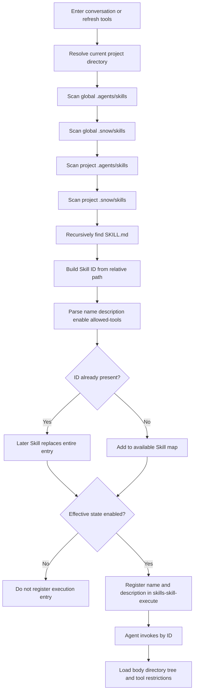

# 21-Create and Author Skills

This guide is for users who want Snow App Agent—or a human author—to create a Skill from scratch. You will choose the correct directory, write actual frontmatter, constrain tool access, verify dynamic registration, and troubleshoot failures.

For third-party installation, toggles, and uninstallation, see [Install and Manage Skills](2-install-and-manage-skills.md).

## 1. Choose the scope and Skill ID first

### 1.1 Choose a directory

| Goal | Recommended directory | Typical use |
| --- | --- | --- |
| Current project only | `<project>/.snow/skills/<skill-id>/` | Project policy, scripts, and team workflows |
| Current project with a generic agent directory | `<project>/.agents/skills/<skill-id>/` | Discovery by other compatible tools |
| All projects for the current user | `~/.snow/skills/<skill-id>/` | Personal reusable workflows managed by Snow App |
| Generic user-level agent directory | `~/.agents/skills/<skill-id>/` | Cross-agent sharing |

Effective same-ID precedence from highest to lowest is:

1. `<project>/.snow/skills/`
2. `<project>/.agents/skills/`
3. `~/.snow/skills/`
4. `~/.agents/skills/`

Later scan roots replace earlier same-ID Skills; their contents are not merged. Before creating a Skill, check all four locations for the same ID to avoid accidental shadowing.

### 1.2 The ID is not `name`

The Skill ID is the directory containing `SKILL.md`, relative to its Skill root. For example:

```text
<project>/.snow/skills/database/schema-review/SKILL.md
```

has the ID `database/schema-review`. Frontmatter `name` is only a display name and does not change the runtime ID of a manually created Skill. Prefer lowercase letters, digits, hyphens, and `/` groups; avoid spaces and ambiguous path characters.

## 2. Scan and dynamic-registration data flow



The scan skips directories whose names start with `.` and directories named `templates`, `examples`, or `node_modules`. A Skill is skipped when its frontmatter is invalid or an opening `---` has no closing marker. A file without frontmatter can load, but a missing description makes automatic selection less reliable.

## 3. Create from scratch: human workflow

1. Choose a scope and unique ID;
2. Create `<skills-root>/<skill-id>/`;
3. Create `<skills-root>/<skill-id>/SKILL.md`;
4. Fill in metadata and instructions using the template in section 5;
5. Put references, templates, or scripts in the same Skill directory when needed;
6. Refresh Skills Settings, or ask the agent to validate with `config-list scope=skills`;
7. Run a minimal task and verify triggering, steps, permissions, and output.

Recommended structure:

```text
my-skill/
├── SKILL.md
├── references/
│   └── policy.md
├── templates/
│   └── report.md
└── scripts/
    └── validate.ps1
```

When a Skill loads, Snow App includes its directory tree and absolute path for the agent, so the body can explicitly say “read `references/policy.md` first.” Auxiliary files are not registered as separate Skills; the entry point is always the uppercase filename `SKILL.md`.

## 4. Ask Snow App Agent to create it

Give the agent enough information to avoid inventing business rules:

- Scope: global or a specific project;
- Exact Skill ID;
- When it should and should not trigger;
- Inputs, output, and completion criteria;
- Allowed tools;
- Required auxiliary files;
- Validation scenarios to run.

Suggested request template:

```text
Create a Skill in the current project with ID release/check-package.
Trigger: pre-release artifact checks; do not publish anything.
Output: blocking issues, warnings, and passed checks.
Allow only filesystem-read and grep-search.
Check for a same-ID Skill first. After creation, verify its path and fields with
config-list/config-get, then run one read-only example. Do not delete or overwrite
an existing Skill unless I confirm.
```

A rigorous agent workflow is:

1. Confirm the project root and exact absolute target path;
2. Search all four scan roots for the same ID;
3. If the target already exists, explain the override impact and ask before replacing it;
4. Create the directory, `SKILL.md`, and required auxiliary files;
5. Read back the written content and check frontmatter and fenced-block boundaries;
6. Validate the effective path, state, and `allowedTools` in the config Skills list;
7. Run a non-destructive minimum test and report the evidence.

## 5. Frontmatter fields

The actual fields are:

```yaml
---
name: package-review
description: Review release artifacts when the user asks for a pre-publish package check.
enable: true
allowed-tools:
  - filesystem-read
  - grep-search
---
```

| Field | Type | Default | Authoring guidance |
| --- | --- | --- | --- |
| `name` | string | Final ID segment | Keep it short and readable. The GitHub installer also uses it to derive an installation ID. |
| `description` | string | Empty | State “when to use + what it does + primary output,” not a vague capability. |
| `enable` | boolean | `true` | Set `false` when the Skill should not be registered yet. The field is not `enabled`. |
| `allowed-tools` | string[] or comma-separated string | Unrestricted | Use exact full tool names. The field is not `allowed_tools`. |

`allowed-tools` may also be written as:

```yaml
allowed-tools: filesystem-read, grep-search
```

An empty array or values that trim to empty are treated as no restriction. Before allowing an MCP tool, obtain its actual public name in the current project. External server and tool names may be normalized or collision-resolved; do not guess them from memory.

## 6. Reusable `SKILL.md` template

```markdown
---
name: example-skill
description: Use when <trigger>; perform <core task>; return <primary output>.
enable: true
allowed-tools:
  - filesystem-read
  - grep-search
---

# Example Skill

## Goal

State the single goal, success criteria, and explicit non-goals.

## Required inputs

- Required inputs;
- Missing details that must be requested;
- Business rules that must never be guessed.

## Workflow

1. Files or state to inspect first;
2. How to verify facts;
3. How to perform the core task;
4. Failure and edge-case handling;
5. How to validate the result.

## Safety boundaries

- Operations that require user confirmation;
- Files, data, or services that must not be changed;
- How credentials and private data must be handled.

## Output format

Specify headings, fields, tables, or a checklist so the result is verifiable.

## Completion criteria

- All mandatory checks completed;
- No errors silently skipped;
- Validation evidence and unresolved items reported.
```

Authoring principles:

- **One focused task**: do not combine unrelated responsibilities in one Skill;
- **Read before writing**: identify sources of truth and inspection order;
- **Executable steps**: use concrete verbs, inputs, outputs, and failure branches;
- **Avoid generic filler**: keep only domain-specific rules in the body;
- **Explicit boundaries**: state confirmation rules for deletion, publishing, credentials, and database changes;
- **Verifiable work**: pair every write or decision with a check;
- **Reference auxiliary files**: move long policy text into `references/` instead of growing the entry file indefinitely.

## 7. Test and validate

### 7.1 Static checks

- The filename is exactly `SKILL.md`;
- If frontmatter exists, both opening and closing lines are standalone `---` markers;
- YAML parses and uses spaces for indentation;
- Only `enable` and `allowed-tools` are used;
- `enable` is a boolean, not a quoted string;
- `allowed-tools` contains no misspellings or unnecessary privileged tools;
- Every Markdown fence is closed and every referenced auxiliary file exists.

### 7.2 Registration checks

Ask the agent to run read-only queries:

```text
config-list scope=skills projectId=<projectId>
config-get scope=skills key=<skill-id> projectId=<projectId>
```

Verify:

- `id` is the expected relative path;
- `path` points to the newly created directory;
- `source` and `location` match the intended scope;
- `defaultEnabled` and `enabled` are correct;
- `allowedTools` matches frontmatter;
- No higher-precedence same-ID directory shadows it.

### 7.3 Behavioral checks

Cover at least three cases:

1. **Positive trigger**: a matching request selects the Skill and follows its workflow;
2. **Negative trigger**: an unrelated request does not select it;
3. **Permission boundary**: a branch that needs an unlisted tool stops and reports the missing permission instead of bypassing the restriction.

Use read-only, small, side-effect-free inputs by default. If the Skill writes files, runs commands, publishes, or modifies data, obtain explicit confirmation and test in an isolated environment.

## 8. Troubleshooting

| Problem | Check in this order |
| --- | --- |
| Skill is missing from the list | Path → exact `SKILL.md` casing → skipped directory → closed frontmatter → YAML syntax. |
| ID differs from expectation | ID comes from the relative directory path, not `name`; check for an extra nesting level. |
| Old content is displayed | Inspect `path`; check all four roots for a higher-precedence same-ID Skill. |
| `enable: false` still appears enabled | Check for a project database override, which wins over frontmatter. |
| `enabled: false` has no effect | The field is wrong; use `enable: false`. |
| `allowed_tools` has no effect | The field is wrong; use `allowed-tools`. |
| A tool is unavailable | Compare the returned `allowedTools` and exact tool name, then check whether that tool/server is enabled for the project. |
| Edits still load the old body | Start the next Skill invocation or refresh tools, and confirm the effective `path` is not shadowed. |
| Agent does not select it automatically | Make `description` specify the trigger and output; invoke the ID directly for diagnosis if needed. |

## 9. Pre-publish checklist

- [ ] ID is unique, scope is correct, and there is no accidental override;
- [ ] `name` and `description` are specific;
- [ ] Frontmatter uses `enable` and `allowed-tools`;
- [ ] Tool access follows least privilege;
- [ ] Body includes goal, inputs, workflow, safety boundaries, output, and completion criteria;
- [ ] Auxiliary files exist and paths are correct;
- [ ] Config list/get validation passes;
- [ ] Positive, negative, and permission-boundary cases have been tested;
- [ ] No API keys, tokens, personal data, or machine-specific absolute paths are embedded.
