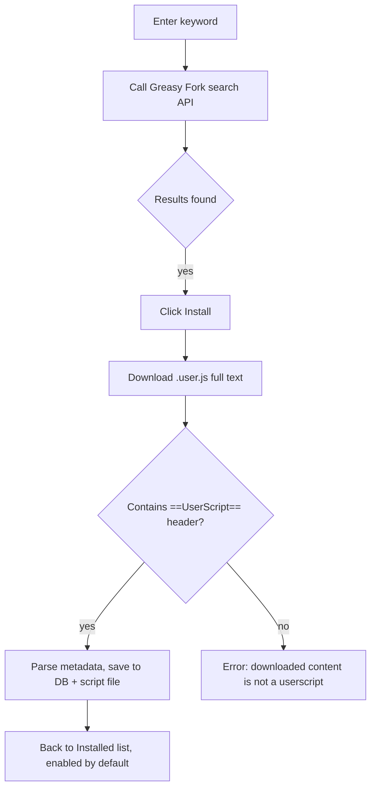

# 22-Userscripts

> Applies to: the built-in browser (`Settings → Browser settings → Userscripts`). This is a **separate capability** from the AI Agent's `browser` MCP tools in [Browser automation](6-browser-automation.md): these scripts only inject into the built-in browser's webview pages, not into instances created by the AI `browser` tools.

## Goal

Run Tampermonkey-compatible userscripts in Snow's built-in browser: modify page DOM, work around some cross-origin restrictions, register right-click menu commands, persist settings (`GM_*` values), download files, and more. Scripts are automatically injected into pages that match their `@match`/`@include` rules.

## Prerequisites

- The script file must contain a complete `// ==UserScript==` ... `// ==/UserScript==` metadata header (`@name` and at least one `@match` or `@include` are required — see the metadata table below).
- Searching and installing from Greasy Fork requires network access to `https://api.greasyfork.org`, and the download URL must be `https://`.
- Scripts run in the **page's main world** (the page's `window`), with full access to page objects — equivalent to running the page's own script. Only install scripts from trusted sources.

## Entry point

Open **Settings → Browser settings** (settings page id: `browser-settings`; an agent can open it via `app-control-openSettings page=browser-settings`) and switch to the **Userscripts** tab. The tab has two sub-tabs: **Installed** and **Search & Download**.

> Note: this tab lives in the same settings panel (`BrowserSettingsPanel`) as the homepage and password features in [17-Browser settings, passwords, and import](17-browser-settings-passwords-and-import.md), just a different tab.

## Steps

### 1. Create a new script

Click **New script**. The editor opens prefilled with a minimal template:

```javascript
// ==UserScript==
// @name         My Script
// @namespace    snow-app
// @version      1.0
// @description  Describe what this script does
// @author       You
// @match        https://example.com/*
// @run-at       document-idle
// @grant        none
// ==/UserScript==

console.log("Hello from userscript!");
```

Saving writes the record to the app database and the script file, and the script is injected automatically into matching built-in browser pages (no app restart needed).

### 2. Edit / enable / disable / delete

The **Installed** list shows name, description, version, match-rule summary, and run-at timing. Each row supports:

- **Enable toggle**: takes effect immediately; a disabled script is no longer matched (stops injecting on the next navigation).
- **Edit**: opens the full source (metadata header included) in a code editor; saving rewrites the file and re-parses metadata.
- **Delete**: after a confirmation dialog, removes the database record and the on-disk script file (irreversible).
- **Refresh**: reloads the list from the database and disk (use after manually editing `~/.snowapp/browser-script/`).

### 3. Search & install from Greasy Fork

The **Search & Download** tab calls the Greasy Fork search API (sorted by install count). Results include name, description, rating, install count, and a detail link:



Already-installed scripts (deduplicated by name) are shown as "Installed" with the button disabled. The search API does not return a total count; pagination relies on `hasMore` (whether the page returned the full requested number of items) to decide if a next page exists.

### 4. Let the AI install it for you (`config` tool, `userscripts` scope)

Besides the UI, you can have the AI manage userscripts directly through the `config` tool without opening the settings page:

```text
# Recommended flow: write the full source to a file first, then let the backend read the file
# (avoids passing a huge string in tool arguments)
filesystem-create writes ./scripts/demo.user.js (full // ==UserScript== content)
config-set scope=userscripts key="new" value={sourcePath: "/abs/path/demo.user.js"}

# Small scripts can be inlined directly
config-set scope=userscripts key="new" value={raw: "// ==UserScript==\n// @name Demo\n// @match https://example.com/*\n// ==/UserScript==\nconsole.log('hi');"}

# Update an existing script
config-set scope=userscripts key="<scriptId>" value={sourcePath: "..."}  // or {raw: "..."}

# Enable / disable
config-set scope=userscripts key="<scriptId>" value={enabled: false}

# Read / write GM_* persistent values
config-set scope=userscripts key="<scriptId>" value={values: {"k": "v"}}
config-set scope=userscripts key="<scriptId>" value={deleteValues: ["k"]}
config-get scope=userscripts key="<scriptId>"   // returns metadata + full source + GM values

# Uninstall (removes the database record + the on-disk file)
config-delete scope=userscripts key="<scriptId>" confirmed=true
```

`key` is the script's `scriptId` (the UUID returned by the list API); `"new"` means create. See the `config` tool's `userscripts` scope in the [built-in tools reference](../3-reference/2-builtin-tools-reference.md).

## Metadata fields

The parser only recognizes lines starting with `// @`, with keys matched case-insensitively. Localized variants such as `@name:zh-CN` are used as a fallback when a bare `@name` is missing, selected by the app locale (exact tag → primary language → first available variant).

| Field | Required | Default | Notes |
| --- | --- | --- | --- |
| `@name` | Yes (unless a localized variant exists) | — | Script name; localized variants like `@name:zh-CN` / `@name:en` are supported |
| `@match` / `@include` | At least one | — | Match rules, multiple allowed; if both lists are empty, the script matches **all** URLs |
| `@version` | No | `1.0` | Version |
| `@description` | No | empty | Description |
| `@namespace` | No | empty | Namespace |
| `@author` | No | empty | Author |
| `@run-at` | No | `document-idle` | `document-start` / `document-end` / `document-idle` |
| `@noframes` | No | `true` | When true, the script does not run inside `iframe` child frames |
| `@grant` | No | empty | Declares which `GM_*` APIs are used, multiple allowed; display-only, does not actually gate available APIs |
| `@exclude` / `@exclude-match` | No | empty | Exclusion rules; take priority over `@match`/`@include` |
| `@require` | No | empty | External JS dependency URL(s); warmed up asynchronously and inlined (may not be ready on the very first navigation — takes effect on the next one) |
| `@resource` | No | empty | External resources, shaped like `@resource <name> <url>`, readable via `GM_getResourceText` / `GM_getResourceURL` |

**Wildcard rules** (`@match`): `*` matches any non-`/` characters; the host part supports `*.example.com` (any subdomain), `*example.com` (suffix match), and `*` (any host); `*://` matches any scheme; in the path, `*` matches any characters and `/*` matches everything under that path. `@include`/`@exclude` use the same wildcard semantics but may omit the scheme (in which case the pattern is anchored as a substring).

## GM_* API support matrix

Before a script's main-world code runs, that script's `GM_*` APIs are attached to `window` (each script gets its own closure context, so `GM_getValue`/`GM_setValue` etc. only affect that script's own persistent namespace).

| API | Notes |
| --- | --- |
| `GM_getValue` / `GM_setValue` / `GM_deleteValue` / `GM_listValues` | Persistent key-value store, saved in the `userscript_values` database table (unique per `scriptId` + `key`); `GM_setValue` also broadcasts the change to other tabs (a tab's own listener is **not** triggered by its own write, matching Tampermonkey semantics) |
| `GM_addValueChangeListener` / `GM_removeValueChangeListener` | Listen for `GM_setValue`/`GM_deleteValue` changes |
| `GM_getTab` / `GM_saveTab` / `GM_getTabs` | Session-scoped (per webContents) in-memory store; cleared on process restart |
| `GM_xmlhttpRequest` | Issued via the main process, **bypassing the page's CORS restrictions**; supports `text`/`json`/`arraybuffer`/`blob` (binary returned as base64); only `http(s)` URLs allowed, 30-second timeout |
| `GM_notification` | Creates a system notification; supports `onclick` / `ondone` callbacks (click and failure events are delivered back to the script) |
| `GM_setClipboard` | Writes to the system clipboard |
| `GM_addStyle` | Injects a `<style>` node into the page |
| `GM_addElement` | Creates and attaches a DOM element |
| `GM_registerMenuCommand` / `GM_unregisterMenuCommand` | Registers a **page right-click menu** command that runs the given callback when clicked (idempotent: the same title reuses the same id) |
| `GM_openInTab` | Opens a URL in a new built-in browser tab (`active:false` opens in the background) |
| `GM_download` | Starts a download with `onload`/`onerror`/`onprogress`; allows `http(s)`/`blob:`/`data:` URLs |
| `GM_getResourceText` / `GM_getResourceURL` | Reads `@resource`-declared external resource content / produces a data URL |
| `GM_log` | Equivalent to `console.log` |
| `GM_cookie.list` / `GM_cookie.set` / `GM_cookie.delete` | Reads/writes/deletes cookies in the current Electron session (Tampermonkey beta API) |
| `GM_info` | Read-only metadata (`script.name` / `version` / `description` / `scriptMetaStr` / `scriptHandler` / `version`) |

**Known differences vs. a full Tampermonkey implementation**:
- `window.prompt()` is not supported in Electron; scripts calling it get a synchronous fallback that returns the default value (with a console warning), so code paths that rely on interactive user input will just proceed with the default.
- When multiple scripts match the same page, they share a single `window.GM_*` singleton (bound to the **last** prepared script's context), which differs slightly from Tampermonkey's per-script isolation — though each script's `GM_*` persistent values are still stored independently per `scriptId`.
- `@require` content is warmed up asynchronously: on the very first navigation, if a dependency hasn't finished downloading yet, a placeholder comment is used instead; the real content is inlined starting with the **next** navigation.

## Verification

1. After creating or installing a script, switch to the built-in browser and open a URL matching its `@match`;
2. Check the devtools console for script output (`console.log` / `GM_log`), or observe the expected DOM changes;
3. If the script declares `GM_registerMenuCommand`, its entry should appear in the page's right-click menu.

Scripts are injected according to `@run-at`: `document-start` runs before any page script (useful for intercepting media streams or injecting UI early), `document-end` runs after `DOMContentLoaded`, and `document-idle` (default) runs on the next frame after `DOMContentLoaded`.

## Troubleshooting & recovery

| Symptom | Check |
| --- | --- |
| Script doesn't take effect | Make sure the enable toggle is on; verify `@match`/`@include` actually match the current URL; check `@noframes` scenarios (if the page itself is an iframe) |
| `@require` dependency didn't work on the first load | Expected behavior — async warm-up wasn't finished yet; navigate again |
| `GM_xmlhttpRequest` errors | Confirm the URL is `http(s)` and hasn't exceeded the 30-second timeout |
| Manually edited files under `~/.snowapp/browser-script/` | Click **Refresh** to reload metadata; if database metadata and file content diverge, re-edit and save to resync |
| Deleting a script | Both the UI and `config-delete` require confirmation; after deletion, the database record and on-disk file are both removed and cannot be restored |

## Security boundaries

- Scripts run in the **page's main world**, with full read/write access to the page's `window`/DOM/cookies — the risk is equivalent to running that website's own script. Only install scripts from trusted sources (especially watch the gap between declared `@grant` and actual behavior).
- `GM_*` persistent values are stored as plaintext strings in the app database's `userscript_values` table; redact before backing up or sharing the database.
- `GM_cookie` and `GM_setValue` operations depend on the current OS user and Electron session, and are not portable across machines.
- Full storage locations for the database and script files: see [Data storage locations](../3-reference/4-data-storage-locations.md).

## Implementation anchors

- Metadata parsing and database/file storage: `native/src/storage/userscripts.rs::parse_meta`, `native/src/storage/userscripts.rs::create_userscript`
- Script file directory: `~/.snowapp/browser-script/{script_id}.user.js` (`native/src/storage/userscripts.rs::browser_script_dir`)
- Injection engine (webview preload, main-world execution + GM shim): `src/preload/userscriptEngine.ts::injectUserscripts`
- Main-process synchronous match cache (`document-start` semantics, `sendSync`, no IO on match): `src/main/app/userscriptSyncStore.ts::initUserscriptSyncStore`
- GM_* IPC bridge (storage / network / notifications / clipboard / cookies / downloads / menu commands): `src/main/ipc/handlers/userscriptHandlers.ts::registerUserscriptHandlers`
- Greasy Fork search/install: `src/main/ipc/handlers/userscriptHandlers.ts` (`userscripts:search` / `userscripts:install`)
- Settings UI: `src/renderer/components/sidebar/browserSettings/UserscriptsSection.tsx` (embedded in `BrowserSettingsPanel.tsx`'s "Userscripts" tab)
- AI tool entry point: `native/src/mcp/servers/config/userscripts_scope.rs::set_userscript`
