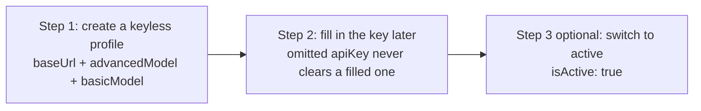

# 3-configure-api-keys

Snow App manages model provider access through **API profiles**, supporting multiple profiles and one-click switching. This article explains how to configure API keys and models in the GUI, and where the corresponding configuration files are located.

## 1. Configuration Entries

| Entry | Description |
| --- | --- |
| Settings → API Settings (settings page id: `api-settings`) | GUI: create / edit / switch API profiles |
| `api_configs` table in the app database | **Authoritative store for all profiles**; one row per profile (`profile_name` is the unique identifier) |
| `activeProfile` field in `~/.snow/active-profile.json` | Records the **currently active profile name**; the active config = that profile's row in `api_configs` |
| `snowcfg` field in `~/.snow/config.json` | CLI compatibility layer / snapshot shared with Snow CLI, **not** the authoritative source |

> **Storage at a glance**: profiles live in the `api_configs` table of the app
> database; the active profile is chosen via `activeProfile`. The `config` tool
> and the UI read/write the **currently active profile**; the `snowcfg` field in
> `config.json` is just a CLI-compatible mirror of the active profile.

## 2. GUI Configuration (multiple profiles)

Open **Settings → API Settings** to create multiple profiles. When creating a profile, fill in:

| Field | Required | Description |
| --- | --- | --- |
| Profile name | Yes | Unique identifier for the profile, e.g. `openai` |
| Display name | No | Name shown in the UI; defaults to the profile name if omitted |
| Base URL | Yes | Service endpoint URL |
| Base URL mode | Yes | `auto` automatic / `custom` manual |
| API Key | No (can be added later) | Provider key, e.g. `sk-...` |
| Request method | Yes | e.g. `chat` |
| Advanced model | Active profile: yes (non-empty after trim); inactive draft: no | This profile's default advanced model; ordinary conversations still use their selected model |
| Basic model | Active profile: yes (non-empty after trim); inactive draft: no | Model for conversation titles, AI Commit, `@?` file search, and codebase Agent Review |
| Vision model | No | Image understanding model, can be configured separately |

When a profile has `isActive: true`—whether it is saved as active or activated later—
Snow trims `advancedModel` and `basicModel` and requires both to be non-empty. An
inactive profile may remain a draft with either model field empty; API-key presence
is not part of this model-completeness check.

When a model input is focused, the available model list is automatically fetched from the current Base URL; you can also fill it in manually.

### Basic and Advanced Model Routing

- Snow App does not classify prompt complexity or automatically switch between `basicModel` and `advancedModel`;
- An ordinary conversation uses the model selected for that conversation. `advancedModel` is only the profile's default advanced model and is used when a call supplies no non-empty explicit advanced model. The two model classes never fall back to each other: an advanced path does not use `basicModel` when `advancedModel` is missing, and a basic path does not fall back in the other direction;
- Conversation titles, AI Commit, `@?` file search, and codebase Agent Review use `basicModel`. A title request's provider and profile follow the conversation binding; if that profile has been deleted, ordinary-conversation rules fall back to the current active profile;
- Vision understanding, image generation, and embedding use independent channels and are not affected by these basic/advanced routing rules.

### Separate Vision Model Configuration

When the main model does not support vision, turn off the **Supports vision** switch and configure `visionBaseUrl`, `visionApiKey`, `visionRequestMethod`, `visionModel` separately, so image understanding requests go to a dedicated endpoint and key. Images are textified into descriptions for the main model; each image in a **user message** also gets a `[Reference image #N ...]` block (just a relative path under the upload/ directory), so image-to-image editing still uses the **original image** and is never downgraded to text-to-image (see [9-image-generation](9-image-generation.md)).

### Optional Configuration

- **System prompt**: choose from saved system prompts, or inherit the global profile setting;
- **Custom header scheme**: choose a scheme defined in `custom-headers.json`, with the option to "inherit global" or "use none";
- **Auto-compress**: when `enableAutoCompress` is on, history messages are automatically compressed when context usage reaches the threshold `autoCompressThreshold` (percentage);
- **1M context (Anthropic)**: when the request method is `anthropic`, the **1M context** switch makes all Anthropic requests send the `anthropic-beta: context-1m-2025-08-07` header to declare 1M-token context support, recognized by the Anthropic API and gateways/proxies that require explicitly enabling 1M context; no model-name marker is needed (a Claude Code ecosystem `[1M]` suffix on the model name is also stripped and honored, staying compatible with tools like cc-switch);
- **Google search (Gemini)**: when `googleSearch` is enabled, Gemini chat requests inject the Google Search tool for real-time web grounding; the separate vision-model section has its own `visionGoogleSearch` switch for vision requests;
- **Responses Fast Mode**: when the request method is `responses`, you can enable `responsesFastMode` so the server processes Responses requests in fast mode.

The form validates fields per request method: switching methods resets or skips fields that do not apply (such as reasoning effort or Responses-only options), preventing invalid combinations from being submitted.

The fields above are stored as one row for the profile in the `api_configs` table of the app database; a copy of the currently active profile is synced to the `snowcfg` field of `~/.snow/config.json`, shared with Snow CLI.

## 3. Switching Profiles

Toggle the **Enable profile** switch in API Settings to switch the currently active profile; the active profile name is recorded in the `activeProfile` field of `~/.snow/active-profile.json`. Agents can also switch directly with the config tool (see [5.1 ④](#51-quick-reference-agent-follow-along)).

## 4. Advanced Options

Some advanced parameters can be configured in the Runtime area of the UI (such as max context, max generation tokens, stream idle timeout, retry count and delay); the rest can be edited directly in the `snowcfg` field of `~/.snow/config.json`:

| Field | Description |
| --- | --- |
| `maxContextTokens` | Max context tokens |
| `maxTokens` | Max tokens per generation |
| `streamIdleTimeoutSec` | Stream response idle timeout (seconds) |
| `maxRetries` | Max request retries |
| `retryDelayMs` | Retry interval (milliseconds) |
| `showThinking` | Whether to show the thinking process |
| `chatThinking.reasoning_effort` | Reasoning effort (e.g. `max`) |
| `toolResultTokenLimit` | Maximum percentage of the model context available to each tool result |

> **Tip**: after editing `config.json` directly, restart the app for the changes to take effect.

> **DeepSeek thinking-mode compatibility**: in DeepSeek V4 thinking mode, stream processing fills in the `reasoning_content` field for every assistant message to avoid 400 errors from providers that reject a missing field; the `showThinking` toggle and `chatThinking.reasoning_effort` setting apply in this mode too.

## 5. AI / CLI Configuration (config tool)

Snow App ships a built-in `config` tool; AI agents can read/write the same
config that the UI uses. API-profile related tools:

| Tool | Purpose |
| --- | --- |
| `config-list scope=snowcfg` | List the full config of the currently active profile |
| `config-get scope=snowcfg key=baseUrl` | Read a single key (`apiKey` is always masked, e.g. `sk-****abcd`) |
| `config-set scope=snowcfg key=baseUrl value="..."` | Write a single key (whitelist + type check + auto backup + atomic write) |
| `config-list scope=apiProfiles` | List **all profiles** (keys masked), with usage guidance |
| `config-get scope=apiProfiles key=<profile-name>` | Read one profile (keys masked; null when missing) |
| `config-set scope=apiProfiles key=<profile-name> value={...}` | Create/update a profile (writes the app database, same as the UI; takes effect immediately) |
| `config-delete scope=apiProfiles key=<profile-name>` | Delete a profile (destructive — ask the user first, then call with `confirmed: true`) |



### 5.1 Quick Reference (agents, follow along)

#### ① View profiles

```
config-list scope=apiProfiles   # all profiles (apiKey/visionApiKey masked; isActive marks the active one)
config-list scope=snowcfg       # full config of the active profile
config-list scope=app           # activeProfile (profile name in the CLI compatibility layer)
```

#### ② Change the API key

```
config-set scope=apiProfiles key=profile-name value={"apiKey": "sk-new-key"}
```

- An empty or omitted `apiKey`/`visionApiKey` **always keeps the existing key**
  — so you can create a keyless profile first and fill the key later without
  losing it when updating other fields;
- Keys are always masked when read — **never ask for or display plaintext keys**;
  the user provides the key, you write it.

#### ③ Change the model / other fields

```
config-set scope=apiProfiles key=profile-name value={"advancedModel": "new-model"}
```

Writable fields (all optional; omitted fields keep their current values):
`displayName`, `baseUrl`, `baseUrlMode`, `apiKey`, `requestMethod`,
`advancedModel`, `basicModel`, `supportsVision`, `visionBaseUrl`, `visionApiKey`,
`visionRequestMethod`, `visionModel`, `maxContextTokens`, `maxTokens`,
`streamIdleTimeoutSec`, `enableAutoCompress`, `autoCompressThreshold`,
`maxRetries`, `retryBaseDelayMs`, `isActive`, etc. `configJson` is generated
automatically.

#### ④ Switch the active profile

```
config-set scope=apiProfiles key=profile-name value={"isActive": true}
```

- Writes `api_configs.is_active` in the app database — **takes effect
  immediately for NEW conversations** (the runtime uses the DB as the source of truth);
- **Conversation isolation**: conversations bind the active profile at creation
  time (`api_profile_name`); **switching the global profile does NOT change
  existing conversations that already bound a profile**; sub-agent sessions are
  strictly bound to their profile name and fail (no fallback) if it is deleted;
- The legacy `config-set scope=app key=activeProfile value="profile-name"` only
  writes `active-profile.json` (CLI compatibility layer) and does not change the
  runtime profile; kept for compatibility only.

#### ⑤ Create a profile (including keyless-first workflow)

```
# Step 1: create a keyless profile (omitting apiKey leaves it empty)
config-set scope=apiProfiles key=my-new-profile value={
  "baseUrl": "https://api.example.com/v1",
  "advancedModel": "gpt-4o",
  "basicModel": "gpt-4o"
}

# Step 2: once the user provides the key, fill it in (empty-key semantics never clears an existing key)
config-set scope=apiProfiles key=my-new-profile value={"apiKey": "sk-..."}

# Step 3 (optional): make it the active profile
config-set scope=apiProfiles key=my-new-profile value={"isActive": true}
```

Users can also create profiles in **Settings → API Settings**
(`app-control-openSettings page=api-settings`).

#### ⑥ Delete a profile

```
# Get explicit user approval via the user-interaction askUserQuestion tool first, then:
config-delete scope=apiProfiles key=profile-name confirmed=true
```

The storage layer automatically keeps at least one active profile (seeding the
default one if necessary).

### 5.2 Effect of writes

- `apiProfiles` writes the app database — **takes effect immediately**;
- `snowcfg`/`app` are file-backed — changes take effect after an app restart or
  a UI re-save (`app.activeProfile` is only the CLI compatibility layer);
- `apiKey`/`visionApiKey` are always masked — never ask for or display plaintext
  keys;
- every write is backed up automatically to `~/.snow/.config-backups/` (for DB
  writes, the profile's `config_json` is backed up).

## 6. FAQ

| Symptom | Cause & fix |
| --- | --- |
| Requests return 401/403 | Check whether `apiKey` and `baseUrl` are correct and whether the key has expired |
| The model doesn't support thinking | Turn off `showThinking` or adjust `chatThinking.reasoning_effort` |
| Vision model unavailable | Configure `visionBaseUrl`, `visionApiKey`, `visionModel` separately |
| Profile switch has no effect | Switch with `config-set scope=apiProfiles key=profile-name value={"isActive":true}` (writes the DB, takes effect immediately); `active-profile.json` is only the CLI compatibility layer |

## 6. Reference

- Full field documentation: [3-reference/1-settings-json-reference](../3-reference/1-settings-json-reference.md)
