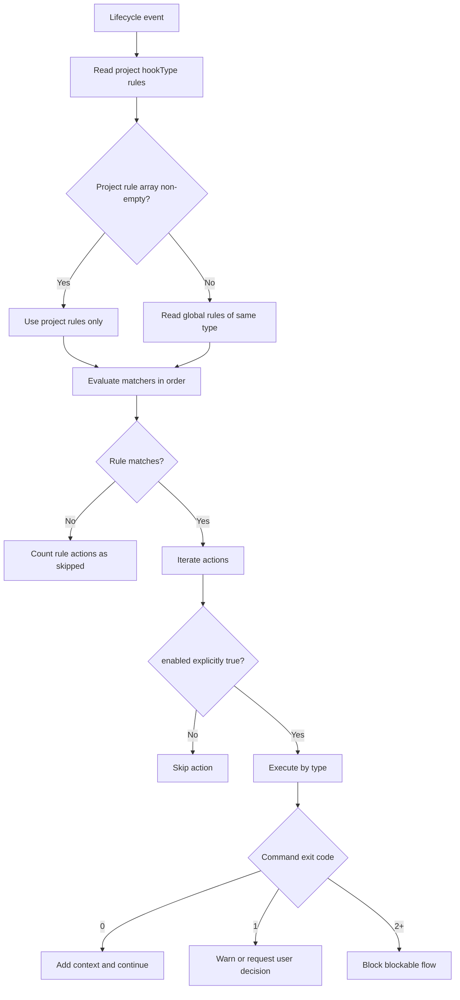
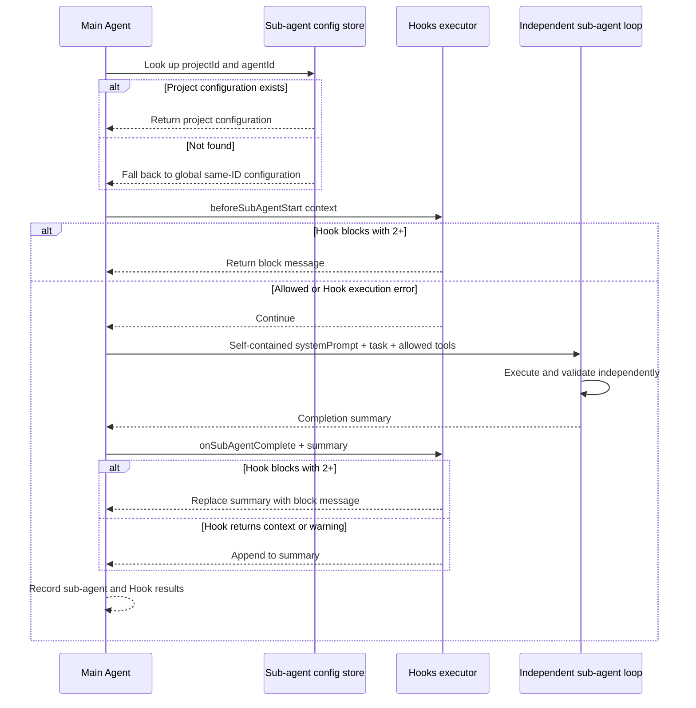

# 5-Configure Hooks and Sub-agents

Snow App stores Hooks and sub-agent configuration in the app SQLite database, shared with the Settings UI. The Agent can read and write it through the built-in `config` service, and successful changes take effect immediately.

## 1. Hooks

### 1.1 Scope and effective rules

- A global Hook is available to all projects; a project Hook requires `projectId`;
- For a `hookType`, Snow App uses the project's rules when that array is **non-empty**; otherwise it falls back to the global rules of the same type;
- Project and global rules are not merged. A non-empty project array suppresses global fallback even when every action in it is disabled;
- An action runs only when **`enabled` is explicitly `true`**. Missing, `null`, and `false` all mean skipped. The Settings UI writes this field explicitly; hand-written config must do the same.

### 1.2 Hook types

| `hookType` | Trigger | Allowed actions |
| --- | --- | --- |
| `onUserMessage` | Before a user message reaches the AI | `command`, `context` |
| `beforeToolCall` | Before a tool call | `command` |
| `toolConfirmation` | When a tool enters confirmation | `command` |
| `afterToolCall` | After a tool call completes | `command` |
| `onSubAgentComplete` | After a sub-agent completes | `command`, `prompt` |
| `beforeSubAgentStart` | Before a sub-agent starts | `command`, `context` |
| `beforeCompress` | Before context compaction | `command` |
| `onSessionStart` | When an existing conversation opens; fire-and-forget | `command`, `context` |
| `onStop` | When a conversation stops or is cleaned up; fire-and-forget | `command`, `prompt` |

> `prompt` is a valid configuration type, but the current native executor does not make a model call; it returns an unsupported failure record. Do not depend on a `prompt` action for production automation. Prefer a verifiable `command`, or `context` where allowed. A `beforeSubAgentStart` context result is currently recorded but is not appended to the child agent prompt by the caller.

### 1.3 Rule and action fields

```json
{
  "description": "Inject project policy into release checks",
  "matcher": "toolName:bash-*",
  "hooks": [
    {
      "type": "command",
      "command": "node scripts/check-release.mjs",
      "timeout": 5000,
      "enabled": true
    }
  ]
}
```

| Field | Location | Meaning |
| --- | --- | --- |
| `description` | rule | Must be present; describe intent and failure impact. |
| `matcher` | rule | Optional. Commas mean OR; `key:glob` is supported, such as `toolName:bash-*`. Without a key, matching checks `toolName` first, then context text. |
| `hooks` | rule | Required action array. |
| `type` | action | `command`, `context`, or `prompt` where allowed. |
| `command` | command | Runs through the shell selected in terminal settings. |
| `content` | context | Static text. JSON fields `additionalContext` or `prompt` are extracted; otherwise the whole text is used. |
| `prompt` | prompt | The current native executor does not run a model call. |
| `timeout` | command | Milliseconds; defaults to `5000`. Timeout kills the child and returns an error. |
| `enabled` | action | **Must be `true` to execute**; missing means skipped. |

A command receives event context JSON on stdin and uses `cwd` from context when present. stdout/stderr are interpreted by exit code:

| Exit code | Result |
| --- | --- |
| `0` | Pass; non-empty stdout becomes additional context. JSON stdout can supply `additionalContext` or `prompt`. |
| `1` | Soft warning and warning log. stdout shaped as `{"decision":{"message":"..."}}` requests an interactive user decision. |
| `2+` or no valid exit code | Block the current blockable flow, preferring stderr and then stdout as the message. |

`onSessionStart` and `onStop` are fire-and-forget. Their caller downgrades interactive decisions to ordinary warnings, so they cannot be relied on to block a flow.

### 1.4 Hook execution flow



### 1.5 Configure in the UI

1. Open **Settings → Hooks Settings** (settings page id: `hooks-settings`);
2. Select Global or Project scope;
3. Choose a `hookType`, then add rules and actions;
4. Ensure the toggle is on for every action that should run;
5. Save and test with a low-risk event;
6. Inspect Hook execution records and app logs.

### 1.6 Configure through `config`

Global command Hook:

```jsonc
config-set scope=hooks key=beforeToolCall value={
  "rules": [
    {
      "description": "Run read-only tool auditing",
      "matcher": "toolName:filesystem-*",
      "hooks": [
        {
          "type": "command",
          "command": "node scripts/audit-tool-call.mjs",
          "timeout": 5000,
          "enabled": true
        }
      ]
    }
  ]
}
```

Project context Hook:

```jsonc
config-set scope=hooks key=onUserMessage projectId=<projectId> value={
  "rules": [
    {
      "description": "Inject this project's technology stack",
      "hooks": [
        {
          "type": "context",
          "content": "This project uses Electron, React, TypeScript, and Rust.",
          "enabled": true
        }
      ]
    }
  ]
}
```

When there are multiple actions, set `enabled` explicitly on each one:

```json
{
  "rules": [
    {
      "description": "Check and record context before compaction",
      "hooks": [
        {
          "type": "command",
          "command": "node scripts/check-context.mjs",
          "timeout": 5000,
          "enabled": true
        },
        {
          "type": "command",
          "command": "node scripts/write-audit.mjs",
          "timeout": 5000,
          "enabled": false
        }
      ]
    }
  ]
}
```

Recommended flow:

1. Run `config-list scope=hooks projectId=<projectId>` and read the current state and `guidance`;
2. Preserve the current value with `config-get scope=hooks key=<hookType> projectId=<projectId>`;
3. Write the complete `rules` value with `config-set`;
4. Immediately read it back and inspect every `enabled` field;
5. Test matcher and exit-code behavior with a low-risk event;
6. Before `config-delete`, show the scope, key, projectId, and impact and obtain explicit confirmation.

Hook database writes create a temporary backup during the operation and remove it after success. It is not persistent history.

## 2. Sub-agents

### 2.1 Fields and scope

A sub-agent runs through `sub-agents-activate` in an independent execution loop with no main-conversation history. Configuration fields:

| Field | Meaning |
| --- | --- |
| `name` | Required display name. |
| `description` | Tells the main Agent when to delegate. |
| `systemPrompt` | Must be self-contained: mission, inputs, workflow, tools, safety, and output. |
| `toolsJson` | JSON string or tool-name array. `["*"]` means all tools; `[]` means no tools. |
| `configProfile` | Empty inherits the API profile and current model used by the parent conversation's current run; non-empty pins the named profile. |
| `model` | Applies only with a pinned profile. A non-empty value pins the model; an omitted, empty, or trim-empty value uses that profile's `advancedModel`. If that profile's `advancedModel` is also empty, activation fails; it never falls back to `basicModel`. |

Activation looks up the current project's same-ID configuration first and falls back to global only when it is absent. Built-in `agent_general` cannot be modified or deleted through config.

The main agent's system prompt now **dynamically injects the list of available sub-agents** (with `agentId`, name, and purpose description). When calling `sub-agents-activate`, the main agent must pick the `agentId` that best matches the task from that list — it must **not default to the built-in `agent_general`** when a more specific agent is configured (the built-in remains a generic fallback). The list follows the same resolution rules as activation: **project-scoped sub-agents of the current project come first** and override the global one on the same `agentId`; agents without a project-level config fall back to global/built-in. Sub-agents of other projects are not injected. New sessions pick up configuration changes immediately.

Before creating a sub-session, Snow validates the tools, profile, and model once and creates a runtime snapshot. The normal loop, recursive tool loop, automatic compaction, and post-compaction resume all reuse that snapshot instead of following later global changes. Each request still reloads current credentials by the fixed profile name, but deleting that profile causes a strict failure rather than switching providers. The sub-session persists the profile and model actually selected at startup, so history display is not affected by later sub-agent or API configuration edits.

Tool rules:

- An **explicit tool-name list requires `projectId`**, so that sub-agent is project-scoped;
- A global sub-agent may use only `["*"]` or `[]`;
- Every tool in a project list must be an exact full tool name enabled for that project;
- An external MCP tool's public server-name prefix must belong to a server enabled for the project;
- Activation returns an error when configured tools are unavailable or disabled; it does not silently expand permissions.

### 2.2 Sub-agent Conversation View

A sub-agent runs in its own conversation. Opening it shows:

- **Header title**: displays the **stage name** (the prompt truncated to 80 characters at activation — the task stage the sub-agent was spawned for) instead of the project name; the subtitle notes **which main conversation launched it**;
- **Info card**: above the message list, an `agentName` badge, the stage title, a **jump back to the main conversation** button, and the **full prompt** (clamped to 3 lines by default; hovering shows the whole text);
- **Data sources**: the conversation record's `title` / `subAgentName`, the first user message (the prompt), and the parent conversation's title (fetched asynchronously).

### 2.3 Configure in the UI

1. Open **Settings → Sub-agent Settings** (settings page id: `sub-agent-settings`);
2. Select Global or Project scope;
3. Enter the name, description, and a complete system prompt;
4. Choose all/no tools for a global agent, or select explicit tools for a project agent;
5. Keep **Follow the parent conversation (recommended)**, or select a pinned API profile. With a pinned profile, optionally select an independent model; leaving it empty uses the profile's advanced model;
6. Save, then delegate one narrowly scoped test task from the main conversation.

### 2.4 Configure through `config`

Valid global sub-agent:

```jsonc
config-set scope=subAgents key=agent_readonly_reviewer value={
  "name": "Read-only Reviewer",
  "description": "Use for an independent review and issue list",
  "systemPrompt": "You are a read-only reviewer. Verify inputs and files first, then report issues and evidence by severity. Never modify files, run commands, or guess missing business rules. With no tools, identify what cannot be verified.",
  "toolsJson": [],
  "configProfile": "",
  "model": ""
}
```

Project-scoped explicit tools:

```jsonc
config-set scope=subAgents key=agent_project_reviewer projectId=<projectId> value={
  "name": "Project Reviewer",
  "description": "Review the current project and return findings with paths",
  "systemPrompt": "You are this project's read-only code reviewer. Use allowed tools to establish facts. Report severity, file path, evidence, and remediation. Never modify files.",
  "toolsJson": [
    "filesystem-read",
    "grep-search",
    "codelens-file_outline"
  ],
  "configProfile": "",
  "model": ""
}
```

Before writing, run `config-list scope=subAgents projectId=<projectId>` to obtain guidance and the current tool environment. Read back with `config-get` after writing. `config-delete` also requires explicit user confirmation.

### 2.5 Sub-agent and Hooks sequence



If `beforeSubAgentStart` Hook execution itself throws, the current caller continues activation. A security gate must therefore be reliable, tested, and return an explicit `2+` exit code when blocking.

### 2.6 Sub-agent session resume and same-session communication

- **Resume after restart**: sub-agent sessions survive an app restart — `sub-agents-listSubAgents` lists the current session's sub-agents (including ones already finished during this app run) with their `status`/`resumable` state, and `sub-agents-continue` reactivates a finished sub-agent with its **original configuration (model, tools, system prompt) and full conversation history**;
- **Same-session communication**: `sub-agents-listTeammates` queries sub-agents still running in the current session, and `sub-agents-sendMessage` delivers a message to them (as a Pending message at the end of the target's current round, prefixed with the sender's identity). Parallel sub-agents can coordinate directly without routing through the main session;
- **Session isolation**: the tools above only apply to the **current session** — `listTeammates` does not expose other sessions' sub-agents, and cross-session `sendMessage`/`continue` calls are rejected.

## 3. Validation and troubleshooting

| Symptom | Check |
| --- | --- |
| Hook saves but never runs | Ensure the action explicitly has `"enabled": true`; a missing value is skipped by the native executor. |
| Project Hook does not fall back globally | A non-empty project array replaces global rules; delete the project config or use an empty rule array to fall back. |
| Matcher does not match | Verify context keys and full tool name; use `toolName:<glob>` when appropriate. |
| Command times out | Default is 5000 ms; inspect shell, PATH, cwd, stdin handling, and a reasonable positive `timeout`. |
| Exit 1 shows no decision card | stdout must be valid JSON with a string `decision.message`; fire-and-forget Hooks only show a warning. |
| Prompt action has no effect | The current native executor does not execute prompt model calls; use command or supported context. |
| Context does not reach the child prompt | `beforeSubAgentStart` currently records context but does not append it to the child prompt; put required content in `systemPrompt`. |
| Global sub-agent explicit list is rejected | Explicit lists require `projectId`; make it project-scoped or use global `["*"]`/`[]`. |
| Sub-agent cannot find a tool | Use the exact project-enabled full tool name and inspect MCP server and tool toggles (global + project). |
| Sub-agent depends on main conversation | It has no main history; place context in the task prompt or self-contained `systemPrompt`. |
| Wrong same-ID config activates | Project scope wins over global; query both scopes and verify `projectId`. |
