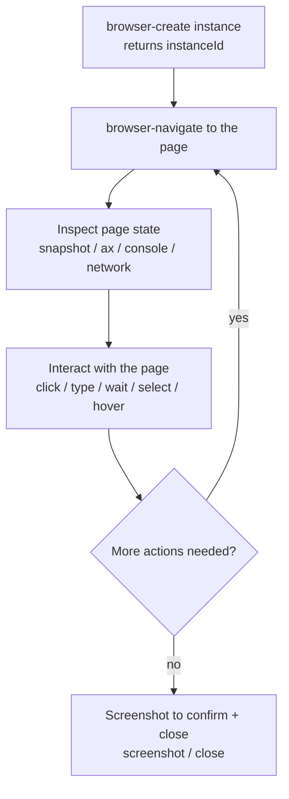

# 6-Browser Automation

Snow App ships an embedded Electron browser that the AI agent can drive
directly to test, scrape and interact with web pages. This guide covers all
tools of the built-in `browser` server and typical workflows.

## 1. Tools Overview

| Tool | Purpose |
| --- | --- |
| `browser-create` | Create a browser instance (optional initial URL) |
| `browser-navigate` | Navigate to a URL |
| `browser-click` | Click page elements with real mouse events (CSS selector / visible text / accessibility ref) |
| `browser-type` | Type text into an element (set at once or key by key; ref targeting supported) |
| `browser-wait` | Wait for text/element to appear or disappear, or a fixed duration |
| `browser-press_key` | Press a keyboard key or combination (Enter/Tab/Escape/arrows, `Ctrl+A`-style) |
| `browser-select_option` | Select option(s) in a dropdown (match by value or label) |
| `browser-hover` | Hover an element (triggers hover overlays) |
| `browser-upload-file` | Upload file(s) (CDP injection, no dialog) |
| `browser-back` / `browser-forward` | Browser history back/forward (waits for navigation) |
| `browser-navigate_back` / `browser-navigate_forward` | Browser history back/forward (no navigation wait) |
| `browser-evaluate` | Run arbitrary JavaScript in the page and return the result |
| `browser-screenshot` | Capture the page as PNG (full page supported) |
| `browser-devtools` | Text/accessibility-tree snapshot / performance trace / console messages / network requests & details / offline simulation / route mocking / encrypted login-state save & restore / cookie management / dialog handling / open DevTools |
| `browser-close` | Close a browser tab |
| `browser-focus` | Switch to a tab |
| `browser-list` | List all open tabs |

## 2. Typical Workflows



### 2.1 Open a page

```text
browser-create url=https://example.com
→ creates an instance and returns its instanceId

browser-navigate instanceId=<id> url=https://example.com/docs
→ navigate to another URL
```

### 2.2 Inspect page state

```text
browser-devtools action=snapshot instanceId=<id>
→ page metadata + text snapshot (understand the page structure)

browser-devtools action=ax instanceId=<id>
→ accessibility-tree snapshot (structured interactive elements with [uid=eN];
  engine-level AX tree, pierces closed shadow DOM, elements are ref-addressable)

browser-devtools action=ax verbose=true maxNodes=500 instanceId=<id>
→ all nodes + input values (higher token cost, use on demand)

browser-devtools action=console level=error instanceId=<id>
→ console errors (troubleshoot page JS failures)

browser-devtools action=network filter=api instanceId=<id>
→ network request log (observe API calls; CDP records include requestId for details)

browser-devtools action=networkDetails requestId=<requestId> instanceId=<id>
→ full details of one request: request/response headers + request body + response body
  (default limit 128KB, adjustable via maxBodyBytes)

browser-devtools action=networkState state=offline instanceId=<id>
→ simulate offline (all requests fail); state=online restores connectivity
```

### 2.3 Mock APIs (route interception)

```text
# Intercept requests matching /api/users and return custom JSON
# (pattern supports /regex/ or plain substring)
browser-devtools action=route pattern="/api/users" body='{"code":0,"data":[]}' contentType=application/json instanceId=<id>

# Simulate a server error
browser-devtools action=route pattern="/login" status=500 body='{"error":"boom"}' instanceId=<id>

# Remove all mock rules and restore real network
browser-devtools action=routeClear instanceId=<id>
```

Re-registering the same pattern overwrites the rule; multiple rules are active
at once (matched in registration order).

### 2.4 Interact with the page

```text
# Click (by CSS selector, visible text, or accessibility ref)
browser-click selector="#submit-btn" instanceId=<id>
browser-click text="Sign in" instanceId=<id>
browser-click ref=e3 instanceId=<id>

# Type text (ref targeting supported too)
browser-type selector="#username" value="user1" instanceId=<id>
browser-type text="password field" value="secret" delayMs=30 instanceId=<id>
browser-type ref=e6 value="hello" submit=true instanceId=<id>

# Wait for async content (operate only after SPA rendering completes)
browser-wait text="Loaded" instanceId=<id>
browser-wait textGone="Loading..." timeoutMs=15000 instanceId=<id>

# Keyboard actions
browser-press_key key="Tab" instanceId=<id>
browser-press_key key="Control+a" instanceId=<id>   # Ctrl+A select all
browser-press_key key="Escape" instanceId=<id>

# Dropdown / hover / upload
browser-select_option selector="#country" values=["CN"] instanceId=<id>
browser-hover text="User menu" instanceId=<id>
browser-upload-file selector="input[type=file]" files=["C:/tmp/avatar.png"] instanceId=<id>

# History navigation
browser-back instanceId=<id>
browser-forward instanceId=<id>
browser-navigate_back instanceId=<id>
browser-navigate_forward instanceId=<id>

# Execute arbitrary JS (read/modify page state)
browser-evaluate expression="document.title" instanceId=<id>
```

### 2.5 Performance analysis (trace)

```text
# Record 3s of performance data; returns long-task/event stats (main-thread jank)
browser-devtools action=trace instanceId=<id>
browser-devtools action=trace durationMs=5000 instanceId=<id>
→ { eventCount, longTasks: { count, totalMs, longestMs }, topEventTypes }
```

Long tasks (runnable events >50ms) are the core jank indicator; `topEventTypes`
shows the main event mix — combine with `action=network` and `action=console`
for deeper diagnosis.

### 2.6 Screenshot and close

```text
browser-screenshot instanceId=<id> fullPage=true
→ returns a PNG image

browser-close instanceId=<id>
```

## 3. Login-state save & restore (cookies + localStorage)

The embedded browser uses a persistent session, but login state can be
explicitly archived/restored for multi-account switching and backup. Files are
encrypted with OS-level encryption (safeStorage) under `~/.snow/browser-state/`
and are **never stored as plaintext**; the current state is automatically
backed up (also encrypted) before every restore.

```text
# Save the current login state (cookies + localStorage of the current origin)
browser-devtools action=storageSave instanceId=<id>
browser-devtools action=storageSave fileName=github-account1.bin instanceId=<id>
→ returns file name and counts (cookies / origins), never the contents

# Restore login state (current state is auto-backed up to backups/ first)
browser-devtools action=storageRestore fileName=github-account1.bin instanceId=<id>
→ returns restore stats + backup file path

# List cookies (values masked by default: first 4 chars + length)
browser-devtools action=cookies instanceId=<id>
browser-devtools action=cookies domain=".github.com" instanceId=<id>
# Explicitly request plaintext for debugging (response carries a sensitive-data warning)
browser-devtools action=cookies showValues=true domain=".github.com" instanceId=<id>

# Delete one cookie (name + domain for precise targeting)
browser-devtools action=cookieDelete name="_gh_sess" domain=".github.com" instanceId=<id>
```

Security notes:

- **Encryption**: files are encrypted with OS-level encryption (Windows DPAPI /
  macOS Keychain / Linux keyring); saving is refused when the keyring is unavailable;
- **No echo**: save/restore only return counts — cookie values never enter the
  conversation context; `showValues=true` is required for plaintext and adds a warning;
- **Origin checks**: localStorage is only restored to origins that exactly match
  the saved origin;
- **File-name whitelist**: only `[A-Za-z0-9._-]` is allowed; the real path is
  composed by the app (no path traversal);
- **Backup**: current state is auto-backed up (encrypted) to the `backups/`
  subdirectory before restore.

## 4. Dialog (alert / confirm / prompt) handling

When the page shows a dialog, subsequent agent actions may be blocked:

```text
browser-devtools action=dialog instanceId=<id>
→ list pending dialogs

browser-devtools action=dialog dialogResponse={accept:true} instanceId=<id>
→ accept (OK) the dialog
browser-devtools action=dialog dialogResponse={accept:false} instanceId=<id>
→ dismiss (Cancel) the dialog
browser-devtools action=dialog dialogResponse={accept:true, promptText:"input"} instanceId=<id>
→ provide input for a prompt dialog
```

## 5. Best Practices

- **Snapshot before interacting**: for dynamic/complex pages prefer
  `browser-devtools action=ax` and target elements deterministically with
  `ref=<uid>` (instead of guessing CSS selectors); plain static pages work
  fine with `action=snapshot`;
- **Refs go stale**: after the page changes (re-render/navigation) take a new
  `action=ax` snapshot — stale refs fail with a clear re-snapshot hint;
- **Multi-tab management**: `browser-list` lists all tabs,
  `browser-focus` switches to the target one;
- **Pair with the network panel**: when a page misbehaves, check
  `action=console level=error` and `action=network` before re-navigating;
- **Real mouse events**: `browser-click` uses real Electron mouse input
  events, unlike script injection — handlers relying on real events fire;
- **Not headless**: the built-in browser is an embedded window and requires
  the app to be running.

## 6. Related config

- Browser tools can pop the current page out into a **standalone window**; standalone windows support full **tab migration and restoration** — tabs can be moved between the standalone window and the main panel, and reopening a standalone window restores its tabs and session state;
- Proxy and browser paths are configured in **Settings → Proxy & Browser** (`app-control-openSettings page=proxy-browser-settings`); fields are documented in [3-config-file-field-reference](../3-reference/3-config-file-field-reference.md) under `proxy-config.json` (`browserPath`, `browserDebugPort`);
- Other browser settings are covered in [17-browser-settings-passwords-and-import](17-browser-settings-passwords-and-import.md).
