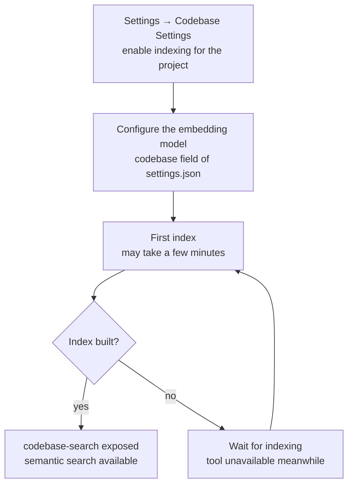

# 7-Codebase Index & Symbol Location

Snow App provides codebase semantic search (the `codebase` server) and code
symbol location (the `codelens` server) to help the agent understand and
navigate code quickly.

## 1. Codebase semantic search (codebase)

### 1.1 Enable and index

`codebase-search` is **only exposed when the project has codebase indexing
enabled and an index has been built**. Enable indexing for the project in
**Settings → Codebase Settings** (`app-control-openSettings
page=codebase-settings`) and configure the embedding model (see the
`codebase` field of `settings.json`; structure is documented in
`3-config-file-field-reference`). The first index may take a few minutes.



### 1.2 Tool

| Tool | Purpose |
| --- | --- |
| `codebase-search` | Semantic search over the embedding index |

Parameters: `query` (natural-language query text, required), `topN` (result
cap, default 10, max 50).

### 1.3 Example

```text
codebase-search query="how is config backslash escaping handled" topN=10
→ returns semantically related code snippets

codebase-search query="retry logic" topN=5
→ returns semantically related code snippets
```

### 1.4 Choosing between grep and codebase

| Scenario | Use |
| --- | --- |
| Exact keywords, regex, path-limited search | `grep-search` (faster, precise) |
| Semantic/intent queries ("find the login handling logic") | `codebase-search` (understands meaning) |

## 2. Code symbol location (codelens)

The `codelens` server performs lightweight static analysis (oxc /
tree-sitter based) for symbol resolution and reference lookup without
running a full LSP.

### 2.1 Tools

| Tool | Purpose |
| --- | --- |
| `codelens-find_definition` | Find a symbol's definition location |
| `codelens-find_references` | Find a symbol's references within the file |
| `codelens-file_outline` | Get a file's symbol outline (functions/classes/variables) |

### 2.2 Examples

```text
# Understand file structure
codelens-file_outline filePath=src/main/app/bootstrap.ts
→ top-level symbol list

# Jump to definition (pair with filesystem-read)
codelens-find_definition filePath=src/main/native/types.ts line=414 column=20
→ symbol name + definition location
```

### 2.3 Notes

- `find_definition`/`find_references` locate symbols by **line + column**:
  use `filesystem-read` to find the target position first.

### 2.4 About LSP (lsp-config)

Snow App's `lsp` server consumes **external language servers** (rust-analyzer /
gopls / pyright ...) for semantics-based **diagnostics** (`lsp-diagnostics`)
and **hover** (`lsp-hover`). `codelens` remains the built-in static analysis
(symbol navigation); the two are complementary.

Configuration is persisted in the app database table `lsp_server_configs`
(**DB-backed, no config file**):

- **Agent config**: `config-set scope=lsp-config key=servers value={...}`
  (full replacement, deep-validated; takes effect immediately, no restart).
- **User config**: Settings → LSP settings (`lsp-settings` page).
- The legacy `~/.snow/lsp-config.json` (reserved-era file) is imported once on
  first start (source=legacy); never read afterwards.

**Tools are OFF by default**: `lsp-*` tools only appear when the table has at
least one enabled AND installed language server (seed/migration set `enabled`
from a PATH probe — uninstalled servers default to off and show a ❌not-installed
badge in the settings page; after installing a server, turn the toggle on
manually). SSH/remote projects are not supported yet.

**Tool list** (all backed by real semantic analysis from external language
servers; exposed per the enabled languages' capability subset, §8.7):

| Tool | Purpose |
|---|---|
| `lsp-diagnostics` | File diagnostics (errors/warnings with severity/message/exact positions) |
| `lsp-hover` | Symbol hover info (type signature / docs, Markdown) |
| `lsp-definition` | Symbol definition location (cross-file semantic jump, more accurate than codelens) |
| `lsp-references` | All reference locations + one-line code context (cap 100) |
| `lsp-symbols` | File symbol outline (nested, with type/visibility detail) |
| `lsp-rename` | Semantic rename (dryRun default previews multi-file edits; false writes) |
| `lsp-type-definition` | Jump to the definition of a symbol's type |
| `lsp-implementation` | All implementations of an interface / abstract class / trait |
| `lsp-code-action` | Quick-fix / refactor menu (apply=true applies; command actions run via lsp-execute-command) |
| `lsp-execute-command` | Execute server refactor/import commands (WorkspaceEdit results previewable/applicable) |
| `lsp-call-hierarchy` | **Two-way call chain** (who calls it + what it calls, with call-site context) — the first choice for pre-edit impact analysis |
| `lsp-type-hierarchy` | **Type hierarchy** (parent chain + all subtypes) — base-type refactor blast radius (exposed only for Go/Java projects) |
| `lsp-workspace-symbols` | Cross-project fuzzy symbol search (merged across enabled languages, cap 50) |
| `lsp-workspace-diagnostics` | Project-wide diagnostics (LSP 3.17 pull, grouped by file) |

```text
# Example: agent configures the rust server (skip if already seeded)
config-get scope=lsp-config key=servers             # view current config
config-set scope=lsp-config key=servers value={...} # add/update servers
# then run diagnostics on a file
lsp-diagnostics filePath=/path/to/main.rs
```

### 2.5 LSP-preferring behavior & troubleshooting (2026-08-15)

Once LSP is configured, the system **automatically prefers LSP semantic analysis**
(no extra setup):

- **System prompt injection**: when the project has an enabled server for a
  matching language (and the command is installed), a "Language Servers" section
  is appended to the system prompt — listing available servers with their runtime
  status (`running` / `crashed; restarts on next use` / `installed; starts on
  first use`), grouping the `lsp-*` tools (diagnostics / navigation / symbol
  search / call graph, etc.), and stating **mandatory routing rules**: semantic
  queries (symbols, types, definitions, references, call graph, diagnostics) MUST
  use `lsp-*`; `grep-search` is only for literal string/pattern search;
  `codelens-*` auto-route to LSP. Injection conditions are **identical** to
  tool exposure: unconfigured, command missing, scope disabled, SSH remote,
  project without programming languages, or server language not matching the
  project — any of these suppresses both.
- **Session pre-warming**: while building the prompt, matching servers are
  **started in the background** (idempotent reuse; failures degrade silently),
  removing the cold-start delay of the first `lsp-*` call; idle sessions are
  reaped after 30 minutes, so they stay resident while the project is in use.
- **codelens auto-forwarding**: `codelens-find_definition` / `codelens-find_references`
  / `codelens-file_outline` automatically run through LSP when available (result
  gains `"engine": "lsp"`, shape unchanged); when LSP is unavailable or fails they
  fall back to built-in static analysis and the result gains **`"lspFallback": true`**
  — agents can tell the source of the result; **for semantic-level results call the
  `lsp-*` tools directly** (their errors carry actionable configuration guidance).

**Troubleshooting** (check in order when LSP is not working):

| Symptom | Check | Fix |
|---|---|---|
| `lsp-*` tools missing | Config exists and enabled (`config-get scope=lsp-config key=servers`) | `config-set scope=lsp-config key=servers value={...}`; enable in Settings → LSP settings |
| Error "not found or cannot start" | Command in PATH (`which <command>` / ❌ not-installed badge) | Install per the `installCommand` hint; enable in Settings after install |
| Error "no LSP server configured for x" | File extension in the server's `fileExtensions` | Add the extension (e.g. missing `.tsx`); confirm the project language matches the server |
| Project has no programming language / mismatch | Project has matching language files (no Language Servers section in the prompt) | Language detection = project markers (Cargo.toml etc.) + extension scan; no match → not injected nor exposed |
| SSH remote project | `ssh://` path | LSP is local-only; SSH projects never expose lsp-* tools |
| `crashed; restarts on next use` | Session crashed (≥2 consecutive restarts error out) | Check server install/config; next call restarts automatically |
| Dig deeper | App logs | `config-get scope=logs` reads `~/.snow/log` (main-process logs); in dev, native `[lsp]`-prefixed fallback logs appear in the terminal |

**Logging**: LSP fallback/failure reasons are written to the **app log table
(`app_logs`)** — same source as the System Logs panel; filter by `module=lsp` to
locate them (prompt-injection failure, codelens forwarding failure, scope-check
failure, project-root resolution failure are all recorded as level/warn with error
details). They are also printed to native stderr (visible in the dev terminal).
`~/.snow/log` holds main-process file logs (readable via `config-get scope=logs`);
the two complement each other.

## 3. Typical workflow

```text
1. Understand    → codelens-file_outline + filesystem-read key files
2. Locate        → grep-search (keywords) or codebase-search (semantic)
3. Formal check  → project build commands (tsc / cargo check / npm run check)
```
