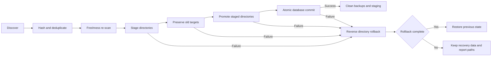
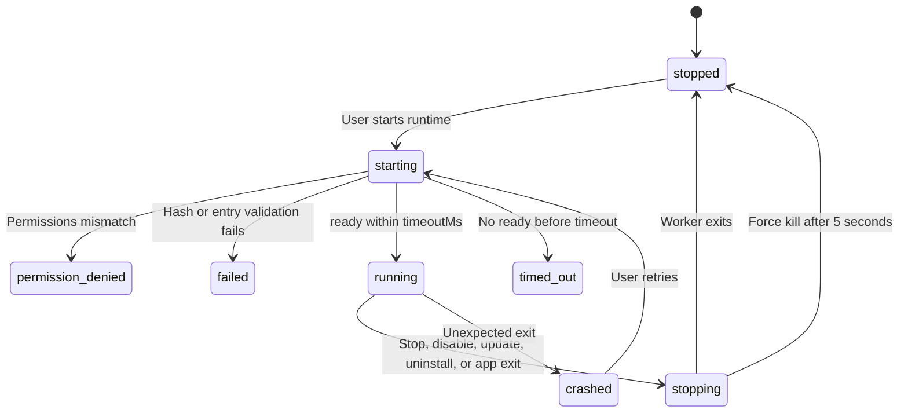

# 8-Third-party Configuration Import

Snow App can discover and import MCP servers, Skills, prompts, commands, agents, and plugins from Codex, Claude Code, and OpenCode. It can also install and manage declarative plugins. Open **Settings → Third-party configuration** (page id: `import-settings`).

| Tab | Purpose |
| --- | --- |
| Import configuration | Discover third-party configuration in the active environment, select candidates, and import them |
| Manage Plugins | Enable, disable, update, and uninstall plugins; manage marketplaces and plugin runtimes |

## 1. Sources and Importable Content

| Source | Configuration root | Main scanned files | Importable content |
| --- | --- | --- | --- |
| Codex | `CODEX_HOME` or `~/.codex` | Global/project `config.toml`, `AGENTS.md`, `AGENTS.override.md` | MCP, prompts, Skills, Plugins |
| Claude Code | `CLAUDE_CONFIG_DIR` or `~/.claude` | `~/.claude.json`, `settings.json`, project `.mcp.json`, `CLAUDE.md`, rules/commands | MCP, prompts, Commands, Skills |
| OpenCode | `OPENCODE_CONFIG_DIR`, `$XDG_CONFIG_HOME/opencode`, `~/.config/opencode`; legacy `~/.opencode` is supported | Global/project `config.json`, `opencode.json/jsonc`, `.opencode/...` | MCP, instructions, Commands, Agents, Skills |

Discovery shows summary cards, candidate items, actual source paths, and warnings. Candidate states include New, Already effective, Update available, Conflict, Unsupported, and Managed. Identical content from several sources is merged. The same logical ID with different content becomes a Conflict, and only one variant may be selected. Snow App rescans before commit; if content changed, refresh before importing.

## 2. Local, WSL, and SSH Discovery Rules

Snow App does not scan every registered remote environment. The active project determines the discovery scope:

| Current context | Discovery scope |
| --- | --- |
| No active project supplied | Local global configuration only; the global settings page does not enter WSL or SSH automatically |
| Ordinary local Windows project | Local global configuration plus the active local project |
| Project under `\\wsl$\<distro>\...` or `\\wsl.localhost\<distro>\...` | Local global discovery remains enabled, plus the active WSL project in that distribution |
| `ssh://...` project | Local global discovery remains enabled, plus the active SSH host's remote home and project |

For WSL, Snow App resolves the Linux home from `/etc/passwd` and reads files through the UNC mapping. Failure to resolve the home produces a warning and falls back to local-only discovery. For SSH, Snow App connects to the active host, resolves its remote home, scans the project, and closes the session after discovery. Connection or home-resolution failure also warns and falls back to local only.

Additional boundaries:

- Registered WSL/SSH projects are not all scanned; only the environment for the active project is used;
- An SSH-declared stdio MCP command cannot run on the local machine and is marked Unsupported;
- An SSH Skill may be downloaded to local staging and then enter the same directory transaction as a local Skill.

## 3. Selecting and Importing

1. Select Codex, Claude Code, or OpenCode;
2. Review source paths, warnings, and candidate states; use **Refresh discovery** when needed;
3. Select candidates; conflicting variants are mutually exclusive;
4. Click **Import selected (n)**;
5. Review the imported, unchanged, skipped, and unsupported counts.

| Candidate type | Target |
| --- | --- |
| MCP | Snow MCP settings, preserving global/project scope |
| Skill | `~/.snow/skills` or `<project>/.snow/skills` |
| Prompt / Command / Agent | System Prompt storage |
| Plugin | Snow plugin management and managed components |

If a target already exists with different content and is not an unchanged Snow-managed snapshot, the import skips it instead of overwriting the user's directory.

## 4. Reversible Directory Transaction

Skills and plugins are not overwritten while discovery runs. Directory changes and the database commit form a recoverable transaction:

1. Copy each source directory to staging under the target's parent directory;
2. If the target exists, atomically rename it to a `previous` backup in the same directory;
3. Rename staged `new` into the final target;
4. After every directory commit succeeds, commit MCP entries, managed resources, and metadata in one native database transaction;
5. On any failure, roll promoted directories back in reverse order;
6. Remove `previous` and staging data only after the database commit succeeds;
7. If automatic recovery is incomplete, retain recovery data and report its paths in the error.

## 5. Two MCP Enablement Semantics

### 5.1 Ordinary Configuration Import

When importing an MCP server from ordinary Codex, Claude Code, or OpenCode configuration:

- `enabled` is inherited from the source declaration;
- If the source omits `enabled`, normalization defaults it to `true`;
- The marketplace's per-MCP approval dialog is not involved.

### 5.2 Plugin Marketplace Installation

Installing a marketplace plugin applies stricter component approval:

- Before installation, review each MCP's transport, command, args, env, headers, URL, and declaration path;
- Every MCP is disabled by default. The user must select each one, and only approved components are written with `enabled=true`;
- Approval is bound to an `approvalHash` derived from `componentId + declarationPath + connectionHash`;
- Snow App validates again before and after installation. A declaration change invalidates the old approval and requires another review;
- A plugin's `defaultEnabled` does not automatically approve its MCP servers.

These flows are intentionally different: ordinary configuration imports preserve source enablement, while marketplace plugins require explicit approval for every bundled MCP server.

## 6. Plugin Marketplaces and Declarative Components

Supported marketplace sources include local directories, `owner/repo[@ref]`, Git URLs, and HTTPS URLs that point directly to `marketplace.json`. Marketplace caches live in `~/.snow/plugin-marketplaces`; installed plugins live in `~/.snow/plugins/marketplaces`. Removing a marketplace clears its cache but keeps installed plugins.

Snow App can import declarative MCP, Skill, Prompt, Command, and Agent components and **does not run install scripts**. A Hook directory or manifest declaration is detected but currently marked Unsupported: it is not imported as an executable Snow lifecycle Hook, and plugin Hook code does not run. External code can run only through a plugin's optional Snow runtime after the user explicitly starts it and reviews its permissions. Import records a content hash for the plugin directory, which is used for update detection and runtime integrity checks.

## 7. Plugin Runtime Security and Lifecycle

A plugin may optionally declare a runtime. A plugin without one cannot be started. Before launch, Snow App:

- Recomputes the source-directory hash and refuses to run if it differs from the saved `contentHash`, requiring a rescan/update;
- Requires an entry that exists inside the plugin directory and has a `.js`, `.mjs`, or `.cjs` extension;
- Supports only `storage`, `network`, and `child-process` declarations. The normal Settings UI submits the declaration list unchanged as the granted list;
- Requires the low-level granted value to be a duplicate-free string array containing every declared permission. A missing declared permission, duplicate, or invalid shape produces `permission-denied`. The current validator does not reject extra strings, but Node permission flags are always derived only from the plugin declaration, so extras do not expand effective runtime authority.

The runtime starts as an isolated worker through Electron `utilityProcess.fork`, with Node permission flags narrowing its capabilities:

| Permission | Runtime capability |
| --- | --- |
| Default | Read-only access to plugin source, entry, and required application paths |
| `storage` | Write access to a plugin-specific storage directory named from the first 24 characters of the plugin ID's SHA-256 hash |
| `network` | Adds `--allow-net` |
| `child-process` | Adds `--allow-child-process` |

Lifecycle states include `unavailable`, `stopped`, `starting`, `running`, `stopping`, `timed-out`, `crashed`, `permission-denied`, and `failed`:

1. The worker must send `ready` within `runtime.timeoutMs`; otherwise it is killed and marked `timed-out`;
2. Stop first sends `{type: "stop"}` and force-kills the process only if it has not exited after five seconds;
3. Disable, update, and uninstall stop the runtime first;
4. App shutdown calls `stopAll()`.

Installing declarative components, not running install scripts, rejecting plugin Hooks, and explicitly starting a Snow runtime are separate trust boundaries. Run plugin code only after reviewing its content hash, entry, and declared permissions.

## 8. Unsupported Items and Troubleshooting

| Symptom | Resolution |
| --- | --- |
| Source not found | The source tool is not installed or has not been used; install/run it, then refresh |
| Unsupported | Review the warning; common cases are Claude Code `ws`/`sse`, `headersHelper`, a plugin MCP without command/URL, or an SSH stdio MCP |
| Import discovery changed | Source content changed after discovery; refresh and select again |
| A user directory was not overwritten | Different content outside an unchanged Snow-managed snapshot is skipped for safety |
| Runtime is permission-denied | Verify that the granted value is a duplicate-free string array containing every declared permission; review and submit the plugin's declaration list again from Settings |
| Runtime is timed-out | The plugin did not send `ready` within `runtime.timeoutMs` |

## 9. References

- [Configure MCP Servers](1-configure-mcp.md)
- [Install and Manage Skills](2-install-and-manage-skills.md)
- [Configuration File Field Reference](../3-reference/3-config-file-field-reference.md)
