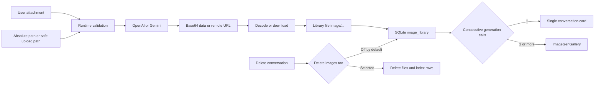

# 9-Image Generation

Snow App ships built-in **image generation & editing** (tool `imagegen-generate`)
with **multiple channels**: **OpenAI** (gpt-image / dall-e) and
**Google Gemini** (Nano Banana family). Channels can be enabled at the
same time and are picked per request. Image generation uses its **own
configuration, independent from the conversation API**, and has **no built-in
default model** — you must configure at least one usable channel in
**Settings → Image generation**.

## 1. Where to Configure

| Entry                                                               | Description                                                 |
| ------------------------------------------------------------------- | ----------------------------------------------------------- |
| Settings → Image generation (settings page id: `imagegen-settings`) | GUI: channel table with add/edit/delete                     |
| App database `system_settings` table (code: `imagegen_settings`)    | Storage (same source as the UI)                             |
| `imagegen` scope of the `config` tool                               | AI agents can read/write the same settings via config tools |

> **Exposed on demand**: when neither channel is configured, `imagegen-generate`
> is hidden from the AI's tool list; configuring any channel makes it visible
> again immediately (no restart needed).

## 2. GUI Configuration (Multiple Channels)

Open **Settings → Image generation**: channels are managed as a **table** —
you can create any number of OpenAI / Gemini channels, mixed and
enabled simultaneously, via the **Add channel** button:

| Field                      | Description                                                                                                                                                                                                                                            |
| -------------------------- | ------------------------------------------------------------------------------------------------------------------------------------------------------------------------------------------------------------------------------------------------------ |
| Enabled                    | Channel switch; a disabled channel is unusable. **Cannot be enabled without an API key and a model** (a hint asks you to complete the configuration first) — only fully configured channels expose the generation tool to the agent                    |
| Channel name               | Custom display name (used in the list and by the agent); leave empty to fall back to the protocol name (OpenAI / Google Gemini). Edit it in the channel editor dialog                                                                       |
| API Key                    | Provider key (OpenAI `sk-...` / Gemini `AIza...`)                                                                                                                                                                                                      |
| Base URL                   | Endpoint; leave empty for the official default (OpenAI `https://api.openai.com/v1`, Gemini `https://generativelanguage.googleapis.com/v1beta`). **OpenAI-compatible endpoints (including the baseUrl you use for the Snow App conversation API) MUST include the `/v1` path segment** (e.g. `http://host:port/v1`) — requests are built as `{baseUrl}/images/generations` and `{baseUrl}/images/edits`, so a bare host root without `/v1` returns 404                                                                                                         |
| Model                      | Image model; **required** — a channel without a model is treated as unconfigured (no built-in default)                                                                                                                                                 |
| Default size               | **OpenAI**: linked ratio × tier presets (12 ratios × 1K/2K/4K recommended resolutions, or `auto`), or type any resolution directly; **Gemini**: two independent presets — aspect ratio + image size, stored combined as `16:9@2K`                      |
| Aspect ratio               | Gemini: `1:1`, `5:4`, `4:3`, `3:2`, `16:9`, `2:1`, `21:9`, `4:5`, `3:4`, `2:3`, `1:2`, `9:16` (12 ratios)                                                                                                                                              |
| Image size                 | Gemini: `512px` / `1K` / `2K` / `4K` (**case-sensitive**); the options **adapt to the selected model** (see the model table below)                                                                                                                     |
| Default quality            | **OpenAI channels only**: `low` / `medium` / `high` / `auto`; hidden for Gemini channels (Gemini only accepts `low`/`medium`/`high` — the panel's `auto` default would be ignored)                                                                     |
| Output format              | **OpenAI channels only**: `png` / `jpeg` / `webp`; ignored for Gemini                                                                                                                                                                                  |
| Max concurrent generations | Global setting (1–8, default 4): when the agent requests several images at once, at most this many are generated **in parallel**; the rest queue up and a new one starts as soon as one finishes. Lower it if your provider rate-limits image requests |
| Gemini web search          | Grounds generation with live Google Search results                                                                                                                                                                                                     |
| Streaming / Non-streaming  | Pick the default mode under Advanced: **Streaming** shows intermediate previews while generating; **Non-streaming** shows images once generation finishes; overridable via the `stream` tool parameter                                                 |

**Model dropdown**: focusing the model input pulls the model list from the
channel's Base URL and filters image models (OpenAI matches `gpt-image`/`dall-e`,
Gemini matches `-image`/`imagen`); you can also type a model manually.
Selecting a model shows its **capability tags**:

| Tag                 | Meaning                                          |
| ------------------- | ------------------------------------------------ |
| 4K / 2K / 1K only   | Maximum output resolution                        |
| Streaming           | Supports incremental previews during generation  |
| Image-to-image      | Supports reference-image editing                 |
| Fidelity            | Supports edit fidelity control (`inputFidelity`) |
| Thinking            | Supports pre-render reasoning (`thinkingLevel`)  |
| Image search        | Supports Google Image Search grounding           |
| Interleaved         | Supports interleaved text & image output         |
| Up to 3 images      | Max 3 images per request                         |
| Text-to-image only  | No reference-image editing                       |
| Fast                | Speed-first generation                           |
| Legacy / Deprecated | Old models; Imagen shuts down 2026-08-17         |

## 3. Supported Models

### OpenAI channel

| Model                           | Notes                                                                                                                                     |
| ------------------------------- | ----------------------------------------------------------------------------------------------------------------------------------------- |
| `gpt-image-2` / `gpt-image-1.5` | 4K, streaming, image-to-image                                                                                                             |
| `gpt-image-1`                   | 2K, streaming, image-to-image, fidelity control; **the only model that outputs transparent backgrounds** (pair with `outputFormat="png"`) |
| `gpt-image-1-mini`              | Fast, streaming                                                                                                                           |
| `dall-e-3`                      | Text-to-image only; **exactly 1 image per request** (`n>1` is clamped to 1)                                                               |

### Gemini channel (Nano Banana family)

| Model                         | Image sizes               | Reference images | Notes                                                                                     |
| ----------------------------- | ------------------------- | ---------------- | ----------------------------------------------------------------------------------------- |
| `gemini-3.1-flash-image`      | `512px`, `1K`, `2K`, `4K` | Up to 14         | Nano Banana 2, recommended default: 4K, streaming, image-to-image, thinking, image search |
| `gemini-3.1-flash-lite-image` | `1K` only                 | —                | Nano Banana 2 Lite: fastest/cheapest                                                      |
| `gemini-3-pro-image`          | `1K`, `2K`, `4K`          | Up to 14         | Nano Banana Pro: professional assets, high resolution, interleaved text                   |
| `gemini-2.5-flash-image`      | ~`1K`                     | Up to 3          | Legacy: low latency, high volume                                                          |

> **Image size follows the model**: the “Image size” dropdown of the Gemini
> channel automatically filters the available options based on the selected
> model and shows “Current model supports: …” below it, so you never pick a
> size the model cannot produce.
>
> **Automatic model-capability validation (400 protection)**: before sending a
> request, the server validates the combination against the model's
> capabilities and intercepts unsupported ones locally with a fix hint,
> instead of handing the raw 400 back to the agent — `dall-e-3` and `imagen-*`
> are text-to-image only (reference images are rejected locally with a hint to
> switch to `gpt-image-1/2` or a Nano Banana model), and `dall-e-3`'s `n` is
> clamped to 1. If a provider 400 still comes back, the error message carries a
> concrete fix hint (image count / image input / size / quality) so the agent
> can retry correctly in one step.
>
> **Imagen deprecated**: `imagen-*` models are shut down on **2026-08-17** —
> migrate to the Nano Banana family above.

### OpenAI recommended resolutions (gpt-image family)

The settings panel provides **12 ratios × 1K/2K/4K** linked presets, all
provider-recommended values (max side ≤ 3840px, multiples of 16px, long/short
ratio ≤ 3:1):

| Ratio  | 1K        | 2K        | 4K        |
| ------ | --------- | --------- | --------- |
| `1:1`  | 1248×1248 | 2048×2048 | 2880×2880 |
| `5:4`  | 1440×1152 | 2240×1792 | 3200×2560 |
| `4:3`  | 1472×1104 | 2304×1728 | 3264×2448 |
| `3:2`  | 1536×1024 | 2496×1664 | 3504×2336 |
| `16:9` | 1792×1008 | 2560×1440 | 3840×2160 |
| `2:1`  | 1792×896  | 2880×1440 | 3840×1920 |
| `21:9` | 1904×816  | 3024×1296 | 3696×1584 |
| `4:5`  | 1152×1440 | 1792×2240 | 2560×3200 |
| `3:4`  | 1104×1472 | 1728×2304 | 2448×3264 |
| `2:3`  | 1024×1536 | 1664×2496 | 2336×3504 |
| `1:2`  | 896×1792  | 1440×2880 | 1920×3840 |
| `9:16` | 1008×1792 | 1440×2560 | 2160×3840 |

You can also choose `auto` (decided by the model) or type a custom resolution.

## 4. Using It in Chat

Once configured, just ask in the conversation; the AI calls `imagegen-generate`
automatically:

- **Text-to-image**: describe the picture, e.g. “draw a shiba inu wearing an
  astronaut helmet, cyberpunk city background”;
- **Image-to-image / edit**: **attach a reference image** in the chat, then give
  an edit instruction, e.g. “replace the background with Tokyo at night”,
  “make it photorealistic”. Whether or not the main model supports vision, the
  **original image is always passed to the generation service** as a reference,
  so the request is a true image-to-image edit (OpenAI `/images/edits` /
  Gemini `inlineData`):

  - **Main model supports vision**: the image is sent as a multimodal block;
    the AI fills the `images` parameter from the image data;
  - **Main model does NOT support vision** (images are first textified by a
    separate vision model): the textified message includes a
    `[Reference image #N for imagegen-generate: {"path": "...", "mimeType":
"..."}]` reference block per image — just a relative path under the
    upload/ directory (a few dozen bytes, no context bloat). The AI copies
    the reference into the `images` parameter and the server **reads the
    original file itself**, so it never falls back to text-to-image from the
    description alone.
    The “N reference image(s)” area on the generation card shows the reference
    thumbnails: inline base64 renders directly; `path` references are read from
    disk by the main process and also render as **real thumbnails** (a brief
    placeholder icon while loading, or permanently if the file is missing — the
    image-to-image call itself is unaffected);

  **What the AI actually receives** (full content injected into the textified
  message when the main model does not support vision):

  ```text
  [The user attached 2 reference image(s). When the user asks to generate or
  edit an image based on them, call the imagegen-generate tool and pass the
  corresponding JSON object(s) below in its "images" parameter (image-to-image)
  — do NOT generate from the text description alone.]
  [Image #1]
  [Image description: <text description produced by the vision model>]
  [Reference image #1 for imagegen-generate: {"path":"upload/2026-08-05/a1b2c3.png","mimeType":"image/png"}]
  [Image #2]
  [Image description: <text description produced by the vision model>]
  [Reference image #2 for imagegen-generate: {"path":"upload/2026-08-05/d4e5f6.jpg","mimeType":"image/jpeg"}]
  ```

  Details: the guidance line (“do NOT generate from the description alone”) is
  injected **once per message that has images**; reference block numbers match
  the `[Image #N]` placeholders one-to-one; only **user messages** get the
  blocks (tool-result screenshots do not); the rare non-persisted inline images
  fall back to `{"data":"<base64>","mimeType":"..."}`; reference blocks in
  historical messages are kept, so later turns can still reference previously
  uploaded images (e.g. “turn the image from earlier into anime style”);

- **Multiple images (parallel calls)**: ONE call = ONE image. To generate
  several images (e.g. a set with different styles or themes), the AI fires
  **multiple parallel calls** — one call per image, each with its own single
  `prompt` (and its own `images` group when editing). Parallel generation is
  only done through multiple separate calls; several prompts are never
  packed into one call (the `n` / `prompts` / `requestImages` parameters are
  kept for backward compatibility only). Parallel calls run concurrently,
  bounded by **Max concurrent generations** in the settings (1–8, default
  4); the rest queue up and a new one starts as soon as one finishes, and
  each card shows its own progress in real time;
- **In-chat display**: two or more consecutive `imagegen-generate` calls are combined into `ImageGenGallery`. Two to four images use the image count as the column count, five to six use three columns, and seven to eight use four. Narrow containers automatically reduce the layout to three, two, or one column. Each cell uses contain sizing to show the complete image without distortion; galleries do not apply special full-row layouts to wide or tall images. Multiple images have index badges; click one to open the lightbox and download it; when a generation channel is available, the system prompt also receives a `## Image Generation` section telling the AI that one call produces one image, multiple images MUST come from parallel calls, and parallel results are merged into the gallery (see "Tool-domain system-prompt injection" in [Agent Runtime and Tool Orchestration](../4-architecture-and-development/4-agent-runtime-and-tool-orchestration.md));
- **Upstream returns only links**: some relays return `data[].url` (e.g. S3
  pre-signed links) instead of image data. The tool now **downloads and
  persists** such images into the image library (disk + index), so the
  gallery shows them like any other result and expired links don't matter.
  If a download fails, the card degrades to a "failed to load remote image"
  placeholder that opens the original URL on click, and the "Remote image
  links" list stays below as a fallback;
- **Streaming / Non-streaming**: in streaming mode, intermediate previews
  appear in real time while generating; in non-streaming mode, images are shown
  once generation finishes. The default mode is set in the channel's
  **Advanced** options (a streaming/non-streaming picker); the `stream` tool
  parameter overrides it per request;
- **Channel selection**: the AI picks a usable channel per request (OpenAI is
  the default when both are enabled); you can ask explicitly, e.g. “use Gemini”.

### Reference Paths and Runtime Limits

Reference items in `images` may use inline `data` or a `path`. Two path forms are supported:

1. An **absolute disk path**, such as `C:/Users/name/photo.png`;
2. A **safe relative path**, such as `upload/2026-07-25/hash.png`.

A relative path must start with `upload/`, may not traverse with `..`, and is resolved relative to the application database directory. Absolute paths are explicitly supported by the runtime, but should reference only trusted files you are allowed to read. `[Reference image #N ...]` blocks produced while textifying vision messages always use safe `upload/...` paths so absolute paths and large base64 payloads do not enter the model context.

Hard input limits come from the runtime source and current error messages. In this version, `MAX_IMAGES` and `MAX_BASE64_LEN` in `imagegen.rs` allow at most 14 images per `images` group (and per legacy `requestImages` group), with about 20 MiB of **encoded data** per image; data read from a path is encoded and checked against the same limit. The tool description recommends no more than five images per call for compatibility with stricter upstreams. That recommendation is not the current runtime count limit. Models and providers may impose lower limits, so follow current capabilities and provider responses.

### Tool Parameters (`imagegen-generate`)

| Param               | Type              | Description                                                                                                                                                                                                                                                                                                                                                                                                                       |
| ------------------- | ----------------- | --------------------------------------------------------------------------------------------------------------------------------------------------------------------------------------------------------------------------------------------------------------------------------------------------------------------------------------------------------------------------------------------------------------------------------- |
| `prompt`            | string (required) | Generation description, or the edit instruction with reference images (**one call = one image**; for several images fire multiple parallel calls)                                                                                                                                                                                                                                                                                             |
| `prompts`           | array             | **Legacy, not recommended**: a different prompt per image `["prompt 1", "prompt 2", ...]` (1-8 items; overrides `n`). To generate several different images, fire **multiple parallel calls** (one call per image with its own single `prompt`) instead of packing prompts into one call                                                                                                                                                                                                                       |
| `images`            | array             | Reference images `[{data, mimeType}]` or `[{path, mimeType}]`; `path` may be an absolute disk path or a safe `upload/...` relative path (must start with `upload/` and may not contain `..`). The current runtime allows 14 images per group and about 20 MiB of encoded data per image; the five-image tool-description recommendation only targets stricter upstream compatibility. Ignored when `requestImages` is present |
| `requestImages`     | array             | **Legacy, not recommended**: a different reference-image group per request `[[group 1...], [group 2...], ...]` (shape same as `images`), group count must equal the request count (= `prompts` length or `n`, 1-8). To restyle several source images, fire **multiple parallel calls** (one call per source image with its own `images` group) instead                                                                                                                                                              |
| `model`             | string            | Override the configured model                                                                                                                                                                                                                                                                                                                                                                                                     |
| `provider`          | enum              | `auto` (default) / `openai` / `gemini`, backend override                                                                                                                                                                                                                                                                                                                                                                          |
| `size`              | string            | OpenAI: a resolution like `1024x1024` or `auto`; Gemini: `1K`/`2K`/`4K` (imageSize) or an aspect ratio like `16:9` (aspectRatio), combinable as `16:9@2K` to set both                                                                                                                                                                                                                                                             |
| `quality`           | enum              | `low` / `medium` / `high` / `auto`; Gemini only accepts `low`/`medium`/`high` (`auto` is ignored, i.e. the provider default quality is used)                                                                                                                                                                                                                                                                                      |
| `outputFormat`      | enum              | OpenAI: `png` / `jpeg` / `webp`                                                                                                                                                                                                                                                                                                                                                                                                   |
| `outputCompression` | number            | OpenAI JPEG/WebP compression 0-100                                                                                                                                                                                                                                                                                                                                                                                                |
| `n`                 | number            | **Legacy, not recommended** for multiple images: 1-8 (default 1). To generate several images, fire **multiple parallel calls** (one call per image) instead of raising `n`; kept for backward compatibility only — n>1 fans out to n concurrent sub-requests of the SAME prompt (one image each — relays/upstreams reject n>1 in a single request) and returns the whole batch at once, persisting every image. Streaming preview is disabled when n>1. `dall-e-3` always returns 1. Passing `prompts` sets the request count from its length |
| `personGeneration`  | enum              | Gemini: `dont_allow` (default) / `allow_all` / `allow_adult`                                                                                                                                                                                                                                                                                                                                                                      |
| `webSearch`         | boolean           | Gemini Google Search grounding                                                                                                                                                                                                                                                                                                                                                                                                    |
| `stream`            | boolean           | Streaming preview (defaults to the setting)                                                                                                                                                                                                                                                                                                                                                                                       |
| `inputFidelity`     | enum              | OpenAI edits: `low` / `high` / `auto` (not supported by gpt-image-2)                                                                                                                                                                                                                                                                                                                                                              |
| `background`        | enum              | OpenAI: `opaque` (default) / `transparent` / `auto`; falls back to `opaque` automatically when the model lacks transparency support (e.g. gpt-image-2). For a transparent background (sticker / cutout / desktop pet) pick **`gpt-image-1`** with `outputFormat="png"` — it is the only model that actually outputs transparency; gpt-image-2 silently downgrades the request and dall-e-3 / Gemini ignore the parameter entirely |
| `moderation`        | enum              | OpenAI: `auto` (default) / `low` (less filtering)                                                                                                                                                                                                                                                                                                                                                                                 |
| `seed`              | number            | Deterministic seed for reproducible results                                                                                                                                                                                                                                                                                                                                                                                       |
| `thinkingLevel`     | enum              | Gemini 3.1 Flash Image: `minimal` (default) / `high`                                                                                                                                                                                                                                                                                                                                                                              |
| `imageSearch`       | boolean           | Gemini 3.1 Flash Image: Google Image Search grounding                                                                                                                                                                                                                                                                                                                                                                             |

> When multiple channels are enabled, the `provider` parameter wins; otherwise the
> provider is derived from the configuration. OpenAI edits use `/images/edits`
> (multipart), Gemini edits use `inlineData` multimodal prompts; the Gemini
> Nano Banana family uses the Interactions API.

## 5. Image Library Management

Every generated image is automatically persisted into the **image library**
(disk `~/.snowapp/image/` + SQLite `image_library` index), viewable and
manageable in **Sidebar → Image Library** (or `app-control-openSettings
page=image-library`):

| Capability | Description |
| --- | --- |
| Browse and filter | The default view is an **album card wall** (one cover card per album); click into the image grid. Lists images newest-first with thumbnails and model/date metadata. Select **All**, **Uncategorized**, or a specific album, then combine that with aspect-ratio (landscape/square/portrait), time (today/7d/30d), provider, and model filters. Click an image to open the lightbox |
| Search | The top search box does fuzzy matching over **file name / prompt / model / provider**; typing a keyword switches from the album card wall to the image grid automatically |
| Album organization | Create and rename albums, then use each image's album selector to move it into an album or back to **Uncategorized**; you can also **drag an image directly onto an album card** to classify it. Album deletion requires confirmation; its images are **kept** and all move to **Uncategorized** |
| Batch operations | Multi-select images to enter batch mode and reveal a batch toolbar: **move into album** (including back to Uncategorized) and **batch delete** (deleted one by one; a failure does not stop the rest) |
| Manual import | Click **Import** and pick local image files; they are copied into the library directory and indexed, then appear in the list. Multiple selection is supported |
| Download | Download the current image under its original file name from either the library card or the lightbox toolbar |
| Delete image | Requires confirmation; afterwards the disk file **and** index row are removed together, and conversation messages referencing the image are rewritten (references become invalid instead of dangling) |
| Custom save directory | The panel header shows the current root. **Change** selects another directory and **Reset** restores `~/.snowapp/image/` through the `image_library_dir` setting |

Albums are an organizational lifecycle over library index data, not the lifetime of image files: **deleting an album never deletes its images**, and moving an image changes only its classification. A physical file and index row are removed only by **Delete image** or when conversation deletion explicitly selects **Delete images too**.

Related behaviors:

- **Remote-URL results are downloaded & persisted**: when the upstream only
  returns a URL, the tool downloads it into the library (30s timeout / 50MB
  cap / content-type check), so expired links never break the gallery;
- **Cascading delete on conversation removal**: deleting a conversation with
  "don't keep images" cascades deletion of its referenced library images
  (physical files + index rows);
- **Backup**: the library defaults to `~/.snowapp/image/` — include it in
  backups (see [3-reference/4-data-storage-locations](../3-reference/4-data-storage-locations.md)).

### 5.1 Generation and Persistence Flow

Every successful result is written to the library directory and indexed in SQLite `image_library`. If the upstream returns only a remote URL, the tool downloads and persists it; the URL remains only as a fallback when the download fails.



Deleting a conversation **keeps library images by default**. Physical files and index rows are removed only when **Delete images too** is selected in the confirmation dialog. The `upload/...` conversation upload area is outside the `image/...` library migration scope.

### 5.2 Library Directory Migration Boundaries

An empty library switches directories directly. A non-empty library uses a recoverable migration:

1. `prepare` creates the target directory, lists only valid indexed `image/...` paths, and writes a migration log;
2. Files are **copied** in chunks, with an attempted catch-up copy for images created during migration before commit;
3. `commit` updates `image_library_dir`, then performs best-effort cleanup of old files;
4. Cancellation, copy failure, or closing the migration panel removes copied target files and keeps the old directory setting;
5. After a process interruption, the next startup reads the log: an uncommitted migration rolls back, while a committed migration resumes cleanup.

The migration rejects `..`, and the new root may not be inside the current library root. Unindexed miscellaneous files and `upload/...` files are not moved. Cleanup failure after commit may leave orphaned files. A failed catch-up copy for newly created images is recorded but does not guarantee that commit is blocked, so back up important libraries separately rather than treating migration as a zero-loss backup.

## 6. Managing via the config Tool (AI / CLI)

`imagegen` is a database-backed scope of the `config` tool (same source as the
app database, takes effect immediately):

| Operation          | Example                                                                                                                                                                                                                                                                                                    |
| ------------------ | ---------------------------------------------------------------------------------------------------------------------------------------------------------------------------------------------------------------------------------------------------------------------------------------------------------- |
| List channel state | `config-list` + `scope: "imagegen"` → enabled / model / configured per channel, plus the global `maxConcurrentImages` and `timeoutSecs` (generation timeout in seconds)                                                                                                                                    |
| Read config        | `config-get` + `scope: "imagegen"` + `key: "openai"` (omit `key` for the full settings); read the concurrency cap with `key: "maxConcurrentImages"`, the timeout with `key: "timeoutSecs"`                                                                                                                 |
| Write config       | `config-set` + `scope: "imagegen"` + `value: {openai: {...}}` (partial updates merge; omitted fields keep their previous values); full example `value: {openai: {baseUrl: "https://api.example.com/v1", apiKey: "sk-...", model: "gpt-image-1", enabled: true}}` — **an openai channel's `baseUrl` MUST include the `/v1` path segment** (same rule as the Snow App conversation API baseUrl, e.g. `http://host:port/v1`), otherwise `{baseUrl}/images/generations` returns 404; a gemini channel's baseUrl must include its version segment (default `.../v1beta`); adjust the concurrency cap alone with `value: {maxConcurrentImages: 6}` (clamped to 1–8); adjust the timeout alone with `value: {timeoutSecs: 600}` (clamped to 60–3600) |
| Clear config       | `config-delete` + `scope: "imagegen"` (hides the generation tool again)                                                                                                                                                                                                                                    |

> **Key safety**: `apiKey` values are always returned masked (e.g.
> `sk-e****7890`) — plaintext secrets are never exposed. Writes merge per
> channel; fields you omit keep their previous values.

## 7. Troubleshooting

| Symptom                                              | Cause & fix                                                                                                                                                                                                                                                                                                                                                                                                                             |
| ---------------------------------------------------- | --------------------------------------------------------------------------------------------------------------------------------------------------------------------------------------------------------------------------------------------------------------------------------------------------------------------------------------------------------------------------------------------------------------------------------------- |
| The AI cannot see the generation tool                | Neither channel is configured (`enabled` + `apiKey` + `model` all required); it appears automatically once configured                                                                                                                                                                                                                                                                                                                   |
| 401/403 errors                                       | Check the channel API key & Base URL; the key may be expired                                                                                                                                                                                                                                                                                                                                                                            |
| 400 errors                                           | Model-capability validation is built in (`dall-e-3`/`imagen` image-to-image, image count, size and quality are intercepted or clamped before the request is sent); if a 400 still comes back, the error message carries a fix hint and the agent usually retries successfully on its own. Manual checks: `n` above the model's limit, a size/quality outside the model's supported set, or image-to-image on a text-to-image-only model |
| Channel enabled but unusable                         | Confirm the model is filled in — an empty model means unconfigured                                                                                                                                                                                                                                                                                                                                                                      |
| Image-to-image not working                           | Make sure a reference image is attached and the prompt is an edit instruction                                                                                                                                                                                                                                                                                                                                                           |
| Broken image icon in the AI reply body               | When the model references generated images by local relative paths (`image/...` library or `upload/...`) in Markdown, the renderer resolves them to data URLs via IPC; if it still breaks, confirm the file still exists (deleting a library image rewrites the conversations that reference it)                                                                                                                                            |
| Slow generation                                      | Disable streaming preview; use `low` quality or a Lite model                                                                                                                                                                                                                                                                                                                                                                            |
| How do I control concurrency for many images at once | Parallel generation = **multiple separate calls**, controlled by Settings → Image generation → **Max concurrent generations** (1–8, default 4): at most that many calls run at once, excess calls queue automatically and start as one finishes. Lower the cap if your provider rate-limits (429). The legacy `n` (concurrent sub-requests inside one call) stacks with parallel calls and may overwhelm weak relays — not recommended |
| Imagen model errors                                  | Imagen is deprecated (shut down 2026-08-17); use the Nano Banana family                                                                                                                                                                                                                                                                                                                                                                 |

## 8. References

- Full tool parameters: the `imagegen` section of
  [3-reference/2-builtin-tools-reference](../3-reference/2-builtin-tools-reference.md)
- Storage locations: [3-reference/4-data-storage-locations](../3-reference/4-data-storage-locations.md)
