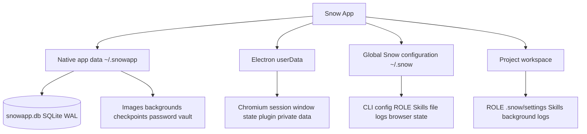

# Data Storage Locations

> Based on the current implementation in `native/src/storage/` and `src/main/`, this reference describes Snow App's main persistence locations, lifecycles, security boundaries, and correct backup and restore procedures. `~` means the current operating-system user's home directory.

## Storage Architecture Overview

These layers do not replace one another. The database stores indexes and structured records, resource directories store binary files, Electron `userData` stores browser runtime data and main-process files, and `~/.snow/` plus workspaces store CLI, rule, and project-scoped files.

## 1. Native App Data: `~/.snowapp/`

`native/src/storage/paths.rs` resolves `<home>/.snowapp` from the user's home directory. It contains both the main database and application-managed resources.

### 1.1 Main Database: `~/.snowapp/snowapp.db`

The application uses SQLite through rusqlite with:

- WAL journal mode;
- `synchronous=NORMAL`;
- foreign keys enabled;
- a five-second busy timeout.

Representative tables include:

| Table                                                   | Contents and sensitivity                                                                                                                                                                                                      |
| ------------------------------------------------------- | ----------------------------------------------------------------------------------------------------------------------------------------------------------------------------------------------------------------------------- |
| `system_settings`                                       | Key-value settings for theme, language, shortcuts, privacy, request logging, image-library root, and more                                                                                                                     |
| `api_configs`                                           | API profiles, keys, and model settings; highly sensitive                                                                                                                                                                      |
| `system_prompts`                                        | Global and project system-prompt templates                                                                                                                                                                                    |
| `custom_header_schemes`                                 | Custom request-header schemes that may contain tokens                                                                                                                                                                         |
| `workspace_directories`                                 | Workspace list                                                                                                                                                                                                                |
| `mcp_server_configs`                                    | Global MCP configuration                                                                                                                                                                                                      |
| `lsp_server_configs`                                    | LSP language-server configuration (DB-backed `lsp-config` scope; legacy `~/.snow/lsp-config.json` merged in)                                                                                                                  |
| `plugins` / `plugin_marketplaces` / `plugin_components` | Plugin metadata, marketplaces, and component registry                                                                                                                                                                         |
| `chat_conversations` / `chat_messages`                  | Conversations and messages, including resource references                                                                                                                                                                     |
| `sub_agent_sessions` / `sub_agent_configs`              | Sub-agent sessions and configuration                                                                                                                                                                                          |
| `todo_items` / `memos`                                  | TODO items and memos                                                                                                                                                                                                          |
| `project_memories`                                      | Project-level persistent memory (cross-session AI knowledge bank; isolated per `directory_id`, traceable to the source conversation via `conversation_id`)                                                                    |
| `usage_records`                                         | Token usage, status, model, and project associations                                                                                                                                                                          |
| `userscripts` / `userscript_values`                     | Built-in browser Tampermonkey-compatible userscript metadata and `GM_*` persistent values; script source files are stored separately under `~/.snowapp/browser-script/`, not sensitive but may hold credential-like GM values |
| `app_logs`                                              | System logs and optional raw API request payloads                                                                                                                                                                             |
| `image_library`                                         | Image-library index; files live in the default or custom root                                                                                                                                                                 |
| `codebase_embed_sessions` / `codebase_embeddings_*`     | Codebase embedding state and dynamically created per-project vector tables                                                                                                                                                    |

Treat database backups as sensitive because one file can contain credentials, prompts, user messages, logs, and project paths.

### 1.2 Schema, Migrations, and Version

The current source sets `PRAGMA user_version` to 26. Initialization runs in this order:

1. pre-schema migrations;
2. `CREATE TABLE IF NOT EXISTS` statements;
3. post-schema migrations;
4. `user_version` update.

The pre-schema phase handles incompatible table rebuilds. The post-schema phase handles idempotent column additions, indexes, and data repairs. Source still contains a destructive rebuild path for an old development-era `INTEGER PRIMARY KEY` schema, so not every historical upgrade can be guaranteed lossless. Back up before upgrading.

### 1.3 Corrupt Database Recovery

When errors such as `DatabaseCorrupt`, `NotADatabase`, or `malformed` are detected, the application attempts best-effort recovery:

1. create `snowapp.db.recovered` with the current schema;
2. copy readable data table by table and row by row;
3. skip rows that cannot be read or inserted;
4. run post-schema migrations;
5. remove old WAL/SHM sidecars;
6. rename the original database to `snowapp.db.corrupt.<unix_timestamp>.bak`;
7. atomically replace the live database with the recovered file.

Automatic recovery does not guarantee that every row can be recovered. If a `.corrupt.*.bak` file appears, preserve it and verify critical conversations, credentials, and settings before cleanup.

In addition to automatic recovery, **Settings → General Settings** provides **Repair database** buttons (one for the runtime database and one for the archive database) that trigger the same table-by-table recovery flow manually; make sure no important writes are in flight before repairing.

### 1.4 App Resource Directories

| Path                              | Contents                                                         | Lifecycle and boundary                                                                                                                             |
| --------------------------------- | ---------------------------------------------------------------- | -------------------------------------------------------------------------------------------------------------------------------------------------- |
| `~/.snowapp/checkpoints/`         | Conversation file-change checkpoints                             | Stores user-file snapshots; scanning excludes `.snow` / `.snowapp`                                                                                 |
| `~/.snowapp/backgrounds/`         | Copied theme backgrounds                                         | Removing the original does not affect the copy; removing the copy breaks the theme resource                                                        |
| `~/.snowapp/stream-cursors/`      | Custom streaming-cursor SVGs                                     | Read through the controlled theme-resource path                                                                                                    |
| `~/.snowapp/upload/<YYYY-MM-DD>/` | Inline chat images named `<hash>.<ext>`                          | Messages store relative references; a database-only backup loses images                                                                            |
| `~/.snowapp/image/`               | Default image-library root                                       | May be replaced by a custom root; files and database index must be backed up together                                                              |
| `~/.snowapp/workspace/`           | Built-in default workspace                                       | Used to mount conversations when no user workspace is configured                                                                                   |
| `~/.snowapp/browser-passwords/`   | Browser password vault                                           | OS-bound encryption; see below                                                                                                                     |
| `~/.snowapp/browser-script/`      | Built-in browser userscript source files (`{script_id}.user.js`) | Metadata lives in the SQLite `userscripts` table; this directory holds only the raw source; files are best-effort removed when a script is deleted |

**Storage usage display**: the storage-location section of **Settings → General Settings** shows the occupied size of each path (runtime database, archive database, checkpoints, uploads, image library, etc., computed via `get_path_size`); entries are hidden when the path does not exist or the size cannot be read.

## 2. Browser Passwords and Login State

### 2.1 Password Vault: `~/.snowapp/browser-passwords/`

The password vault uses two layers of protection:

- `vault.key`: a random 32-byte AES-256 master key generated per installation and wrapped by Electron `safeStorage`, backed by macOS Keychain, Windows DPAPI, or a Linux keyring;
- `vault.bin`: all password records encrypted with AES-256-GCM using a random 12-byte IV and a 16-byte authentication tag.

Permissions are set to `0600` where possible. Updates write `vault.bin.tmp` and then atomically rename it. If `safeStorage` is unavailable, the application refuses plaintext persistence.

The list API never returns passwords. Decryption occurs only when viewing a record by ID or performing same-origin autofill. The autofill IPC validates the sender frame's origin and rejects cross-origin reads.

> `safeStorage` is bound to the OS user and environment. Copying `vault.key` and `vault.bin` to another computer does not guarantee decryption. If the key is missing or cannot be decrypted, a new key is generated. A corrupt or mismatched old vault yields an empty vault, while the original file is preserved rather than overwritten.

### 2.2 Live Browser Session

Cookies for an embedded browser webContents are managed through its Electron session. Chromium session data belongs to the Electron `userData` boundary. Exact filenames and subdirectories are controlled by the Electron/Chromium version and platform, so this reference does not hard-code a `Cookies` path.

Clearing browser data and exporting login state are different operations. Runtime browser data may contain authentication cookies; exit the application before backing up, sharing, or replacing all of `userData`.

### 2.3 Exported Login State: `~/.snow/browser-state/`

An exported file contains cookies from the current webContents and same-origin localStorage from its main frame:

- the complete file is encrypted with `safeStorage`, with permissions set to `0600` where possible;
- plaintext saving is refused when `safeStorage` is unavailable;
- filenames must match `[A-Za-z0-9._-]{1,100}`;
- files contain a `SNOWSTATE` magic value, version, and schema validation;
- default names resemble `state-<ISO-time>.bin`;
- corrupt, forged, modified, or wrong-OS-user files are rejected.

Before restoration, existing cookies/localStorage are backed up in the same encrypted format under `~/.snow/browser-state/backups/`. localStorage is injected only for a matching origin. Cookies can still be restored when the debugging protocol is unavailable.

## 3. Image Library and Custom Root

The default image-library root is `~/.snowapp/image/`. A custom root is stored in SQLite as `system_settings.image_library_dir`. Physical paths use `<root>/<YYYY-MM-DD>/<file>`, while `image_library.relative_path` always retains the logical `image/...` prefix even when the physical root is custom.

Switching, resetting, and migrating the image-library root is done from the storage-location section of **Settings → General Settings** (alongside the checkpoint/upload directories, each showing its occupied size); the image-library panel itself keeps only browsing and album features.

If a custom directory cannot be created, path resolution falls back to the default root. Changing the root uses a recoverable migration:

1. prepare writes a migration journal under `~/.snowapp/`;
2. up to 16 files per batch are copied to the new root while copied items are recorded;
3. commit updates `image_library_dir` and then cleans old-root files;
4. cancellation or copy failure rolls back copies in the new root;
5. at startup, an interrupted journal is rolled back if uncommitted or finished if committed.

Sources remain in place until commit, so this is not a direct move. Do not manually delete either root during migration. When an image is deleted, the application first rewrites conversation references and removes the index in a transaction, then attempts to remove the physical file. Conversation deletion can optionally cascade to referenced images.

## 4. Electron `userData`

Typical locations follow Electron platform rules and the application name `Snow App`:

| Platform | Typical `userData`                        |
| -------- | ----------------------------------------- |
| Windows  | `%APPDATA%\Snow App\`                     |
| macOS    | `~/Library/Application Support/Snow App/` |
| Linux    | `~/.config/Snow App/`                     |

Application-written content includes:

| Path                                     | Contents                                                                      |
| ---------------------------------------- | ----------------------------------------------------------------------------- |
| `<userData>/window-state.json`           | Window position, size, and maximized state                                    |
| `<userData>/ssh-credentials`             | SSH credential storage                                                        |
| `<userData>/plugins/<hash>/`             | Plugin runtime private storage                                                |
| Electron/Chromium-managed subdirectories | Live sessions, cookies, caches, and related data; exact structure is unstable |

### 4.1 Isolated Plugin Storage

Each plugin receives `<userData>/plugins/<first 24 characters of sha256(pluginId)>/`. The path is passed as `SNOW_PLUGIN_STORAGE_PATH`, and the utility process also uses it as its working directory. Only plugins declaring `storage` permission may read and write their own directory. `network` and `child-process` permissions separately control network and child-process access.

Plugin data is split across four locations:

| Type                         | Location                                                     |
| ---------------------------- | ------------------------------------------------------------ |
| Metadata                     | SQLite `plugins`, `plugin_marketplaces`, `plugin_components` |
| Marketplace cache            | `~/.snow/plugin-marketplaces/`                               |
| Marketplace-installed bodies | `~/.snow/plugins/marketplaces/`                              |
| Runtime private data         | `<userData>/plugins/<hash>/`                                 |

Disabling or stopping a plugin does not mean its private storage is deleted. Source does not guarantee that uninstall always cleans this directory, so backup and cleanup must handle each location separately.

### 4.2 Platform Differences in Update Caches

The custom macOS updater uses:

- `<userData>/updates/latest-mac.json`;
- `<userData>/updates/snow-app-update-<version>-<arch>.zip`;
- `<userData>/updates/install-update.sh`;
- `app.getPath("logs")/updater.log`.

Non-macOS platforms use `electron-updater`. Its download cache is managed by the library and platform, and the location can change with platform and library version; it must not be documented universally as `<userData>/updates/`. Update status itself is held only in process memory and is not persistent configuration.

## 5. Global Snow Configuration: `~/.snow/`

This directory is shared with Snow CLI and the `config` tool. Main entries include:

| Path                                             | Contents and boundary                                                                             |
| ------------------------------------------------ | ------------------------------------------------------------------------------------------------- |
| `settings.json`                                  | Global settings; workspace settings may override them                                             |
| `config.json`                                    | `snowcfg` API/model configuration that may contain keys                                           |
| `proxy-config.json`                              | Proxy, search-engine, and browser configuration                                                   |
| `active-profile.json`                            | Active profile                                                                                    |
| `custom-headers.json`                            | CLI custom-header synchronization source; may contain secrets                                     |
| `system-prompt.json`                             | CLI system-prompt synchronization source                                                          |
| `theme.json` / `language.json`                   | Config-tool theme and language domains; not the sole source for current SQLite-backed UI settings |
| `permissions.json`                               | Always-approved tool allowlist                                                                    |
| `lsp-config.json` / `buddy.json`                 | LSP and Buddy configuration                                                                       |
| `ROLE.md`                                        | Global personalization rules                                                                      |
| `skills/` / `skills-registry.json`               | Global skills and registration metadata                                                           |
| `docs/`                                          | Synchronized built-in documentation copy                                                          |
| `plugin-marketplaces/` / `plugins/marketplaces/` | Plugin marketplace cache and installed bodies                                                     |
| `browser-state/`                                 | Encrypted exported login states and pre-restore backups                                           |
| `log/`                                           | Daily level files for the config `logs` scope                                                     |
| `.config-backups/`                               | Temporary pre-write safety net used by the config tool and removed after success                  |

## 6. Project Workspace

| Path                              | Contents                                                 |
| --------------------------------- | -------------------------------------------------------- |
| `<workspace>/ROLE.md`             | Current project rules                                    |
| `<workspace>/.snow/settings.json` | Project settings, including `role.includeGlobalRules`    |
| `<workspace>/.snow/skills/`       | Project-level skills                                     |
| `<workspace>/.snow/logs/`         | stdout/stderr from bash tasks started with `detach:true` |

`.snow` is normally ignored by Git and excluded from checkpoint scanning and SSH file traversal. A project directory can still contain independent sensitive data; being ignored does not make it a safe backup.

## 7. Do Not Confuse the Three Log Sources

| Log source           | Location                  | Cleanup behavior                                                   |
| -------------------- | ------------------------- | ------------------------------------------------------------------ |
| Settings System Logs | SQLite `app_logs`         | Two-step UI confirmation deletes all log rows                      |
| Config file logs     | `~/.snow/log/`            | `config-delete` removes one exact file after explicit confirmation |
| Background-task logs | `<workspace>/.snow/logs/` | Independent workspace files unaffected by the other two            |

Raw API request logging writes to the first source and may include complete request payloads. Redact all three log types before sharing.

## 8. Lifecycle and Deletion Boundaries

| Data                              | Default lifecycle                                                        | Key deletion/recovery boundary                                                            |
| --------------------------------- | ------------------------------------------------------------------------ | ----------------------------------------------------------------------------------------- |
| SQLite business data              | Retained until a UI action, migration, recovery, or database replacement | In WAL mode, do not copy or replace only the DB file while the app is running             |
| `usage_records`                   | No automatic retention period is defined                                 | The current Usage page has no clear action                                                |
| `app_logs`                        | No automatic rotation is defined                                         | Clear removes all SQLite logs regardless of active filters                                |
| Uploaded and library images       | Retained with resource directories                                       | Database index and physical files must stay consistent; conversation deletion may cascade |
| Theme resources                   | Managed copies persist                                                   | Removing originals does not affect copies; removing copies breaks references              |
| Password vault and browser states | Retained until user deletion or directory replacement                    | Encryption is OS-user-bound, so cross-machine copies may be unrecoverable                 |
| Plugin private data               | May remain after disabling or stopping                                   | Do not assume uninstall always cleans it                                                  |
| Update cache                      | Managed by update flow/library                                           | Platform location and cleanup policy differ                                               |
| Config backups                    | Temporary safety net during config writes                                | Not a long-term backup strategy                                                           |

## 9. Security Boundaries

- `snowapp.db`, `~/.snow/config.json`, custom headers, request logs, and SSH credentials may contain secrets.
- Files protected by `safeStorage` depend on the current OS user and key backend; they are not freely portable encrypted backups.
- Restore localStorage, cookies, and passwords only on trusted devices and trusted user accounts.
- Plugin private directories are permission boundaries; do not copy one plugin's data to another.
- Setting file mode `0600` is best effort. On Windows, actual protection depends on account ACLs and DPAPI.
- Before sharing logs, databases, or directory listings, remove API keys, Authorization values, cookies, prompts, user content, paths, and private network addresses.

## 10. Correct Backup and Restore

### Backup

1. Fully exit Snow App so the database is no longer being written.
2. Back up all of `~/.snowapp/`, not only `snowapp.db`; this also captures WAL/SHM sidecars, uploads, the default image library, backgrounds, checkpoints, and the password vault.
3. If the image library uses a custom root, back up that root separately.
4. Back up `~/.snow/`, protecting its keys, ROLE, skills, browser states, and logs as sensitive data.
5. Back up Electron `userData` when needed, especially plugin private data and live browser sessions.
6. Back up the workspace `ROLE.md`, `.snow/settings.json`, project skills, and background-task logs that must be retained.

### Restore

1. Fully exit Snow App in the target environment.
2. Preserve a copy of the target environment's existing directories so the replacement can be rolled back.
3. Restore `~/.snowapp/`, `~/.snow/`, required `userData`, and any custom image-library root.
4. Start the application and allow schema migrations and interrupted image-library recovery to run.
5. Verify conversations, images, API profiles, plugins, and usage records.
6. Validate the password vault and browser login states separately. Across OS users or machines, `safeStorage` binding may prevent decryption.

> Do not replace `snowapp.db` while Snow App is running, and do not restore only the database while omitting `upload/`, the image-library root, or other resources referenced by messages.
