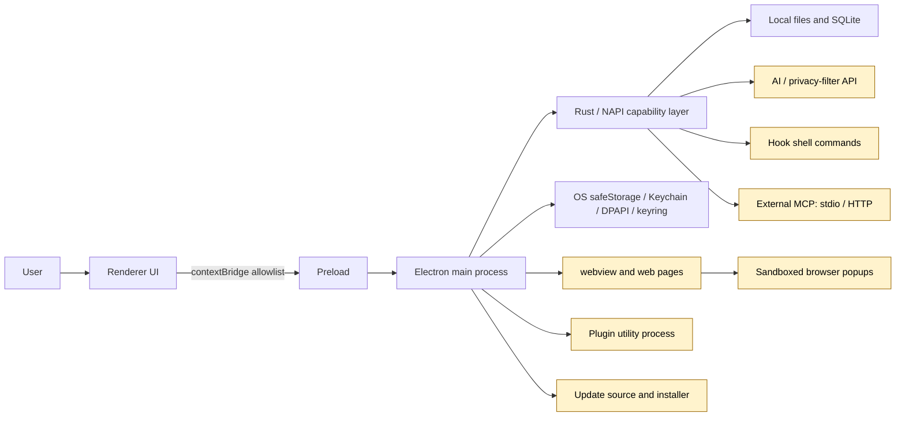

# 5-Security and Trust Boundaries

This reference describes Snow App's security architecture, trust domains, control points, and residual risks. Use it to answer questions such as “where is data decrypted?”, “who can trigger a side effect?”, and “which isolation mechanism does not imply trust?”. It does not replace an organization's own threat model, endpoint protection, backups, or access controls.

## 1. Threat model and non-goals

Snow handles high-value assets including:

- API keys, passwords, cookies, localStorage, and OAuth sessions;
- source code, project files, terminal commands, and database/network access;
- AI context, tool arguments/results, Hook output, and logs;
- code or instructions supplied by Plugins, Skills, sub-agents, and external MCP servers;
- application update manifests, packages, caches, and installation scripts.

Principal risks include malicious or compromised pages/extensions/services, prompt injection, mistaken authorization, supply-chain tampering, control of an unlocked local account, and incorrect assumptions about the portability of encrypted backups.

Snow's client controls are not a complete solution for a malicious OS administrator, kernel-level malware, total compromise of an unlocked user session, external-service governance, release-account security, social engineering, or every unknown command variation.

## 2. Trust-domain overview

Every arrow is a boundary requiring identity checks, argument validation, data minimization, and defined failure behavior. Process isolation, encryption, and authorization each solve only part of the problem; none automatically establishes trustworthy provenance or business correctness.

## 3. Electron window boundary

| Component | Configuration/behavior | Security effect | Residual risk |
| --- | --- | --- | --- |
| Main window | `contextIsolation: true`, `nodeIntegration: false`, `sandbox: false`, `webviewTag: true` | Renderer cannot invoke Node directly; native capabilities go through preload/contextBridge | Main window is not sandboxed; bridge APIs, XSS, and webview orchestration still require least privilege |
| Main-window external link | `window.open` is denied and delegated to `shell.openExternal` | Avoids inheriting Snow capabilities in an ordinary child window | System browser and target site remain external trust parties |
| webview guest | Loads remote pages in a browser session | Separates web content from Snow UI | Page content, prompt injection, cookies, and downloads still carry risk |
| OAuth/web popup | `sandbox: true`, `contextIsolation: true`, `nodeIntegration: false` | Restricts direct Node access from the popup | Shares session/cookies with opener and retains `window.opener`/`postMessage` |

A popup may recursively create another popup under the same policy, and Snow closes all popups with the main window. Always distinguish “browser popups are sandboxed” from “the main window is not sandboxed.”

## 4. Local storage and OS-credential boundary

### 4.1 Password vault

| Layer | Implementation |
| --- | --- |
| Files | `~/.snowapp/browser-passwords/vault.key`, `vault.bin` |
| Master key | Random 32 bytes, wrapped by Electron `safeStorage` |
| OS backend | macOS Keychain, Windows DPAPI, Linux keyring |
| Data encryption | AES-256-GCM with 12-byte IV, 16-byte authentication tag, and ciphertext |
| Writes | Temporary file plus atomic `rename`; best-effort `0600` |
| Failure | Saving is refused when `safeStorage` is unavailable; no plaintext fallback |

List operations omit plaintext passwords. Decryption occurs only for reveal-by-ID or autofill-by-origin. Autofill IPC verifies the sender frame's origin, preventing a page from asking for credentials belonging to another origin.

### 4.2 Login-state archives

`~/.snow/browser-state/` stores cookies and localStorage for the current main-frame origin, encrypted as a whole by `safeStorage`, with pre-restore backups under `backups/`. A magic header, version, schema, filename allowlist, and exact-origin localStorage injection reduce format-confusion and cross-origin restoration risks.

### 4.3 Boundary

OS secure storage is bound to the current OS user environment, not a universally portable key wrapper. Copying `vault.bin`, `vault.key`, or a state archive to another machine/user will usually not decrypt. If the unlocked account is compromised, an attacker may still invoke application decryption paths; disk encryption, session locking, and endpoint protection remain necessary.

See [Data Storage Locations](4-data-storage-locations.md) and [Browser Settings, Passwords, and Data Import](../2-guides/17-browser-settings-passwords-and-import.md).

## 5. AI, tool, and authorization boundary

| Control | Scope | Protection supplied | Not guaranteed |
| --- | --- | --- | --- |
| Per-call authorization | One tool call | User can approve once or reject | User understands arguments; external implementation is safe |
| Permanent project authorization | Current `directoryId` + tool name | Reduces prompts without crossing project boundaries | Arguments are safe; persistence failure rolls back current approval |
| YOLO | Persistent global setting | Ordinary tools are auto-approved | Bypass of sensitive-command, Hook, Plan/Rust gates |
| Sensitive command | Effective global/project regexes | Matching Bash commands require confirmation and a single-use token | Detection of uncovered, encoded, or indirect dangerous commands |
| Plan Mode | Current conversation | Rust blocks ordinary create/replace writes until approval | A complete sandbox for all tool side effects |
| Sub-agent allowlist | Sub-agent calls | Limits the available tool set | Business safety of an allowed tool |

A sensitive-command token is bound to the exact command, lasts roughly 60 seconds, and is consumed once. Invalid regexes are skipped. Interactive commands rely on interactive-terminal confirmation. YOLO auto-approves only non-sensitive entries.

Plan Mode passes `planMode` / `planApproved` into the Rust executor. Before approval, plan documents under `.snow/plan` or `.trellis/tasks` are allowed, while ordinary `filesystem-create` / `filesystem-replace_edit` calls are blocked. A sub-agent cannot grant the main conversation's Plan approval. Other authorization and review remain necessary after approval.

## 6. Privacy-filter boundary

Privacy filtering is off by default and processes only selected tool results. It is not global DLP for chat, filesystems, pages, and network traffic.

| Mode | Data path | Failure behavior | New trust party |
| --- | --- | --- | --- |
| Local | Rust regex/validation before crossing NAPI | Rules can miss or overmatch; exceptional local-task failure can return original text | No external service |
| API | Text is sent to the configured HTTP API, which must return `masked_text` | Any API error falls back to local rules | API operator, network, and authentication configuration |

Local rules include private keys, JWTs, common API keys, Authorization values, URL tokens, Chinese national IDs, and payment cards. API mode may send both `x-api-key` and Bearer headers. Even with fallback, the original input reaches the API endpoint before filtering, so minimize data first.

## 7. Browser and login-state boundary

Treat remote pages as untrusted. A page can read data visible to its own origin, make network requests, and attempt to manipulate a user or AI. Snow's origin check restricts cross-origin password lookup, but these assets remain high risk:

- cookie import writes directly to `defaultSession` and may sign an account in immediately;
- OAuth popups share cookies/session with their opener;
- localStorage restore matches the origin, but scripts at that origin can subsequently read it;
- cookie listings are masked by default, while explicit `showValues=true` returns plaintext;
- import and state restore are neither continuous synchronization nor a server-side session revocation mechanism.

Local-browser import reads source profiles. Chromium uses DPAPI + AES-256-GCM on Windows and Keychain/PBKDF2/AES-128-CBC on macOS; the current Linux implementation cannot obtain Chromium keys from GNOME Keyring/KWallet. Firefox uses an NSS-related 3DES flow and requires special handling for a Primary Password. Locks, WAL state, version changes, and cookie constraints can cause partial failures.

## 8. Plugin, Hook, Skill, MCP, and sub-agent boundary

| Extension surface | Execution/source | Key risk | Recommendation |
| --- | --- | --- | --- |
| Declarative Plugin | Marketplace declaration; no install script | Malicious configuration, provenance, and update risk | Install only trusted publishers |
| External Plugin | Isolated utility process with pre-launch warning | Isolation does not imply trust; granted permissions can be abused | Review code, permissions, and updates |
| Hook | Shell command, context, or prompt | Local code execution, context injection, and flow changes | Pin dependencies, use least privilege, retain output |
| Skill | Agent workflow/knowledge instructions | Can encourage broader tool calls or data access | Read source and content before enabling |
| External MCP | Local stdio process or HTTP service | Arbitrary external side effects, retention, misleading tool declarations | Restrict tools, endpoints, and credentials; audit separately |
| Sub-agent | Independent agent loop plus tool allowlist | Context mistakes and side effects from allowed tools | Provide minimum context and clear file ownership |

Hook exit code 0 passes, 1 warns or requests an optional decision, and 2+ blocks at a blockable lifecycle point. Fire-and-forget points such as `onStop` and `onSessionStart` cannot truly block; a pending decision becomes a warning. Tool authorization controls the Snow entry point, not the internal safety of a Plugin, Hook, or MCP server.

See [Configure Hooks and Sub-agents](../2-guides/5-configure-hooks-and-subagents.md) and [Configure MCP Servers](../2-guides/1-configure-mcp.md).

## 9. Update supply-chain boundary

### Windows/Linux

These platforms use `electron-updater` with automatic download and ordinary-quit installation disabled. The user triggers download and `quitAndInstall()`. Signing, repository permissions, and release-asset policy belong to distribution configuration and cannot be guaranteed from the client event flow alone.

### macOS

macOS uses an unsigned full-ZIP self-replacement flow. The default GitHub release manifest supplies a version, architecture URL, SHA256, and optional size. Snow checks `content-length`, size, and a Rust-calculated SHA256, and reuses cache entries only after hash verification. The installation script waits for the old process, removes the old `.app`, extracts, runs `xattr -cr`, and launches the replacement.

This model primarily trusts HTTPS, the manifest source, the release account, and SHA256. If the manifest can be replaced along with the package, SHA256 does not provide authenticity. `updater.log`, the cache, and the script provide troubleshooting evidence, but an unsigned update remains weaker than a code-signing/notarization chain.

See [App Updates](../2-guides/18-app-updates.md) for the complete flow.

## 10. User responsibilities and residual risk

1. Manually review tool arguments, paths, commands, and external endpoints.
2. Keep YOLO, permanent project approvals, and extension permissions minimal.
3. Give trusted AI/API/MCP/Plugin/Hook parties only the data required for the task.
4. Use OS screen locking, disk encryption, malware protection, and independent backups.
5. Review login sessions after cookie import and revoke them server-side after device loss.
6. Protect release accounts, manifests, and organizational proxy infrastructure.
7. Do not treat privacy filtering, sandboxing, utility processes, or AES-GCM as end-to-end proof of safety.

## 11. Security incident response

When unexpected tool execution, credential exposure, a suspicious extension, or update tampering is detected:

1. stop the affected conversation, disable YOLO, and disable suspicious Hooks/Plugins/MCP servers;
2. disconnect or isolate the device while preserving necessary logs and a timeline;
3. revoke cookies/OAuth sessions server-side and rotate API keys, passwords, and tokens;
4. review project approvals, sensitive-command rules, Hook output, and tool-call records;
5. for updater incidents, preserve the manifest, ZIP hash, cache, script, and `updater.log`;
6. recover from a trusted backup or distribution source without overwriting evidence with unverified files;
7. analyze the root cause and tighten least privilege, monitoring, and publishing controls.

For day-to-day setup procedures, see [Security, Privacy, and Tool Authorization](../2-guides/16-security-privacy-and-tool-authorization.md).
