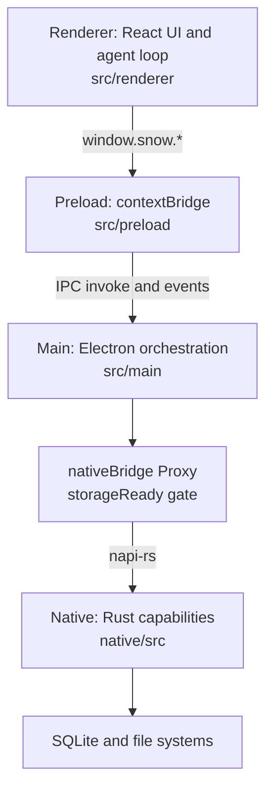
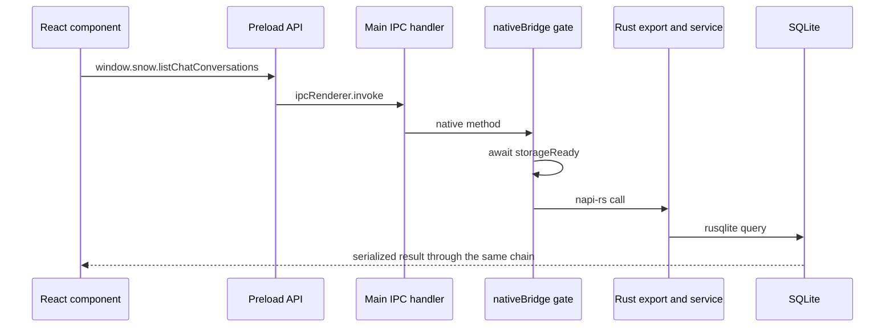
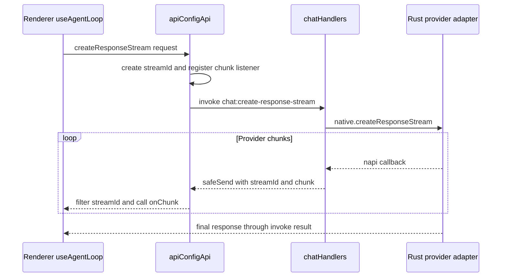
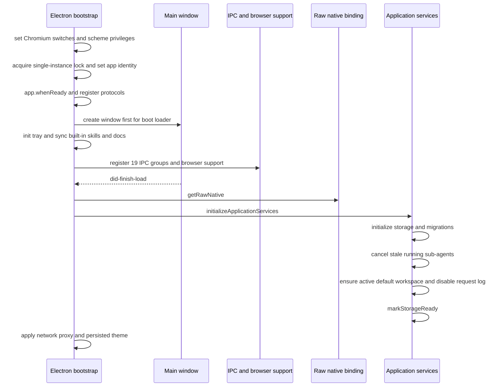
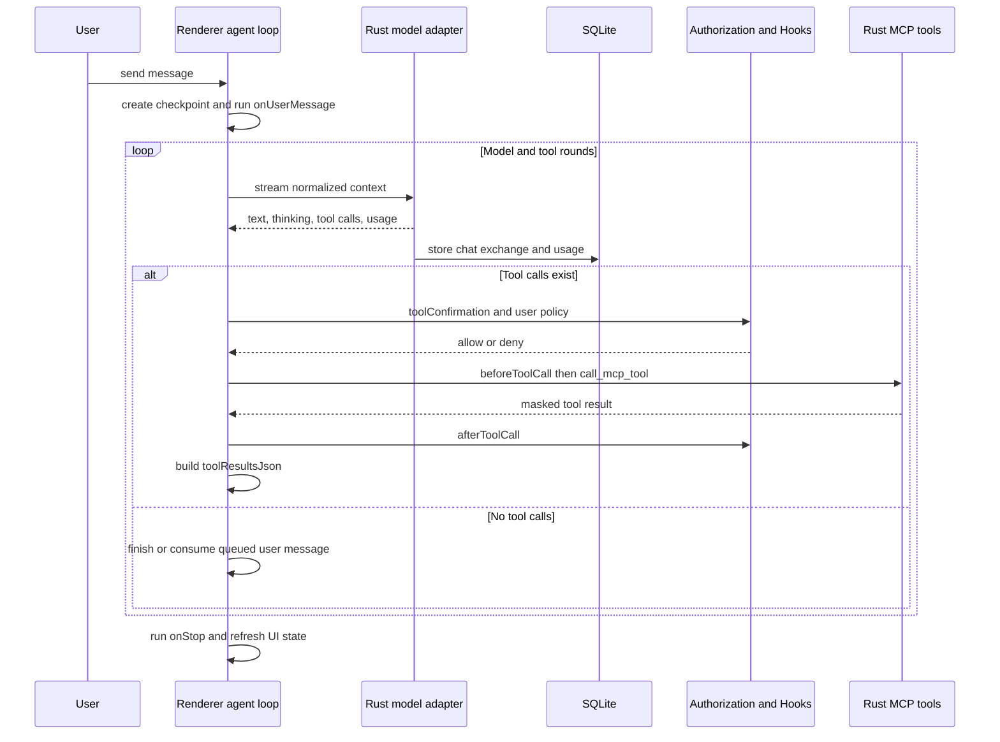

# Architecture Overview

> For developers: Snow App's layer responsibilities, communication boundaries, startup order, and primary AI run path.
> Continue with [Agent Runtime and Tool Orchestration](4-agent-runtime-and-tool-orchestration.md), [Storage, Migration, Backup, and Recovery](5-storage-migration-backup-and-recovery.md), and [Feature Module Architecture and Data-Flow Diagrams](6-feature-module-architecture-and-data-flow-diagrams.md).

## 1. Technology Stack

| Layer    | Technology                             | Primary responsibilities                                                  |
| -------- | -------------------------------------- | ------------------------------------------------------------------------- |
| Renderer | React 19, TypeScript, Vite             | UI, conversation state, main agent loop, authorization UX                 |
| Preload  | Electron contextBridge                 | Flattens 16 API objects into controlled `window.snow.*` methods           |
| Main     | Electron 37, TypeScript                | Lifecycle, IPC orchestration, windows, PTY/SSH, browser, plugins, updates |
| Native   | Rust, napi-rs, Tokio                   | Provider adapters, MCP, SQLite, checkpoints, codebase indexing            |
| Storage  | SQLite, file system                    | `~/.snowapp/snowapp.db`, resource files, and multiple config domains      |
| Build    | electron-vite, Cargo, electron-builder | Three-entry bundling and platform-native `.node` artifacts                |

## 2. Layered Architecture

- The renderer has no Node access; system capabilities must use preload's allowlisted APIs.
- Main owns Electron resources and cross-layer orchestration, not SQLite connections.
- Rust owns provider streams, MCP execution, persistence, and file checkpoints.
- The main agent state machine lives in renderer `useAgentLoop.ts`; `native/src/exports/engine.rs` is one capability export, not the sole complete loop.

## 3. Communication Chains

### 3.1 Ordinary request: renderer to storage

`src/preload/index.ts` currently combines **17 flat API objects**: `apiConfigApi`, `configApi`, `conversationApi`, `workspaceApi`, `sshApi`, `gitApi`, `systemApi`, `ptyApi`, `windowApi`, `memoApi`, `memoryApi`, `personalizationApi`, `codexApi`, `importConfigApi`, `pluginsApi`, `imageLibraryApi`, and `ideApi`. Methods live directly under `window.snow`; types are in `src/preload/types/`.

### 3.2 The storageReady gate

`loadNativeBridge()` loads `native/index.cjs` and retains the raw binding. The Proxy returned for normal calls waits for `storageReady`. Bootstrap initialization must use `getRawNative()`; otherwise initialization would wait for itself and deadlock.

### 3.3 AI streaming events

`src/main/app/sessionProxy.ts` only configures Electron `session` network proxies so `net.fetch`, webviews, and updater traffic follow proxy settings. It does not relay AI tokens or tool events.

## 4. Agent Runtime and Rust Capability Split

Renderer `runAgentLoop` maintains per-conversation `runId`, `streamId`, abort/pause state, and queued messages. Each round requests the model, parses `toolCallsJson`, runs authorization and Hooks, invokes tools, and passes `toolResultsJson` into the next round. It stops when no tool call remains; multiple conversations can continue independently in the background.

Rust `api/conversation/stream.rs` dispatches by `request_method` to four protocols: OpenAI Chat Completions, OpenAI Responses, Anthropic Messages, and Google Gemini. Each adapter builds payloads, converts normalized history, parses streaming events, accumulates text/thinking/tool calls/usage, and persists the round. Cross-provider tool-history conversion is centralized in `api/conversation/tool_messages.rs`.

## 5. Main and Native Modules

### 5.1 Main

`src/main/ipc/registerIpcHandlers.ts` is the authoritative IPC registration list and currently registers **20 groups**: PTY, native, API config, chat, config, conversation, workspace, IDE, SSH, Git, window, notification, memo, memory, personalization, Codex, import config, image, image library, and browser password. `browserNetworkRecorder`, `browserStorageState`, and `browserTrace` are support modules, not registration groups.

| Area                      | Responsibility                                                   |
| ------------------------- | ---------------------------------------------------------------- |
| `app/`                    | Bootstrap, windows, protocols, tray, network proxy, storageReady |
| `ipc/handlers/`           | Validation and business orchestration                            |
| `native/`                 | Binding load, types, and storage gate                            |
| `pty/`, `ssh/`            | Local terminals and remote workspaces                            |
| `browser/`                | Webview popups and browser support                               |
| `plugins/`                | Isolated utility-process plugin runtime                          |
| `importConfig/`, `codex/` | Third-party discovery, selective import, reversible commit       |
| `updater/`                | Platform update flows                                            |

### 5.2 Native

`native/src/exports/` currently has 13 `.rs` files: `api.rs`, `checkpoint.rs`, `codebase.rs`, `engine.rs`, `git.rs`, `ide.rs`, `images.rs`, `mod.rs`, `sample.rs`, `sphere_layout.rs`, `storage.rs`, `terminal.rs`, and `updater.rs`.

The direct batch in `native/src/storage/database.rs::create_schema` creates 21 tables, followed by `image_library::ensure_image_library_table`; the current core business schema is therefore **22 tables including `image_library`**. Codebase indexing also creates auxiliary or per-project dynamic tables. `storage/services/` currently contains **36 service implementation modules plus `mod.rs`**.

The **15 fixed-order built-in MCP services** are filesystem, bash, todo, grep, websearch, browser, user_interaction, sub_agents, codebase, codelens, app_control, config, terminal, imagegen, and memory. Their order stabilizes the model tool array and prompt cache. The Skills tool is injected dynamically by `SkillsService`; `remote_workspace.rs` supports SSH and is not one of the 15 services.

## 6. Startup Flow

The window is created first; heavy native loading and storage initialization wait until the first page load. Normal native calls queue at the gate, while initialization itself bypasses it.

## 7. One AI Conversation

Checkpoints are supplemented around tool calls. Plan Mode, sub-agent allowed-tools, and sensitive bash authorization also have Rust-side enforcement. Parallel image generation and parallel sub-agents use dedicated orchestration and must not be modeled as universally serial tool execution.

## 8. Key Design Decisions and Source Anchors

| Decision                    | Rationale                                                                               | Authoritative anchor                                                           |
| --------------------------- | --------------------------------------------------------------------------------------- | ------------------------------------------------------------------------------ |
| Agent loop in renderer      | Conversation UI, authorization, pause, and background state share one runtime           | `src/renderer/components/mainContent/chatMessages/hooks/useAgentLoop.ts`       |
| No Node in renderer         | Reduces attack surface to allowlisted capabilities                                      | `src/preload/index.ts`                                                         |
| Window before storage       | Shows the boot loader as early as possible                                              | `src/main/app/bootstrap.ts`                                                    |
| Automatic nativeBridge gate | Avoids duplicated readiness checks in every IPC handler                                 | `src/main/native/nativeBridge.ts`                                              |
| Providers and MCP in Rust   | Unifies streaming, tool security boundaries, and persistence                            | `native/src/api/conversation/stream.rs`, `native/src/mcp/tools.rs`             |
| SQLite WAL                  | Supports concurrent readers and one writer; backups must still preserve WAL consistency | `native/src/storage/database.rs`                                               |
| Stable built-in tool order  | Stabilizes request bodies and prompt caches                                             | `native/src/mcp/builtin.rs`                                                    |
| streamId-isolated AI chunks | Supports concurrent conversations without cross-stream events                           | `src/preload/modules/apiConfigApi.ts`, `src/main/ipc/handlers/chatHandlers.ts` |
