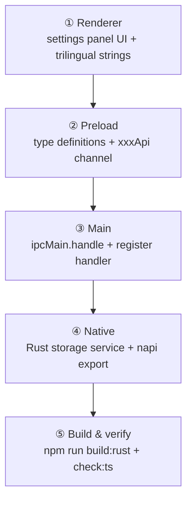

# Developer Guide

> For contributors: environment setup, common commands, directory responsibilities, the full implementation chain for new features, and coding conventions.
> See also: [Architecture Overview](1-architecture-overview.md), [Data Storage Locations](../3-reference/4-data-storage-locations.md).

## 1. Requirements

- **Node.js** >= 18 (20 LTS recommended)
- **Rust** stable toolchain + Cargo
- Platform requirements:
  - Windows: Visual Studio Build Tools (C++ workload) + ConPTY (auto-ensured)
  - macOS: Xcode Command Line Tools
  - Linux: `build-essential`, `pkg-config`, system SQLite (or bundled)

## 2. Common Commands

```bash
npm install                 # Install deps (postinstall patches spectre / ensures conpty.dll)

npm run dev                 # Dev mode (electron-vite dev, renderer hot reload)
npm run build:rust          # Compile Rust native module → snow_native.<platform>.node
npm run check:ts            # tsc --noEmit (must pass before committing)
npm run build               # build:rust + tsc --noEmit + electron-vite build
npm run build:app           # Full package (electron-builder)
npm run build:win           # Windows installers (nsis + portable)
```

> ⚠️ After changing `native/src/`, you MUST re-run `npm run build:rust` and
> **restart the app** (`.node` modules cannot be hot-swapped). Changes under
> `src/` are picked up by hot reload.

## 3. Packaging & Installation

> For contributors: building the source into distributable installers and installing
> them locally. If an installed build won't start, see
> [Packaging & Installation Troubleshooting](3-packaging-troubleshooting.md).

### 3.1 Quick verification without packaging

- `src/` changes (renderer / main / preload): `npm run dev` hot reload is enough;
- `native/src/` (Rust) changes: run `npm run build:rust` first, then **restart the app**
  (`.node` modules cannot be hot-swapped, see the note in Section 2).

### 3.2 Packaging

```bash
npm run build:win      # Windows: NSIS installer + portable (preferred for distribution)
npm run build:app      # Full package for the current platform (electron-builder default target)
npm run build:mac      # macOS: dmg + zip
npm run build:linux    # Linux: AppImage + deb
```

Artifacts go to `release/`:

| Artifact | Description |
| --- | --- |
| `Snow App Setup <version>.exe` | NSIS installer (recommended for distribution and installation) |
| `Snow App <version>.exe` | Portable build (no install; double-click to run) |
| `win-unpacked/` | Unpacked directory; run `Snow App.exe` directly (debugging) |

Time estimate: the native release build takes ~2-4 min; a full first-time package
(including electron-builder downloading electron / nsis dependencies) usually takes
5-10 min. `.npmrc` is configured with the npmmirror registry to speed up downloads.

### 3.3 Install / Update / Uninstall

- **Install**: run `Snow App Setup <version>.exe`; the default install location is
  `%LOCALAPPDATA%\Programs\snow-app`, with Start Menu and desktop shortcuts created;
- **Portable**: double-click `Snow App <version>.exe`; data still goes to
  `~/.snow` (config) and `~/.snowapp` (database / images);
- **Update**: run the new installer over the existing installation; `~/.snow` and
  `~/.snowapp` data are preserved;
- **Uninstall**: Settings → Apps → Snow App → Uninstall (or run
  `Uninstall Snow App.exe` in the install directory).

### 3.4 Verifying the installed build contains your changes

An installed build uses the code and native artifacts from **packaging time**:

1. **Version**: `release\win-unpacked\Snow App.exe --version` prints the version;
2. **Native artifact**: confirm `npm run build:rust` ran before packaging
   (check the `native/snow_native.win32-x64-msvc.node` timestamp);
3. **New UI**: Settings → LSP settings → Project tab shows the "Detect stack" button
   (`src/renderer/components/sidebar/LspSettingsPanel.tsx`);
4. **New capability**: running `lsp-diagnostics` on a `.tsx` file returns real
   diagnostics from typescript-language-server (npm-installed shim servers start
   correctly on Windows, see
   [LSP External Language Server Design](7-lsp-external-language-server-design.md)).

### 3.5 Common issues

| Issue | Resolution |
| --- | --- |
| Installed build won't open (dev works) | `out/` was concurrently written during packaging, corrupting the asar: stop all dev processes → delete `out/` → re-package (see [Troubleshooting](3-packaging-troubleshooting.md)) |
| Changed `native/src/` but the installed build behaves the same | Make sure `build:rust` ran and `out/` was clean before re-packaging |
| electron-builder downloads are slow / fail | The npmmirror registry is configured; retry or set the `ELECTRON_MIRROR` env var |

## 4. Directory Responsibilities

```
snow-app/
├── src/
│   ├── main/               # Electron main process (orchestration)
│   │   ├── app/            # bootstrap, windows, session proxy, tray, protocols
│   │   ├── ipc/handlers/   # IPC handlers (business orchestration)
│   │   ├── native/         # Rust bridge (nativeBridge.ts gate)
│   │   ├── pty/            # PTY terminal
│   │   ├── ssh/            # SSH / remote workspaces
│   │   ├── plugins/        # Plugin runtime (isolated workers)
│   │   ├── settings/       # Settings read/write
│   │   ├── snowCli/        # ~/.snow CLI compatibility
│   │   ├── updater/        # App updates
│   │   ├── codex/          # Codex compatibility layer
│   │   └── importConfig/   # Third-party config import
│   ├── preload/
│   │   ├── index.ts        # contextBridge.exposeInMainWorld("snow", api)
│   │   ├── modules/        # One *Api.ts per domain (ipcRenderer.invoke)
│   │   └── types/          # Cross-layer shared types
│   └── renderer/
│       ├── components/     # Sidebar / main content / right panel
│       ├── hooks/          # Custom hooks (useAgentLoop etc.)
│       ├── i18n/lang/      # zh-CN.ts / en.ts / zh-TW.ts (must stay in sync)
│       └── utils/          # Frontend utilities
├── native/                 # Rust native layer (capability layer)
│   └── src/
│       ├── exports/        # napi export entries (*.rs per domain)
│       ├── api/            # AI provider adapters (anthropic/gemini/responses/chat)
│       ├── mcp/            # MCP servers (servers/) + external client (external/)
│       ├── prompt/         # System prompts
│       └── storage/        # SQLite (database.rs / migrations.rs / services/)
├── scripts/                # Build & utility scripts (build-native.cjs etc.)
├── resources/              # Icons & static assets
└── docs/                   # Docs (guides + reference + architecture & development)
```

## 5. Full Chain for Adding a Feature

Using "add a settings item" as an example — the cross-layer change pattern:

```
① Renderer (UI)
   src/renderer/components/sidebar/xxxSettingsPanel.tsx    # form UI
   src/renderer/i18n/lang/{zh-CN,en,zh-TW}.ts               # three-language copy

② Preload (types + channel)
   src/preload/types/xxx.ts                                 # type definitions
   src/preload/modules/xxxApi.ts                            # ipcRenderer.invoke("xxx:get")
   src/preload/index.ts                                     # register on window.snow
   src/preload/types/index.ts                               # export types

③ Main (IPC handler)
   src/main/ipc/handlers/xxxHandlers.ts                     # ipcMain.handle("xxx:get", ...)
   src/main/ipc/registerIpcHandlers.ts                      # register handler

④ Native (Rust capability)
   native/src/storage/services/xxx.rs                       # SQL access layer
   native/src/exports/storage.rs                            # napi export
   (or native/src/api/, native/src/mcp/servers/ per domain)

⑤ Build & verify
   npm run build:rust   # required after Rust changes
   npm run check:ts     # no `any`, must pass
```



**Read-only query chain**: Renderer → `window.snow.xxxMethod` →
`ipcRenderer.invoke` → `ipcMain.handle` → `native.xxx` (storageReady gate
auto-waits) → rusqlite. `src/preload/index.ts` spreads each `*Api` object, so
the runtime API is flat.

## 6. Coding Conventions

### Mandatory

- **No `any` types**: `tsc --noEmit` must pass (CI red line for this project).
- **Three-language sync**: any UI copy change updates `zh-CN.ts` / `en.ts` /
  `zh-TW.ts` together.
- **Rust code**: keep `cargo fmt` style; new SQL goes through the existing
  `storage/services/` pattern.
- **Database changes**: new table → `database.rs::create_schema`; new column →
  post-schema migration in `migrations.rs` (must be idempotent) + bump `user_version`.

### Design Constraints

- The renderer must **never** require Node modules directly (always via `window.snow.*`).
- Main-process native calls must **not** bypass `nativeBridge` (except during
  initialization — see `bootstrap.ts` comments: raw binding avoids the
  storageReady deadlock).
- **The main process runs as ESM**: `__dirname` / `__filename` are forbidden;
  always use `import.meta.dirname` / `import.meta.filename` (already migrated
  in `src/main/app/`, `nativeBridge.ts`, and others).
- New MCP tools should follow the parameter-description style of existing
  servers in `native/src/mcp/servers/` (schemas are exposed to AI models —
  describe constraints and defaults precisely).
- File edits follow workspace conventions: prefer apply_patch/filesystem
  tools; shell commands use PowerShell syntax (Windows default environment).
- **Settings-panel styles are shared, not reinvented**: every sidebar settings
  panel reuses the `api-settings-*` classes (`api-settings-page` →
  `page-header` → `summary-grid` → actions row → `table-panel`); do not build
  a parallel layout. Override column ratios with a page-level class that only
  changes `grid-template-columns`. All styles live in
  `src/renderer/styles.css` — `grep -n "<class>"` the whole file before adding
  or removing a class (classes from retired layouts are still reused by newer
  panels; duplicate definitions make one copy silently win). Full conventions
  and the CSS-specificity trap: `.trellis/spec/frontend/component-guidelines.md`.

## 7. Common Pitfalls

| Issue                                                                                      | Notes                                                                                                                                                                                                                                                                             |
| ------------------------------------------------------------------------------------------ | --------------------------------------------------------------------------------------------------------------------------------------------------------------------------------------------------------------------------------------------------------------------------------- |
| Native changes don't take effect                                                           | Forgot `npm run build:rust` or didn't restart (`.node` can't hot-swap)                                                                                                                                                                                                            |
| storageReady deadlock                                                                      | Calling native before init without the Proxy — only bootstrap may use the raw binding                                                                                                                                                                                             |
| tsc can't find a module                                                                    | Run `npm install` after adding deps; commit lockfile changes with the PR                                                                                                                                                                                                          |
| Missing translation                                                                        | The three i18n files must stay structurally identical; missing keys show `undefined` at runtime                                                                                                                                                                                   |
| CRLF warnings                                                                              | Git CRLF→LF notices on Windows are normal (repo is LF-normalized)                                                                                                                                                                                                                 |
| DB migration failure                                                                       | Migrations must be idempotent; verify on a backup DB before committing                                                                                                                                                                                                            |
| Standalone script calling `callMcpTool` fails with `Create threadsafe function ... failed` | Positions 7–12 of `callMcpTool` (onChunk, onBrowserCommand, onUserQuestion, onAppControl, onRemoteWorkspaceCommand, onTerminalCommand) are all **required** `ThreadsafeFunction`s; passing `undefined` fails with `InvalidArg` — see the detailed section below                   |
| CSS rules silently don't apply                                                             | A custom class inside a shared container is overridden: `.api-settings-summary-card span/small` (specificity 0,1,1) beats a bare class selector (0,1,0) — always qualify child selectors with the container class (e.g. `.imagegen-concurrency-card .imagegen-concurrency-head`)  |
| The same class is defined twice in styles.css                                              | Classes from retired layouts (e.g. `imagegen-*` at ~line 12180) are still reused by newer panels; `grep -n` the whole file before writing a new rule, add only delta rules                                                                                                        |
| File corrupted after a large search-replace                                                | Replacing very long JSX/CSS blocks can leave stale tails (`})}`, stray `}`); read the region back and verify pairs immediately, then run `tsc --noEmit` + `electron-vite build`                                                                                                   |
| imagegen reference images show only placeholders                                           | `images:resolve-upload-image` used `join(uploadRoot, normalized)` while `normalized` already carries the `upload/` prefix → double `uploadRoot\\upload\\...` prefix made every read fail; join against `dirname(databasePath)` instead (fixed with a comment in `imageHandlers.ts`) |
| Broken images for `image/`/`upload/` paths in Markdown                                       | The markdown worker's image rule used to proxy only http(s) images, so local relative paths were loaded as relative URLs and broke. Local paths (`image/`, `upload/` — decodes first, normalizes separators, rejects `..` and absolute paths, `normalizeLocalImagePath` in `markdownWorker.ts`) are now rewritten to `img-proxy://` URLs (`localImageProxyUrl`) just like external images, and the main-process protocol handler (`serveLocalImage` in `imageProxyProtocol.ts`) resolves the library/upload root and reads the file directly — no IPC or data-URL round-trip in the renderer |
| Debugging renderer image/file chains                                                       | Use plain `node` with `require("../native/index.cjs")`, call `initializeAppStorage()` to get `databasePath`, replicate the main-process path logic + `readFile` — no Electron needed to locate the fault                                                                          |

### callMcpTool callbacks (standalone scripts / e2e verification)

`native.callMcpTool(toolFullName, argsJson, ...)` is the MCP tool entry point
exposed by the native binding. Its signature has 15 parameters, and the
**6 callback parameters are all required** `ThreadsafeFunction`s (the Rust
types are not `Option`) — the JS side **must pass a function for each of
them**. Passing `undefined`/`null` throws synchronously during argument
conversion:

```
Error: Create threadsafe function in ThreadsafeFunction::create failed
code: 'InvalidArg'
```

| Position | Parameter                                                                   | Type           | Notes                                                                          |
| -------- | --------------------------------------------------------------------------- | -------------- | ------------------------------------------------------------------------------ |
| 1        | `toolFullName`                                                              | string         | Full tool name, e.g. `config-list`                                             |
| 2        | `argsJson`                                                                  | string         | JSON string of the arguments                                                   |
| 3–6      | projectId / checkpointIds / checkpointWorkDir / sensitiveAuthorizationToken | optional       | `undefined` is fine                                                            |
| 7        | `onChunk`                                                                   | function       | Streaming chunk callback (`BashStreamChunk`)                                   |
| 8        | `onBrowserCommand`                                                          | async function | Browser command forwarding                                                     |
| 9        | `onUserQuestion`                                                            | async function | User-question interaction                                                      |
| 10       | `onAppControl`                                                              | async function | App-control commands                                                           |
| 11       | `onRemoteWorkspaceCommand`                                                  | async function | Remote (SSH) command forwarding                                                |
| 12       | `onTerminalCommand`                                                         | async function | **Terminal PTY command forwarding (newest callback, most commonly forgotten)** |
| 13–15    | subAgentAllowedTools / planMode / planApproved                              | optional       | `undefined` is fine                                                            |

Placeholder pattern for standalone Node scripts (see `scripts/e2e-verify-config.cjs`):

```js
const noop = () => undefined;
const asyncNoop = async () => "";
const result = await native.callMcpTool(
  "config-list",
  JSON.stringify({ scope: "imagegen" }),
  undefined,
  undefined,
  undefined,
  undefined, // projectId / checkpointIds / checkpointWorkDir / sensitiveAuthorizationToken
  noop, // onChunk
  asyncNoop, // onBrowserCommand
  asyncNoop, // onUserQuestion
  asyncNoop, // onAppControl
  asyncNoop, // onRemoteWorkspaceCommand
  asyncNoop, // onTerminalCommand ← required, 6 callbacks in total
  undefined,
  undefined,
  undefined // subAgentAllowedTools / planMode / planApproved
);
// Resolves to a Promise<string> — the tool result as a JSON string
```

> If any callback is `undefined`, napi-rs tries to create a
> `ThreadsafeFunction` from it and returns `InvalidArg` — this is an
> argument-validation error, not a tool-logic error. The app renderer
> (`nativeBridge`) always passes 6 real callbacks, so it is unaffected; only
> hand-written standalone scripts need to be careful.

## 8. Commit Conventions

Commit messages follow [Conventional Commits](https://www.conventionalcommits.org/),
keeping the same style as the repository history: `type(scope): summary - extra detail`.

### 8.1 Message Format

A commit message consists of a **header** and an optional **body**:

```text
<type>(<scope>): <summary>

<body>
```

- **Header**: one line, at most 72 characters; `type` and `scope` are lowercase,
  and the `summary` is concise, imperative English. Keep technical terms such as
  `N+1`, `IPC`, and `localStorage` unchanged.
- **Body**: multiple lines explaining *why* the change was made and its impact;
  use `-` bullets when needed. Write a body only for complex changes or breaking
  behavior — simple changes need just the header.

### 8.2 Types

| type | Purpose | Example |
| --- | --- | --- |
| `feat` | New feature | `feat(chat): persist drafts per conversation - preserve input when switching` |
| `fix` | Bug fix | `fix(imagegen): validate model capabilities - disable references for text-only models` |
| `refactor` | Refactor, behavior unchanged | `refactor(sidebar): use batch deletion API - remove N+1 calls` |
| `docs` | Documentation only | `docs: document commit message conventions` |
| `chore` | Build/deps/misc | `chore: exclude e2e verification scratch files` |
| `perf` | Performance improvement | `perf(chat): batch sub-agent queries - avoid N+1 calls` |
| `test` | Tests | `test(storage): cover cascading deletion in batch operations` |
| `style` | Styling/formatting (no logic change) | `style: normalize import ordering` |

### 8.3 Scope (optional)

`scope` names the affected module, lowercase and short, e.g. `chat`, `sidebar`,
`imagegen`, `storage`, `ipc`, `native`, `docs`. Omit it when the change is not
module-specific.

### 8.4 Summary Style

- Start with a verb describing *what was done*, not *what it is*;
- One commit does one thing — keep the summary aligned with the diff, no mixed changes;
- Append motivation with ` - ` when needed, e.g.
  `feat(chat): persist drafts per conversation - preserve input when switching`.

### 8.5 Body Example

```text
fix(sidebar): keep the conversation context menu open

Root cause: the document-level contextmenu listener decided whether the
target was inside the component by checking only the ellipsis-button
container. A right-click elsewhere on the conversation row was treated as
an outside click, so the menu opened and closed in the same event loop
after React cleared the anchor during batching.

Fix: compare the owning conversation row with closest('.chat-item').
Right-clicking the same row no longer closes the menu, while right-clicking
another area still switches it correctly.
```

### 8.6 Before Committing

- `npm run check:ts` (`tsc --noEmit`) must pass;
- Never commit: `out/`, `release/`, `node_modules/`, `.tmp-*.cjs`, user data dirs;
- Syncing upstream: `git fetch upstream && git merge upstream/main`, resolve conflicts locally;
- One commit contains only logically related changes; do not mix unfinished feature files into the same commit.

## Appendix: Vision Textification & Image-to-Image Reference Mechanism

When the main model does not support vision ("Supports vision" off plus a
separately configured vision model), `textify_images_in_messages` in
`native/src/api/vision.rs` replaces `@@image:...@@` tags with text descriptions
from the vision model (cached per-image by hash to avoid repeated vision calls
across turns). **User messages** additionally get image-to-image guidance
injected during textification:

```text
[The user attached N reference image(s). When the user asks to generate or edit
an image based on them, call the imagegen-generate tool and pass the
corresponding JSON object(s) below in its "images" parameter (image-to-image)
— do NOT generate from the text description alone.]
[Image #1]
[Image description: <text description produced by the vision model>]
[Reference image #1 for imagegen-generate: {"path":"upload/2026-08-05/a1b2c3.png","mimeType":"image/png"}]
```

Design points & conventions:

- **Why `path` instead of base64**: context is scarce for text-only models — a
  ~1MB image expands to ~340k tokens of base64. The reference block carries
  only a relative path (a few dozen bytes); `imagegen-generate` reads the file
  itself via `load_reference_image_from_path` in `mcp/servers/imagegen.rs`.
- **Two path boundaries**: reference blocks produced by vision textification
  always contain a safe relative path with an `upload/` prefix and reject `..`
  traversal, keeping machine-specific absolute paths out of model context.
  The runtime `images[].path` interface of `imagegen-generate` also accepts a
  trusted absolute disk path. The renderer thumbnail IPC
  `images:resolve-upload-image` (`src/main/ipc/handlers/imageHandlers.ts`)
  continues to double-check generated reference paths (prefix match plus a
  second prefix check after normalization).
- **User messages only**: tool results (e.g. browser screenshots) are textified
  without reference blocks to avoid context bloat; `ChatImage.source`
  (`api/conversation/images.rs`) records the on-disk relative path, and
  non-persisted data-URL images fall back to inline
  `{"data":"<base64>","mimeType":"..."}`.
- **Numbering**: reference block numbers match the `[Image #N]` placeholders
  one-to-one; the guidance line is injected once per message with images.
- **History**: reference blocks replay with the context, so later turns can
  still reference previously uploaded images.
- **Limits**: server `MAX_IMAGES = 14` (Gemini 3 Pro Image official cap),
  ≤20MB each; the tool description guides the model to ≤5 per call to stay
  compatible with stricter OpenAI edits limits.
- **Files touched**: `api/conversation/images.rs` (`source` field),
  `api/vision.rs` (reference-block injection),
  `mcp/servers/imagegen.rs` (`path` resolution),
  `src/main/ipc/handlers/imageHandlers.ts` (thumbnail IPC),
  `ImageGenToolCall.tsx` (thumbnail rendering + in-process cache).
