# Agent Runtime and Tool Orchestration

> This document describes the actual runtime boundary from model request through tool-result feedback. The key rule is: **the main agent loop runs in Renderer; provider streaming, MCP execution, and persistence run in Rust.**

## 1. Component View

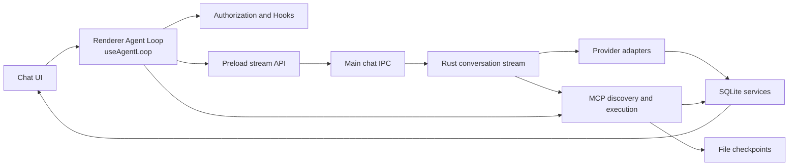

Responsibility boundaries:

- `useAgentLoop.ts` owns the per-conversation loop, stream state, tool rounds, pause/abort, and queued input.
- Preload and `chatHandlers.ts` provide only `streamId`-isolated stream transport.
- Rust provider adapters own request formats, stream parsing, and persistence of each model exchange.
- `mcp/tools.rs` owns discovery, mandatory policy, routing, privacy masking, and checkpoint integration.

## 2. Model Adapter Layer

The unified entry `native/src/api/conversation/stream.rs::create_response_stream` dispatches by `request_method`:

| request_method | Adapter directory | Protocol |
|---|---|---|
| `chat` | `native/src/api/chat/` | OpenAI Chat Completions |
| `responses` | `native/src/api/responses/` | OpenAI Responses |
| `anthropic` | `native/src/api/anthropic/` | Anthropic Messages |
| `gemini` | `native/src/api/gemini/` | Google Gemini |

Adapters share responsibility for provider payloads, normalized-message conversion, SSE or equivalent stream parsing, text/thinking/tool-call/usage accumulation, and `store_chat_exchange`. Tool definitions are generated by `tools_as_openai_chat_json`, `tools_as_openai_responses_json`, `tools_as_anthropic_json`, and `tools_as_gemini_json`; cross-protocol tool-history conversion is centralized in `api/conversation/tool_messages.rs`.

API profile resolution prefers an explicit request profile, then the persisted conversation binding, then the globally active profile. A sub-agent always resolves its configured profile and has main-conversation-only Plan/Goal Mode forcibly disabled.

## 3. Streaming Event Protocol

1. Renderer calls `window.snow.createResponseStream(request, onChunk, onStreamId)`.
2. `apiConfigApi.ts` synchronously creates a `streamId`, registers a `chat:create-response:chunk` listener, then invokes Main.
3. `chatHandlers.ts` validates parameters and calls `native.createResponseStream`.
4. Main receives Rust callbacks and uses `safeSend` to emit `{ streamId, chunk }`.
5. Preload forwards only chunks matching the current `streamId`.
6. `createStreamChunkHandler` updates text, thinking, tool execution IDs, and stream metrics; the invoke Promise returns the final `ResponsesApiResult`.

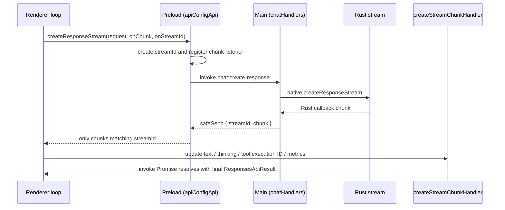

This chain is unrelated to `src/main/app/sessionProxy.ts`, which configures Electron network proxies.

## 4. Renderer Main Loop

Each conversation has independent session state, `runId`, `streamId`, AbortController, pause state, and queued input, so switching conversations does not stop background runs.

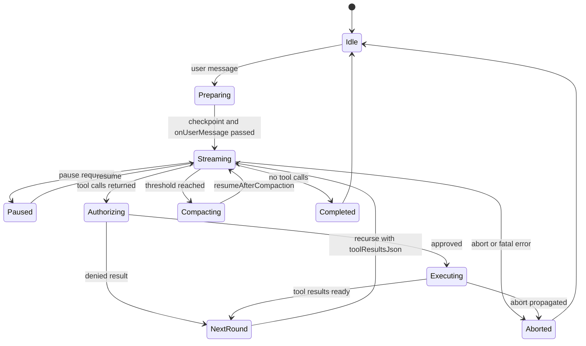

A round streams the model, parses `toolCallsJson`, creates an executor from the authorization result, executes tools, builds structured `toolResultsJson`, and recurses into the next round. It stops when no tool call remains or first consumes queued user input. A local file checkpoint is created before the loop; `onUserMessage` runs before the first round and `onStop` runs during final cleanup.

## 5. Tool Discovery

`collect_all_mcp_tools` filters and merges tools in this order:

1. Resolve global and project scope.
2. Expose codebase tools only when a project exists, codebase is enabled, and vector chunks exist.
3. Expose imagegen only when at least one channel is enabled.
4. Read 14 built-in services in fixed order; Plan approval appears only in Plan Mode requests.
5. Apply global and project server/tool enable states (global disable wins); terminal is disabled by default and requires explicit project enablement.
6. Inject the Skills tool dynamically.
7. Discover external stdio/HTTP MCP tools in parallel; one server failure is logged without failing all discovery.

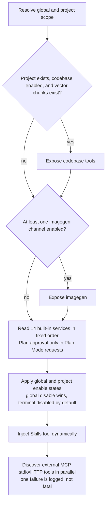

Sub-agents use `collect_allowed_mcp_tools`. Their `tools_json` must be a string array; only built-in sub-agents may use `*`. Missing or globally/project-disabled tools are rejected rather than silently expanding authority. External MCP supports `server/discover` with a legacy initialize fallback.

**Tool-domain system-prompt injection**: beyond tool visibility, system-prompt construction (`native/src/api/conversation/context.rs`) dynamically appends per-domain guidance sections, with **injection conditions kept consistent with tool visibility** — a disabled domain is never injected, so the prompt never steers the model toward invisible tools:

- **`## Language Servers`** (LSP domain, `build_system_prompt_section` in `native/src/mcp/servers/lsp/mod.rs`): injected when the project has usable external language servers (config enabled + command installed + language match) and the domain scope allows it. It lists the servers with their runtime state (running / crashed / not started), groups the preferred `lsp-*` tools by capability, and mandates that semantic queries MUST use `lsp-*` (grep stays for literal patterns only); it also prewarms not-yet-running servers in the background to remove first-call cold starts.
- **`## Image Generation`** (imagegen domain, `build_system_prompt_section` in `native/src/mcp/servers/imagegen/mod.rs`): injected when at least one usable image-generation channel is configured and the domain scope allows it. It lists the usable channels (id / name / protocol, non-sensitive summary) and mandates that multiple images MUST be produced by parallel `imagegen-generate` calls (one call per image; legacy `prompts` / `n>1` are NOT the multi-image path); ≥2 consecutive parallel calls are merged into a single `ImageGenGallery` grid by the UI.
- Both sections are appended at the **end** of the prompt (state changes only affect the tail, minimizing prompt-cache prefix invalidation); any query failure silently degrades to an empty string (never breaks the request); normal / Plan / Goal modes all inject them, and sub-agent prompts carry them too.

## 6. Tool Calls and Checkpoints

`call_mcp_tool` sanitizes polluted names, validates Plan special tools, blocks writes before Plan approval, checks global and project enable state, checks the sub-agent allowlist, resolves local/SSH workspace context, anchors local relative paths to the project root, augments pre-tool checkpoint capture, routes by tool type, privacy-masks output, and updates the post-tool checkpoint.

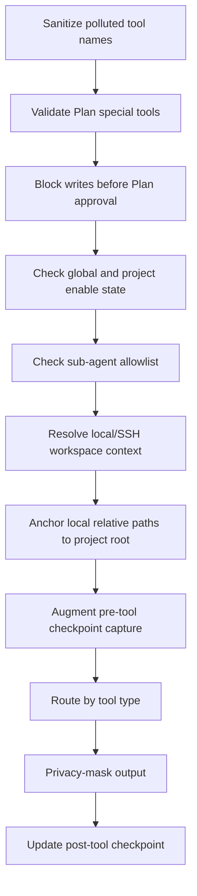

Routes include bash, grep, remote filesystem, browser, user interaction, app control, terminal, imagegen, external MCP, and ordinary built-ins. Cancellable remote execution returns an execution ID through a `tool_execution` chunk. Checkpoint capture lets parent and sub-agent file changes share one preview and restoration boundary.

## 7. Authorization and Mandatory Policy

Renderer `useToolAuthorization.ts` composes these policies:

- YOLO Mode can auto-approve ordinary tools.
- The global `permissions.alwaysApprovedTools` (`~/.snow/permissions.json`) is merged with project-level approvals into the no-confirmation list; choosing “always allow” persists a project approval. The Project tool permissions panel can add/remove project-level approvals and shows the global list read-only.
- Bash checks sensitive-command patterns first; sensitive commands cannot be bypassed by “approve all.”
- Interactive bash relies on the interactive terminal UI and does not show a duplicate sensitive-command dialog.
- The `toolConfirmation` Hook may approve or deny before ordinary user confirmation.
- Pending confirmations suspend on a Promise until the user decides.

Rust is the second boundary: `bash.rs` verifies short-lived one-use authorization tokens for sensitive commands, while `call_mcp_tool` enforces Plan Mode and sub-agent allowed-tools. Frontend convenience policy never replaces backend enforcement.

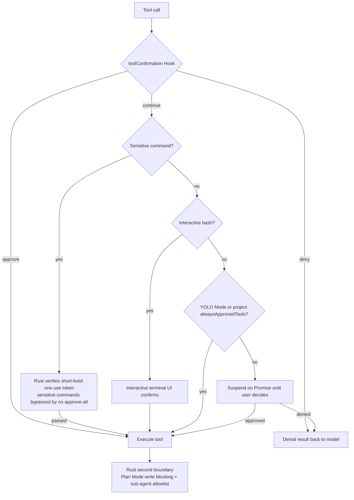

## 8. Hooks

Supported Hook types are `onUserMessage`, `beforeToolCall`, `toolConfirmation`, `afterToolCall`, `onSubAgentComplete`, `beforeSubAgentStart`, `beforeCompress`, `onSessionStart`, and `onStop`.

Command Hook exit code 0 passes and can inject stdout as Hook Context; 1 is a soft warning and specific decision JSON may open a user-decision UI; 2 or greater aborts. Blocking outcomes are normalized by `hookOutcome.ts`; fire-and-forget Hooks such as `onStop` never block final cleanup.

The tool lifecycle is:

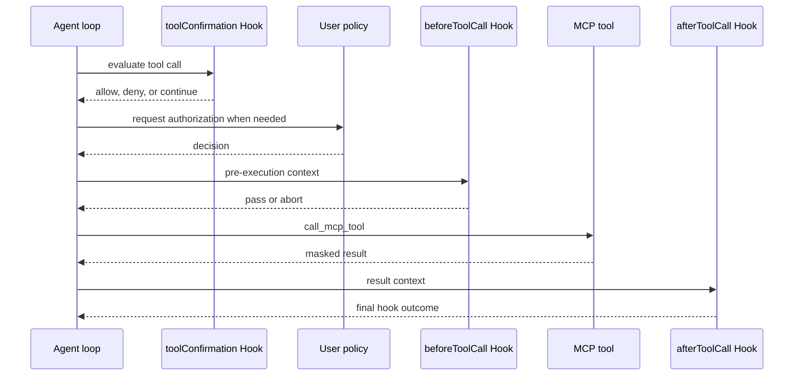

Parallel image generation and parallel sub-agents have batch-specific handling. Their Hook lifecycle remains, but invocation must not be assumed universally serial.

## 9. Sub-agents

After the model calls `sub-agents-activate`, Renderer runs `beforeSubAgentStart`, creates an independent conversation/session, and persists `running`. The sub-agent loads its own system prompt, `tools_json`, and API profile and streams in an independent Renderer loop.

While building the main session's system prompt, Snow queries `sub_agent_configs` and **dynamically injects the available sub-agent list** (with `agentId`, name, and purpose) together with a selection rule — the main agent picks the best-matching `agentId` instead of defaulting to the built-in `agent_general`. The list resolves like activation: **project-scoped sub-agents of the current project (`directory_id`) take priority** and override the global one on the same `agentId`; sub-agents of other projects are not injected.

A sub-agent inherits parent checkpoint IDs so its file changes remain inside the parent's rollback boundary. Rust also enforces allowed-tools and blocks writes while the parent Plan is unapproved. A sub-agent cannot call or grant Plan approval. Completion persists `completed` or `failed`, runs `onSubAgentComplete`, and makes the conversation read-only; later queued input is forwarded to the parent. Parent abort propagates to active sub-agents, and startup cancels stale `running` sessions.

Activation runs in parallel with the main agent (pre-started by the Renderer) and returns a structured JSON tool result when it ends; the main agent never auto-retries — the model decides the next step from the result. Normal completion returns `{success: true, conversationId, agentName, summary}` (`onSubAgentComplete` may append context on pass, append a warning on warn, or replace the summary on abort). An API stream failure returns the failure content as the final output and marks the message as error. An exception returns `{success: false, error}`, persists the session as `failed`, broadcasts the failure event, and forwards messages the user queued inside the sub-conversation to the parent. A user interrupt returns "Sub-agent interrupted by user". An unapproved parent Plan stops the sub-agent immediately and returns control to the main loop. There is no global sub-agent timeout (only per-tool timeouts); stopping the main agent recursively cancels the whole descendant tree via `childSubAgentIds` (aborting streams, rejecting pending authorizations, killing bash child processes), and app startup cleans up stale `running` sessions.

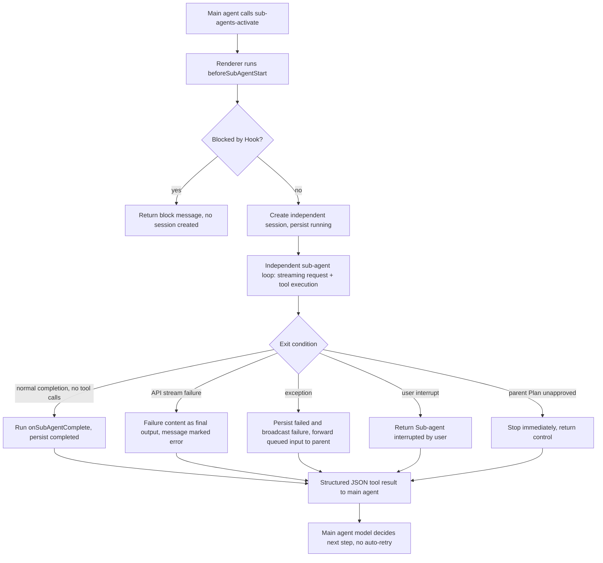

## 10. Context Compaction

Compaction is manual or automatic when total tokens reach `autoCompressThreshold`:

1. A local workspace attempts a temporary checkpoint; SSH skips local file checkpoints.
2. Run `beforeCompress`.
3. Stream a request with `contextCompaction: true` and `checkpointId`; compaction exposes no tools.
4. Rust generates a handoff from the complete valid context and persists a `status = 'context_compaction'` boundary with real usage and checkpoint ID.
5. Renderer reloads database messages; automatic compaction resumes the original loop with `resumeAfterCompaction`.
6. Failure deletes the temporary checkpoint.

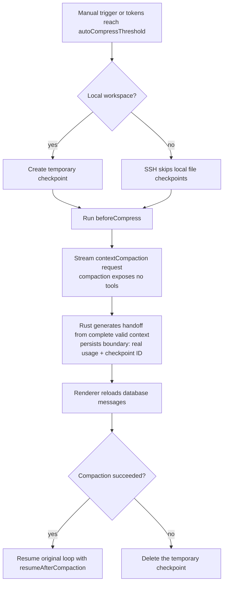

## 11. Rollback

`useRollback.ts` aborts the current stream, cancels summary generation, computes the checkpoint diff and TODOs to remove, and shows a preview. After confirmation it waits for stream and summary Promises to finish, avoiding races with SQLite write transactions. The user may truncate conversation only or also call `restoreCheckpoint` for files.

Rolling back the first message may delete the conversation; other cases call `truncateConversation` and clean obsolete checkpoints. A `context_compaction` boundary must be truncated using that boundary's own `responseId`, not misclassified as a first message.

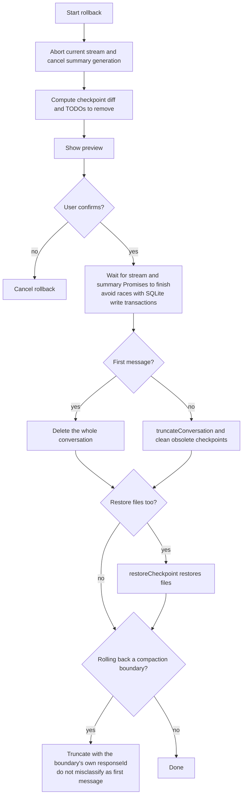

## 12. Persistence

At the end of a model stream, each provider adapter calls `store_chat_exchange` with the user message, assistant content, thinking, `tool_calls_json`, response/checkpoint IDs, token usage, and compaction state. Renderer then executes tools. The next round carries `toolResultsJson` in a tool-role message, which is persisted with the next model exchange. `usage_records` accounts for successful, failed, and compaction requests.

## 13. End-to-End Sequence

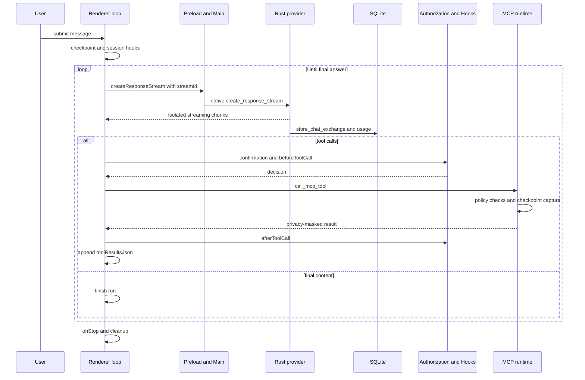

## 14. State Invariants

- Chunks must be filtered by `streamId`; listeners are removed after completion or abort.
- A conversation accepts updates only from its current `runId`; an old Promise must not overwrite a newer run.
- Sub-agent authority cannot exceed explicit allowed-tools and project enablement.
- Before Plan approval, Renderer UX and Rust write blocking must both hold.
- The model exchange is persisted first; tool results enter the next round as structured tool-role history.
- Rollback waits for asynchronous work that may still write to the database.

## 15. Source Anchors

| Topic | Files |
|---|---|
| Main loop and stream state | `src/renderer/components/mainContent/chatMessages/hooks/useAgentLoop.ts`, `agentLoopHelpers.ts` |
| Tool execution and authorization | `toolExecution.ts`, `useToolAuthorization.ts` |
| Hooks | `hooks/hookOutcome.ts`, `useToolAuthorization.ts`, `native/src/hooks/` |
| Sub-agents | `hooks/subAgentActivation.ts`, `native/src/api/conversation/sub_agent.rs`, `native/src/mcp/servers/sub_agents.rs` |
| Compaction and rollback | `hooks/useCompaction.ts`, `hooks/useRollback.ts`, `native/src/exports/checkpoint.rs` |
| Stream IPC | `src/preload/modules/apiConfigApi.ts`, `src/main/ipc/handlers/chatHandlers.ts`, `src/main/utils/safeSend.ts` |
| Provider dispatch | `native/src/api/conversation/stream.rs`, `tool_messages.rs` |
| MCP discovery and call | `native/src/mcp/builtin.rs`, `native/src/mcp/tools.rs`, `native/src/mcp/external/` |
| Conversation and usage storage | `native/src/storage/services/chat_conversations.rs`, `usage_records.rs` |
