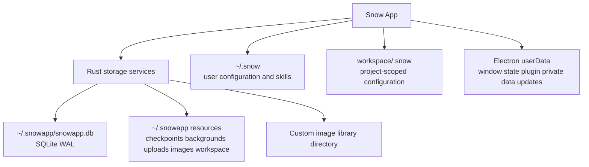
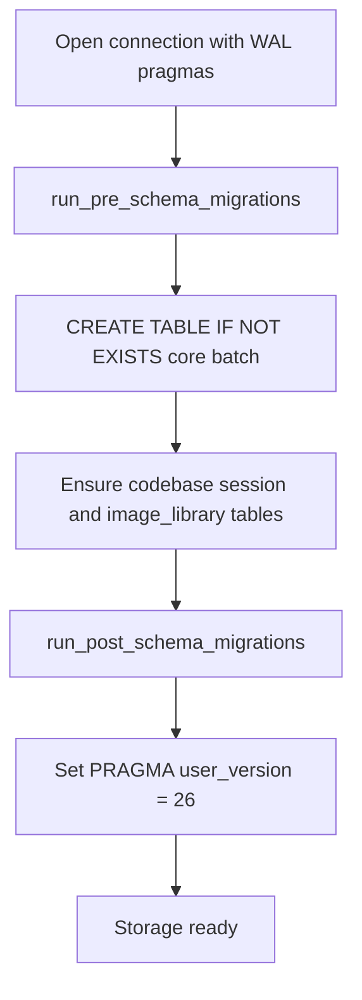
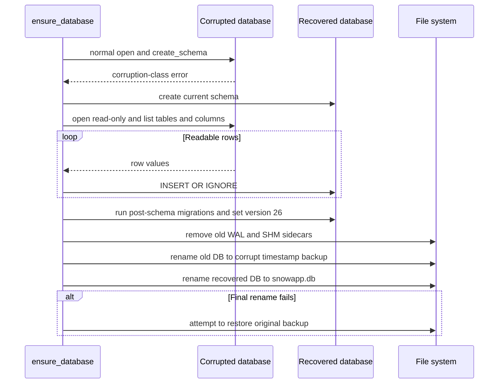
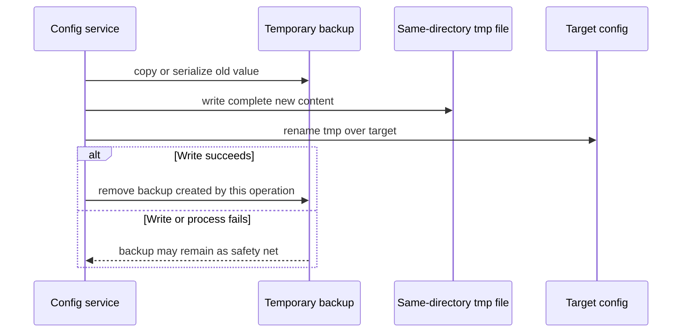
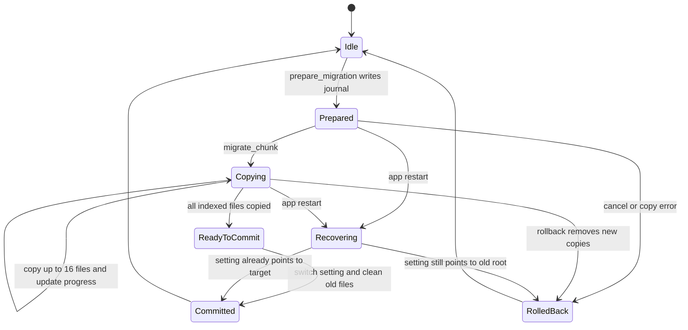
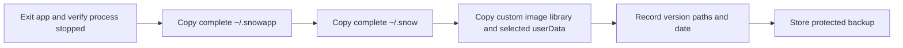

# Storage, Migration, Backup, and Recovery

> This document covers Snow App persistence domains, the SQLite schema lifecycle, best-effort recovery, atomic config writes, and image-library directory migration. No one-click complete backup/restore API was confirmed in the project; those sections describe offline operational procedures.

## 1. Storage Domain Component View

Do not describe all data as residing under `~/.snowapp`. Actual locations are determined jointly by `native/src/storage/paths.rs`, Electron `app.getPath("userData")`, and workspace scope.

## 2. Persistence Locations

| Domain | Typical content | Notes |
|---|---|---|
| `~/.snowapp/` | `snowapp.db`, `checkpoints/`, `backgrounds/`, `stream-cursors/`, `upload/<date>/`, default `image/`, built-in `workspace/` | Application data and default resource root |
| `~/.snow/` | Settings JSON, Skills, docs, `ROLE.md`, temporary `.config-backups/` | CLI/agent-visible configuration domain |
| `<workspace>/.snow/` | Project MCP, approvals, Hooks, sub-agents, or index-related state | Isolated by workspace |
| Electron `userData` | `window-state.json`, `plugins/<hash>/`, update cache, and more | Main-process and plugin-private data |
| Custom image directory | `image/...` files | The database still holds the index and relative paths |

SSH credentials and platform security storage may live in OS- or Electron-managed locations and must be treated as sensitive credentials during backup.

## 3. SQLite WAL and Connection Rules

`native/src/storage/database.rs::open_connection` consistently sets on every service connection:

- `PRAGMA foreign_keys = ON`
- `busy_timeout = 5s`
- `journal_mode = WAL`
- `synchronous = NORMAL`

WAL permits concurrent readers and one writer; the five-second busy timeout reduces immediate failures during concurrent `spawn_blocking` writes. Services should reuse `open_connection` instead of calling `Connection::open` and omitting pragmas.

At runtime, `snowapp.db-wal` may contain committed transactions not yet checkpointed into the main file. Therefore **copying only `snowapp.db` while the app runs is not a consistent backup**. The simplest safe procedure is to exit the app completely and copy the full data directory.

## 4. Schema and user_version

The direct `create_schema` batch currently creates 20 tables, followed by `image_library::ensure_image_library_table`, for **21 core business tables including `image_library`**. Auxiliary tables such as `codebase_embed_sessions` and per-project dynamic codebase-index tables are outside those 21 direct core tables.

The current `PRAGMA user_version` is 26. New tables belong in the current schema; new columns/indexes and old-structure conversions belong in migrations. Every migration must be idempotent, followed by a `user_version` bump. Never edit the database or change `user_version` manually to bypass migrations.

## 5. Two-Phase Migration

- **Pre-schema** runs before the table batch and handles old structures that would obstruct the current schema, such as legacy INTEGER-primary-key handling.
- **Post-schema** runs after current tables exist and handles idempotent columns, indexes, table rebuild completion, and data cleanup.
- New and upgraded databases may repeatedly enter these functions, so a completed migration must remain a safe no-op when rerun.

Migration failure prevents storage readiness. Callers must not bypass the `storageReady` gate for ordinary business access before the schema is complete.

## 6. Corruption Detection and Automatic Recovery

Startup first attempts `open_connection` and `create_schema`. Recovery runs only when the SQLite primary code is `DatabaseCorrupt` or `NotADatabase`, or the message matches `malformed` / `not a database`. The app does not unconditionally run `quick_check` or `integrity_check` on every startup.

Unreadable rows are skipped and logged, so automatic recovery is **best-effort, not lossless**. Preserve `snowapp.db.corrupt.<timestamp>.bak` for forensic inspection or a more specialized SQLite recovery attempt. Do not overwrite it with the recovered file.

## 7. Atomic Config Writes and Temporary Backups

File-backed writes in `native/src/mcp/servers/config.rs` use a same-directory temporary file and rename. Before writing, the old file is copied to `~/.snow/.config-backups/<file>.<timestamp>.bak`. DB-backed config also serializes the old value to a temporary `.bak`. `ROLE.md` uses a separate `atomic_write_role` with the same tmp-and-rename principle.

`.config-backups` is a temporary write-time safety net, **not a long-term backup repository**. Code limits leftover backups per file, but a normal successful write immediately removes the backup created for that operation. Long-term backup requires copying the complete config domain elsewhere.

## 8. Image-Library Directory Migration

Changing the image root uses journal-driven copy-and-commit rather than a direct move:

`prepare_migration` validates old/new root relationships, reads `image_library` relative paths, and writes a journal without deleting originals. The UI calls `migrate_chunk(16)` to copy at most 16 files and update progress. `commit_migration` catches up images generated during migration, then switches `system_settings.image_library_dir`; that is the commit point, followed by journal and old-file cleanup.

`rollback_migration` deletes copies under the new root and preserves originals. During storage initialization, `recover_interrupted_migration` checks whether settings already point to the new root: a committed migration finishes old-file cleanup, while an uncommitted migration removes copies. A corrupt journal is discarded and logged. IPC channels are `images:library-migrate-prepare/chunk/commit/rollback`.

## 9. Consistent Backup Checklist

Recommended offline backup:

1. Exit Snow App completely and verify no application process remains.
2. Copy all of `~/.snowapp/`, not only the database main file.
3. Copy all of `~/.snow/`.
4. If `system_settings.image_library_dir` points to a custom directory, copy it separately.
5. To retain plugin-private data, copy `<userData>/plugins/`.
6. Optionally copy window state, update cache, or SSH-related data; encrypt credentials and restrict access.
7. Record app version, operating system, and custom paths for compatibility decisions during restore.

If online backup becomes a requirement, implement SQLite's backup API or a controlled checkpoint flow instead of ad hoc copying of main, WAL, and SHM files. No such project feature was confirmed here.

## 10. Restore Procedure

1. Keep Snow App fully stopped.
2. First save the current `~/.snowapp/`, `~/.snow/`, and relevant custom directories so the only usable copy is not overwritten.
3. Restore the complete directory set; do not replace only `snowapp.db` while leaving mismatched `-wal` / `-shm` files.
4. Restore the custom image library and required plugin-private data.
5. Start Snow App and let the current version run idempotent schema migrations.
6. Inspect app logs, key conversations, settings, images, and workspace bindings.
7. If automatic corruption recovery occurs, preserve `.corrupt.*.bak` and verify whether rows were lost.

Restoring old-version data into a newer version allows forward migrations to run. Giving a newer database directly to an older app has no compatibility guarantee. Cross-machine restore also requires revalidating absolute paths, SSH credentials, and OS-specific settings.

## 11. Failure Scenarios and Prohibitions

| Scenario | Correct response |
|---|---|
| Copy only `snowapp.db` while running | Stop the app and copy the full directory, or later use a formal SQLite backup API |
| Manually alter `user_version` | Restore a backup and let migration code run |
| Data is incomplete after auto-recovery | Preserve the corrupt backup, compare logs, and perform manual recovery |
| Config write is interrupted | Inspect target, tmp, and `.config-backups` leftovers; do not treat that directory as version history |
| Image migration is interrupted | Let journal recovery determine commit or rollback at next initialization |
| Open a new DB in an old app | Use a matching version or validate compatibility; migrations are not assumed reversible |

## 12. Source Anchors

| Topic | File or function |
|---|---|
| Path resolution | `native/src/storage/paths.rs` |
| Connections, schema, corruption recovery | `native/src/storage/database.rs` |
| Pre/post migration | `native/src/storage/migrations.rs` |
| Initialization and interrupted migration recovery | `native/src/storage/mod.rs` |
| Image-library migration | `native/src/storage/services/image_library.rs` |
| Image-library IPC | `src/main/ipc/handlers/imageLibraryHandlers.ts`, `src/preload/modules/imageLibraryApi.ts` |
| Config backup and atomic write | `native/src/mcp/servers/config.rs` |
| Conversations and checkpoints | `native/src/storage/services/chat_conversations.rs`, `checkpoint.rs` |
