# Feature Module Architecture and Data-Flow Diagrams

> This atlas splits maintainable Mermaid sources by feature. Diagrams retain stable boundaries only. When implementation changes, update both the maintenance note and source anchors instead of packing every internal function into one oversized graph.

## 1. Chat and Conversations

**Purpose and boundary**: Renderer owns message UI, each conversation's agent loop, and stream state. Rust normalizes provider requests, parses streams, and persists model exchanges.

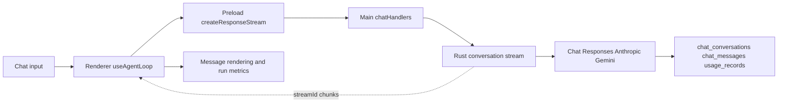

**Maintenance**: Do not draw `sessionProxy.ts` into the AI stream. Renderer builds `toolResultsJson`, which enters the next model round.

**Source anchors**: `src/renderer/components/mainContent/chatMessages/hooks/useAgentLoop.ts`, `src/preload/modules/apiConfigApi.ts`, `src/main/ipc/handlers/chatHandlers.ts`, `native/src/api/conversation/stream.rs`, `native/src/storage/services/chat_conversations.rs`.

## 2. MCP Tool Discovery and Calls

**Purpose and boundary**: Rust builds the model-visible tool set and executes tools. Renderer owns user authorization and invocation rounds but cannot bypass Rust policy.

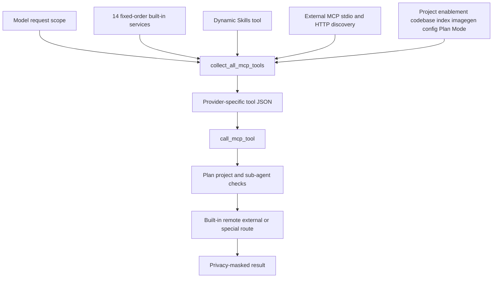

**Maintenance**: Append fixed services to the end of `builtin_services_in_order` to preserve prompt caching. Skills and remote workspace are not counted among the 14 fixed services.

**Source anchors**: `native/src/mcp/builtin.rs`, `native/src/mcp/tools.rs`, `native/src/mcp/service.rs`, `native/src/mcp/external/`, `native/src/mcp/privacy_mask.rs`.

## 3. Skills

**Purpose and boundary**: Skills config is global- or project-scoped, while the model-side tool is injected per request. Built-in Skills and docs are idempotently synced into `~/.snow/` at startup.

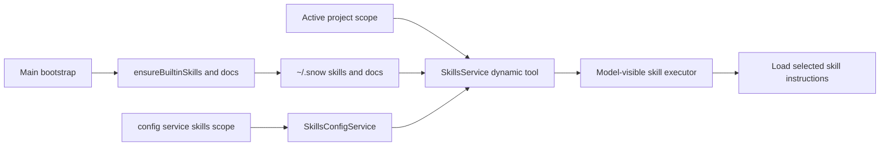

**Maintenance**: `skills_config` is the delegated implementation behind config's skills scope, not a separately registered MCP service. Dynamic availability depends on scope and usable configuration.

**Source anchors**: `src/main/app/ensureBuiltinSkills.ts`, `native/src/mcp/servers/skills.rs`, `native/src/mcp/servers/skills_config.rs`, `native/src/mcp/servers/config.rs`, `native/src/mcp/tools.rs`.

## 4. Hooks and Sub-agents

**Purpose and boundary**: Hooks add configured decision points to user-message, tool, compaction, and sub-agent lifecycles. A sub-agent has an independent conversation and Renderer loop but remains constrained by parent permissions and checkpoints.

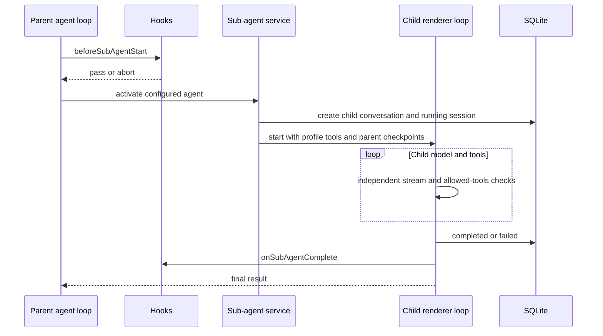

**Maintenance**: Tool Hook order is `toolConfirmation` → authorization → `beforeToolCall` → MCP → `afterToolCall`. Parent abort propagates to children; stale running sessions are cancelled at startup.

**Source anchors**: `src/renderer/components/mainContent/chatMessages/hooks/subAgentActivation.ts`, `toolExecution.ts`, `useToolAuthorization.ts`, `hookOutcome.ts`, `native/src/hooks/`, `native/src/mcp/servers/sub_agents.rs`.

## 5. Image Generation and Library

**Purpose and boundary**: The imagegen MCP service calls providers using independent channel configuration. Results are written to files and indexed in the library; Renderer merges consecutive parallel calls into a gallery.

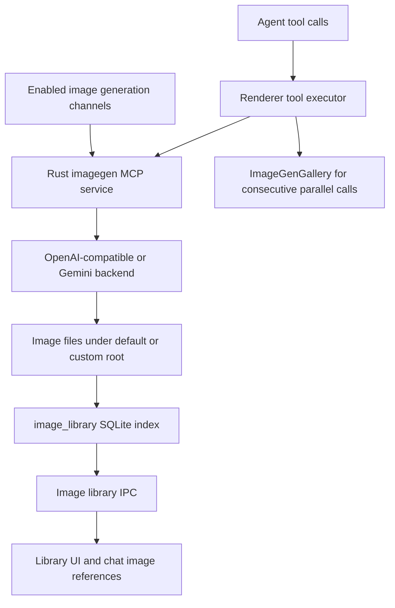

**Maintenance**: The tool is discoverable only when at least one channel is enabled. Parallel multi-image output is multiple tool calls unified by the Renderer gallery. Image-root changes use the prepare/chunk/commit/rollback journal flow.

**Source anchors**: `native/src/mcp/servers/imagegen.rs`, `src/main/ipc/handlers/imageHandlers.ts`, `native/src/storage/services/image_library.rs`, `native/src/exports/images.rs`, `src/main/ipc/handlers/imageLibraryHandlers.ts`.

## 6. Browser

**Purpose and boundary**: A Renderer webview provides the visible page. Main manages Electron network recording, popups, passwords, and context menus. The Rust MCP browser service exposes model tools.

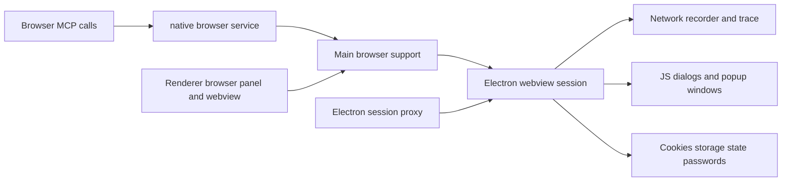

**Maintenance**: `browserNetworkRecorder`, storage state, and trace are support modules, not separate IPC registration groups. OAuth popups must retain `window.opener`; `sessionProxy.ts` applies network proxy policy to Electron sessions.

**Source anchors**: `native/src/mcp/servers/browser.rs`, `src/main/ipc/handlers/browserNetworkRecorder.ts`, `browserStorageState.ts`, `browserTrace.ts`, `browserPasswordHandlers.ts`, `src/main/browser/browserPopupWindow.ts`, `src/main/app/sessionProxy.ts`.

## 7. Terminal and SSH

**Purpose and boundary**: Local PTY and persistent terminal tools use local process management. SSH manager, remote commands, and remote-workspace adapters handle remote files, commands, and Git.

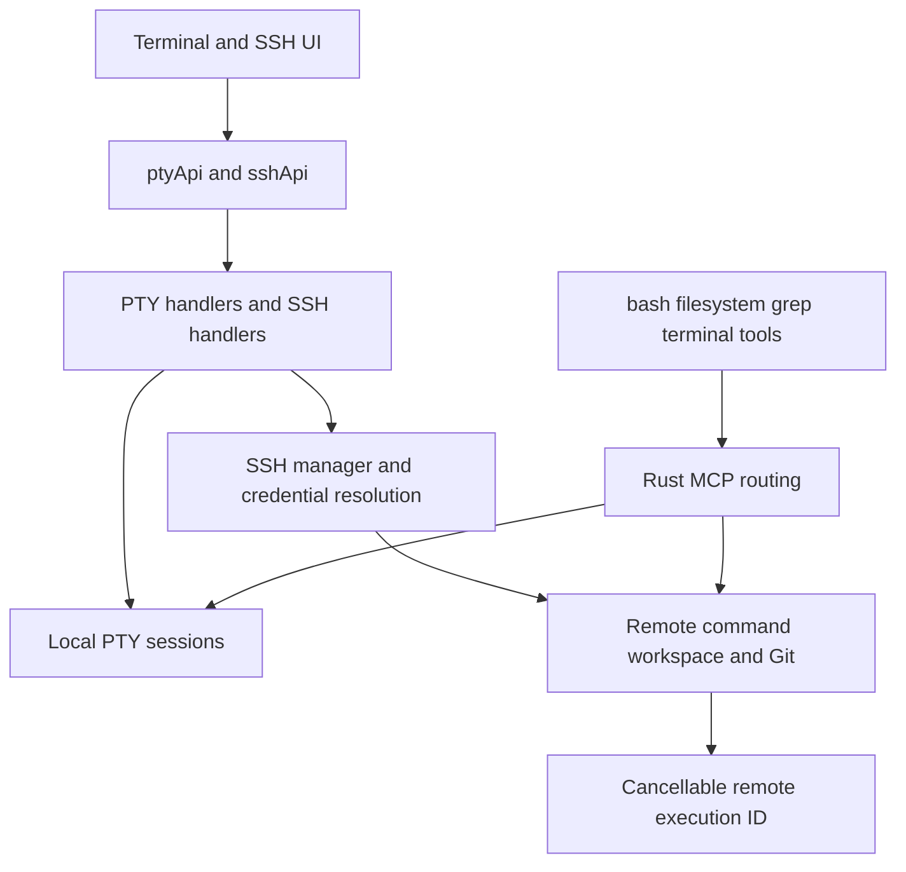

**Maintenance**: The terminal MCP service is disabled by default and must be explicitly enabled per project. Remote workspace supports execution and is not a duplicate fixed built-in service. Windows/local and SSH paths must be resolved before routing.

**Source anchors**: `src/main/pty/registerPtyHandlers.ts`, `src/main/ipc/handlers/sshHandlers.ts`, `src/main/ssh/sshManager.ts`, `remoteWorkspaceCommand.ts`, `remoteGit.ts`, `native/src/mcp/servers/terminal.rs`, `remote_workspace.rs`.

## 8. Git and Codebase Indexing

**Purpose and boundary**: UI Git calls Main and native exports for local or remote Git. Rust creates embeddings/chunks for codebase indexing and exposes search tools only when an index is usable.

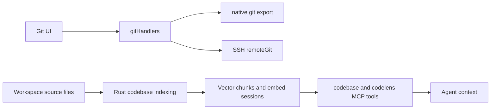

**Maintenance**: Git UI operations and model tool authorization are separate entry points. Codebase tools require a valid project, project enablement, and existing chunks; hide them before indexing instead of advertising an empty capability.

**Source anchors**: `src/main/ipc/handlers/gitHandlers.ts`, `src/main/ssh/remoteGit.ts`, `native/src/exports/git.rs`, `native/src/exports/codebase.rs`, `native/src/mcp/servers/codebase.rs`, `native/src/mcp/servers/codelens/`, `native/src/storage/services/codebase_embed_sessions.rs`.

## 9. Third-Party Import and Plugins

**Purpose and boundary**: Codex, Claude Code, and OpenCode can be discovered and selectively imported from local, WSL, or SSH environments. Directory changes coordinate rollback with a SQLite import transaction. Plugin runtimes use restricted utility processes.

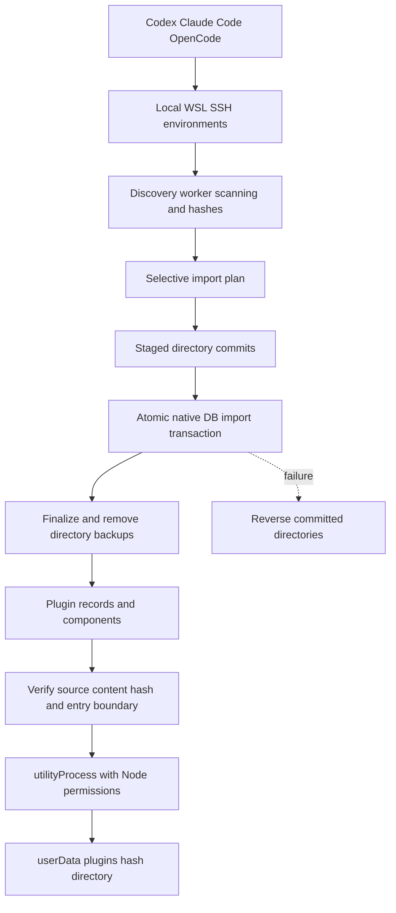

**Maintenance**: `ImportExecutionPlan.commit` commits staged directories first, then one native DB transaction; DB failure rolls directories back in reverse. Plugins receive only declared storage/network/child-process permissions, require rescan after source hash changes, and stop through `stopAll()` on exit.

**Source anchors**: `src/main/codex/importer.ts`, `src/main/importConfig/importEnvironments.ts`, `discovery.ts`, `selectedImport.ts`, `directoryCommit.ts`, `importTransaction.ts`, `pluginManager.ts`, `src/main/plugins/pluginRuntimeManager.ts`, `plugin-runtime-worker.ts`.

## 10. Configuration

**Purpose and boundary**: Configuration spans file-backed, DB-backed, global, and project scopes. Renderer uses config APIs and the model can use config MCP tools; Rust centralizes validation, masking, backup, and writes.

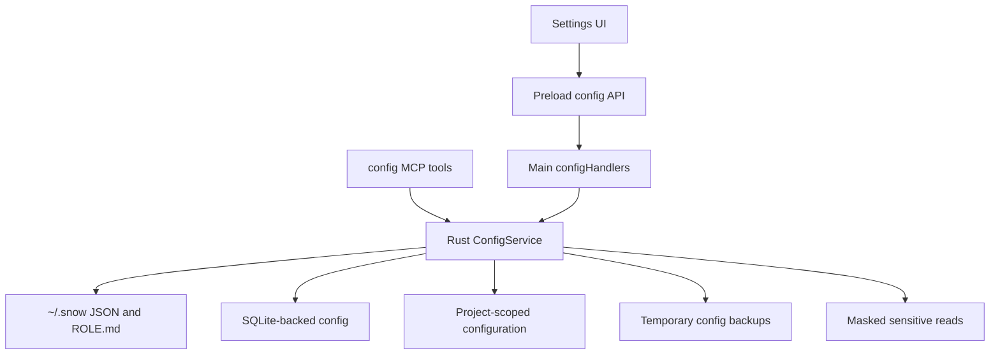

**Maintenance**: File writes use same-directory tmp plus rename; temporary backups are removed after success. Deletion must identify target and impact. Sensitive reads remain masked. The skills scope delegates to SkillsConfigService.

**Source anchors**: `native/src/mcp/servers/config.rs`, `native/src/mcp/servers/skills_config.rs`, `src/preload/modules/configApi.ts`, `src/main/ipc/handlers/configHandlers.ts`, `src/main/settings/`.

## 11. Application Updates

**Purpose and boundary**: The updater branches by platform. Non-macOS uses an explicit electron-updater download/install state machine; macOS has a separate check and download implementation. Update networking follows the dedicated Electron updater-session proxy.

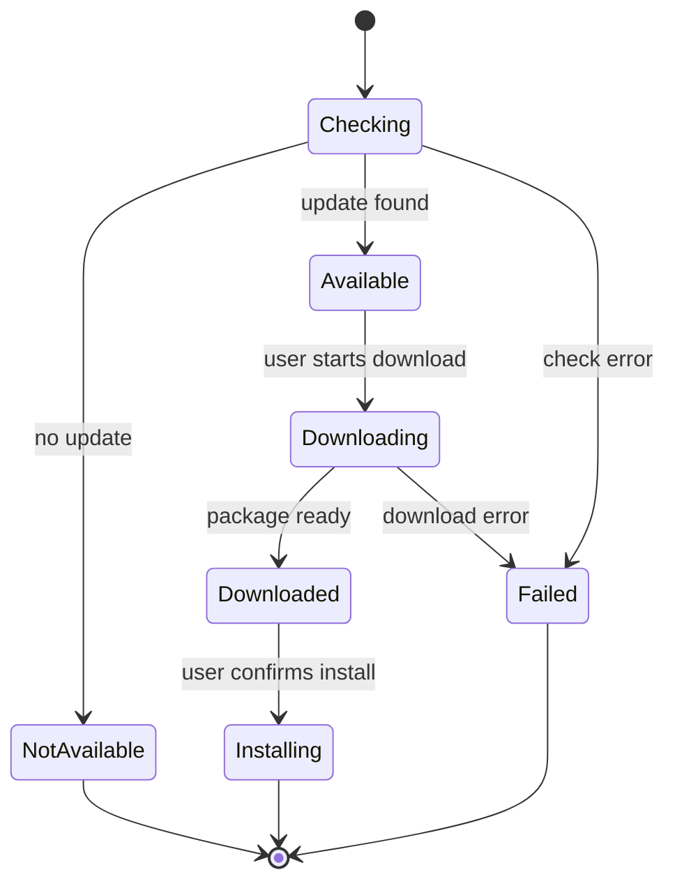

**Maintenance**: Non-macOS disables automatic download and install-on-quit; state must retain user-triggered download and install. macOS download cache is under the relevant userData updates directory. Both default session and updater partition receive `applySessionProxy`.

**Source anchors**: `src/main/updater/autoUpdater.ts`, `electronUpdater.ts`, `macUpdater.ts`, `updateStatus.ts`, `src/main/app/mainWindow.ts`, `src/main/app/sessionProxy.ts`.
