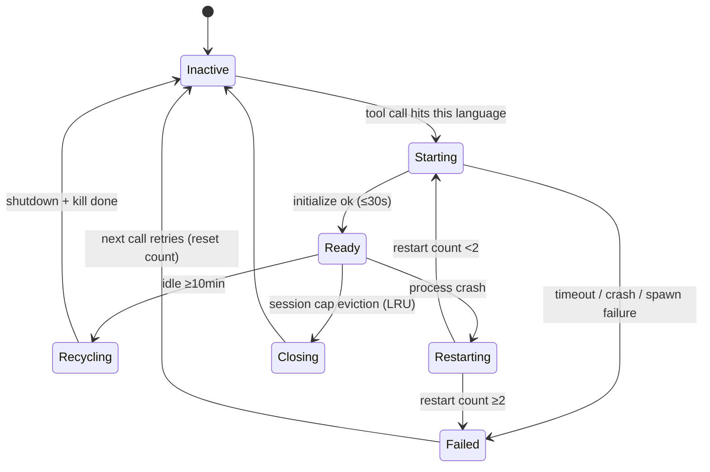
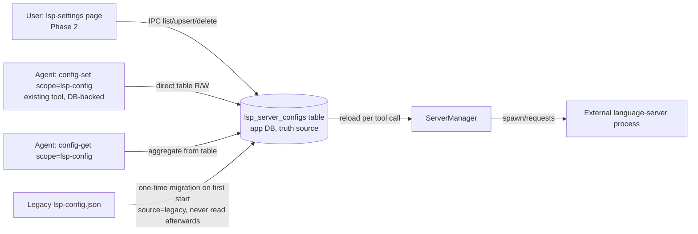
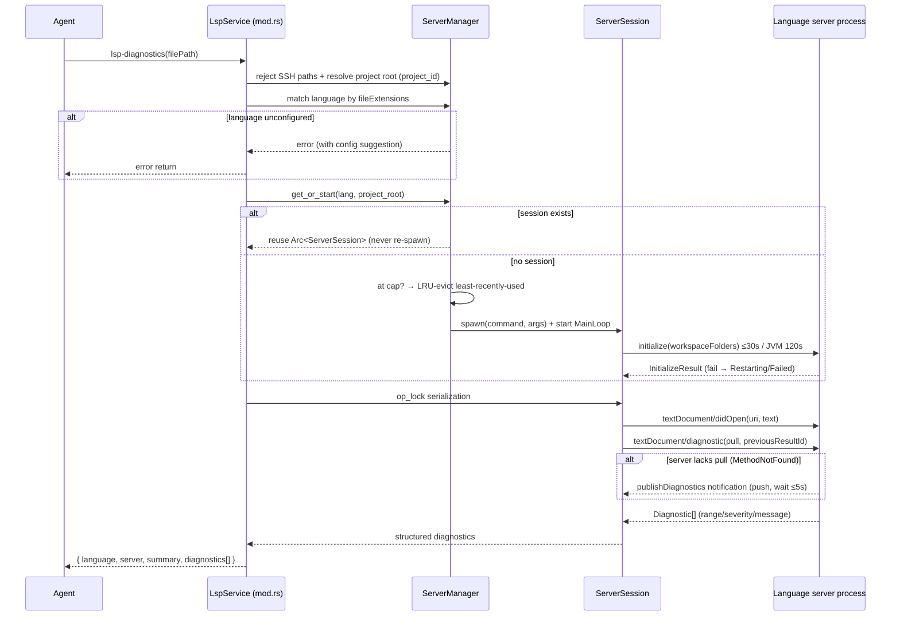

# 7-LSP External Language Server Integration Design (lsp MCP service)

> Status: Design v1 (under review)
> Target version: v0.2.x
> Chinese original: `docs/zh-CN/4-架构与开发/7-LSP外部语言服务器接入设计.md`

## 1. Background & Motivation

### 1.1 Historical lesson (why not build our own diagnostics)

- **v0.1.x ~ v0.1.7**: codelens shipped a built-in `codelens-diagnose` tool using oxc (TS/JS) + tree-sitter (other languages), with hand-written per-language semantic analyzers (`semantic_analyzer/`, 10 files, ~2100 lines) and an ambient-globals patch (318 lines).
- **v0.1.21 (34677584)**: removed entirely — 3186 lines deleted. Reason: single-file static analysis cannot understand cross-file semantics (imports/module systems/framework globals), false positives were structurally unsolvable; maintaining 10 hand-written analyzers was unsustainable; untrustworthy diagnostics are negative value for an agent.
- **Conclusion**: diagnostics capability itself is valuable (otherwise the false-positive fix would never have been made) — the problem was the "self-built" approach. The correct path is to **consume external professional language servers** (rust-analyzer/gopls/tsc, maintained by official/community teams).

### 1.2 Current gap

- `~/.snow/lsp-config.json` (scope `lsp-config`) is a **reserved config domain**: fields complete (command/args/fileExtensions/installCommand/initializationOptions), deep validation implemented in Rust (`config/mod.rs:985`), 6 languages pre-seeded — but **no consumer at all**; writes change nothing.
- codelens only provides symbol navigation (outline/find_definition/find_references) — no diagnostics/hover/formatting.
- No LSP client runtime in `src/` (Electron) or `native/` (Rust).
- A frontend `lsp-settings` page is available and can be opened through `app-control-openSettings`.
- Persistence is a **file-backed scope**; the project already has a more mature "server config" pattern: `mcp_server_configs` table + DB-backed config scopes (subAgents/hooks/imagegen, `config/mod.rs:1269`) + mcp-settings frontend page — this design follows the **DB-backed scope** pattern (no file compatibility layer).

### 1.3 Industry references

- **LSAP (lsp-client/LSAP)**: agent-cognitive orchestration layer, Markdown-First output. We borrow its **output style**, not its protocol.
- **claw-code / oh-my-pi / pi-lsp-extension**: lazy server startup, post-write diagnostics, process lifecycle management — same patterns adopted here.
- **async-lsp (oxalica/async-lsp 0.2.x)**: preferred Rust LSP client framework (`LspService` trait supports both server & client, stdio transport, MainLoop, concurrency middleware).
- **gopls official MCP (go.dev/gopls/features/mcp)**: gopls natively exposes an MCP server; internally still LSP; locks workspace root via `os.Getwd()` at startup.
- **golang/go#78668**: gopls MCP shared daemon cannot serve multiple projects due to root locking; official status is **per-project daemon**. Direct evidence for our "session granularity = language × project".
- **VS Code Multi-Server LSP Pattern** (microsoft/vscode-extension-samples): **one language server instance per workspace folder**, isolating project state & config — the industry standard.

## 2. Goals & Non-Goals

### Goals

1. Activate the `lsp-config` domain: new `lsp` MCP service consumes `~/.snow/lsp-config.json`.
2. Phase 1 ships `lsp-diagnostics` + `lsp-hover`.
3. Full server lifecycle management: lazy start, idle reclamation, crash restart (bounded), concurrency cap.
4. Degradation-friendly: clear, actionable errors when unconfigured/server missing/startup fails; existing codelens capabilities untouched.

### Non-Goals (this iteration)

- No self-built semantic analysis (historical lesson).
- No LSAP orchestration protocol (protocol unstable; style only).
- No post-write auto-diagnostics hook (invasive to the agent loop; optional Phase 3).
- No TCP/pipe transports (stdio only, matching lsp-config field semantics).

## 3. Architecture Constraints (facts to respect)

| Constraint | Source |
|---|---|
| `McpService` trait: `id()` / `tools()` / `execute()` (sync) | `native/src/mcp/service.rs` |
| Async tool execution: add a `lsp-` prefix branch in `call_mcp_tool` (`native/src/mcp/tools/call.rs`) and `.await` directly (mirror `codelens-` branch, call.rs:305) | `tools/call.rs` |
| Sync `execute()` must return "must be executed through the async executor" for lsp tools (mirror codelens mod.rs:148) | `servers/codelens/mod.rs` |
| Service registration: append to the END of `builtin_services_in_order()` in `mcp/builtin.rs` (prompt-cache stability red line) | `mcp/builtin.rs:29-51` |
| Config path | Truth source is the `lsp_server_configs` table; **`lsp-config` scope becomes DB-backed** (like subAgents/hooks/imagegen, config/mod.rs:1269); no file, no diff-sync; legacy `~/.snow/lsp-config.json` imported once | `servers/config/mod.rs:1269`, `database.rs:468` |
| tokio already enables `process`/`io-util`/`sync`/`time`/`rt` features | `native/Cargo.toml:20` |
| No synchronous blocking in Rust backend (async APIs only) | AGENTS.md red line 7 |
| Tool name format `{server_id}-{tool_name}`, lowercase snake_case | `mcp/tools` convention |

## 4. Dependencies (add to native/Cargo.toml)

```toml
# LSP client framework: stdio transport + MainLoop + LanguageClient omnitrait
# default-features off to drop client-monitor (server-side) / tracing (not used in this project)
async-lsp = { version = "0.2", default-features = false, features = ["tokio", "stdio", "omni-trait"] }
# LSP 3.17 full types (async-lsp re-exports the same version; declare explicitly for direct use)
lsp-types = { version = "0.95" }
```

Rationale:

- **Why async-lsp**: supports both Language Server and Language Client roles via `LspService`; `stdio` feature provides piped stdin/stdout channels and `MainLoop`; `omni-trait` provides the `LanguageClient` full request/notification methods; `concurrency` middleware provides request multiplexing & cancellation; re-exports `lsp-types`.
- **Not tower-lsp**: server-oriented, weak client support.
- **No hand-rolled JSON-RPC**: Content-Length framing + serde_json is doable but lsp-types would still be needed — reinventing the wheel.
- **tokio feature**: the project runs on the tokio runtime (napi async + `tokio::task::spawn_blocking`); async-lsp defaults to async-io, so the `tokio` compat methods must be enabled.
- Transitive deps (no explicit declaration needed): `tower-service`, `tower-layer`, `url` (via lsp-types; `lsp_types::Url` directly usable).

## 5. Module Layout

```
native/src/mcp/servers/lsp/
├── mod.rs       # LspService: McpService impl + tool schemas + execute entry
├── config.rs    # Config loading: read lsp_server_configs table (spawn_blocking) + validation
├── manager.rs   # ServerManager global singleton: session routing & lifecycle
├── session.rs   # ServerSession: single language-server session (process + client + state)
├── client.rs    # Protocol ops: initialize / didOpen / hover / diagnostics
└── format.rs    # LSP responses → agent-friendly output (JSON + Markdown summary)

native/src/storage/services/lsp_server_configs.rs   # new table CRUD (mirror mcp_server_configs.rs)
native/src/storage/database.rs                      # CREATE TABLE (create_schema, idempotent)
native/src/exports/storage/lsp.rs                   # napi exports (list/upsert/delete)
```

### 5.1 Module responsibilities

| Module | Responsibility | Key points |
|---|---|---|
| `mod.rs` | Tool schemas (`McpTool`), sync `execute()` error, `execute_lsp_tool()` async entry (for call.rs) | mirror codelens/mod.rs |
| `config.rs` | Read `~/.snow/lsp-config.json`, serde deserialization; missing file → empty config; invalid JSON → error | fields aligned with `validate_lsp_servers` |
| `manager.rs` | `OnceLock<Arc<ServerManager>>`; resolve project root → route sessions by (language, project root); lazy start / idle reclaim / crash restart / cap | global singleton; `tokio::sync::Mutex` guards session table |
| `session.rs` | Session state machine: spawn process, async-lsp MainLoop, initialize handshake, opened-file registry, serialized op lock | holds process handle + reclamation |
| `client.rs` | `textDocument/hover`, `textDocument/diagnostic` (pull) + `publishDiagnostics` (push fallback), `didOpen/didClose` | all async, with timeouts |
| `format.rs` | Diagnostic→JSON items, hover→Markdown, errors→actionable text | output structure per §8 |

## 6. Core Data Structures

```rust
// ---------- config.rs ----------
/// One row of table lsp_server_configs (truth source; fields align with validate_lsp_servers)
#[derive(Debug, Clone, Serialize, Deserialize)]
pub struct LspServerConfigRecord {
    pub id: String,
    pub lang: String,                        // language id (UNIQUE), e.g. "rust"
    pub command: String,
    pub args: Vec<String>,                   // args_json
    pub file_extensions: Vec<String>,        // file_extensions_json
    pub install_command: Option<String>,
    pub initialization_options: Option<serde_json::Value>,
    pub enabled: bool,                       // UI toggle (disabled = server not started for this language)
    pub sort_order: i64,
    pub source: String,                      // "seed" | "manual" | "legacy" (mirror mcp source convention)
    pub created_at: String,
    pub updated_at: String,
}

// ---------- manager.rs ----------
/// Global singleton: manages all (language × project) sessions
pub struct ServerManager {
    /// key = (language, project root); at most ONE process per language within a
    /// project; separate projects get separate processes (single-root workspace model)
    sessions: tokio::sync::Mutex<HashMap<(String, PathBuf), Arc<ServerSession>>>,
    config: RwLock<Vec<LspServerConfigRecord>>,  // reloaded from table per tool call (hot update, no restart)
    max_sessions: usize,                  // total process cap (default 3, across projects/languages)
    idle_timeout: Duration,               // idle reclamation threshold (default 10 min)
}

// ---------- session.rs ----------
/// One language-server session bound to a (language, project root)
pub struct ServerSession {
    lang: String,
    project_root: PathBuf,                // locked at init, immutable
    config: ServerConfig,
    child: tokio::process::Child,         // child process handle (for reclamation)
    client: ClientSocket,                 // async-lsp client socket (clone for concurrent requests)
    main_loop: tokio::task::JoinHandle<()>,
    op_lock: tokio::sync::Mutex<()>,      // serializes didOpen/request sequences
    opened_files: HashSet<PathBuf>,       // files didOpen'ed
    last_used: std::time::Instant,
    restart_count: u32,                   // crash restart count (cap 2)
    init_failed: bool,                    // startup-failed flag (avoid infinite retry)
}
```

## 7. Lifecycle Design

### 7.1 State machine



### 7.2 Session granularity: language × project (core decision)

**Rule: session key = (language, project root); at most one process per language within a project; no process reuse across projects.**

Evidence (industry facts):

1. **LSP workspace is single-root**: a workspace = one folder + per-folder config (gopls workspace docs). rust-analyzer / gopls / tsc all analyze within a single root.
2. **gopls official MCP is per-project daemon**: locks root via `os.Getwd()` at startup; golang/go#78668 confirms shared daemons cannot serve multiple projects.
3. **VS Code Multi-Server LSP Pattern**: one server instance per workspace folder.

Multi-module projects (Go `go.work`, Rust Cargo workspace, TS monorepos) are **naturally single-process** — module relationships are discovered by the server within one root; the client does nothing.

**Project root resolution** (reuse existing pattern, codelens/mod.rs:530 / skills.rs:350):

```
tool call → project_id present?
  ├─ yes → get_workspace_directory_path(db, project_id) → project root
  └─ no  → filePath's parent directory (single-file fallback)
```

- SSH/remote projects (`is_ssh_path`): **not supported**, return error (external language-server processes run locally).
- Repeated calls to the same (language, project) within a session hit the same process — **never re-spawn**.

### 7.3 Key parameters

| Parameter | Default | Notes |
|---|---|---|
| `max_sessions` | 3 | **Total process cap across (language, project)** (rust-analyzer ~500MB per process; LRU-evict least-recently-used on overflow) |
| `idle_timeout` | 10 min | Idle reclamation (no tool calls) |
| `initialize_timeout` | 30 s (default); **120 s for JVM-based** | Per-server default table: `jdtls`/`kotlin-lsp` 120s (JVM startup, per Anthropic claude-plugins-official `startupTimeout: 120000`), others 30s |
| `request_timeout` | 10 s (diagnostics) / 5 s (hover) | Per-request timeout |
| `restart_limit` | 2 | Consecutive crash restart cap |
| Session eviction | LRU | Evict least-recently-used when over cap |

### 7.4 Process management essentials

- **spawn**: `tokio::process::Command`; Windows MUST set `creation_flags(CREATE_NO_WINDOW)` to avoid console windows.
- **Reclamation**: `shutdown` notification → wait for exit (≤3s) → `child.kill()` fallback; cleanup on drop.
- **Crash detection**: `main_loop` end or `child.wait()` completion = process exit; abnormal exit → Restarting.
- **stderr**: forwarded to app logs (never returned to the agent, avoids flooding); log prefix `[lsp:{lang}]`.
- **Only reclaim processes we spawned** (per global process-management rules).

## 8. Tool Design

### 8.0 Tool exposure policy (off by default)

**`lsp` service tools are NOT exposed by default; they only appear when the `lsp_server_configs` table has at least one *enabled AND installed* language server (§8.6).**

- Implementation: `has_enabled_server()` reads the table and PATH-probes the enabled records — no *enabled-and-installed* record → **empty tool list** (agent never sees `lsp-*` tools; no prompt overhead, no wasted calls). Plain enabled is not enough: a server whose command is missing from PATH can never start, so exposing it only invites guaranteed-to-fail calls.
- Runtime changes via `config-set scope=lsp-config` (agent) or the `lsp-settings` page (user) take effect on the **next tool call automatically** (reload from table per call — no restart needed; better than file-backed scopes).
- Exposed but file type unmatchable (e.g. only rust configured, diagnosing .py) → explicit error per §9 (**never silent**).
- Sub-agent scenarios follow the same policy (tool list controlled globally).

### 8.5 Config architecture (DB-backed scope, no file compatibility layer)



Key points:

- **Truth source = table**; the `lsp-config` scope changes from file-backed to **DB-backed** (like subAgents/hooks/imagegen: config/mod.rs:1269 "DB-backed config domains: read the app database directly, same source as the UI") — **no file, no diff-sync logic**; config-get/set/delete hit the table directly.
- **Agent config path**: no new tool — agents use the existing `config-set scope=lsp-config` to configure language servers (command/path/extensions/toggle), **effective immediately, no restart**.
- **Legacy migration**: first start with empty table + existing `~/.snow/lsp-config.json` → one-time import (source=legacy, idempotent); file never read afterwards.
- **Table creation**: `database.rs::create_schema` adds `CREATE TABLE IF NOT EXISTS lsp_server_configs` (idempotent, no user_version bump); structure mirrors mcp_server_configs (database.rs:468).
- **Seed config**: seed logic writes to the table (source=seed), platform-aware (Appendix B); never overwrites user records (inserts missing languages only).
- **v1 global-only** (no project_id column, consistent with imagegen etc.); project-level deferred to Phase 3 (separate table pattern like project_mcp_server_configs).

### 8.1 lsp-diagnostics (Phase 1, core)

```
lsp-diagnostics filePath=<absolute path>
```

Execution sequence (**revised per 2026-08-14 live testing**):

0. Reject SSH/remote paths (`is_ssh_path` → "remote projects not supported for LSP yet"); file ≤512KB.
1. `manager` resolves project root (project_id → `get_workspace_directory_path`; fallback: filePath parent) → match language by `fileExtensions` (enabled only) → no match: "no LSP server configured for this file type" (with config-set hint).
2. Lazy-load session: lookup (language, project root) → if absent and process count < `max_sessions`, spawn + initialize (root = project root); at cap, LRU-evict one (**graceful shutdown**) then start.
3. `textDocument/didOpen` (first, version=1) + **`textDocument/didChange` (every call, version++ , full content) to force re-diagnostics** + **`textDocument/didSave` (pull-capable servers, triggers flycheck)**.
4. **Diagnostic path chosen by server capability** (initialize `diagnostic_provider`):
   - **pull declared** (rust-analyzer): **push + pull merged** — rustc/cargo diagnostics (type errors etc.) only arrive via push (`publishDiagnostics`, triggered by didSave → flycheck); rust-analyzer native diagnostics via pull; the two never overlap (rust-lang/rust-analyzer#18709); poll-retry on empty/cancelled (-32802), up to 8 × 2s.
   - **pull not declared** (gopls etc.): pure push (wait `publishDiagnostics`, up to 30s — first flycheck/cargo build may take 10-30s).
5. Merge + dedupe (by start line/col/message); files stay open (`opened_files`), closed with the session on reclamation.
6. Output JSON:

```json
{
  "language": "rust",
  "server": "rust-analyzer",
  "summary": "2 errors, 1 warning",
  "diagnostics": [
    {
      "severity": "error",
      "message": "expected `i32`, found `&str`",
      "source": "rustc",
      "code": "E0308",
      "line": 12,
      "column": 20,
      "endLine": 12,
      "endColumn": 25
    }
  ]
}
```

Severity mapping: `1=error, 2=warning, 3=information, 4=hint` (LSP DiagnosticSeverity).

**Key live-test findings (2026-08-14, rust-analyzer 1.93 + gopls v0.21.1)**:

1. **rust-analyzer's dual-track diagnostics are by design** (#18709): pull never includes cargo diagnostics, push never includes native ones — clients must merge, and type errors depend on **didSave triggering flycheck** (first cargo check 10-30s; push wait needs 30s).
2. **gopls does not declare diagnosticProvider**: cannot detect via MethodNotFound (it returns an empty Partial, not an error) — must read the initialize `diagnostic_provider` capability.
3. **workspace/configuration requests must be handled** (return empty array = server defaults): otherwise rust-analyzer logs "No such method workspace/configuration" and diagnostics degrade.
4. **Windows uri case**: rust-analyzer pushes `file:///c:/...` while `Url::from_file_path` yields `file:///C:/...` — push-store keys must be normalized (lowercase on Windows).
5. **async-lsp Router terminates the mainloop on unregistered notifications** (Break): register all common notifications (showMessage/logMessage/telemetry/progress/publishDiagnostics) and requests (workspace/configuration, workspaceFolders).
6. **No `blocking_lock()` in tokio context** (panics); `min_by_key` closures cannot await — collect first, then minimize.

### 8.2 lsp-hover (Phase 1)

```
lsp-hover filePath=<absolute path> line=<1-based> column=<1-based>
```

Steps 0-3 same as above (file stays open via `opened_files` ref-counting for consecutive queries; closed on idle reclamation).
Output (hover content is itself Markdown; pass through + wrap):

```json
{
  "language": "rust",
  "contents": "```rust\nfn foo(x: i32) -> i32\n```\nReturns `x + 1`.",
  "range": { "start": { "line": 12, "column": 4 }, "end": { "line": 12, "column": 7 } }
}
```

### 8.3 Phase 3 (completed 2026-08-14) — more tools + project-level scope

> Phase 2 (the `lsp-settings` page) was completed on 2026-08-14: preload `lspApi` → IPC `lsp-server-configs:*` → `LspSettingsPanel` + `lspSettings/` subdirectory (Editor/List/Summary) → registration chain (`app_control` VALID_PAGES / `types.ts` / `MainContent` lazy / `settingsItems.ts`) → i18n in three languages. Page CRUD reads/writes the `lsp_server_configs` table (source of truth) directly, identical to `config-set scope=lsp-config`.

| Tool | Notes | Status |
|---|---|---|
| `lsp-definition` | `textDocument/definition`; output aligned with codelens-find_definition (name + definitions list); LSP preferred when configured | ✅ done (cross-file jump to manager.rs:29 verified) |
| `lsp-references` | `textDocument/references`; locations + one-line code context (cap 100) | ✅ done (11 refs with context verified) |
| `lsp-symbols` | `textDocument/documentSymbol`; nested tree name/kind/detail/range/children, more accurate than tree-sitter outline | ✅ done (26 symbols verified) |
| `lsp-format` | `textDocument/formatting`; dryRun default true (no write); false applies edits + didChange sync | ✅ done (dryRun 42 edits verified) |

**Project-level scope** (2026-08-14): `project_lsp_server_configs` (system_settings JSON, mirroring project_mcp_server_configs) — project configs **override** global ones for the same language; configure via `config-set scope=lsp-config projectId=...`; frontend lsp-settings page gained Global/Project tabs. Session granularity (language × project root) already gives per-project processes.

**Initialization root (revised 2026-08-17)**: initialize uses `workspaceFolders` as the sole project-root declaration; deprecated `rootUri` compatibility is intentionally not retained.

**Post-write auto-diagnostics: evaluated, NOT implemented** — cold start 10-30s would block edit-tool returns, filesystem→lsp cross-service coupling breaks tool independence, and auto-appended diagnostic summaries pollute conversation context (up to 200 items on large projects). Agents can already call `lsp-diagnostics` explicitly; the tool chain is complete.

### 8.6 Install-state detection (implemented 2026-08-14)

**Problem**: early seeding/migration always wrote `enabled=true` without probing the environment — producing the contradictory "enabled but not installed" state: the tool list exposed servers that could never start, and the truth only surfaced as a call-time error.

**`enabled` semantics (revised)**: `enabled` expresses *user intent to use the config*; it does **not** mean installed. Actual availability = `enabled && installed`:

- `installed`: the command is executable on PATH (`probe.rs`; Windows builds candidates from PATHEXT, explicit paths supported; **pure filesystem scan — no process spawn, no side effects**).
- Both tool exposure (`has_enabled_server` / the lsp filter in `collect_all_mcp_tools`) and session startup (config lookup in `manager.get_or_start`) require `enabled && installed`; a missing server yields an explicit degradation error (§9).

**Three write/reconcile paths** (all idempotent, side-effect free):

| Path | Behavior |
|---|---|
| Seed `default_seed_servers()` | Sets `enabled` from `probe::is_command_installed(command)` at write time — only installed servers default to enabled |
| Migration `migrate_legacy_file()` | Same (the legacy lsp-config.json has no enabled concept; migration decides by environment) |
| Existing-data reconcile `reconcile_enabled_by_probe()` | Runs at every startup: for records with `source=seed`/`source=legacy` AND `enabled=true` only, probe the command — not installed → `enabled=false`; **never touches `source=manual`** (user-configured) or already-disabled records |

**Reconcile boundary**: one-directional "not installed → disable" only; it **never auto-enables** — after installing a server the user turns the toggle on in the settings page (avoids overriding explicit user intent, and avoids force-enabling a server the user deliberately disabled).

**Probe cost**: PATH scan is millisecond-level; only enabled records are probed; `get_or_start` probes once when first creating a session (existing sessions are reused at zero cost). No TTL cache — stays consistent with the real environment: install/uninstall takes effect immediately.

**Frontend**: the `lsp-settings` page shows ✅installed / ❌not-installed badges per row (parallel `probeLspServerCommands`), side by side with the enabled toggle.

### 8.8 Call / Type Hierarchy tools (Phase 5, implemented 2026-08-15)

> Background: the Appendix F capability matrix (zh-CN design doc) shows callHierarchy/typeHierarchy as the **last two high-value agent gaps** in the protocol — references only returns call sites, so an agent must recursively traverse every call site to reconstruct "who calls it"; implementation only finds interface implementations, not "which classes inherit it". Both requests return the full relationship in a single call — a qualitative leap for pre-edit impact analysis and refactor blast-radius assessment.

**Tool definitions**:

| Tool | LSP requests | Input | Output |
|---|---|---|---|
| `lsp-call-hierarchy` | `textDocument/prepareCallHierarchy` + `callHierarchy/incomingCalls` + `callHierarchy/outgoingCalls` | filePath/line/column | `symbol` + `incoming[]` (caller: name/kind/detail/location + callSites: call-site position + one-line context) + `outgoing[]` (callee, same shape); cap 100 each |
| `lsp-type-hierarchy` | `textDocument/prepareTypeHierarchy` + `typeHierarchy/supertypes` + `typeHierarchy/subtypes` | filePath/line/column | `symbol` + `supertypes[]` (parent chain) + `subtypes[]` (all children); each item name/kind/detail/location |

**Key design decisions**:

1. **One call returns both directions** — no direction parameter: agents need both sides for impact analysis; two calls waste a round trip. Incoming call sites live in the caller's file (`from.uri`); outgoing call sites live in the caller (current) file — context-line reads and filePath output follow this distinction.
2. **Capability filtering (§8.7 + §8.7.2 project-aware)**: `call-hierarchy` is exposed for typescript (tsserver ≥ 3.80) / go / rust / java / swift; `type-hierarchy` for go / java only, and **additionally requires the current project to detect a Go/Java stack** (§8.7.2: reuses detect.rs `detect_project_stack`, depth ≤ 2 scan for go.mod / pom.xml / build.gradle(.kts); no project id / SSH remote / not detected → not exposed. 2026-08-15 user feedback: avoid inducing AI to install gopls/jdtls in unrelated projects). pyright/clangd/csharp-ls/kotlin/lua are not exposed; intelephense 🔒 and ruby-lsp ⚠️ (experimental) are treated as unsupported. The capability table was re-verified against server sources on 2026-08-15 (see Appendix F-1 correction note in the zh-CN doc).
3. **Empty prepare result**: a position that hits no item (e.g. an expression) returns empty incoming/outgoing arrays, not an error.
4. **Timeout/caps**: reuses `REQUEST_TIMEOUT` (10s) and `MAX_REFERENCES` (100); context-line read failures stay empty (same as references).

### 8.9 code-action restore + execute-command (Phase 5.5, implemented 2026-08-15)

> Background: Phase 4.6 trimmed code-action ("LLM is the completer" — true for **completion**, false for **auto-fix / refactor execution**: the server returns **exact edits** (add import, fix types, add parameters) while LLM-typed fixes often drift off line/column). Phase 5.5 restores code-action and adds the execute-command executor, completing the "fix + refactor execution" quadrant.

**Tool definitions**:

| Tool | LSP requests | Input | Output |
|---|---|---|---|
| `lsp-code-action` | `textDocument/codeAction` | filePath/line/column; optional `only` (kind filter, e.g. `["quickfix"]`), `apply` | apply=false: action list (title/kind/isPreferred + edit summary + command name & args); apply=true: applies edit-based actions (applied[]), command actions go to deferredCommands (**never executed implicitly**) |
| `lsp-execute-command` | `workspace/executeCommand` | `command` (required); `arguments` (pass-through); `filePath` (optional, locates language); `dryRun` (default true) | WorkspaceEdit results → dryRun preview of multi-file edits / false applies to disk + didChange sync; non-WorkspaceEdit results returned verbatim as `result` |

**Key design decisions**:

1. **Two-tool workflow**: `lsp-code-action` lists the menu → for command-based actions, copy `command` + `arguments` **verbatim** into `lsp-execute-command`. Command names and arguments are server-private (rust-analyzer.applySourceChange takes a serialized SourceChange — agents cannot hand-build it; the code-action round-trip is required).
2. **Result detection**: the most common structured return of server commands is WorkspaceEdit (rust-analyzer applySourceChange); `serde_json::from_value::<WorkspaceEdit>` is attempted first — success goes through the edits preview/apply pipeline (reusing rename's workspace_edit path), failure returns the raw result (e.g. gopls.add_import may return null or confirmation info).
3. **Language targeting**: filePath is optional — when provided it matches the language by extension and ensures the file is open; without it, the call only succeeds when **exactly one** server is enabled (multi-server setups get an error asking for filePath).
4. **Capability filtering (§8.7)**: code-action is marked per Appendix F ✅ languages (typescript/python/go/rust/c/java/ruby); execute-command is currently marked for rust/go (verified live on 2026-08-15), other languages pending verification. Command execution has side effects — dryRun defaults to true; false requires an explicit argument.

## 9. Degradation & Error Strategy

| Scenario | Behavior |
|---|---|
| SSH/remote path | Error: `remote projects not yet supported for LSP (language-server processes run locally); use a local project` |
| File type unconfigured | Error: `no LSP server configured for .xyz; configure via the lsp-config domain (config-set scope=lsp-config). Symbol navigation remains available via codelens-* tools` |
| Enabled but not installed (§8.6) | PATH probe before session start → error + `installCommand` hint (no need to wait for spawn ENOENT) |
| Command missing (spawn ENOENT) | Error + `installCommand` hint (e.g. `rustup component add rust-analyzer`) |
| initialize timeout / crash ≥2 | Error: `language server xxx failed to start; check installation & configuration`; mark init_failed; next call retries |
| Pull unsupported | Auto fallback push (transparent) |
| Request timeout | Error: `lsp request timed out (10s)` |
| Config JSON corrupt | Error with fix hint for `~/.snow/lsp-config.json` (config tool validates writes; should not normally happen) |
| Oversized file (>512KB) | Reject with hint (matches codelens MAX_FILE_SIZE) |
| codelens-* forwarding (2026-08-15) | When LSP is available the codelens tools automatically run through LSP (result gains `engine: "lsp"`, shape unchanged); when unavailable/failed they fall back to built-in static analysis with an explicit **`lspFallback: true`** marker — agents can tell the source of the result, and call `lsp-*` tools directly for semantic results (their errors carry actionable config guidance) |

**Degradation principle**: lsp failures NEVER silently fall back to codelens (diagnostics ≠ symbol navigation; silent fallback misleads the agent); errors must be actionable. The reverse codelens → LSP fallback is likewise **explicitly marked** (`lspFallback: true`), never silent.

## 10. Safety & Resource Constraints

1. **Command source**: spawn commands come from user-configured lsp-config.json (same trust level as bash tools); never execute anything outside config.
2. **Timeouts everywhere**: initialize / requests / reclamation waits all have timeouts — no agent-loop hangs.
3. **Output limits**: stderr goes to logs only; diagnostics truncated at 200 entries.
4. **Resource caps**: max_sessions=3; per-session memory determined by the server (rust-analyzer is heavy); 10-min idle reclamation.
5. **Windows**: `CREATE_NO_WINDOW`; path→`file://` URI via `lsp_types::Url::from_file_path`.
6. **Concurrency**: per-session `op_lock` serialization (most LSP servers are single-threaded; serialization is simple & reliable); sessions run in parallel.

## 11. Phased Implementation Plan

| Phase | Content | Verification |
|---|---|---|
| **Phase 0** | Cargo.toml deps; `lsp_server_configs` table + storage service + exports; one-time legacy file migration; `lsp/` skeleton; builtin.rs registration; call.rs branch; seed writes to table (platform-aware) | `cargo check` + `npx tsc --noEmit` |
| **Phase 1** | Session lifecycle (spawn/initialize/reclaim/restart) + `lsp-diagnostics` + `lsp-hover` (config read from table) | rust-analyzer live test (see §12) |
| **Phase 1.5** | **`lsp-config` scope becomes DB-backed** (config-get/set/delete hit the table directly, mirroring subAgents/imagegen) — **agent config path live** | config-set takes effect immediately (no restart) |
| **Phase 2** | Frontend `lsp-settings` page (mirroring mcp-settings: list + editor + toggle + summary; registration chain: app_control VALID_PAGES + types.ts + MainContent lazy + settingsItems.ts + LspSettingsPanel + lspSettings/ subdir; i18n zh/en/zh-TW) | ✅ done (2026-08-14): page CRUD consistent with table; `app-control-openSettings page=lsp-settings` works |
| **Phase 3** | More tools (definition/references/symbols/format) + project-level scope (project_lsp_server_configs + config scope projectId + frontend tabs) | ✅ done (2026-08-14): tools verified (cross-file definition/references/format dryRun) + project override semantics verified |
| **Phase 4** | **Per-server capability-based tool exposure** (§8.7: capabilities.rs static table + collect filtering — expose only the tool subset supported by enabled language servers) + high-value tools (completion / rename / code-action / signature-help, priority per Appendix F) | ✅ done (2026-08-14): capability filtering verified (php-only → 8 tools without rename/code-action; restored → 10); 4 new tools verified on gopls; runtime second-check verified (php rename → unsupported error) |
| **Phase 4.5** | **More agent high-value tools**: `lsp-workspace-symbols` (merged query across all enabled server languages, content-dedup, cap 50), `lsp-implementation` (interface/trait implementation jump), `lsp-type-definition` (type definition jump); Appendix F-3 rejections finalized (document-highlight superseded by references, inlay-hints noisy, semantic-tokens low value) | ✅ done (2026-08-14): gopls verified (type-definition on variable / implementation 2 hits / workspace-symbols merged); 13 tools |
| **Phase 4.6** | **Tool-set trim (13→10) + project-wide diagnostics**: removed 4 editor-oriented low-value tools (completion/signature-help/code-action/format — LLM is the completer, empty results in agent scenarios; code kept for future restore); added `lsp-workspace-diagnostics` (LSP 3.17 workspace/diagnostic pull; rust-analyzer/gopls/clangd support, TS/pyright skipped gracefully, grouped by file, failures degrade to warnings) | ✅ done (2026-08-14, task 08-14-lsp-tools-trim): 10 tools = diagnostics/hover/definition/references/symbols/rename/type-definition/implementation/workspace-symbols/workspace-diagnostics |
| **Phase 5** | **High-value hierarchy tools (§8.8)**: `lsp-call-hierarchy` (LSP 3.16 two-way call chain — incoming callers + outgoing callees in one call, with call-site context, no recursive references for impact analysis), `lsp-type-hierarchy` (LSP 3.17 parent chain + all subtypes, base-type refactor blast radius); capability matrix re-verified against server sources (tsserver callHierarchy ❌ → ✅; new typeHierarchy row) | ✅ done (2026-08-15, task 08-15-lsp-hierarchy-tools): cargo check + tsc + electron-vite build pass; capability-matrix unit tests; **rust-analyzer live test** (call-hierarchy on a session.rs function: 1 incoming caller + 18 outgoing callees incl. stdlib, with call-site context and signature detail); **gopls v0.23 live test** (temp Go project: ReadWriter interface → supertypes=[Reader] / subtypes=[File]; Reader → subtypes=[ReadWriter, File, Buffer] incl. interface inheritors); capability guard verified (rust + type-hierarchy → "server does not support" error); 12 tools |
| **Phase 5.5** | **Restore `lsp-code-action` + add `lsp-execute-command` (§8.9)**: code-action restored (quick-fix / refactor menu — the correctness pain point for agent bug fixes: the server supplies exact edits instead of LLM-typed fixes; apply=true applies edit actions, command actions are listed for execute); execute-command (workspace/executeCommand executor — rust-analyzer.applySourceChange / gopls.add_import etc.; WorkspaceEdit results → dryRun preview / apply to disk; filePath optional, default requires exactly one enabled server) | ✅ done (2026-08-15, task 08-15-lsp-execute-command): cargo check + tsc + unit tests (3 passed) pass; **live-test finding fixed**: rust-analyzer quickfix actions depend on `CodeActionContext.diagnostics` (VS Code semantics; empty context yields refactor-only actions) → code-action now pulls the current file's diagnostics automatically (client.rs `code_actions` gained a diagnostics param); 14 tools; **full execute-command pipeline test pending app restart** |

**Red lines**:

- Append new service to the END of `builtin_services_in_order()` (prompt cache).
- After Rust changes: `npm run build:rust` + restart the app (`.node` has no hot reload).
- No `any`; `npx tsc --noEmit` must pass.
- Docs: after Chinese design is confirmed, add English version + register in `docs/README.md`.

## 12. Verification Plan

1. **Build**: `cargo check` (native/) + `npm run build:rust` + `npx tsc --noEmit`.
2. **rust-analyzer live test** (core path):
   - Clean file: `lsp-diagnostics` returns empty diagnostics.
   - Deliberate type error: error diagnostic with severity/message/line/column matching rustc.
   - Unresolved reference: error (contrast with the historical self-built false positives — LSP does not misreport cross-file references).
   - hover on `fn` / variable / type name: signature Markdown.
3. **Lifecycle**: process exists after consecutive calls; process reclaimed after idle timeout; kill server process → next call auto-restarts.
4. **Degradation**: unconfigured language (e.g. `.zzz`) errors with actionable hint; bad command (`command: "definitely-not-exist"`) errors with installCommand.
5. **Windows**: no console windows; files with spaces/CJK in path diagnose fine.
6. **Regression**: existing codelens-* tools unchanged; tool list order stable (prompt cache).

## 13. Risks & Mitigations

| Risk | Impact | Mitigation |
|---|---|---|
| Windows stdio compat (Node-family servers EOF semantics) | ts-family servers may misbehave | Phase 1 validated with rust-analyzer/gopls; ts issues handled in Phase 2 |
| rust-analyzer memory usage | memory stacks across projects | max_sessions=3 (across projects) + LRU eviction + idle reclamation |
| Per-project processes | process count grows with projects | cap 3; go.work/Cargo-workspace cases are naturally single-process |
| Slow initialize (jdtls cold start >30s) | false timeout | per-language timeout table (JVM 120s), configurable later |
| async-lsp 0.2 API vs lsp-types 0.95 details | compile/behavior diffs | Phase 0 runs a minimal client (initialize handshake) before extending |
| Long-lived process leaks (abnormal exit paths) | zombie processes | drop guard + kill fallback + log observation |

## 14. References

- async-lsp: https://docs.rs/async-lsp (0.2.4, MIT/Apache-2.0)
- lsp-types: https://docs.rs/lsp-types (0.95)
- LSP 3.17 spec: https://microsoft.github.io/language-server-protocol/
- LSAP (output-style reference): https://github.com/lsp-client/LSAP
- Anthropic claude-plugins-official LSP catalog: https://github.com/anthropics/claude-plugins-official (plugins/*-lsp)
- gopls MCP: https://go.dev/gopls/features/mcp; golang/go#78668 (per-project daemon)
- History: 34677584 (remove codelens-diagnose), 8e3ad9c8 (v0.1.7 false-positive fix)

## Appendix A: Recommended Language Server Catalog (v1)

> Source: Anthropic claude-plugins-official (Claude Code's official 12-language LSP plugins, indexed 2026-08) cross-checked with langserver.org / awesome-lsp-servers.
> Purpose: basis for revising `lsp-config.json` seed config & user reference.

| Language | Recommended server | command | args | Install (installCommand) | Notes |
|---|---|---|---|---|---|
| TypeScript/JS | typescript-language-server | `typescript-language-server` | `["--stdio"]` | `npm install -g typescript-language-server typescript` | ✅ existing seed correct |
| Go | gopls | `gopls` | `[]` | `go install golang.org/x/tools/gopls@latest` | ✅ existing seed correct (official) |
| Rust | rust-analyzer | `rust-analyzer` | `[]` | `rustup component add rust-analyzer` | ✅ existing seed correct |
| Java | jdtls | `jdtls` | `[]` | `brew install jdtls` | ✅ existing seed correct; **startup timeout 120s** |
| **Python** | **pyright** (pyright-langserver) | `pyright-langserver` | `["--stdio"]` | `pip install pyright` / `npm install -g pyright` | ⚠️ seed pylsp → **switch to pyright** (Microsoft, typeshed inference, Neovim default; pylsp is community, weak typing) |
| **C#** | **csharp-ls** | `csharp-ls` | `[]` | `dotnet tool install --global csharp-ls` | ⚠️ seed omnisharp → **switch to csharp-ls** (omnisharp semi-retired; .NET SDK 6+) |
| **C/C++** | clangd | `clangd` | `["--background-index"]` | `apt install clangd` / `brew install llvm` | ➕ new (LLVM official) |
| **PHP** | intelephense | `intelephense` | `["--stdio"]` | `npm install -g intelephense` | ➕ new (commercial license, free for personal use) |
| **Ruby** | ruby-lsp | `ruby-lsp` | `["--stdio"]` | `gem install ruby-lsp` | ➕ new (Shopify official, replaces solargraph; Ruby 3.0+) |
| **Swift** | sourcekit-lsp | `sourcekit-lsp` | `[]` | bundled with Swift toolchain / Xcode | ➕ new (Apple official) |
| **Kotlin** | kotlin-lsp | `kotlin-lsp` | `["--stdio"]` | see Kotlin official docs | ➕ new (JetBrains official, IntelliJ-based); **startup timeout 120s**; alt: fwcd/kotlin-language-server |
| **Lua** | lua-language-server | `lua-language-server` | `[]` | `brew install lua-language-server` | ➕ new (sumneko, community standard) |

Key points:

- 4 of 6 existing seeds correct (typescript/go/rust/java); **2 to fix** (python→pyright, csharp→csharp-ls); **6 to add** (clangd/intelephense/ruby-lsp/sourcekit-lsp/kotlin-lsp/lua-language-server).
- **Startup timeout variance**: JVM-family (jdtls/kotlin-lsp) 120s, others 30s — client provides a per-language default timeout table (§7.3).
- **Windows note**: installCommand & server binary paths vary by platform (e.g. clangd via LLVM installer on Windows); users adjust config per platform.
- **Seed placement**: `~/.snow/lsp-config.json` is a user-state file; seed revisions ship with client implementation (Phase 0 item); existing user files are NOT overwritten.

## Appendix B: Platform Compatibility Matrix (v1)

> Sources: official server repos/docs + Swift.org platform support table + eclipse-jdtls issues. ❓=needs live verification.

| Server | Windows | macOS | Linux | Key notes |
|---|---|---|---|---|
| typescript-language-server | ✅ | ✅ | ✅ | Node-based; Windows stdin EOF semantics differ from Unix — reclamation relies on kill fallback (§7.4) |
| pyright | ✅ | ✅ | ✅ | Node-based, same as above |
| gopls | ✅ | ✅ | ✅ | Go official, `go install` cross-platform |
| rust-analyzer | ✅ | ✅ | ✅ | `rustup component add` cross-platform |
| jdtls | ⚠️ usable but fiddly | ✅ (brew) | ✅ | **Requires Java 21+** (eclipse.jdt.ls latest); Windows uses `jdtls.bat` (JVM arg wrapping); **known bug: bat fails with spaces in path** (eclipse-jdtls#3783); startup 120s |
| csharp-ls | ✅ | ✅ | ✅ | `dotnet tool install --global csharp-ls` (NuGet official); needs .NET SDK 6+ |
| clangd | ✅ | ✅ (brew llvm) | ✅ (apt) | Windows via LLVM official installer / winget; diagnostics degrade without compile_commands.json (`--background-index` only mitigates) |
| intelephense | ✅ | ✅ | ✅ | Node-based; **commercial license** (free for personal use) |
| ruby-lsp | ✅ | ✅ | ✅ | Needs Ruby 3.0+ |
| sourcekit-lsp | ⚠️ experimental | ✅ (bundled w/ Xcode) | ✅ | **Windows support immature** (Swift Forums; Swift.org platform table) |
| kotlin-lsp | ⚠️ usable | ✅ | ✅ | JVM-based; needs Java on Windows; startup 120s; alt fwcd/kotlin-language-server |
| lua-language-server | ✅ | ✅ | ✅ | Official Windows builds on GitHub Releases |

**Design implications**:

1. **command is configured per platform**: users fill `command` per platform (e.g. `jdtls.bat` on Windows, `jdtls` on macOS); the client does NOT auto-adapt platforms, but ENOENT errors must hint "check command matches current platform / is installed".
2. **Seed config is platform-aware**: seed logic writes platform-specific items (e.g. jdtls command/installCommand per platform); sourcekit-lsp is not seeded on Windows.
3. **Windows live-test items** (Phase 1 checklist): rust-analyzer / gopls / pyright primary paths must pass; complex items (jdtls) deferred to Phase 2.

## Appendix C: lsp-diagnostics Sequence Diagram



## Appendix D: Full lsp-config.json Example (12 languages, Windows platform)

> Based on Appendix A; Windows-specific items annotated. Actual seed is generated per platform; users may override.

```json
{
  "schemaVersion": 1,
  "servers": {
    "typescript": {
      "command": "typescript-language-server",
      "args": ["--stdio"],
      "fileExtensions": [".ts", ".tsx", ".js", ".jsx", ".mts", ".cts", ".mjs", ".cjs"],
      "installCommand": "npm install -g typescript-language-server typescript",
      "initializationOptions": {}
    },
    "python": {
      "command": "pyright-langserver",
      "args": ["--stdio"],
      "fileExtensions": [".py", ".pyi"],
      "installCommand": "pip install pyright",
      "initializationOptions": {}
    },
    "go": {
      "command": "gopls",
      "args": [],
      "fileExtensions": [".go"],
      "installCommand": "go install golang.org/x/tools/gopls@latest",
      "initializationOptions": {}
    },
    "rust": {
      "command": "rust-analyzer",
      "args": [],
      "fileExtensions": [".rs"],
      "installCommand": "rustup component add rust-analyzer",
      "initializationOptions": {}
    },
    "c": {
      "command": "clangd",
      "args": ["--background-index"],
      "fileExtensions": [".c", ".h", ".cpp", ".cc", ".cxx", ".hpp", ".hxx", ".C", ".H"],
      "installCommand": "winget install LLVM.LLVM",
      "initializationOptions": {}
    },
    "csharp": {
      "command": "csharp-ls",
      "args": [],
      "fileExtensions": [".cs"],
      "installCommand": "dotnet tool install --global csharp-ls",
      "initializationOptions": {}
    },
    "java": {
      "command": "jdtls",
      "args": [],
      "fileExtensions": [".java"],
      "installCommand": "scoop install jdtls",
      "initializationOptions": {}
    },
    "kotlin": {
      "command": "kotlin-lsp",
      "args": ["--stdio"],
      "fileExtensions": [".kt", ".kts"],
      "installCommand": "",
      "initializationOptions": {}
    },
    "php": {
      "command": "intelephense",
      "args": ["--stdio"],
      "fileExtensions": [".php"],
      "installCommand": "npm install -g intelephense",
      "initializationOptions": {}
    },
    "ruby": {
      "command": "ruby-lsp",
      "args": ["--stdio"],
      "fileExtensions": [".rb", ".rake", ".gemspec", ".ru", ".erb"],
      "installCommand": "gem install ruby-lsp",
      "initializationOptions": {}
    },
    "lua": {
      "command": "lua-language-server",
      "args": [],
      "fileExtensions": [".lua"],
      "installCommand": "winget install lua-language-server",
      "initializationOptions": {}
    }
  }
}
```

> Note: `sourcekit-lsp` (Swift) is not seeded on Windows (Appendix B); macOS/Linux users add it per Appendix A.
> `jdtls`/`kotlin-lsp` may need platform commands (e.g. `jdtls.bat`) on Windows; adjust `command` per actual install.

## Appendix E: Change Boundary & Acceptance Checklist

### Change boundary (Rust layer + frontend settings page + docs)

| Change | Files |
|---|---|
| New lsp service | `native/src/mcp/servers/lsp/` (mod/config/manager/session/client/format.rs) |
| DB-backed scope conversion | `native/src/mcp/servers/config/mod.rs` (lsp-config from file-backed scope to DB-backed, mirroring subAgents/imagegen) + optional new `lsp_config_scope.rs` submodule |
| Migration | one-time import of legacy `~/.snow/lsp-config.json` (source=legacy, idempotent) |
| Dependencies | `native/Cargo.toml` (async-lsp + lsp-types) |
| Registration | `native/src/mcp/servers/mod.rs` (pub mod lsp) + `native/src/mcp/builtin.rs` (END of list) |
| Async dispatch | `native/src/mcp/tools/call.rs` (`lsp-` prefix branch) |
| Seed config | seed writes to table (source=seed, per platform, no user-record overwrite) |
| Frontend page (Phase 2) | `src/renderer/components/sidebar/LspSettingsPanel.tsx` + `lspSettings/` subdir + `mainContent/types.ts` (ViewType) + `MainContent.tsx` (lazy render) + `sidebar/settingsItems.ts` (menu) + `app_control.rs` (VALID_PAGES) |
| preload/IPC (Phase 2) | `src/preload/modules/*Api.ts` + `src/main/ipc/handlers/*Handlers.ts` + `registerIpcHandlers.ts` (full chain: UI → preload → IPC → native export → storage) |
| i18n (Phase 2) | `src/renderer/i18n/lang/{zh-CN,en,zh-TW}.ts` (three-language sync red line) |
| Docs | this design (zh/en) + `docs/README.md` index + 7-codebase-index-and-diagnostics.md §2.4 (drop "reserved" wording) + 3-config-file-field-reference.md §10 (file-backed → DB-backed status update) + 2-builtin-tools-reference.md (tool table) + 4-data-storage-locations.md (new table) |

**Not touched**: database migration version bump (new table via idempotent create_schema), codelens behavior, existing MCP behavior.

### Acceptance checklist (all must pass)

- [ ] `cargo check` (native/) passes
- [ ] `npm run build:rust` succeeds
- [ ] `npx tsc --noEmit` passes (red line)
- [ ] `lsp-*` tools absent from the tool list when lsp-config unconfigured (§8.0)
- [ ] rust-analyzer live: clean file → empty diagnostics; type-error file → error (severity/message/position correct)
- [ ] hover returns signature Markdown
- [ ] Repeated calls to same (language, project) do not re-spawn (process-count check)
- [ ] Idle reclamation: process gone after idle_timeout
- [ ] Crash recovery: kill process → auto-restart on next call (≤2)
- [ ] Degradation: unconfigured language errors with suggestion; missing command errors with installCommand
- [ ] Windows: no console windows; files with spaces/CJK in path work
- [ ] codelens regression clean; tool-list order stable (prompt cache)
- [ ] Docs (zh/en) synced
