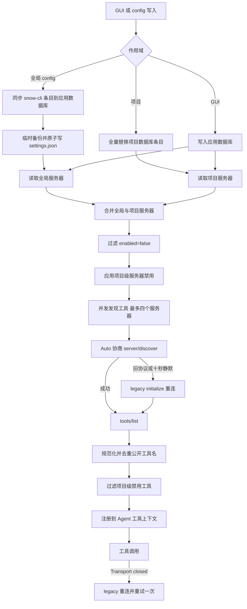

# 1-配置 MCP 服务器

MCP（Model Context Protocol）服务器向 AI 提供外部工具。Snow App 支持本地 `stdio` 和远程 Streamable HTTP，并会把全局服务器与项目服务器组合成当前项目的有效工具集。

## 1. 配置入口与作用域

| 入口                                             | 存储与生效语义                                                                                      |
| ------------------------------------------------ | --------------------------------------------------------------------------------------------------- |
| **设置 → MCP 设置**（设置页 id：`mcp-settings`） | 直接管理应用数据库；可配置全局或项目服务器、服务器与工具级启停（全局+项目）。                       |
| Agent 的 `config` 服务                           | 全局 `settings.mcpServers` 先同步到应用数据库并写 `~/.snow/settings.json`；项目级直接写应用数据库。 |
| 手动编辑 `~/.snow/settings.json`                 | 仅修改 Snow CLI 共享文件；需要在 MCP 设置页执行“同步 Snow CLI MCP 设置”。                           |

全局服务器对所有项目可见。项目服务器与全局服务器**叠加**，不是按名称覆盖；内部 ID 独立。公开服务器名若冲突，会规范化并追加稳定短哈希，实际工具全名应以“获取工具”或项目工具列表为准。

## 2. 传输与字段

| 字段        | `stdio`                              | `http`         | 说明                                         |
| ----------- | ------------------------------------ | -------------- | -------------------------------------------- |
| `type`      | `stdio`（`local` 也会按 stdio 连接） | `http`         | 默认 `stdio`                                 |
| `command`   | 必填                                 | 忽略           | 可执行文件或可解析命令                       |
| `args`      | 可选字符串数组                       | 忽略           | 逐项传给子进程                               |
| `env`       | 可选字符串对象                       | 忽略           | 传给子进程的环境变量                         |
| `url`       | 忽略                                 | 必填           | Streamable HTTP MCP 端点                     |
| `headers`   | 忽略                                 | 可选字符串对象 | HTTP 请求头，例如授权头                      |
| `enabled`   | 可选                                 | 可选           | 默认 `true`                                  |
| `timeoutMs` | 可选正整数                           | 可选正整数     | 连接与工具发现的总时间预算；默认 `120000` ms |

`timeoutMs` 当前用于**工具发现阶段**：连接和 `tools/list` 共享同一个截止时间。它不是每次 `tools/call` 的通用执行超时；长任务仍应由服务器自身实现取消或超时。

### 2.1 stdio 示例

```json
{
  "type": "stdio",
  "command": "npx",
  "args": ["-y", "@example/mcp-server"],
  "env": {
    "EXAMPLE_REGION": "local"
  },
  "enabled": true,
  "timeoutMs": 120000
}
```

在 Windows 上，GUI 直接填写普通路径；在 JSON 中反斜杠必须转义为 `\\`。Snow App 启动 stdio 服务时会结合终端 shell 环境解析 PATH，但生产配置优先使用可验证的绝对可执行路径。

### 2.2 HTTP 示例

```json
{
  "type": "http",
  "url": "https://mcp.example.com/mcp",
  "headers": {
    "Authorization": "Bearer <token>"
  },
  "enabled": true,
  "timeoutMs": 30000
}
```

仅使用可信的 HTTPS 端点。HTTP 服务器能看到发给其工具的参数，并能返回进入模型上下文的内容。

## 3. 设置面板配置

1. 打开 **设置 → MCP 设置**；
2. 选择全局或项目范围；
3. 点击 **添加服务**，选择 `stdio` 或 `http`；
4. 填写对应必填字段、`enabled` 和可选 `timeoutMs`；
5. 保存后点击 **获取工具**；
6. 在项目工具列表中关闭不需要的服务器或单个工具；
7. 用一个只读、最小参数调用验证结果。

JSON 导入支持 `{ "mcpServers": {...} }`、Claude 风格 `{ "servers": {...} }` 和纯服务器映射。导入前检查未知字段、命令、环境变量、请求头和目标 URL。

## 4. Agent 通过 `config` 配置

### 4.1 全局配置

```json
{
  "scope": "settings",
  "key": "mcpServers",
  "value": {
    "docs": {
      "type": "http",
      "url": "https://mcp.example.com/mcp",
      "headers": {},
      "enabled": true,
      "timeoutMs": 30000
    },
    "local-tools": {
      "type": "stdio",
      "command": "npx",
      "args": ["-y", "@example/mcp-server"],
      "env": {},
      "enabled": true,
      "timeoutMs": 120000
    }
  }
}
```

写入全局 `settings.mcpServers` 的真实顺序是：

1. 按文件中的服务器映射同步应用数据库；
2. upsert `source=snow-cli`、ID 为 `global:<name>` 的条目；
3. 删除数据库中同来源但新映射已不存在的 `global:*` 孤儿条目；
4. UI 手工创建的其他来源条目不受该差集删除影响；
5. 备份原 `settings.json`，再原子替换文件；成功后删除本次临时备份。

因此它立即影响应用中的 MCP 发现。`value` 是**全量服务器映射**，不要只传想修改的一项，否则其他 `snow-cli` 来源的全局条目会从同步结果中删除。应先 `config-get`，在完整对象上修改，再 `config-set`。

### 4.2 项目级配置

```text
config-get scope=settings key=mcpServers projectId=<projectId>
config-set scope=settings key=mcpServers projectId=<projectId> value={...完整映射...}
```

传 `projectId` 后，`value` 会**全量替换该项目服务器**：先删除现有项目条目，再逐项写入。全局服务器不会被删除，而是与项目服务器一起成为有效配置。项目级写入直接进入应用数据库并立即生效；不要把 `.config-backups` 当作项目 MCP 的持久恢复历史。

`config-delete scope=settings key=mcpServers projectId=<projectId>` 会清空该项目的全部 MCP 服务器，调用前必须明确确认。

## 5. 配置、发现与调用数据流



## 6. 协议发现与旧版本回退

Snow App 对 `stdio` 和 HTTP 使用相同的生命周期策略：

1. Auto 模式优先尝试 `2026-07-28` 的无状态 `server/discover`；
2. SDK 对规范的 `Method Not Found` / `Unsupported Protocol Version` 进行自动降级；
3. 对其他协商 JSON-RPC 错误或发现阶段连接关闭，Snow App 重新建立连接并使用 legacy `initialize`；
4. `server/discover` 探测请求本身在传输层失败（如仅支持 `2024-11-05` 会话式的服务器对 `discover` 回 HTTP 400/404/405，且响应体不是合法 JSON-RPC 错误）时，同样视为不支持无状态发现，回退 legacy `initialize`；
5. 若 `server/discover` **10 秒无响应**，也按旧服务器处理并重连；
6. 连接成功后调用 `tools/list`；
7. 工具调用若报 `Transport closed`，用 legacy 握手重连并重试一次；若重试仍失败，保留原始传输错误以便诊断。

发现多个服务器时最多并行 4 个。单个服务器失败会记录错误并跳过，不阻止其他服务器工具注册。

## 7. 启停条件与工具禁用

有效工具需要同时满足：

- 服务器配置 `enabled` 不是 `false`；
- 对全局外部服务器，当前项目没有禁用该服务器；
- 全局作用域没有禁用该工具（全局工具开关，对所有项目生效）；
- 当前项目没有禁用该工具的完整公开名称；
- 项目自有服务器本身启用。项目服务器不使用全局服务器的项目开关，但仍可逐工具禁用。

这意味着“服务器存在于设置中”不等于“工具会进入当前 Agent 上下文”。修改全局或项目开关后重新获取工具，并用实际完整名配置子代理的 `toolsJson` 或 Skill 的 `allowed-tools`。

## 8. 工具级启停

MCP 设置面板支持**工具级启停**：每个服务器行显示工具数量按钮，点击后展开该服务器的工具列表。

- 每个工具可独立启用/禁用；**全局作用域**的开关对所有项目生效，**项目作用域**的开关仅对当前项目生效，两者与聊天框“项目 MCP”弹窗共享同一存储；
- 提供**全部启用 / 全部禁用**批量按钮，以及按名称/描述搜索过滤；点击工具行可查看详情（完整 description 与参数 Schema）；
- 禁用语义为**黑名单**：默认全部启用，只有被禁用的工具进入黑名单；
- 服务器级与工具级开关是 **AND 关系**：服务器被禁用时，其下所有工具均不可用，即使工具级开关仍为启用。

工具级启停（全局与项目）由 MCP 设置面板管理并存储在应用数据库，**不写入 settings.json**，也不通过 `config` 服务（`config-list`/`config-get`/`config-set`）配置（UI-only）。

## 9. 隐私、凭据与供应链风险

### 9.1 凭据并非自动安全

- `env` 和 `headers` 会以配置内容存储，并传给外部进程或 HTTP 服务；
- `config` 对 `apiKey`、`visionApiKey` 等专门敏感键有强制遮罩，但 `settings.mcpServers` 整体不是敏感键，**不要假设其中的 `env`/`headers` 会在 config 读取时自动隐藏**；
- 不要把令牌写入文档、聊天、截图、仓库或可共享的项目配置；优先使用受控环境注入、最小权限短期令牌和服务端秘密管理；
- 不要让 Agent回显凭据来“验证”配置。应通过只读健康检查验证授权是否成功。

### 9.2 工具结果隐私

Snow App 的隐私遮罩只有在隐私设置已启用，并且该完整工具名被加入“工具结果”遮罩列表时才处理结果；API 模式失败会回退本地规则。未配置的外部 MCP 工具结果不会因此自动遮罩。对数据库、文件、日志和 SaaS 工具应限制查询范围，并在送入模型前最小化敏感数据。

### 9.3 信任服务器与命令

- stdio 命令以当前用户权限运行，可读写其有权访问的文件和网络；
- HTTP 服务接收工具参数，可能记录请求；
- 安装或启用前核对发布者、包名、固定版本、源代码和数据处理政策；
- 不要使用不可信的 `npx -y` 包、未知脚本或明文 HTTP；
- 先关闭写入/删除类工具，只开放当前任务需要的最小集合。

## 10. 临时备份的真实语义

对全局文件型 config 写入，Snow App 会在 `~/.snow/.config-backups/` 创建写前备份并原子替换目标文件。**本次写入成功后，备份立即删除**；它只是写入期间的临时安全网，不是可依赖的版本历史。失败或并发异常可能留下备份，清理逻辑最多保留每个文件 10 个残留。

项目级 MCP 是数据库全量替换流程，不应依赖上述文件备份。重大调整前应先用 `config-get` 保存经用户批准的非敏感配置副本；不要复制明文凭据到聊天或文档。

## 11. 排错

| 症状                                         | 原因与处理                                                                                                                                       |
| -------------------------------------------- | ------------------------------------------------------------------------------------------------------------------------------------------------ |
| stdio 报没有 command                         | `type` 为 `stdio`，但 `command` 为空；检查 JSON 路径转义和可执行文件。                                                                           |
| HTTP 报没有 URL                              | `type` 为 `http`，但 `url` 为空；确认端点是 MCP Streamable HTTP。                                                                                |
| `server/discover` 超时                       | 客户端会在 10 秒后尝试 legacy；仍失败则检查服务器日志、协议支持和网络。                                                                          |
| HTTP 服务器对 `discover` 回 HTTP 400/404/405 | 仅会话式旧服务器常见（如 Chat2DB 内置 Spring MCP）：视为不支持无状态发现，自动回退 legacy `initialize`；回退后仍失败则检查服务器日志与鉴权配置。 |
| 整体发现超过 `timeoutMs`                     | 连接与 `tools/list` 共用预算；适度增大正整数，或修复慢启动服务器。                                                                               |
| 某服务器失败但其他工具正常                   | 发现按服务器隔离；查看失败服务器错误，不要重启所有服务。                                                                                         |
| 工具列表为空                                 | 检查服务器 `enabled`、项目服务器开关、项目工具禁用、服务端 `tools/list` 返回。                                                                   |
| 工具名与配置名不同                           | 名称被规范化或因冲突追加哈希；使用 UI/工具列表返回的公开名。                                                                                     |
| 写一个全局服务器后其他条目消失               | `settings.mcpServers` 是全量映射并执行差集同步；恢复完整对象后重写。                                                                             |
| 项目配置修改后全局工具仍存在                 | 项目服务器与全局服务器叠加；需要在项目工具设置中禁用全局服务器。                                                                                 |
| `Transport closed`                           | Snow App 会 legacy 重连并重试一次；持续失败需检查子进程退出、服务日志或 SDK 版本。                                                               |
| 凭据出现在 config 读取结果                   | MCP `env`/`headers` 不保证自动遮罩；立即轮换暴露凭据并改用安全注入。                                                                             |

## 12. 参考

- [settings.json 配置参考](../3-参考手册/1-settings.json配置参考.md)
- [内置工具参考](../3-参考手册/2-内置工具参考.md)
