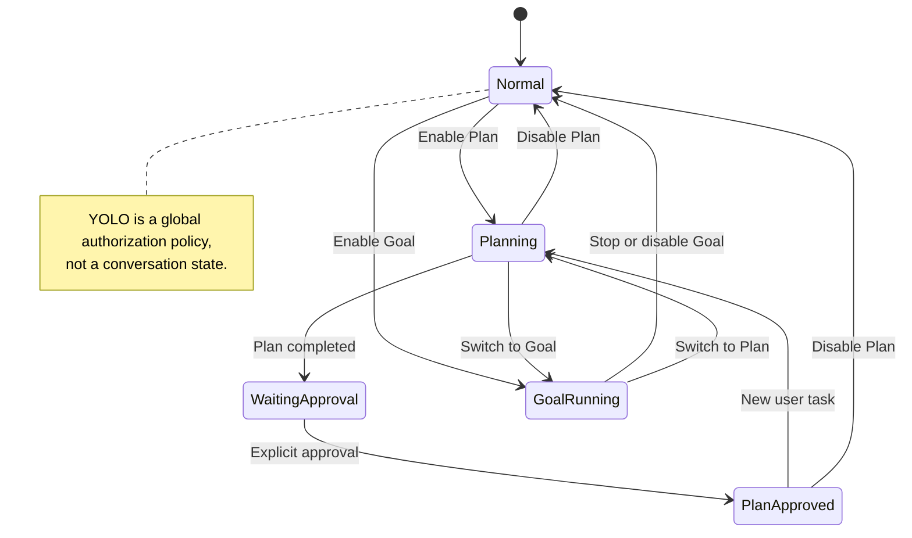
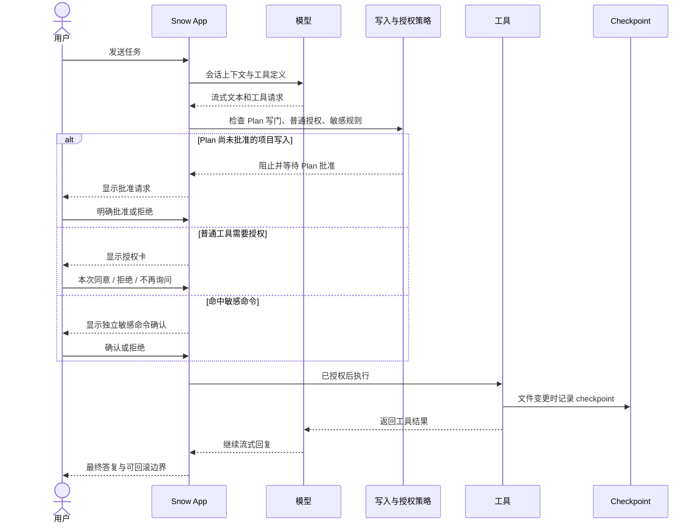

# 10-使用聊天与 AI 助手

Snow App 以对话作为 AI 协作入口。AI 除了流式回复文本，还能在授权边界内读取和修改文件、执行命令、搜索网络、操作浏览器、生成图片并调用子代理；每一步都会以工具卡片展示。

## 1. 界面与开始对话

| 区域           | 内容                                                                     |
| -------------- | ------------------------------------------------------------------------ |
| 侧边栏         | 本地/SSH 项目、会话列表、备忘录、定时任务、设置入口                      |
| 主区域         | AI 对话、终端、Git、浏览器、代码库、图像库等视图                         |
| 右侧面板       | 文件阅读器、Markdown/Office/图片预览、Diff 与 Git 面板，可多标签         |
| 顶部栏与输入区 | 切换视图/API 档案，选择模型和思考强度，输入 `/` 命令、`@` 文件或粘贴图片 |

1. 在侧边栏选择项目并创建或打开会话；
2. 输入任务并发送，`Shift+Enter` 换行；
3. AI 流式输出，并在需要时请求工具授权；
4. 工具完成后，结果回传给 AI，继续生成回复。

```text
请查找当前项目中的 Python 文件，读取关键入口，并总结各文件用途。
```

模型与 API 档案配置见 [3-配置 API 密钥与模型](3-配置API密钥与模型.md)。

**会话模型路由**：普通会话使用该会话选定的模型。Snow App 不会根据提示词复杂度在基础/高级模型之间自动切换；`advancedModel` 只是会话所属 Profile 的默认高级模型，且 `advancedModel` 与 `basicModel` 不会互相回退。

**标题路由**：首次生成会话标题时使用 `basicModel`，供应商、凭证和 Profile 跟随该会话绑定的 Profile；若绑定档案已删除，则按普通会话规则回退当前 active Profile。

### 1.1 管理本地项目与工作区

左侧“项目”区域既能创建新的磁盘目录，也能登记已有目录。两种操作的边界不同：

1. **创建项目**：点击“+”并选择“创建项目”，填写项目名，再选择保存它的父目录。主进程会在磁盘上创建真实项目目录，把它登记为本地工作区，并将它设为活动工作区；
2. **添加已有本地目录**：选择“添加本地目录”，可通过目录选择器选取文件夹，也可向对话框**恰好拖入一个文件夹**。Snow 只登记已有路径，不会复制其内容，并把新条目设为活动工作区；
3. **激活与排序**：点击工作区，或从三点/右键菜单选择“设为活动”，即可切换当前上下文。拖拽工作区条目可调整顺序，新的 `sortOrder` 会持久化；
4. **重命名与移除**：菜单中的“重命名”只修改 Snow 内显示名称，`directoryId` 与磁盘路径保持不变；“删除”经确认后从工作区列表移除登记，它不同于在项目资源管理器中删除文件或目录；
5. **查看详情**：菜单中的“详情”进入该工作区的项目资源管理器，即使它不是当前活动工作区也可查看；资源管理器的文件操作见 [12-Git 面板与代码浏览](12-Git面板与代码浏览.md)。

SSH 工作区不走本地目录选择/拖入流程，而是选择“添加 SSH 目录”进入独立连接向导；凭据、远程路径与重连规则见 [11-终端与 SSH 远程管理](11-终端与SSH远程管理.md)。

## 2. 会话与输入

### 2.1 会话操作

会话行的「⋯」或右键菜单支持：置顶/取消置顶、重命名（也可双击标题）、设置图标、导出 Markdown/HTML/JSON/CSV、进入多选模式和删除。草稿文字与图片按会话保存，切换会话后会恢复，发送成功后清除。

单条删除和批量删除都需要确认。删除会话还会中止相关流、级联删除其子代理会话，并清理对应输入草稿。若会话引用图库图片，确认框会显示「同时删除图片」选项：

- 默认**不勾选**，因此删除会话时保留图库中的图片；
- 只有主动勾选后，才会同时删除引用图片的物理文件和 SQLite 图库索引；
- 直接在图像库删除单图是另一项操作，会删除文件与索引并改写引用该图的会话消息。

#### 拖拽会话注入开头上下文

从会话列表**拖拽历史会话到聊天输入框**，会把它附加为「开头上下文」，随**下一条消息**一起注入：

- 输入框上方出现**附件栏**，显示附带的会话与估算字符数，可单个移除或折叠为摘要行；
- 多条附带会话按拖入顺序拼接，先注入再拼接当前消息；
- 注入预算可在设置中调整：单条预算默认 `40000` 字符、总预算默认 `60000` 字符（范围 `1000–200000`），超出部分会被截断；
- 拖拽到已有草稿的输入框同样生效；发送成功后附件随消息消费，不会残留到后续消息。

### 2.2 跨项目通知聚合

侧边栏「对话」区域默认只展示**当前项目**的会话；当**其他项目**的会话产生动态时，会在会话列表下方聚合为**跨项目通知**区块，避免切换项目后丢失后台会话的状态：

- **聚合内容**：其他项目中处于**流式生成中**、**需要关注**（如等待审批/提问）或**已完成**的会话，按所属项目分组展示，组内按最近更新时间倒序；
- **状态徽标**：流式会话显示进行中动画；需要关注的会话带 **attention-required** 强调徽标（会话列表中的条目同样显示该指示）；
- **快速跳转**：点击某条通知会切换到该项目并打开对应会话，随后该会话状态改由当前项目列表正常展示；
- **项目名回退**：无法解析项目显示名时使用目录路径末级名称兜底。

### 2.3 文件与图片

- 输入 `@` 可搜索工作区文件；目录可逐级进入，面包屑可返回任意层级，`←` 返回上级；
- 输入 `@?<关键词>` 可发起**自然语言文件搜索**（见 [12-Git 面板与代码浏览](12-Git面板与代码浏览.md)）；
- 输入 `@!<关键词>` 可搜索并引用**已启用的 Skills**：选择后以技能 chip 插入输入框，随消息原样发送给 AI，AI 可读取技能名称与描述并按需加载执行；
- 可勾选或拖入整个目录，让 AI 按需读取其中内容；
- 图片可粘贴或拖入，支持单张和多张。主模型不支持视觉时，外挂视觉模型会先生成文字描述，同时保留安全的 `upload/...` 原图引用，供后续图生图使用；
- 图像生成和参考图规则见 [9-图像生成](9-图像生成.md)。

## 3. 完整斜杠命令

输入 `/` 打开命令面板。当前版本共 10 个命令：

| 命令                  | 行为与可用条件                                                   |
| --------------------- | ---------------------------------------------------------------- |
| `/clear`              | 创建一个新会话；不是 `/new`，也不会在原会话内抹除历史            |
| `/file-changes`       | 查看当前会话的文件变更与 Diff；尚无已持久化会话时禁用            |
| `/mcp`                | 管理当前项目的 MCP；需要已选择项目                               |
| `/role`               | 编辑当前项目的 `ROLE.md`；需要已选择项目                         |
| `/sensitive-commands` | 配置当前项目的敏感命令规则；需要已选择项目                       |
| `/permissions`        | 查看/删除当前项目的永久授权工具；需要已选择项目，YOLO 模式下禁用 |
| `/skills`             | 管理当前项目的 Skills；需要已选择项目                            |
| `/codebase`           | 管理当前项目的代码库索引；需要已选择项目                         |
| `/review`             | 让 AI 审查当前项目的 Git 变更；仅新会话且存在项目目录时可用      |
| `/compact`            | 压缩当前会话；无消息或正在压缩时禁用                             |

AI 运行期间，`/compact`、`/role`、`/sensitive-commands`、`/skills`、`/codebase`、`/mcp`、`/review` 会禁用。`/file-changes` 与 `/clear` 不在这组运行中禁用命令内，但仍受各自条件约束。

## 4. Plan、Goal 与 YOLO

### 4.1 Plan Mode

Plan Mode 用于先调查和制定计划，再经用户批准后执行：

- Plan 与 Goal 在同一会话内互斥；两者状态按会话隔离并持久化，切换回来会恢复；
- 规划阶段存在项目写入硬门控。批准前，只允许写入计划目录中的计划文档，其他项目写入会被阻止；
- AI 完成计划后必须单独调用 `app-control-requestApproval` 请求批准。普通回复里出现“批准”或类似文字不会解锁写入；
- 用户批准后，仅当前会话/当前任务的项目写入可以继续；发送新的用户任务会重置该会话的批准状态；
- 子代理不能自行获得 Plan 批准。父会话尚未批准时，子代理的写操作同样会被拦截。

### 4.2 Goal Mode

Goal Mode 是持续的目标驱动自主循环。它会在配置的 token 预算和停止条件内持续推进任务；预算可在加号菜单中调整（含**无限**选项）。Goal 与 Plan 互斥，开关与预算都按会话保存。文档不承诺固定的循环次数或单一终止算法，实际执行还受预算、模型结果、工具状态和用户停止操作影响。

### 4.3 YOLO Mode

YOLO 是**全局持久化授权策略**，不是会话模式：

- 自动批准普通工具调用，也会处理当前待决的非敏感授权；
- 已设置为永久批准的工具同样可直接通过；
- **不能绕过敏感命令规则**。`bash-terminal-execute` 命中当前项目合并后的敏感规则时，即使开启 YOLO 仍必须单独确认；
- 交互式命令不弹独立的敏感命令确认，因为用户会在交互终端中逐次输入；
- YOLO 下普通 `toolConfirmation` 确认阶段不运行，但执行前策略门仍然有效。



## 5. 工具授权与敏感命令

未开启 YOLO 且工具未被永久批准时，Snow App 显示授权卡。你可以：

- **同意本次**：只执行本次调用；
- **拒绝**：该调用不执行，拒绝结果会返回给 AI；
- **同意且不再询问**：有项目时持久化为项目级工具批准；无项目时只加入当前应用进程内的批准集合。

同一批工具必须全部完成授权决定后才会开始执行。`user-interaction-askUserQuestion` 会直接进入交互问答，不走普通工具批准卡。敏感 Bash 命令始终使用独立确认，普通工具的永久批准和 YOLO 都不能代替它。



## 6. 工具卡片与消息操作

常见工具卡片包括命令输出、持久终端、文件读取与 Diff、搜索结果、浏览器截图与网络信息、TODO、图像生成、子代理及代码诊断。文件修改后可用 `/file-changes` 集中查看本会话的改动。

AI 消息支持复制、复制 Markdown、复制纯文本、切换原始 Markdown、停止生成和回滚。渲染支持表格、代码块、KaTeX（`$...$` / `$$...$$`）与 Mermaid。

## 7. Checkpoint 与消息回滚

在目标 AI 消息或压缩边界选择回滚前，应先查看 Diff。可选择：

- **仅回滚会话**：删除目标边界及其后的消息，恢复消息时间线；
- **回滚会话和文件**：除消息外，还恢复 checkpoint 记录的文件，并清理关联 TODO。

恢复能力有明确边界：checkpoint 缺失、已清理，或外部变更未被 checkpoint 覆盖时，不能保证恢复。回滚不是通用备份替代方案。

## 8. 上下文压缩

`/compact` 会把后续发送给模型的上下文切换为交接摘要，从而降低上下文占用；正常继续聊天时不会自动展开压缩前的旧上下文。

压缩**不是绝对不可逆**：压缩消息是带 `checkpoint_id` 的 `context_compaction` 边界，可把该边界作为消息回滚目标。选择“仅回滚会话”可恢复消息边界；选择“回滚会话和文件”还会尝试恢复 checkpoint 文件并清理关联 TODO。恢复仍受 checkpoint 是否存在及覆盖范围限制，因此压缩后应先确认摘要完整，回滚前应先查看 Diff。

## 9. 定时任务与备忘录

- 定时任务可由侧边栏或 `app-control-createScheduledTask` 创建，支持单次执行、固定间隔或每日固定时刻。任务保存在本地数据库中，重启应用后仍会保留并继续执行；应用未运行时错过的执行会被跳过；
- 定时任务可用 `model` 固定主请求高级模型，并用 `basicModel` 固定首次会话标题模型。若指定 `apiProfile` 但省略 `model`，高级默认值只取同一 Profile 的 `advancedModel`，不会借用当前会话或其他 Profile 的模型；`basicModel` 省略时使用任务会话绑定 Profile 的默认值，且不会影响主请求；`thinkingStrength` 省略或 trim 后为空时不保存快照，在任务触发时继承所用 Profile 的最新配置；
- 备忘录可在侧边栏创建、编辑和删除，AI 也可通过 `app-control-createMemo` 创建；AI 还可使用 `app-control-listMemos`、`app-control-getMemo`、`app-control-updateMemoStatus` 按当前项目读取和更新备忘录状态。
- AI 可通过全局站点拦截工具读取和维护 `proxy_browser_settings.blockedPatterns`：`app-control-getBlockedPatterns` 无参数读取规则，`app-control-updateBlockedPatterns` 使用 `{operation: "add" | "remove" | "replace", patterns: string[]}` 添加、删除或完整替换规则。规则不是项目级配置，更新时会校验 JavaScript 正则，并影响 `websearch` 结果过滤和 `websearch-fetch` 抓取拒绝。

## 10. 后台通知、托盘与窗口

- 当 Snow 没有处于前台聚焦状态时，**AI 流程完成**、**敏感命令等待确认**或 **`askUserQuestion` 等待回答**会触发系统通知；应用已聚焦时不会重复弹出通知。点击带会话目标的通知会恢复并聚焦窗口，校验目标仍存在后切换到对应工作区与会话。若原窗口已被销毁或渲染帧刷新，点击通知会回退到主窗口或重建窗口，暂存激活目标并在加载完成后重新派发，避免激活消息静默丢失。平台不支持系统通知时，Snow 会改用任务栏闪烁或 macOS Dock 跳动提醒；
- 所有平台的窗口关闭入口都会先显示确认框。可以取消、选择“最小化”隐藏到系统托盘而不退出，或确认彻底退出；隐藏期间会话、终端和进程内定时任务继续运行。macOS 隐藏时还会暂时移除 Dock 图标；
- 单击托盘图标或选择“打开 Snow App”会恢复、显示并聚焦主窗口；托盘菜单的“退出”会直接结束应用。托盘悬停信息会周期性汇总进行中会话、活动终端、项目数、待办备忘录和今日 Token 用量；有进行中会话时图标显示活动标记；
- 顶栏可折叠侧边栏、折叠或全屏显示右侧面板；拖动两侧分隔条可调整宽度。主窗口会保存尺寸、位置和最大化状态，下次启动时恢复；保存位置不再位于任何显示器可见区域时会回退到安全位置。

## 11. 常见问题

| 症状                         | 处理                                                                                                                                                                                                                                                                                                                                                                  |
| ---------------------------- | --------------------------------------------------------------------------------------------------------------------------------------------------------------------------------------------------------------------------------------------------------------------------------------------------------------------------------------------------------------------- |
| AI 没有可用工具              | 检查 API 档案、模型和相应工具配置；图像生成需独立配置渠道                                                                                                                                                                                                                                                                                                             |
| 工具一直未执行               | 检查同批工具是否仍有待决授权，或 Plan 写门是否在等待明确批准                                                                                                                                                                                                                                                                                                          |
| YOLO 下仍要求确认命令        | 命中了敏感命令规则，这是预期安全行为                                                                                                                                                                                                                                                                                                                                  |
| `/review` 不可用             | 仅新会话且存在项目目录时可用                                                                                                                                                                                                                                                                                                                                          |
| 压缩后看不到旧上下文         | 后续模型上下文已切到摘要；需要时从压缩边界执行消息回滚                                                                                                                                                                                                                                                                                                                |
| 删除会话后图片仍在           | 默认保留图库图片；只有删除确认时勾选「同时删除图片」才级联删除                                                                                                                                                                                                                                                                                                        |
| 关闭窗口后任务停止           | 关闭确认框应选择“最小化”隐藏到托盘；选择“退出”会结束进程并清除仅存于内存的定时任务                                                                                                                                                                                                                                                                                    |
| 回答流中途发生响应体读取错误 | Rust 后端会在 API 档案的 `maxRetries` 与既有可取消退避范围内无感重试；重试期间消息仍显示普通流光标，失败尝试的正文、思考、用量、响应元数据与工具碎片会被丢弃。若重试耗尽，则保留不完整结果并显示既有中断提示；明确的供应商终止状态不会进入传输重试。Unexpected EOF 或空闲超时仍沿用既有部分正文阈值：已输出大量文本（约 1000 字符以上且无工具状态）时可保留不完整结果 |

## 12. 参考

- [内置工具参考](../3-参考手册/2-内置工具参考.md)
- [配置 API 密钥与模型](3-配置API密钥与模型.md)
- [图像生成](9-图像生成.md)
