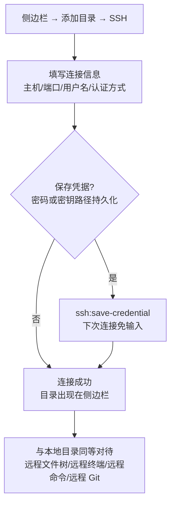

# 11-终端与SSH远程管理

Snow App 内置**终端**（基于 node-pty + xterm.js 的完整 PTY 终端）与
**SSH 远程管理**：本地终端可多开、可交互；SSH 目录作为工作区挂载，
文件操作、终端、Git、AI 工具全部走远程通道，与本地体验一致。

## 1. 内置终端

### 1.1 打开终端

| 方式 | 操作 |
| --- | --- |
| 新建终端 | 右侧面板右键 → **新建终端**（可开多个标签） |
| 在目录打开 | 文件阅读器 / Git 面板 / 文件列表右键 → **在终端中打开**（自动 cd 到该目录） |
| 项目快速打开 | 顶部项目标签右键 → 打开终端 / 浏览器 / 代码库 |
| 会话中打开 | 聊天中输入 `/` 命令或让 AI 调用 `bash-terminal-execute` 时，输出可一键"在终端中打开" |

### 1.2 基本操作

- **多标签**：每个终端标签独立 PTY 会话，可同时运行；
- **复制 / 粘贴**：终端内选中文本 → 复制按钮；粘贴按钮（正确处理
  bracketed paste）；
- **链接点击**：终端输出中的 URL 点击后在内置浏览器 tab 打开；
- **颜色与排版**：`ls --color`、git diff 等彩色输出保持可读；
- **键位**：遵循 Windows 终端惯例（如 `Ctrl+C` 中断等）。

### 1.3 与 AI 的配合

AI 的 `bash-terminal-execute` 每次执行独立命令；需要**长驻进程或
交互式会话**（如 `npm run dev`、vim、SSH 登录）时，AI 会使用
**交互式终端会话**：

- AI 打开交互会话后会实时展示终端画面，用户可直接在其中输入内容；
- 会话通过 UUID 标识，AI 可执行 `open` / `send` / `read` / `wait` /
  `resize` / `close` / `focus` / `list` 等操作管理多个会话；
- 用户也可以随时在会话中输入密码、确认提示等。

## 2. SSH 远程管理

### 2.1 添加 SSH 工作区

1. 侧边栏 → **添加目录 → SSH**；
2. 填写连接信息（主机、端口、用户名、认证方式：密码或密钥）；
3. 可选**保存凭据**：密码或密钥路径持久化（`ssh:save-credential`），
   下次连接免输入；
4. 连接成功后，该 SSH 目录出现在侧边栏，**与本地目录同等对待**：
   - 浏览远程文件树、在右侧阅读器打开远程文件；
   - 在远程目录打开终端（远程 shell）；
   - 使用 filesystem 工具读写远程文件、bash 工具在远程执行命令；
   - 打开远程 Git 仓库（见下文）。

> 支持 `ssh://user@host:port/path` 形式的 URL 解析与连接（`ssh:parse-url`）；
> 已保存的凭据可在 **SSH 管理界面**中列出与管理（`ssh:list-credentials`）。

### 2.2 远程 Git

远程工作区的 Git 仓库与本地一样支持：

- 仓库发现与状态展示（自动发现 `ssh://` 仓库）；
- 远程文件变更的 diff 预览、提交、拉取/推送；
- **远程 Git 轮询**：无法使用文件系统 watcher 的远程仓库每 10 秒自动
  刷新状态。

### 2.3 远程命令与文件

- **远程命令**：AI 在远程工作区执行命令时自动走 SSH 通道
  （`remoteWorkspaceCommand`），与本地 `bash-terminal-execute` 体验一致；
- **远程文件操作**：filesystem 工具对 `ssh://` 路径自动路由到远程
  实现，读写、编辑、创建、搜索均透明可用；
- **会话复用**：聊天中 `Ctrl+点击` 远程路径时按工作区复用 SSH 连接，
  避免重复握手。

### 2.4 常见问题

| 症状 | 原因与处理 |
| --- | --- |
| 连接超时/失败 | 检查主机与端口、网络/代理设置（见 [4-配置代理与网络](4-配置代理与网络.md)） |
| 认证失败 | 检查用户名与密码/密钥路径；密钥格式需为标准 OpenSSH 格式 |
| 远程 Git 状态不刷新 | 远程仓库依赖轮询（10 秒间隔），稍候或手动触发刷新 |
| 终端中文乱码 | 确认远程 locale 为 UTF-8（`export LANG=en_US.UTF-8`） |

## 3. 参考

- 终端设置（shell 路径、字体等）：设置 → 终端设置
  （`app-control-openSettings page=terminal-settings`）
  - **Shell 统一生效**：终端设置中的 Shell 路径是所有命令执行的唯一
    权威来源——AI 的 `bash-terminal-execute`、生命周期 Hooks 脚本、
    Git 面板（WSL 场景）与右侧集成终端均使用该 Shell；留空时自动检测
    系统默认终端（Windows：PowerShell → CMD → Git Bash → COMSPEC；
    macOS/Linux：zsh → bash → fish → sh → `$SHELL`），AI 命令与集成
    终端的检测结果完全一致。
  - **路径校验**：保存非空 Shell 路径时会校验文件存在性，无效路径将被
    拒绝保存；`terminal-open` 传入不存在的 Shell 路径也会直接报错，
    不会静默回退到默认 Shell。
  - 网络代理字段已从终端设置中移除（终端内命令如需代理，请在 Shell
    环境自行配置 `HTTP_PROXY`/`HTTPS_PROXY` 等环境变量）。
- Git 面板：[12-Git面板与代码浏览](12-Git面板与代码浏览.md)
