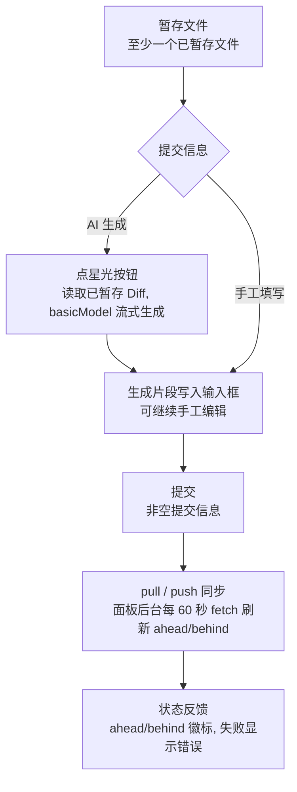

# 12-Git面板与代码浏览

本文介绍四类代码相关功能：**Git 面板**（仓库、分支、变更、提交与同步）、**项目资源管理器**（本地/SSH 文件树与工作区搜索）、**右侧文件阅读器**（多标签查看、编辑与文内搜索），以及**代码库面板**（语义搜索与 3D 关系球体）。

## 1. Git 面板

### 1.1 打开与仓库选择

- 从右侧面板的 **Git tab** 打开 Git 面板；面板会自动发现工作区中的 Git 仓库；
- 使用**仓库选择器**切换当前仓库；右键可复制仓库路径、在文件管理器中显示，或在该目录打开终端；
- 本地仓库与 `ssh://` 远程仓库使用同一组面板操作。SSH 连接规则见 [11-终端与 SSH 远程管理](11-终端与SSH远程管理.md)。

### 1.2 分支

分支选择器把分支分为**本地分支**和**远程分支**两组。选择其他条目会执行 checkout 并刷新状态；“创建分支”会先校验名称、拒绝重复名称，成功后创建并切换到新分支。分支按钮的右键菜单还可复制当前分支名、创建分支或刷新列表。

### 1.3 变更、暂存与 Diff

| 操作 | 行为 |
| --- | --- |
| 查看变更 | “Changes” 视图分别列出未暂存与已暂存文件，并显示新增、修改、删除等状态；点击文件在右侧打开对应 Diff |
| 单项/批量选择 | 普通点击选择单项；`Ctrl/Cmd` 累加选择，`Shift` 在同一区域范围选择 |
| 暂存/取消暂存 | 可对选中项操作，也可用区域标题操作“全部暂存”或“全部取消暂存” |
| 丢弃变更 | 对一个或多个未暂存文件发起丢弃；执行前必须在确认框确认，成功后刷新状态 |
| 文件快捷操作 | 文件条目可在文件阅读器打开，也可在终端中打开其位置；本地路径还可在文件管理器中显示 |

工具栏可在 **Changes** 与 **Graph** 之间切换。Graph 按页读取提交历史，显示提交关系、分支/远程/tag 装饰；展开某个提交可查看**该提交内的文件列表与 Diff**：

- **查看提交内差异**：展开提交后点击文件条目，右侧会显示该文件在此提交中的差异（`View File Diff in This Commit`），当前查看的文件在列表中高亮；
- **新标签页打开**：文件条目的右键菜单支持**在新标签页打开 Diff**（先以加载态打开标签，再异步填充结果）与**复制文件路径**；
- **远程仓库支持**：上述提交内差异查看对本地仓库与 `ssh://` 远程仓库均可用（远程仓库经 SSH 通道执行）。

手动刷新会同时刷新当前状态和正在显示的提交图。

### 1.4 提交、AI 提交信息与远程同步

- **提交前置条件**：必须至少有一个已暂存文件，并填写非空提交信息；否则提交按钮不可用；
- **AI 提交信息**：同样必须先暂存文件。点击星光按钮后，Snow 读取**已暂存 Diff**并调用当前 active API Profile 的 `basicModel` 流式生成提交信息，生成片段直接写入输入框；生成期间按钮变为停止按钮。主动停止或流被取消时，已经收到的流式文本会保留，可继续手工编辑；
- **同步操作**：工具栏提供 pull、push 和手动状态刷新。面板打开后还会立即执行一次后台 fetch，并在窗口可见时每 60 秒再次 fetch；成功后刷新 ahead/behind 数量。本地与 SSH 仓库都使用该流程，后台 fetch 的离线、鉴权或无远端错误会静默忽略；
- **提交模式**：提交按钮旁的下拉菜单可在「仅提交」与「提交并推送」之间切换，选择会持久化并在重启后恢复；「提交并推送」在提交成功后自动执行 push，推送失败会显示错误并保留已提交状态；
- **状态反馈**：ahead/behind 数量显示在顶部，pull 的落后状态有徽标；pull/push 失败会显示错误，而后台 fetch 不打断操作。

> **AI 协作**：AI 修改文件后可通过聊天中的 `/file-changes` 查看本轮变更，也可在 Git 面板审阅和暂存。若让 AI 在终端直接执行 Git 命令，该命令不等同于面板按钮，仍应遵循用户授权与敏感命令规则。

### 1.5 Git 仓库设置

**设置 → Git 仓库设置**（设置页 id：`git-settings`）可配置仓库状态扫描与刷新行为：

- **扫描深度**：状态扫描的目录深度（默认 `1`，与 VSCode 一致）；
- **忽略文件夹**：跳过变更监听的目录列表；
- **变更监听防抖**：文件变更合并为一次状态刷新的等待时间；
- **SSH 轮询间隔**：SSH 仓库状态轮询周期；
- **状态变更上限**：本地 Git 状态在超出上限时截断显示，并在 Git 面板给出警告，保持超大仓库的响应性；
- **自动刷新**：是否自动刷新仓库状态。

## 2. 项目资源管理器与工作区搜索

从工作区三点/右键菜单选择“详情”，可打开目标工作区的项目资源管理器：

- **本地与 SSH 文件树**：两者都支持按需展开目录、刷新、点击文本文件在右侧阅读器打开，以及通过右键菜单重命名或删除文件/目录；SSH 操作通过当前远程会话执行；
- **文件树多选**：本地文件树支持 `Ctrl/Cmd` 点选、`Shift` 范围选择与 `Ctrl+A` 全选，可对多个条目批量操作；
- **文件/目录右键菜单**：本地条目的右键菜单还支持**在终端中打开**（文件取其所在目录）、**在系统文件管理器中显示**、**复制路径**，以及“**打开方式 / Open with**”二级菜单（用本机已安装 IDE 打开该目录，探测逻辑与工作区目录菜单一致）；SSH 远程条目不提供文件管理器与 IDE 打开方式；
- **删除边界**：资源管理器中的删除会修改实际本地或远程文件系统，与仅从工作区列表移除登记不同，应确认目标无误后再操作；
- **本地工作区搜索**：本地工作区顶部显示“搜索文件和内容”，同时匹配文件名和文本内容。点击结果文件名打开整个文件；点击某个命中行会按该行打开并短暂高亮，还可用 `Ctrl/Cmd` 或 `Shift` 选择多行后拖入聊天；
- **SSH 搜索差异**：SSH 工作区仍可浏览、重命名、删除和打开文件，但不显示同一个“搜索文件和内容”栏。

## 3. 右侧文件阅读器、编辑与文内搜索

右侧面板是**多标签**文件阅读器。它既能读取本地文件，也能通过现有 SSH 会话读取远程文件；对可编辑文本可进入编辑模式并保存回对应本地或远程路径。

| 文件类型 | 支持 |
| --- | --- |
| 文本/代码 | 语法高亮、行号、按目标行打开、编辑与保存、文内搜索 |
| Markdown（`.md`） | 渲染预览（标题/表格/代码块/公式/图表）与源码切换；相对文件链接在新标签打开；编辑时自动切回源码 |
| 图片 | 预览；SVG 支持图像/代码双视图 |
| Office 文档 | PDF / Word / Excel / CSV 等读取提取后的文本内容 |
| 二进制 | 显示“二进制文件”占位，不提供文本编辑 |

编辑和搜索快捷方式：

- 点击编辑按钮进入文本编辑；`Ctrl/Cmd+S` 保存，`Esc` 退出编辑。存在未保存改动时退出会要求确认；
- 文件阅读器持有焦点时，`Ctrl/Cmd+F` 打开**文内搜索**而不是全局搜索；Markdown 预览会自动切到源码；
- 搜索支持大小写匹配开关。`Enter` 跳到下一个命中，`Shift+Enter` 返回上一个，`Esc` 关闭搜索；查看和编辑模式都会定位当前命中。

### Markdown 预览小贴士

- **宽表格**：自动横向滚动，不会被截断；
- **公式**：`$...$` 行内、`$$...$$` 块级（KaTeX）；
- **图表**：`mermaid` fenced code block 渲染为可交互图表，可切换代码/图并下载；
- **切换视图**：工具栏“渲染预览 / 源码”按钮切换；编辑自动切回源码。

## 4. 全局搜索

全局搜索聚合三类对象：

1. **会话**：匹配标题、摘要和可搜索消息内容；
2. **项目/工作区**：匹配显示名称与路径，选择后激活该工作区；
3. **全部 26 个设置页**：匹配本地化设置页名称或设置页 id，选择后直接打开对应页面。

结果按会话、项目和设置分组。使用 `↑` / `↓` 循环移动当前项，按 `Enter` 打开；鼠标悬停或点击也会更新/选择当前结果。

## 5. 代码库面板与语义搜索

### 5.1 启用

代码库索引在 **设置 → 代码库设置**（`app-control-openSettings
page=codebase-settings`）中启用并配置嵌入模型；首次索引可能需要数分钟。
启用后：

- 聊天输入框的 `/codebase` 命令打开项目代码库面板；
- AI 获得 `codebase-search` 工具（见
  [7-代码库索引与代码诊断](7-代码库索引与代码诊断.md)）；
- 若代码库设置启用 **Agent Review**，审查循环使用当前 active API Profile 的
  `basicModel`；向量索引仍使用独立配置的 embedding 模型，不参与
  basic/advanced 路由。

### 5.2 3D 相似度球体

代码库面板包含一个 **3D 球体视图**：每个文件是一个节点，节点距离
反映嵌入向量的相似度，可拖拽旋转、缩放，快速感知文件聚类与依赖
关系（布局计算在 Rust 后台线程完成，不阻塞 UI）。

### 5.3 自然语言文件搜索

在聊天输入框输入 `@?<query>` 可发起**自然语言文件搜索**：AI 自动组合
grep / filesystem 工具定位相关文件，并实时展示搜索进度与结果。该文件搜索
Agent 使用当前 active API Profile 的 `basicModel`，不会按查询复杂度改用
`advancedModel`。

### 5.4 代码库索引面板（输入框旁）

- **扫描预览**：索引前显示将扫描的文件数/大小，避免误索引大目录；
- **索引统计**：文件数、嵌入进度；未索引时可一键开始/重建；
- **嵌入进度**：实时显示向量化进度，完成后可立即使用语义搜索。

## 6. 在本机 IDE 中打开工作区

本地工作区的目录菜单可以探测已安装 IDE，并把项目目录交给所选 IDE 打开：

1. 在左侧工作区列表中打开某个**本地工作区**的三点菜单或右键菜单；
2. 展开“打开方式 / Open with”；首次展开时 Snow 扫描本机已安装 IDE；
3. 选择 IDE；菜单项标题会显示探测到的可执行文件路径；
4. 如果没有候选或启动失败，菜单会显示探测/打开错误。

已知识别表包括 Visual Studio Code/Insiders、Cursor、Windsurf、Trae、Zed、Sublime Text、IntelliJ IDEA、WebStorm、PyCharm、GoLand、CLion、PhpStorm、RubyMine、Rider、DataGrip、Android Studio、Xcode 和 Fleet；实际列表取决于操作系统、安装位置与可执行文件是否能被探测。该入口只对有本地目录路径的非 SSH 工作区显示；SSH 工作区应使用远端终端或远端开发工具，不能通过此菜单当成本机目录启动。

## 7. 常见问题

| 症状 | 原因与处理 |
| --- | --- |
| Git 面板看不到仓库 | 确认工作区目录下存在 `.git`；远程仓库需先连接 SSH |
| “打开方式”中没有 IDE | 确认 IDE 已安装在系统可探测位置；关闭并重新打开目录菜单可重试当前会话中的加载流程 |
| IDE 启动失败 | 检查菜单项显示的可执行路径、项目目录权限和本机安全策略；SSH 工作区不支持此入口 |
| 语义搜索不可用 | 代码库索引未启用或未完成；检查嵌入模型配置 |
| 3D 球体卡顿 | 布局已移至 Rust 后台线程；超大仓库可先用 `fileGlob` 限定索引范围 |
| 预览与源码不一致 | Markdown 预览基于渲染器；以源码视图为准 |

## 8. 参考

- 代码库索引配置：[7-代码库索引与代码诊断](7-代码库索引与代码诊断.md)
- 数据存储位置（索引、Git 状态）：[3-参考手册/4-数据存储位置](../3-参考手册/4-数据存储位置.md)
