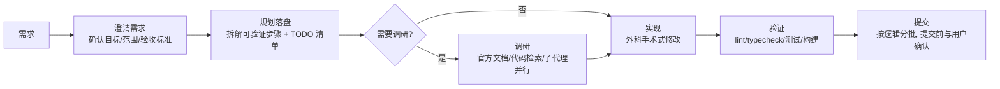

# 13-AI 开发协作（AI Development Collaboration）

> 面向使用 Snow App 的 AI Agent：在**编码、调试、性能优化、像素级 UI 调整、
> 新功能开发、新工具学习**时，如何正确选择与组合内置工具。
> 本文是"策略层"——工具本身的用法见
> [2-内置工具参考](../3-参考手册/2-内置工具参考.md)。

---

## 1. 服务生命周期管理（detach vs PTY）

### 1.1 两种执行方式的本质区别

| 维度 | `bash-terminal-execute`（一次性） | `terminal-*`（持久 PTY） |
| --- | --- | --- |
| 生命周期 | 命令跑完即结束；`detach:true` 时后台常驻 | 标签页常驻，跨多次调用存活 |
| 日志获取 | detach 时写 `<workspace>/.snow/logs/<name>-<ts>.log`，用 `filesystem-read` 读 | 用 `terminal-read` 读屏幕缓冲、`terminal-wait` 等空闲 |
| 交互能力 | 无（一次性）；`isInteractive:true` 可等输入 | 完全交互：可发信号、输密码、按键 |
| 适合 | 构建、测试、lint、单次脚本 | **dev server、长驻进程、需要实时观察输出的场景** |

### 1.2 选择决策表（AI 每轮执行前对照）

```
启动一个进程前，先问：我需要它活多久？我怎么拿它的输出？

① 一次性任务（build/test/lint/单次命令）
   → bash-terminal-execute（前台，等结果）

② 长驻服务（dev server / cargo run / tauri dev）
   → 优先 terminal-open + terminal-send 启动，terminal-read 实时抓输出
   → 或 bash-terminal-execute detach:true（拿 pid + logPath，filesystem-read 轮询日志）

③ 服务已在运行（无论谁启动的）
   → 先探测：端口占用 / curl health / 进程列表
   → 能复用就复用：直接 curl / browser 连它，读它已有的日志文件
   → 需要交互式控制或完整实时日志时才考虑重启
   → ⚠️ 用户手动启动的进程（不是 AI 起的）：绝不停掉！读它的日志位置或让用户提供

④ 需要交互（输密码 / 确认提示 / 发送信号）
   → terminal-open + terminal-send（isInteractive / PTY 通道）
```

### 1.3 从"系统后台"切到"PTY 标签页"的时机

如果服务已由 `detach:true` 在后台跑，而调试需要**实时日志 / 交互控制**：

```
1. 确认该进程是 AI 自己 detach 的（有 logPath / pid），不是用户进程
2. 优雅终止：kill <pid>（或通过 detach 返回信息定位）
3. terminal-open 新建 PTY → terminal-send 重新启动服务
4. terminal-read / terminal-wait 实时抓日志 → 开始调试
```

> 原则：**先探测，能复用就复用；必须交互/实时日志才切换；用户进程绝不碰。**

---

## 2. 调试（Debug）工作流与工具映射

调试纪律（6 阶段：建反馈循环 → 复现最小化 → 假设排序 → 插桩 → 修复+回归 → 清理复盘）
是**方法论**，不依赖任何框架——Snow App 内置工具即可完整执行。
Snow App 工具在每个阶段的映射：

| 阶段 | 后端（Rust/Node） | 前端（WebView） |
| --- | --- | --- |
| 建反馈循环 | `bash-terminal-execute` 跑测试/复现脚本；`terminal-*` 起服务 | `browser-create/navigate` 加载页面；`browser-click/type` 复现操作 |
| 抓错误日志 | `terminal-read`（PTY 屏幕）/ `filesystem-read`（detach 日志文件）/ `grep-search` 搜日志 | `browser-devtools action=console`（JS 错误）；`action=network`（失败请求+响应体） |
| 定位代码点 | `codelens-find_definition/references` 从堆栈追调用链；`grep-search` / `codebase-search` | 同上 + `browser-evaluate` 读运行时状态 |
| 性能定位 | 分层计时 / profiler / `EXPLAIN QUERY PLAN` | `browser-devtools action=trace`（长任务/主线程卡顿）；`action=network`（瀑布）；`browser-evaluate` 跑 `performance.now()` |
| 验证修复 | `bash-terminal-execute` 重跑测试 | `browser-wait` + `browser-screenshot` + 重跑 console 检查 |
| 并行调查 | `sub-agents-activate` 派通用子代理收集证据（如只读调研"这个 API 的正确用法"），主会话保留反馈循环 | 同左 |

> 提示：若项目装有 Trellis（存在 `.trellis/`），可加载 `diagnosing-bugs` skill
> 获得完整的 6 阶段纪律文本，并用 `trellis-research` 子代理做并行证据收集；
> 没有 Trellis 时按上表用内置工具执行同一套方法论即可。

### 2.1 前后端错误日志自动获取（完整闭环）

```
你："前端报错 / 后端 500 / 好慢"
  │
  ▼
① 自动启动：terminal-open → 后端（cargo run）→ 前端（pnpm dev）
  │
② 自动复现：browser-navigate → 页面 → click/type 复现操作
  │
③ 自动抓错（双通道）：
   后端 → terminal-read / detach logPath / grep 日志
   前端 → browser-devtools console + network
  │
④ 自动定位：codelens 追调用链 → 找到 bug 点
  │
⑤ 自动验证：写复现测试 → 跑 → 修 → 重跑
  │
⑥ 复盘沉淀：把根因与教训写进项目文档（如 docs/ 或笔记），防止同类问题再现
```

---

## 3. 前端像素级 UI 优化

页面视觉/布局问题（对齐、间距、溢出、样式偏差）的定位流程：

```
① 基线截图：browser-screenshot（可 fullPage）→ 保存"问题状态"
② 量化测量：browser-evaluate 读取关键指标
     getBoundingClientRect()          → 元素位置/尺寸/溢出
     getComputedStyle(el)             → 实际生效样式（级联结果）
     document.querySelectorAll(...)   → 结构核对
     performance.now() 分段           → 渲染耗时（若与性能相关）
③ 定位根因：
     布局问题 → 计算值与设计稿/预期对比 → 找 CSS 层叠来源
     渲染性能 → browser-devtools action=trace（长任务/重排/重绘）
     网络耗时 → browser-devtools action=network（瀑布图）
④ 修改：filesystem-replace_edit 改样式/组件
⑤ 复验：browser-wait 渲染完成 → browser-screenshot 对比 → browser-evaluate 复查数值
```

> 像素优化的核心：**用数字说话**（evaluate 返回坐标/尺寸/样式），不要凭截图目测；
> 前后各截一张图对比，用数值确认修复生效。

---

## 4. 新功能开发（内置工具通用流程）

不依赖任何外部框架（Trellis / 任务系统等），只使用 Snow App 内置工具与官方 skill 的完整流程：



### 4.1 澄清需求

- 用 `user-interaction-askUserQuestion` 逐项确认：目标、范围、验收标准、优先级
- **不要**在需求不清时直接开写——先问清"完成"的定义
- 多个可行方案并存时全部摆出，说明取舍，让用户拍板

### 4.2 规划落盘

- **先写规划文档再写代码**：把需求拆成可验证的小步骤，写入项目文档
  （如 `docs/plan-<功能名>.md` 或项目约定的规划目录），并同步维护
  `todo-todo-manage` 清单逐项追踪
- 每个步骤标注验收方式：`改 X → 跑 Y 命令/测试验证 → 通过即完成`
- 产出落盘原则：**会话会被压缩，文件不会**——规划、决策、复现脚本都写进文件

### 4.3 调研（需要时）

| 问题类型 | 手段 |
| --- | --- |
| 第三方库/API 用法 | `websearch-search/fetch`、ctx7、官方文档；**不靠模型记忆猜接口** |
| 项目内已有实现/模式 | `grep-search` / `codebase-search`（语义）/ `codelens-file_outline` |
| 现有代码怎么调用某函数 | `codelens-find_references` 追调用点 |
| 独立子问题可并行 | `sub-agents-activate` 派多个子代理同时调研，各自产出汇总 |

### 4.4 实现

- **外科手术式修改**：只改必须改的；匹配现有代码风格；不顺手"优化"无关代码
- **简洁优先**：最小代码解决当前问题；能 50 行写完不要 200 行
- **文件不重叠时可并行**：同一轮派多个 `sub-agents-activate` 各实现一个模块，
  完成后由主会话合并检查（注意：并行只限互不依赖的部分，重叠部分串行）

### 4.5 验证（强验收标准）

- 每个步骤用**可运行命令**验证：lint / typecheck / 测试 / 构建
- 前端改动：`browser-create/navigate` 打开页面 → 操作 → `browser-screenshot` 确认
  → `browser-devtools console` 确认无报错
- 后端改动：`bash-terminal-execute` 跑测试；必要时起服务用 curl 打接口验证
- **全部验证通过才报告完成**；失败就修到绿为止

### 4.6 提交

- 用 Git 面板（或 `bash-terminal-execute`）查看 diff，按逻辑分提交
- **提交前用 `user-interaction-askUserQuestion` 与用户确认**（git 写操作需确认；
  尤其是 `git add -A` / `reset` / `checkout` 等危险操作必须说明将丢弃的内容）
- 不 push 到远端除非用户明确要求

> 提示：若项目装有 Trellis（存在 `.trellis/`），以上流程可无缝升级：
> 澄清 → `trellis-brainstorm`；规划落盘 → `prd.md`/`design.md`/`implement.md`；
> 写码前 → `trellis-before-dev` 读项目规范；实现 → `trellis-implement`；
> 验证 → `trellis-check`；提交 → Phase 3.4 分批提交（`product_auto_commit` 自动执行）。
> 未装 Trellis 时按本节内置工具流程执行即可，二者等价。

---

## 5. 新工具 / 新能力的学习路径

遇到不认识的工具、MCP 服务器或能力时：

```
① 读工具描述：每个工具自带 description（用途 + 参数），先看它
② 查官方文档：加载 snow-app-docs 技能 → 自动读取 ~/.snow/docs 对应章节
   （配置类：MCP/skills/hooks/api；参考类：内置工具/字段/settings）
③ 小样验证：在安全环境试跑一次（bash 试命令 / browser 试页面 / 读示例）
④ 不确定就问：用 user-interaction-askUserQuestion（唯一提问通道）
```

> 禁止凭模型记忆猜接口——涉及第三方库/API 时查权威文档
> （ctx7 / 官方文档 / 仓库源码），失败时说明原因再回退。

---

## 6. 通用纪律（所有场景）

1. **决策必须走工具**：需要用户拍板 → `user-interaction-askUserQuestion`（当轮唯一调用），禁止文本提问收尾
2. **产出必须落盘**：复现脚本、计时 harness、测量数值写进文件（会话会被压缩，文件不会）
3. **子代理纪律**：子代理禁止 git 写操作、禁止再派发子代理；派发 prompt 写清任务目标、文件范围与禁止事项
4. **能自动尽量自动**：后台任务、日志抓取、测试运行均无人值守执行，仅在需要决策时停下
