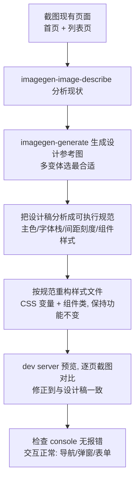

# 15-前端设计与美化工作流（UI / UX）

Snow App 把 **浏览器自动化**、**AI 生图**、**视觉模型分析** 与 **文件系统** 组合
在一起，可以让 AI Agent 完成从前端开发、页面美化到 UI/UX 设计的完整闭环。
本文介绍四个典型场景与可直接套用的提示词模板。

## 1. 工具矩阵

| 工具 | 在本工作流中的作用 |
| --- | --- |
| `filesystem-*` | 读写前端代码（create / replace_edit / read / search） |
| `bash-terminal-execute` | 启动 dev server、跑构建（`npm run dev` 等） |
| `browser-navigate` | 打开本地 dev server（`http://localhost:xxxx`）或线上页面 |
| `browser-screenshot` | 截取当前页面 / 整页快照，作为「现状」输入 |
| `browser-devtools` | 无障碍树（ax）快照理解页面结构；console 报错排查；network 检查资源 |
| `browser-evaluate` | 在页面里执行 JS（临时改样式、读布局数据、验证交互） |
| `browser-click` / `browser-type` / `browser-hover` / `browser-wait` | 交互验证：点击、输入、悬停、等待渲染 |
| `imagegen-generate` | 生成设计稿、图标、配图、风格参考图 |
| `imagegen-image-describe` | **视觉理解**：分析设计稿图片，输出可编码的 UI 描述 |
| `imagegen` 图库 + 相册 | 管理生成的设计稿/配图（可建「设计稿」「图标」相册归类） |
| `grep-search` / `codebase` | 定位项目结构与已有样式 |

> `imagegen-image-describe` 的 `path` 支持**绝对磁盘路径**（项目内任意位置，
> 如 `C:/Users/xx/project/design/home.png`）或 `upload/` 相对路径；单张 ≤20MB，
> 仅图片格式。视觉通道复用主 API 配置的 vision 设置（设置 → API → 视觉模型）。

## 2. 场景 A：从设计稿还原前端（核心场景）

用户提供设计稿（Figma 导出、Sketch 图、手绘 UI 图），AI 编码还原：

```
1. filesystem-search / grep 定位设计稿文件（或用户直接给路径）
2. imagegen-image-describe path=design/home.png
   → 拿到结构化描述：布局结构 / 配色 hex / 字体字号 / 间距 / 组件清单
3. filesystem-create 按描述写 index.html / App.tsx / styles
4. bash 启动 dev server
5. browser-navigate http://localhost:xxxx 打开页面
6. browser-screenshot 截图 → browser-devtools ax 对比结构
7. 与设计稿差异 → replace_edit 修正 → 刷新浏览器再验证
```

**提示词模板**：

```
项目里 design/ 目录下有一张首页设计稿（design/home.png）。
请：
1. 先用 imagegen-image-describe 分析这张图（重点：布局、配色、字体、间距、组件）；
2. 按描述在当前项目里实现这个页面（用现有技术栈，样式写在 styles.css）；
3. 启动 dev server 并在浏览器打开，截图核对与设计稿的差异；
4. 修正明显偏差（颜色、间距、结构），再截图确认。
```

## 3. 场景 B：美化现有页面（改版 / 重构 / 润色）

对已有页面做视觉升级：

```
1. browser-navigate 打开页面（本地 dev 或线上）
2. browser-screenshot 全页截图
3. imagegen-image-describe path=当前截图或设计参考
   → 分析现状（或对比参考设计）
4. 明确改进点：配色统一 / 间距节奏 / 组件样式 / 响应式
5. replace_edit 改 CSS/组件 → 刷新 → 截图对比
6. browser-evaluate 可临时注入样式快速验证方案
```

**提示词模板**：

```
打开 http://localhost:3000 并整页截图。当前页面视觉比较粗糙，
请以「简洁、现代、留白充足」为目标做一次美化：
1. 先截图 + ax 快照理解现状；
2. 给出 3 个明确的改进点（配色/间距/组件圆角等）再动手；
3. 改完刷新页面，截图前后对比确认效果；
4. 用 browser-evaluate 验证没有 console 报错。
```

## 4. 场景 C：UI 设计（从零生成设计稿）

没有设计稿时，用 AI 生图直接产出设计参考，再还原：

```
1. imagegen-generate 生成设计稿
   （prompt 描述页面类型/风格/配色，如
    "modern SaaS dashboard landing page, light theme, indigo accent,
     16:9, clean typography, generous whitespace"）
2. 满意后：imagegen-image-describe 分析这张图 → 编码还原
3. 不满意：变体/重生成迭代（画廊工具栏的「生成变体」/「以此为参考」）
4. 把定稿存进图库相册（如「设计稿」），供后续参考
```

**提示词模板**：

```
请先帮我设计一个「AI 编程助手」产品官网首页：
1. 用 imagegen-generate 生成 2 版设计稿（深色科技风 / 浅色简约风，各一张）；
2. 对更合适的一版调用 imagegen-image-describe 提取设计细节；
3. 在项目里实现这个页面，并在浏览器打开截图验证。
```

## 5. 场景 D：UX 优化（交互 / 可访问性 / 性能感知）

面向用户体验的分析与改进：

```
1. browser-navigate 打开页面
2. browser-devtools action=ax 拿无障碍树（理解真实交互结构）
3. browser-devtools action=console 收集报错
4. browser-devtools action=network 检查资源加载
5. 逐项验证关键交互（click / type / hover / wait）
6. 输出 UX 问题清单（可访问性、反馈缺失、加载体验、布局塌陷…）
7. 逐条修复 → 浏览器复验
```

**提示词模板**：

```
对 http://localhost:3000 做一次 UX 体检：
1. 打开页面，用 ax 快照 + 截图理解结构；
2. 检查 console 错误与网络失败资源；
3. 验证核心交互流程（表单提交、弹窗开关、空状态）；
4. 输出按严重程度排序的问题清单（含复现步骤）；
5. 修复优先级最高的 3 个问题并复验。
```

## 6. 组合拳：完整改版工作流示例

把四个场景串起来的一次完整任务：

```
当前项目是一个内容管理后台，我要把 UI 整体升级一版：
1. 先截图现有页面（首页 + 列表页），imagegen-image-describe 分析现状；
2. 用 imagegen-generate 生成「现代 SaaS 后台」风格的设计参考图，
   多生成几个变体选最合适的；
3. 把设计稿分析成可执行规范：主色/辅助色 hex、字体栈、间距刻度、
   组件样式（按钮/卡片/表格/侧边栏）；
4. 按规范重构样式文件（CSS 变量 + 组件类），保持功能不变；
5. dev server 预览，逐页截图对比，修正到与设计稿一致；
6. 检查 console 无报错、交互正常（导航/弹窗/表单）。
```



## 7. 最佳实践

| 要点 | 说明 |
| --- | --- |
| **先截图再动手** | 任何改动前先 `browser-screenshot`，让 AI 和用户有共同基线 |
| **描述先行、代码随后** | 先让视觉模型输出设计规范（hex/间距/组件），再写代码，避免边猜边写 |
| **小步迭代** | 一次改一个模块 → 截图验证 → 再下一个，比一次性大改更容易收敛 |
| **善用图库相册** | 设计稿、图标、风格参考分别建相册，后续任务可引用「上次定的风格」 |
| **控制截图时机** | 交互类页面用 `browser-wait` 等渲染完成再截图；`fullPage=true` 截整页 |
| **vision 通道需配置** | `imagegen-image-describe` 依赖主 API 配置中的视觉模型（vision），未配置时会报错提示 |
| **生图与还原分离** | 设计稿只作为「意图输入」，最终代码里不引用图片文件，直接内嵌描述中的色值/尺寸 |

## 8. 相关文档

- [6-浏览器自动化](6-浏览器自动化.md) —— browser 工具完整参考
- [9-图像生成](9-图像生成.md) —— 生图渠道配置与参数
- [3-参考手册/2-内置工具参考](../3-参考手册/2-内置工具参考.md) —— `imagegen-image-describe` 工具说明
