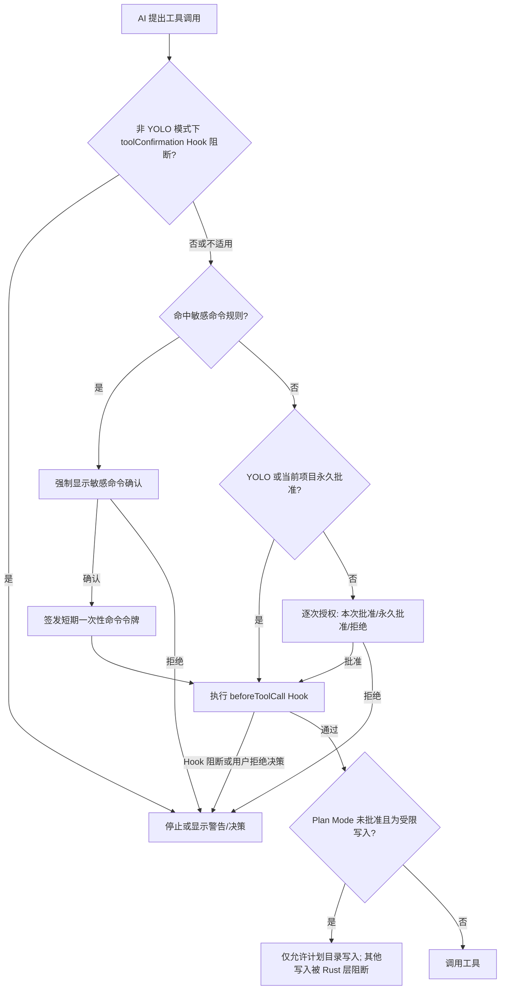

# 16-安全、隐私与工具授权

Snow App 把 AI 建议、工具执行、本地数据和外部服务连接在同一个桌面应用中。本指南说明可配置的安全控制、它们实际保护的边界，以及仍需由用户承担的判断责任。

> 安全控制用于降低风险，不等于对命令、网页、Plugin、Hook 或外部 MCP 的安全背书。对删除数据、执行脚本、上传内容、导入会话等高影响操作，始终先核对目标、参数和影响范围。

## 1. 窗口隔离模型

Snow 的不同窗口采用不同策略，不能笼统地称为“所有窗口均已 sandbox”。

| 窗口/内容 | `contextIsolation` | Node 集成 | sandbox | 说明 |
| --- | --- | --- | --- | --- |
| Snow 主窗口 | 开启 | 禁用 | **关闭**（`sandbox: false`） | 受控原生能力经 preload / `contextBridge` 暴露；主窗口允许 `<webview>` |
| 内置浏览器网页弹窗 | 开启 | 禁用 | **开启** | 由主进程为 guest 的 `window.open` / `target=_blank` 创建 |
| 系统浏览器 | 不属于 Snow 渲染环境 | 不适用 | 不适用 | 主窗口普通 `window.open` 被拒绝后交给系统浏览器打开 |

主窗口渲染代码不能直接使用 Node API。`contextIsolation` 将网页上下文与 preload 隔开，但主窗口明确不是 sandbox；只有预先设计的桥接接口才能从渲染层请求主进程或 Rust 能力。内置 `<webview>` 以及其中加载的远程页面构成额外信任边界。

浏览器弹窗与 opener webview 共用 session/Cookie，并保留 `window.opener` 与 `postMessage`，以支持 OAuth 登录。弹窗可继续打开下一层弹窗，后续弹窗仍应用 sandbox、上下文隔离和禁用 Node 的策略。主窗口关闭时，Snow 会清理这些弹窗，避免残留孤儿窗口。

## 2. 隐私过滤

隐私过滤默认关闭（**设置 → 隐私**，设置页 id：`privacy-settings`）。启用后，它只处理设置中选中的**工具结果**，不是覆盖聊天输入、网页、日志、Plugin、Hook 和所有网络请求的全局 DLP。

默认选中的工具为：

- `filesystem-read`
- `grep-search`
- `bash-terminal-execute`

设置界面还可选择 `codebase-search`、`websearch-websearch-search` 与 `websearch-websearch-fetch`。未选中的工具结果保持原样。

### 2.1 本地模式

本地模式在 Rust MCP 后端使用正则和校验规则脱敏，处理后才跨 NAPI 边界返回 Node/Electron。规则覆盖私钥块、JWT、常见 API Key、敏感键值、`Authorization`、URL 查询令牌、中国身份证号和支付卡号等。

本地规则不调用外部服务，但仍可能误报、漏报或保留上下文中可推断的信息。不要因为开启过滤就主动读取不需要的密钥文件或扩大工具范围。

### 2.2 API 模式及失败回退

API 模式会把待处理文本以 JSON 请求发送到配置的隐私过滤 HTTP API，请求包含 `text`、`aggregation_strategy: "simple"` 和 `mask_token: "[{label}]"`。若配置 API Key，会同时尝试发送 `x-api-key` 与 Bearer `Authorization` 请求头。API 必须成功返回 `masked_text`。

这意味着 API 端点成为新的信任方，待处理文本会离开设备。HTTP 错误、网络错误、响应解析失败或缺少 `masked_text` 时，Snow 会**回退到本地规则**，而不是直接放行原文。极少数本地后台任务本身失败时才可能返回原文，因此高敏感场景仍应采用最小化读取与人工复核。

## 3. 工具授权决策流程

正常模式下，工具按调用逐项请求授权；并行批次中的一个拒绝不会自动拒绝其他项。用户可以批准本次、拒绝，或在有活动项目时把某个工具设为当前项目永久批准。

`beforeToolCall` 在实际执行前运行，即使工具因 YOLO 自动批准也不会跳过。非 YOLO 模式还会在授权 UI 前运行 `toolConfirmation` Hook。Hook 自身失败时，部分调用路径会继续普通授权，因此 Hook 不应作为唯一安全控制。

## 4. 项目永久授权

“永久批准”绑定当前项目/工作区的 `directoryId`：

- 切换项目后会加载另一个项目的批准列表；
- 没有活动项目时，不会持久化为跨项目批准；当前调用仍可继续；
- 持久化失败不会回滚已经批准的当前调用；
- 永久批准按工具名授予，不会理解每次参数的业务风险。

因此只应永久批准行为窄、参数可审计、后果可恢复的工具。终端、文件写入、浏览器状态恢复和外部 MCP 等能力更适合保留逐次确认。

输入框旁的**项目授权面板**（或 `/permissions` 命令）可查看当前项目已永久授权的工具列表，并**删除**不再需要的授权；该命令在 YOLO 模式下禁用。

## 5. YOLO 模式

YOLO 是持久化的全局设置。开启后，普通工具可跳过逐次授权，当前待授权队列中的非敏感项也会被自动批准。它适合完全受控、可回滚、已审查的环境，不适合包含生产凭据、个人资料或共享工作区的会话。

YOLO **不会绕过所有安全检查**：

- 命中敏感命令规则的非交互式 Bash 命令仍需明确确认；
- `beforeToolCall` Hook 仍会执行；
- Rust 工具层的 Plan Mode 写入边界仍会执行；
- 工具自身的参数校验、项目启用状态和子代理工具白名单仍然有效。

交互式终端命令**同样经过敏感命令检查**：`isInteractive` 标志只控制终端会话的展示方式（输入框、无超时），不再作为绕过敏感命令门禁的通道；合法的交互命令（如 `npm init`、`git add -i`）不命中任何规则时不受影响。

## 6. 敏感命令规则

敏感命令由已启用的正则规则匹配（**设置 → 敏感命令**，设置页 id：`sensitive-command-settings`；agent 也可用 `config-set settings sensitiveCommands` 读写），可使用全局规则及项目继承/覆盖后的有效规则。格式错误的正则会被跳过，避免阻断后续规则。命中时 UI 显示规则 ID、表达式和说明。

确认后，Snow 为**完整命令文本**签发有效期约 60 秒、消费一次即删除的授权令牌；Rust Bash 执行层会校验令牌、命令和过期时间。令牌不能批准另一条命令，也不能重复使用。

限制必须明确：

- 规则只能拦截已覆盖的文本模式；未命中的危险命令仍可能执行；
- 错误正则被忽略后不会提供保护；
- 参数拼接、编码、脚本间接调用可能超出规则意图；
- 交互式命令同样需要授权令牌（`isInteractive` 只是展示方式，不绕过检查）；
- 敏感命令是附加安全门，不是 Shell 安全证明。

## 7. Plan Mode 的强制边界

Plan Mode 严格按会话隔离，并与 Goal Mode 在当前会话互斥。切换会话不会清除其他会话已独立获得的批准；关闭某会话的 Plan Mode 会撤销该会话的批准状态。

Plan Mode 不只是提示词：每次工具调用都会把 `planMode` 与 `planApproved` 传到 Rust 工具层。批准前：

- `filesystem-create` 与 `filesystem-replace_edit` 的普通项目文件写入会被阻断；
- 允许在 `.snow/plan` 或 `.trellis/tasks` 内写计划文档；
- 子代理不能自行请求或授予主会话的 Plan 批准；
- 只有专用批准工具返回结构化 `approved=true`，当前会话才进入已批准状态。

批准后写入范围扩大，但 Plan Mode 不替代敏感命令、工具授权、Hook、项目权限或人工审查；它也不是对所有工具副作用的完整沙箱。

## 8. Plugin、Hook 与外部 MCP

### 8.1 Plugin

声明式市场组件不执行安装脚本，但仍应只从可信来源安装。外部 Plugin 运行时代码在隔离 utility process 中执行，启动前会提示风险；进程隔离并不意味着代码可信，也不能消除其已获文件、网络或工具权限的滥用风险。安装前审查来源、声明权限、更新渠道和维护状态。

### 8.2 Hook

Hook 可以执行 shell 命令、注入上下文并改变工具调用流程。命令退出码通常解释为：

| 退出码 | 结果 |
| --- | --- |
| `0` | 通过；stdout 可作为上下文 |
| `1` | 软警告；结构化决策 JSON 可触发确认 UI |
| `2+` | 阻断当前可阻断流程 |

`onStop`、`onSessionStart` 等 fire-and-forget Hook 无法真正阻断原流程；待决策结果会降级为普通 warning。Hook 脚本及其依赖与应用拥有不同信任来源，应像本地自动化程序一样审计。

### 8.3 外部 MCP

外部 MCP 可以通过 stdio 启动本地进程，也可以连接 HTTP 服务。工具描述、网络端点、身份验证和副作用都由外部实现提供。Snow 的授权只控制“是否从 Snow 发起调用”，不能证明服务内部安全，也不能阻止它在已授予范围内保留、转发或滥用数据。

详见 [配置 MCP 服务器](1-配置MCP服务器.md) 与 [配置 Hooks 与子代理](5-配置Hooks与子代理.md)。

## 9. 推荐安全基线

1. 默认关闭 YOLO，对写入、终端和外部工具保留逐次授权。
2. 项目永久授权只授予最小工具集合，并定期撤销不再需要的授权。
3. 为破坏性命令配置具体、可测试的敏感命令正则，同时保留人工复核。
4. 高敏感项目优先使用本地隐私过滤；使用 API 模式前审查端点的数据政策。
5. 不向网页、Hook、Plugin 或 MCP 提供超出任务所需的凭据。
6. Plan Mode 批准前阅读计划；批准后仍逐项检查高影响操作。
7. 安装或更新第三方扩展前确认发布者、代码来源和权限变化。
8. 定期查看日志、项目授权和启用的 Hook/MCP，发现异常立即停用并轮换凭据。

## 10. 常见误区与排障

| 误区/现象 | 正确理解或处理 |
| --- | --- |
| “主窗口启用了 sandbox” | 错误；主窗口 `sandbox: false`，但启用上下文隔离并禁用 Node 集成 |
| “浏览器弹窗不共享登录态” | OAuth 弹窗与 opener webview 共享 session/Cookie |
| “隐私 API 失败会放行原文” | API 失败会回退本地规则；仍需考虑本地任务异常和规则漏报 |
| “YOLO 会绕过敏感命令” | 非交互式命令命中规则时仍强制确认 |
| “永久批准对所有项目生效” | 批准绑定当前项目/工作区 |
| “Plan Mode 只靠提示词” | Rust 层会阻断未批准的普通文件创建和替换编辑 |
| “utility process 中的 Plugin 就是安全的” | 隔离降低影响面，不提供来源、逻辑或数据使用保证 |

进一步了解浏览器凭据和登录态，请参阅 [浏览器设置、密码与数据导入](17-浏览器设置密码与数据导入.md)；完整边界矩阵见 [安全与信任边界](../3-参考手册/5-安全与信任边界.md)。
