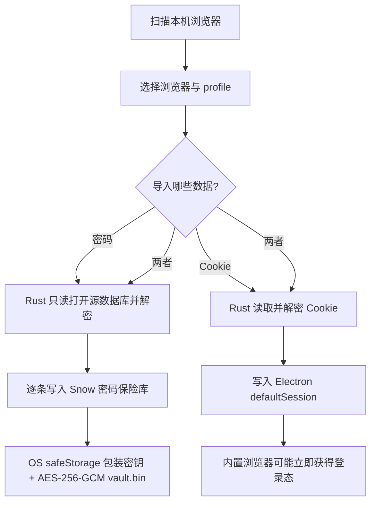

# 17-浏览器设置、密码与数据导入

本指南说明 Snow 内置浏览器的起始页、密码保险库、自动保存/填充、本机浏览器导入和登录态存档。密码、Cookie 与 localStorage 都可能授予账户访问权，请只在可信设备和可信 OS 用户账户中使用这些功能。

## 1. 配置起始页

打开 **设置 → 浏览器设置 → 起始页**（设置页 id：`browser-settings`，agent 可用 `app-control-openSettings page=browser-settings` 打开；**起始页/密码管理为 UI-only**——agent 只能打开页面引导用户操作，不能读取或修改密码）：

1. 输入希望新浏览器标签打开的地址；
2. 按 Enter 或让输入框失去焦点以保存；
3. 留空表示打开空白页。

默认值为 `https://www.google.com`。保存逻辑只会去除首尾空格，不会自动补全 `https://`，也不会把非 HTTP 地址改写为其他协议。所有内置浏览器标签共享同一设置和模块级缓存；保存后，所有浏览器实例都会收到更新通知。

> 如果地址无法加载，请先确认输入了完整、浏览器可识别的 URL，例如 `https://example.com`。

## 2. 密码保险库

### 2.1 文件位置

密码保险库存放在：

- `~/.snowapp/browser-passwords/vault.key`
- `~/.snowapp/browser-passwords/vault.bin`

`vault.key` 不是明文主密钥；它保存由 Electron `safeStorage` 包装后的随机主密钥。`vault.bin` 保存整体加密的密码记录。

### 2.2 加密与写入

1. 首次使用时生成随机 32 字节主密钥；
2. 主密钥由 OS 安全存储保护：macOS Keychain、Windows DPAPI 或 Linux keyring；
3. 密码集合使用 AES-256-GCM 加密，结构包含 12 字节随机 IV、16 字节认证 tag 与密文；
4. 文件权限会尽力设置为 `0600`；
5. 更新先写临时文件，再通过 `rename` 原子替换；
6. `safeStorage` 不可用时，Snow 拒绝保存，不会降级为明文落盘。

AES-GCM 同时提供机密性与完整性检测，但安全性仍依赖当前 OS 用户会话、设备安全和 Electron `safeStorage` 后端。能控制已解锁 OS 账户的程序或用户，仍可能通过应用功能访问已解密凭据。

## 3. 自动保存与自动填充

### 3.1 自动保存

网页登录表单提交或登录按钮点击时，webview preload 会尝试识别用户名和密码：

- 密码不得为空；
- 相同 `origin + username` 会更新现有记录，而不是无限新增；
- 同一页面会话中，相同 `origin + username + password` 会避免重复保存；
- 只保存当前页面检测到的数据，不保证识别所有自定义登录组件。

### 3.2 自动填充

当 HTTP/HTTPS 页面出现空密码框时，Snow 会按页面真实 origin 查询凭据。主进程会比较请求参数与 sender frame 的 origin，拒绝跨源读取。若同一 origin 有多条记录，会选择最近更新的一条。

DOM 就绪后会立即尝试自动填充，随后每 800ms 重试，最长约 8 秒。以下场景可能无法工作：复杂 Shadow DOM、非标准控件、跨源 iframe、多步骤登录、动态加密键盘以及站点主动禁止自动填充。自动填充是尽力而为，不是对所有网站的兼容承诺。

## 4. 搜索、显示与删除密码

在 **设置 → 浏览器设置 → 密码** 中：

- 可按站点或用户名搜索；
- 列表接口只返回元信息，密码默认显示为掩码；
- 点击“眼睛”才会按记录 ID 解密明文，并缓存在当前设置 UI 状态；
- 可删除单条记录；删除会重写加密保险库；
- 离开设备前应关闭密码明文显示，并锁定 OS 会话。

删除保险库记录不会注销网站、删除已经写入浏览器 session 的 Cookie，也不会修改原始 Chrome/Edge/Chromium/Firefox 配置文件。

## 5. 扫描本机浏览器

进入设置页不会自动扫描。导入流程为：

1. 点击 **扫描本机浏览器**；
2. 选择已探测到的浏览器；
3. 选择 profile（Chromium 系通常为 `Default` 或 `Profile N`）；
4. 分别选择是否导入密码和 Cookie；
5. 点击导入并查看成功数、总数与部分失败数。

支持探测 Google Chrome、Microsoft Edge、Chromium 和 Firefox。扫描统计可以在不解密全部内容的情况下读取记录数量；真正导入时才进行数据库读取和解密。

## 6. Chromium 系密码与 Cookie 导入

### 6.1 平台解密路径

| 平台 | 实现与边界 |
| --- | --- |
| Windows | 从 `Local State` 读取加密主密钥，经当前 Windows 用户的 DPAPI 解密，再用 AES-256-GCM 解密记录 |
| macOS | 从 Keychain 读取 “Chrome Safe Storage” 或 “Microsoft Edge Safe Storage”，使用 PBKDF2-HMAC-SHA1 派生密钥并执行 AES-128-CBC；Cookie schema v24 / Chrome 133+ 的 32 字节 hash 前缀会被剥离 |
| Linux | 可以探测 Chromium profile，但当前实现不支持从 GNOME Keyring/KWallet 获取 Chrome 系解密密钥；Chrome 系密码和加密 Cookie 可能无法导入，Firefox 可用 |

这些能力依赖当前 OS 用户有权访问源浏览器的系统凭据。不同浏览器版本、企业策略或密钥后端可能导致部分记录无法解密。

### 6.2 SQLite 锁与 WAL 边界

源数据库以只读方式打开。浏览器正在运行且文件被锁时，Snow 会尝试 `immutable=1` 回退；该模式可能看不到尚未 checkpoint 的最新 WAL 内容。因此如统计不完整、最新密码缺失或读取失败，请完全关闭源浏览器后重新扫描和导入。

SQLite 与密码学重任务在 Rust `spawn_blocking` 中执行，不阻塞 Node 事件循环，但大量 profile 仍可能需要等待。

## 7. Firefox 导入

Firefox 登录数据使用 NSS 相关的 3DES 流程解密。如果 profile 设置了 Firefox 主密码，当前导入流程无法直接解锁；请评估风险后在 Firefox 中临时取消主密码、完成导入，再立即恢复主密码。不要在共享或不可信设备上这样做。

Firefox 与 Chromium 的 Cookie/登录结构不同，某些版本、扩展或企业配置可能导致记录被跳过。导入结果中的 `skipped` / `failed` 应视为需复核信号，而不是无关警告。

## 8. 密码与 Cookie 的去向

| 数据 | 导入目的地 | 后续行为 |
| --- | --- | --- |
| 密码 | Snow 密码保险库 | 按 origin 自动填充；可在设置中查看或删除 |
| Cookie | 当前 Electron `defaultSession` | 内置浏览器访问匹配域名时自动携带，可能直接登录账户 |

Cookie 不进入 `vault.bin`。导入 Cookie 等同于转移登录会话，可能绕过重新输入密码和部分登录步骤。只导入自己拥有、来源可信的 profile，并在设备丢失、误导入或账号异常后从网站安全页面撤销会话。

导入是一次性复制，不是持续同步。源浏览器之后新增或更新的密码/Cookie 不会自动同步到 Snow。

## 9. 部分失败与 Cookie 约束

密码按条目写入保险库，单条保存失败会计入 `skipped`；Cookie 逐条写入 Electron session，失败会计入 `failed`。常见原因包括：

- 源数据库锁定或最新 WAL 未 checkpoint；
- OS 密钥不可访问或记录解密失败；
- Cookie 已过期、域名/路径无效；
- `SameSite=None` 与非 Secure 组合不被 Chromium 接受（Snow 会尝试降级为 unspecified）；
- 浏览器版本、schema 或企业策略差异。

域 Cookie 会保留前导点对应的 domain 语义，以便子域使用。总数、成功数和失败数可能不同；请关闭源浏览器后重试，并登录关键站点验证结果。

## 10. 登录态存档与密码保险库的区别

浏览器自动化工具还可保存登录态文件，位置为：

- `~/.snow/browser-state/`
- 自动备份：`~/.snow/browser-state/backups/`

登录态包含 cookies 和**当前主 frame origin** 的 localStorage，整个文件由 `safeStorage` 加密，并带有 `SNOWSTATE` magic header、版本和 schema 校验。文件名只允许 `[A-Za-z0-9._-]{1,100}`。恢复前会备份当前状态：

- localStorage 只注入完全匹配的 origin；
- CDP 不可用时仍可恢复 Cookie，但跳过 localStorage 并返回 warning；
- Cookie 恢复逐项统计成功和失败；
- 查看 Cookie 时默认只显示前 4 位及长度，只有显式 `showValues=true` 才返回明文。

登录态存档不是密码保险库：前者用于 Cookie/localStorage 会话恢复，后者用于网站密码保存与自动填充。删除其中一个不会自动删除另一个。

更多自动化操作参阅 [浏览器自动化](6-浏览器自动化.md)。

## 11. 备份、换机与恢复边界

`vault.key` 和登录态文件都绑定当前 OS 用户的 `safeStorage` 环境：

- 只复制 `vault.bin` 无法解密；
- 把 `vault.key` 连同 `vault.bin` 复制到另一台电脑、另一 OS 用户或另一安全存储后端，通常仍无法解密；
- key 文件缺失或无法解密时，Snow 会生成新 key；旧 `vault.bin` 与新 key 不匹配，会被当作空库读取，但不匹配的原文件不会自动覆盖；
- 登录态存档同样不应被视为可跨机解密的通用备份格式。

普通目录备份不等于可用的跨机密码恢复方案。换机前应在原设备使用源浏览器或账户提供的可迁移方式，或准备在新设备重新登录并重新导入。不要删除旧文件，直到已在新环境验证关键账户。

## 12. 安全建议与排障

| 现象 | 检查与处理 |
| --- | --- |
| 无法保存密码 | 检查 OS keyring/Keychain/DPAPI 是否可用，确认当前桌面会话已解锁 |
| 自动填充无响应 | 确认页面为 HTTP/HTTPS、origin 正确；复杂 iframe/Shadow DOM 站点可能不受支持 |
| 导入数量少于扫描数量 | 关闭源浏览器后重试，检查主密码、OS 密钥和失败计数 |
| 导入 Cookie 后仍未登录 | 检查 Cookie 是否过期、域名/路径/Secure/SameSite 约束，并重新访问站点 |
| 换机后保险库为空 | 检查是否跨 OS 用户复制；不要用新文件覆盖旧 vault，回原设备导出或重新登录 |
| 怀疑 Cookie 泄露 | 从网站账户安全页撤销所有相关会话，删除 Snow session 数据并轮换密码 |

有关窗口隔离、第三方工具和安全责任，请参阅 [安全、隐私与工具授权](16-安全隐私与工具授权.md) 和 [安全与信任边界](../3-参考手册/5-安全与信任边界.md)。存储目录总览见 [数据存储位置](../3-参考手册/4-数据存储位置.md)。
