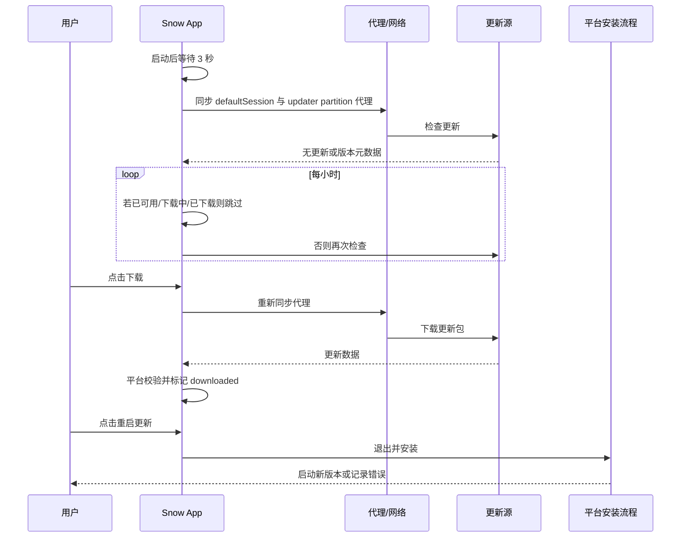

# 18-应用更新

Snow App 会自动检查新版本，但不会静默下载或安装。下载和重启安装都由用户明确触发。本指南说明通用更新流程、代理行为，以及 Windows/Linux 与 macOS 的不同实现和排障方法。

## 1. 更新入口与状态

打开设置，并滚动到设置侧栏底部的 **关于** 区域，查看当前版本和更新状态。**关于** 是设置侧栏中的独立信息区域，不属于 26 个设置页之一。界面可能显示：

| 状态 | 含义 |
| --- | --- |
| `available` | 发现比当前版本更新的版本 |
| `version` | 可用更新版本号 |
| `downloading` | 正在下载更新包 |
| `progress` | 下载进度 |
| `downloaded` | 下载并校验完成，可以重启安装 |
| `error` | 检查、下载、校验或安装准备失败 |

用户可以点击 **检查更新** 立即检查。发现新版本后，点击版本/下载按钮才开始下载；下载完成后，点击 **重启更新** 才会安装。更新安装退出会跳过普通关闭二次确认，避免阻断安装器。

## 2. 自动检查节奏

- 主窗口创建并初始化更新模块后，应用启动约 **3 秒**异步执行首次检查；
- 应用持续运行时，每 **1 小时**触发一次定时检查；
- 如果已有可用更新、正在下载或已经下载完成，该小时任务跳过实际网络检查；
- 自动检查不会自动下载；
- 手动检查可在需要时重新获取状态。



## 3. 代理行为

每次检查和下载前，Snow 会重新应用应用内代理配置：

- 开启内置代理时，使用 `http://host:port`；
- 未开启时使用 `mode: "system"`，即遵循系统代理，而不是强制直连；
- `session.defaultSession` 覆盖 `net.fetch`、webview 与 macOS 自定义 updater；
- Windows/Linux 的 `electron-updater` 使用独立的无缓存 partition：`session.fromPartition("electron-updater", { cache: false })`。

代理同步函数会捕获并记录自身错误，然后后续请求仍可能继续。因此“代理设置失败”不一定会立即终止检查；排障时要同时验证代理可达性、更新源和日志。

更多网络配置参阅 [配置代理与网络](4-配置代理与网络.md)。

## 4. Windows 与 Linux：`electron-updater`

Windows 和 Linux 使用 `electron-updater` 流程：

- `autoDownload = false`：发现更新后等待用户下载；
- `autoInstallOnAppQuit = false`：普通退出不会自动安装；
- 状态由 checking、available、not available、download progress、downloaded 和 error 等事件驱动；
- 用户确认重启安装后调用 `autoUpdater.quitAndInstall()`；
- 开发模式会设置 `forceDevUpdateConfig = true` 并尝试检查，具体结果仍依赖开发更新配置和更新源。

文档只承诺代码中可验证的 `electron-updater` 流程；包签名、公证、仓库权限与发布资产完整性取决于实际发行配置，不能仅凭客户端流程推断。

### Windows/Linux 常见问题

| 现象 | 建议 |
| --- | --- |
| 一直显示检查中 | 检查系统/内置代理、DNS、TLS 与更新源响应 |
| 提示无更新但已发布新版本 | 核对当前版本、渠道、平台/架构资产和发布元数据 |
| 下载失败 | 检查专用 updater partition 的代理、磁盘空间和网络日志 |
| 已下载但不能安装 | 检查安装目录权限、安装器文件、占用进程和系统安全软件 |
| 开发环境行为不同 | 开发检查依赖 dev update config，不等同于打包发行版 |

## 5. macOS：自定义全量 ZIP 更新

当前 macOS 发行流程没有代码签名证书，因此不走 `electron-updater` 的签名更新通道，而使用自定义的**无签名全量 ZIP 自替换流程**。其信任模型弱于平台签名更新，安全性主要依赖 HTTPS、manifest 来源和 manifest 中的 SHA256。

> SHA256 只能证明下载文件与 manifest 声明一致。若 manifest 来源本身被篡改，攻击者可以同时替换 URL 和 SHA256，因此必须保护发布仓库、manifest 地址和网络边界。

未打包的 macOS 开发模式会在检查函数中提前返回，不支持后续下载/安装流程。

## 6. macOS manifest

默认 manifest：

```text
https://github.com/MayDay-wpf/snow-app/releases/latest/download/latest-mac.json
```

可通过环境变量 `SNOW_UPDATE_MANIFEST_URL` 覆盖。请求超时为 20 秒。manifest 至少应提供：

```json
{
  "version": "x.y.z",
  "files": {
    "arm64": {
      "url": "https://example.invalid/snow-app-arm64.zip",
      "sha256": "<64 位十六进制 SHA256>",
      "size": 123456789
    },
    "x64": {
      "url": "https://example.invalid/snow-app-x64.zip",
      "sha256": "<64 位十六进制 SHA256>",
      "size": 123456789
    }
  }
}
```

`files[process.arch]` 必须存在并包含 `url` 与 `sha256`；`size` 可选。发布时应确保版本号、当前架构 key、资产 URL、大小和哈希与实际 ZIP 完全对应。

## 7. macOS 下载与校验

下载过程遵守流背压，并依次进行以下检查：

1. 若响应提供 HTTP `content-length`，检查收到的长度；
2. 若 manifest 提供 `size`，检查实际文件大小；
3. 通过 Rust `sha256File` 异步计算整个 ZIP 的 SHA256；
4. 与 manifest 的 `sha256` 比较；
5. 任何大小或 SHA256 不匹配都会失败，并删除残留 ZIP；
6. 只有所有校验通过，状态才进入 `downloaded=true`。

这能发现截断、缓存损坏和与可信 manifest 不一致的文件，但不替代代码签名、公证或发布账户保护。

## 8. macOS 缓存

缓存目录为 `app.getPath("userData")/updates`，主要文件包括：

- `snow-app-update-<version>-<arch>.zip`
- `latest-mac.json`
- `install-update.sh`

检查更新时，如果目标 ZIP 已存在且 SHA256 匹配，Snow 会直接标记为可安装，避免重复下载。新包成功后会清理其他旧版本 ZIP。缓存命中仍以 SHA256 为准，不能只依据文件名或大小。

## 9. macOS 安装脚本

用户点击 **重启更新** 后，Snow 写入 `<userData>/updates/install-update.sh`，并以独立 `/bin/bash` detached 进程启动，随后 `unref()` 使脚本在应用退出后继续运行。脚本流程为：

1. 最长等待旧 Snow 进程退出 90 秒；
2. 删除旧 `.app` bundle；
3. 把全量 ZIP 解压到原安装目录；
4. 执行 `xattr -cr` 清理 quarantine 扩展属性；
5. 使用 `open` 启动新版本；
6. 记录完成或错误。

原安装目录必须可写。脚本会删除旧 bundle 后再解压，因此电源中断、磁盘故障、权限变化或损坏的 ZIP 都可能使应用不可用；校验通过和可靠备份仍然重要。

## 10. macOS 日志

安装脚本日志位于：

```text
app.getPath("logs")/updater.log
```

日志包含 updater start、相关路径、等待退出、删除旧 bundle、unzip、`xattr`、launch、updater done 或 `[ERROR]`。检查、下载及应用级错误也会通过 Snow 日志系统记录。

日志可能包含本地路径和版本信息。提交排障报告前先检查是否有用户名、目录结构或内部 URL 等敏感内容。

## 11. macOS 排障顺序

建议按以下顺序定位，避免反复下载：

1. 访问 manifest，确认 JSON 可解析，`version` 和当前 `process.arch` key 正确；
2. 验证 manifest 中 ZIP URL 可访问；
3. 检查内置/系统代理和 DNS/TLS；
4. 查看 `<userData>/updates/` 中 ZIP、manifest 副本和 `install-update.sh`；
5. 查看 `app.getPath("logs")/updater.log` 及应用日志；
6. 对照 HTTP `content-length`、manifest `size` 与本地文件大小；
7. 独立计算本地 ZIP SHA256，与可信 manifest 比较；
8. 确认应用安装目录可写、磁盘空间充足；
9. 确认旧进程是否在 90 秒后仍未退出；
10. 检查 `/usr/bin/unzip`、`xattr` 和 `open` 是否存在并查看脚本错误。

如果旧 `.app` 已删除但新版本未解压成功，请停止重复运行脚本，从可信发布源重新下载安装包，并在恢复前保留 updater 日志与缓存证据。

## 12. 发布与使用安全建议

### 用户

- 只使用官方或组织批准的更新源；
- 下载前核对版本与发布说明，安装前保存重要工作；
- macOS 用户应特别理解无签名自替换边界；
- 更新失败时不要从未知镜像下载替代 ZIP；
- 怀疑更新源被入侵时停止更新并等待可信渠道确认。

### 发布者

- 保护 GitHub 发布账户、令牌与 manifest 写权限；
- 为每个架构生成并复核正确的 size/SHA256；
- 上传 ZIP 后再发布引用它的 manifest，避免短暂不一致；
- 保留可审计的构建产物和哈希记录；
- 条件允许时迁移到代码签名、公证和平台标准更新链路。

更新安全与应用其他信任域的关系见 [安全与信任边界](../3-参考手册/5-安全与信任边界.md)。
