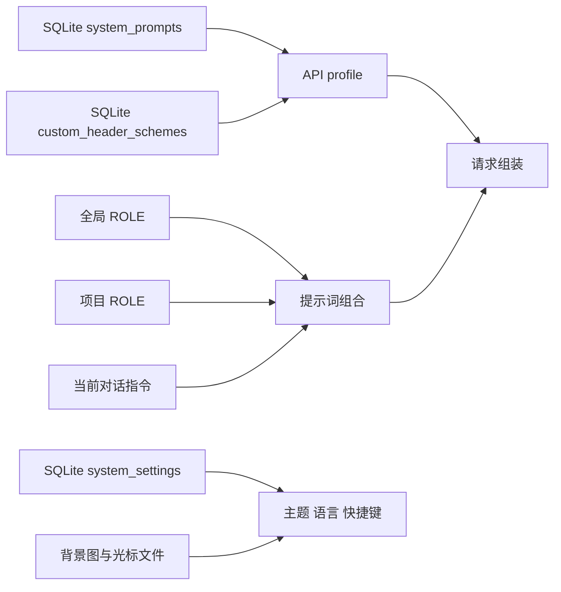

# 19-个性化、主题与快捷键

> 本指南说明 Snow App 的规则组合、请求配置、主题、语言和快捷键行为。设置侧栏当前包含 26 个设置页；本文涉及「系统提示词」（设置页 id：`system-prompt-settings`）、「个性化」（`personalization-settings`）、「自定义请求头」（`custom-headers-settings`）、「主题设置」（`theme-settings`）、「快捷键」（`keyboard-shortcuts-settings`）等页面。语言选择位于设置列表下方的独立区域，不是第 27 个设置页。

## 配置流与生效边界

渲染进程通过 preload API 与 IPC 访问主进程或 Rust 存储层。文件型规则保存在 `~/.snow/` 或工作区，结构化设置主要保存在 `~/.snowapp/snowapp.db`。修改规则不会重写历史消息；它主要影响后续提示词构建和下一次对话请求。

## 个性化规则

### 全局 ROLE

全局规则文件是 `~/.snow/ROLE.md`。个性化页面通过 preload → IPC 读取和保存该文件：

- 文件不存在时，编辑器显示空草稿；
- 保存时会创建缺失的 `~/.snow/` 目录；
- 全局规则适用于允许加载全局规则的项目；
- 规则内容可能影响模型行为，应像代码和配置一样审查后再保存。

### 项目 ROLE

项目规则位于 `<workspace>/ROLE.md`，只编辑当前激活项目。本地和 SSH 工作区都受支持；SSH 工作区由主进程通过远程访问链路读取和写入。

项目是否加载全局规则由 `<workspace>/.snow/settings.json` 中的 `role.includeGlobalRules` 控制。字段缺失时默认值为 `true`。

### 加载顺序与优先级

用户界面展示的组合顺序是：

1. 全局规则；
2. 项目规则；
3. 当前对话指令。

启用的范围都会被加载；只有发生冲突时，后出现的指令才优先。非冲突规则仍共同生效。项目切换后，应确认当前编辑器对应的工作区，避免把规则保存到错误项目。

## 系统提示词与 API profile

系统提示词模板保存在 SQLite 表 `system_prompts`，支持新增、编辑、启用、停用和删除，也可从 `~/.snow/system-prompt.json` 同步 Snow CLI 配置。模板具有 `global` 或 `project` 作用域。

API profile 的 `systemPromptIdsJson` 有三种状态：

| 值 | 行为 |
|---|---|
| 空字符串 | 继承全局启用的系统提示词 |
| `__DISABLED__` | 此 profile 不使用用户配置的系统提示词 |
| JSON 字符串数组 | 绑定明确的系统提示词 ID 列表 |

运行时会按供应商协议放置生效的用户系统提示词：Chat Completions 使用 `system` 消息，Responses 使用 `instructions`，Anthropic 使用顶层 `system`，Gemini 使用 `systemInstruction`。只要存在用户系统提示词，它们会独占对应供应商的系统字段；Snow 内置 Agent 系统提示词不会被删除，而是降为首条 `user` 消息。没有用户系统提示词时，内置提示词仍占用供应商系统字段。因此 `__DISABLED__` 表示禁用用户模板，不表示移除 Snow 的内置 Agent 指令。

删除或停用模板前，应检查使用该模板的 profile。显式 ID 列表与“继承全局”不是同一语义。

## 自定义请求头

请求头方案保存在 SQLite 表 `custom_header_schemes`，支持新增、编辑、启用、停用和删除。同一方案内的请求头名称必须唯一，也可从 `~/.snow/custom-headers.json` 同步。

API profile 的 `customHeaderSchemeId` 同样有三种状态：

| 值 | 行为 |
|---|---|
| 空字符串 | 继承全局请求头方案 |
| `__DISABLED__` | 不添加自定义请求头 |
| 方案 ID | 绑定指定请求头方案 |

自定义请求头会在应用先设置认证与协议头之后注入。空名称/空值会跳过，非法 HTTP header 名称或值会使请求失败；保留名称按大小写不敏感匹配，不能覆盖应用管理的值：

| 供应商协议 | 不能由自定义方案覆盖的请求头 |
|---|---|
| Chat Completions、Responses | `Authorization`、`Content-Type`、`Accept-Encoding` |
| Anthropic | 上述三项以及 `X-API-Key` |
| Gemini | `Content-Type`、`Accept-Encoding`；API key 位于 URL 查询参数而不是 Authorization header |

> **安全警告：** 请求头可能包含 API key、Bearer token、Cookie 或其他秘密。不要分享原始配置文件、数据库、请求日志或包含请求头的截图；排障材料必须先脱敏。

## 主题设置

### 模式、预设与自定义颜色

主题模式支持 `system`、`light` 和 `dark`。可以选择内置预设，也可以分别维护亮色和暗色调色板。调整会实时预览，表单变化后以 1000 ms 防抖自动保存；恢复默认和应用 AI 配色会立即持久化。

主题配置以 `theme_settings` 记录在 SQLite `system_settings` 中，包含：

- `mode`、`presetId`；
- `custom.light` 与 `custom.dark` 调色板；
- `background`；
- `fontFamily`；
- `streamCursor`。

渲染进程还使用 localStorage 快速缓存主题，以减少启动时的主题闪烁；SQLite 仍是持久化设置来源。

### 背景、字体与流式光标

选择背景图后，Snow App 会把文件复制到 `~/.snowapp/backgrounds/`，之后不再持续引用原始文件。渲染进程通过受控的 `theme-bg://` 协议读取该资源。背景支持启用状态、透明度和 0–100 的模糊值。

字体可选择系统默认或指定字体族。流式光标支持：

- 默认脉冲圆点 `dot`；
- 内置 Lucide 图标 `lucide`；
- 自定义 SVG `custom`。

自定义 SVG 复制到 `~/.snowapp/stream-cursors/`。光标尺寸规范化到 8–48，默认值为 14；无效图标类型或缺少必要文件路径时会回退为圆点。

### AI 配色

AI 配色以背景图为视觉输入。使用前必须选择 API profile，且该 profile 的高级模型需要支持视觉输入。生成结果应用后会立即写入主题设置。背景图会发送给所选模型处理，因此在使用私人图片前，应确认服务商的数据处理政策。

## 语言

支持 `en`、`zh-CN` 和 `zh-TW`。语言选择位于设置侧栏底部的独立区域。

- 快速缓存：renderer localStorage 的 `snow.locale`；
- 持久化来源：SQLite `system_settings` 中 code 为 `language` 的记录；
- 无 localStorage 缓存时，先读取数据库；
- 数据库也无有效值时，匹配浏览器语言，无法匹配则回退英文。

`~/.snow/language.json` 属于 Snow CLI/config 工具的配置域，不能视为当前 UI 语言的唯一事实来源。

## 桌面宠物

设置侧栏的「桌面宠物」页用于管理桌面宠物：安装来自 Codex App、Petdex 或
Snow App 的宠物包（`.zip`），选择活动宠物，并在唤醒（显示在桌面上）与关闭
（隐藏）之间切换；唤醒时可通过滑块调整显示大小（0.5–2 倍，默认 0.75）。
宠物会随 AI 工作实时做出反应。

## 快捷键

### 默认绑定

`Mod` 表示平台主修饰键：macOS 为 Command，其他平台为 Control。

| 动作 | 默认键 |
|---|---|
| 取消当前会话 | `Escape` |
| 打开搜索 | `Mod+F` |
| 打开备忘录 | `Mod+B` |
| 打开 TODO | `Mod+T` |
| 切换项目 | `Mod+Backtick` |
| 打开项目浏览器 | `Mod+D` |
| 切换 API profile | macOS `Ctrl+P`；其他平台 `Alt+P` |

七项快捷键均默认启用且 `foregroundOnly=true`，设置以 JSON 形式保存在 SQLite `system_settings` 的 `keyboard_shortcuts` 记录中。

### 重新绑定、冲突与作用域

每项快捷键可独立启用、重新绑定和恢复默认，页面也可恢复全部默认键。录制普通动作时按 `Esc` 会取消录制；录制“取消当前会话”时 `Esc` 是有效绑定。录制支持 **Shift 修饰键**（如 `Cmd/Ctrl+Shift+P`），会按事件转换、展示与匹配逻辑正确识别并保存。

页面会显示绑定冲突，但冲突提示不会自动替用户选择。运行时按动作顺序只触发第一个匹配项。局部组件可以接管某个动作，例如文件查看器聚焦时把搜索快捷键用于文内搜索。

“仅前台”开关会被持久化，但当前引擎基于 renderer 的 `document.keydown`。因此即使关闭该开关，快捷键仍只能在应用聚焦、能够收到键盘事件时工作；它不是系统级全局快捷键。

## 存储、生命周期与安全边界

| 数据 | 位置 | 生命周期 | 安全边界 |
|---|---|---|---|
| 全局 ROLE | `~/.snow/ROLE.md` | 持续保留，直到用户改写或删除 | 可影响所有允许加载全局规则的项目 |
| 项目 ROLE 与开关 | `<workspace>/ROLE.md`、`<workspace>/.snow/settings.json` | 随工作区文件保留 | 仅当前项目；SSH 内容经过远程访问链路 |
| 系统提示词、请求头方案 | `~/.snowapp/snowapp.db` | 持续保留，直到 UI 删除、数据库迁移或恢复 | 可能包含指令和秘密；数据库备份也属敏感材料 |
| 主题、语言、快捷键 | SQLite `system_settings` | 持续保留，直到修改、重置或数据库替换 | localStorage 仅作启动缓存，不代替数据库事实来源 |
| 背景图、光标 SVG | `~/.snowapp/backgrounds/`、`~/.snowapp/stream-cursors/` | 复制后由应用管理；删除原始文件不影响副本 | `theme-bg://` 只暴露受控本地资源 |

更完整的目录、备份和恢复边界参见[数据存储位置参考](../3-参考手册/4-数据存储位置.md)。

## 常见问题

### 修改 ROLE 后为什么旧消息没有变化？

ROLE 在后续提示词构建时读取，不会重写已保存的历史消息。请在下一次请求中验证行为。

### 关闭“仅前台”后，为什么切到其他应用仍不触发？

当前快捷键由渲染进程键盘事件驱动，应用失焦后收不到事件。该开关当前不提供操作系统级全局注册。

### 删除原背景图会导致主题失效吗？

不会。选择时文件已复制到 `~/.snowapp/backgrounds/`。但清理该应用副本会使相应背景失效。

### 为什么 API profile 没有使用全局提示词或请求头？

检查 profile 是否为 `__DISABLED__` 或绑定了显式 ID。空字符串才表示继承全局配置。
