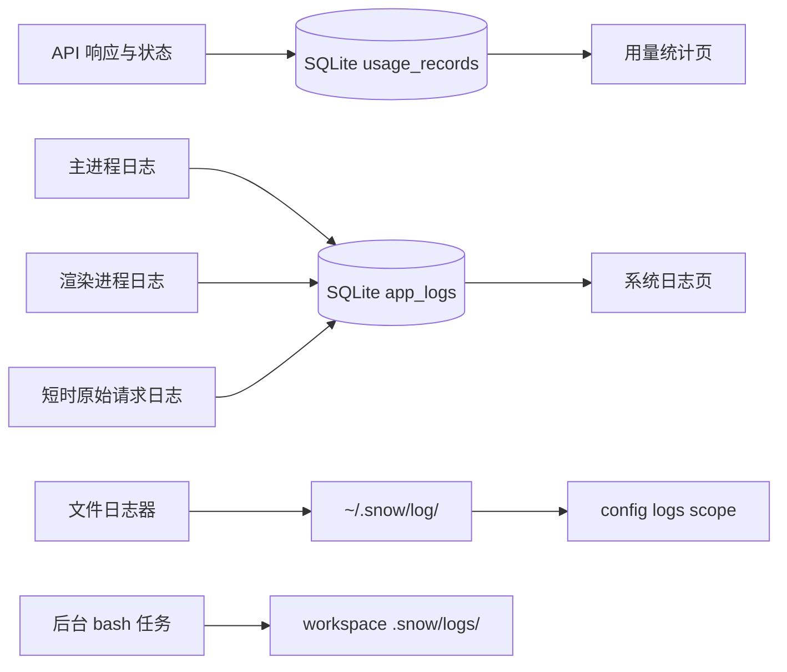

# 20-用量统计与系统日志

> 本指南说明「用量统计」（设置页 id：`usage-settings`）与「系统日志」（`system-logs`）设置页的实际统计口径、三个相互独立的日志源、数据生命周期和排障安全边界。

## 数据流总览

`usage_records` 和 `app_logs` 都在 `~/.snowapp/snowapp.db` 中。`~/.snow/log/` 文件日志及 `<workspace>/.snow/logs/` 后台任务输出不是该数据库的一部分，清理操作互不影响。

## 用量统计

### 记录内容

每次落账记录可包含：

- conversation 与 response 标识；
- model、API profile/config 和请求方法；
- input、output、cache creation、cache read token；
- status；
- 是否来自子代理；
- directory/project；
- 本地时间 `created_at`。

数据保存在 SQLite 表 `usage_records`。底层列表 API 支持 conversation 和 directory 可选过滤，但当前设置页面的明细表没有使用这些筛选参数。

### 统计口径

页面使用以下口径：

- 总 token = input token + output token；
- cache read 是 input 的子集，不会再次加到总 token；
- 有效 cache read = cache read 与 input 中的较小值；
- 非缓存 input = input − 有效 cache read；
- 错误请求只统计 `status = 'error'` 的记录。

这些规则避免上游返回异常 cache 数值时出现负数或重复计数。

### 日期筛选的实际范围

日期按本地日边界构造：起始日 `00:00:00`，结束日 `23:59:59`。预设包括今天、昨天、近 7 天、近 30 天、本月、上月和自定义。

> **重要：日期筛选并不会统一过滤页面中的所有区域。**

| 页面区域 | 实际范围 |
|---|---|
| 顶部汇总卡片 | 受当前日期范围影响 |
| 每日热力图 | 固定请求约一年范围，不随顶部日期筛选变化 |
| “用量记录”明细表 | 当前请求所有记录，每页 20 条；未传日期、conversation 或 directory 筛选 |

因此，汇总卡片的数量与明细表当前页不能直接一一对应。

## SQLite 系统日志

### 浏览与筛选

「系统日志」页面读取 SQLite 表 `app_logs`，每页 50 条。页面可按日期以及 `DEBUG`、`INFO`、`WARN`、`ERROR` 或全部级别筛选。底层 API 支持 module 筛选，但当前 UI 没有 module 输入框。

日志字段可包括：`level`、`module`、`func`、`line`、`message`、`input`、`output`、`duration`、`context`、`error`、`source` 和 `created_at`。日志来自 main 与 renderer；renderer 经 IPC 写入时，`source` 被强制标记为 `renderer`。详情字段支持复制。

### 清空行为

清空按钮采用两步确认：第一次点击进入确认状态，必须在 3 秒内再次点击才会执行。底层执行 `DELETE FROM app_logs`。

> **警告：清空会删除整个 `app_logs` 表中的日志，不只是当前日期、级别或页面显示的筛选结果。**

## 原始 API 请求日志

开启请求日志后，完整原始 API 请求 JSON 会写入 `app_logs`，记录形式为：

- level：`DEBUG`；
- module：`api_request`；
- func：provider；
- message：endpoint；
- input：完整 payload JSON。

payload 可能包含系统提示词、用户内容、工具输入、文件片段和其他敏感数据，因此 UI 会在开启前再次确认。

### 自动关闭

- 默认开启时长为 10 分钟；
- 预设为 3、5、10、15、30、60 分钟；
- 滑块范围为 3–60 分钟；
- 开启时先保存过期时间，再打开开关；
- UI 每秒更新倒计时并在到期时关闭；
- Rust 写入路径也会检查过期时间，即使日志页面已关闭，到期后仍会停止写入并复位开关。

开关和 expiry 都保存在 SQLite `system_settings`。建议仅在普通日志不足时短时开启，复现一次后立即关闭，并清理不再需要的敏感日志。

## 文件日志：`~/.snow/log/`

AI 的 `config` 工具中，`logs` scope 操作 `~/.snow/log/` 下的按日分级文件，例如 `2026-08-03-error.log`。允许的文件名格式为 `YYYY-MM-DD-(debug|info|warn|error).log`。

- `config-list`：列出文件，按文件名倒序返回 `file`、`date`、`level`、`size`、`lastModified`，并汇总总文件数、总字节数和最新错误文件；
- `config-get`：key 可为精确文件名，或 `debug` / `info` / `warn` / `error`（映射当天文件）；默认返回尾部 200 行，最大 2000 行；不存在时返回 `exists: false`；
- `config-set`：不支持，`logs` 是只读诊断域；
- `config-delete`：只接受精确文件名，必须先获得用户明确确认；不存在时返回 `deleted: false`。

文件名白名单和目录拼接共同阻止路径穿越。删除单个文件不会清空 SQLite `app_logs`。

## 后台任务日志：`<workspace>/.snow/logs/`

bash 工具以 `detach:true` 启动后台任务时，stdout/stderr 写入 `<workspace>/.snow/logs/<name>-<timestamp>.log`。它既不属于 `app_logs`，也不属于 `~/.snow/log/`。

停止任务不会自动等于删除日志文件。诊断和清理时必须先确认工作区及具体文件，避免把另一个项目的后台输出当成应用日志。

## 推荐诊断流程

1. 记录问题发生时间、项目、API profile、模型和复现步骤。
2. 在用量页确认请求是否落账、状态是否为 error、token 是否异常。
3. 牢记日期筛选只影响顶部汇总，不会过滤热力图和当前明细表。
4. 在系统日志页按当天和 `ERROR` / `WARN` 过滤。
5. 展开 `module`、`func`、`context`、`error` 等字段；复制前检查秘密。
6. 仅在普通日志不足时，短时开启原始请求日志。
7. 复现一次后立即关闭请求日志。
8. 必要时用 config `logs` scope 查看 `~/.snow/log/` 文件日志。
9. 若问题来自后台命令，再检查当前工作区的 `<workspace>/.snow/logs/`。

## 分享前脱敏

分享日志、截图或数据库前，至少移除：

- API key、Authorization、Cookie 与自定义请求头；
- 系统提示词、ROLE 内容、用户消息和工具输入；
- 文件内容片段、私人图片信息；
- 用户名、主目录、工作区路径和内网地址；
- 可关联 conversation、response、project 或 profile 的标识符。

不要把“仅在本机存储”等同于“可以安全公开”。数据库备份和原始请求日志都应按敏感数据处理。

## 生命周期与删除边界

| 数据源 | 存储位置 | 生命周期 | 删除边界 |
|---|---|---|---|
| 用量记录 | SQLite `usage_records` | 源码未定义自动保留期；持续保留，直到数据库迁移、恢复或未来显式清理 | 当前用量页没有清空入口 |
| 系统与请求日志 | SQLite `app_logs` | 源码未定义自动轮换；持续增长，直到用户清空或数据库被替换 | UI 清空删除整表日志；筛选条件不限制删除范围 |
| 请求日志开关 | SQLite `system_settings` | 到 expiry 自动关闭并复位 | 关闭开关不会自动删除已写入的 payload |
| config 文件日志 | `~/.snow/log/` | 独立文件，未发现统一自动保留期 | `config-delete` 每次只删一个精确文件，且需明确确认 |
| 后台任务日志 | `<workspace>/.snow/logs/` | 随工作区文件保留 | 不受系统日志 UI 或 config `logs` 删除影响 |

完整备份和存储边界参见[数据存储位置参考](../3-参考手册/4-数据存储位置.md)。
