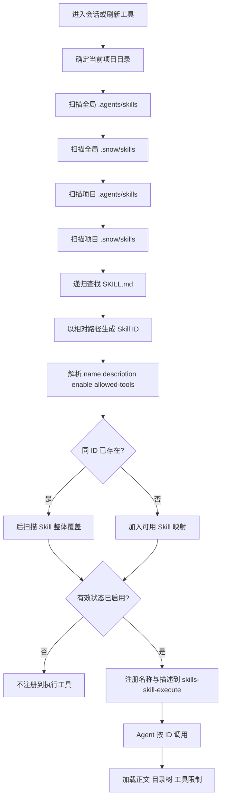

# 21-创建与编写 Skills

本指南面向希望让 Snow App Agent 或用户从零创建 Skill 的场景。你将建立正确目录、编写真实 frontmatter、控制工具权限、验证动态注册，并定位常见问题。

安装第三方 Skill、开关或卸载请参阅[安装与管理 Skills](2-安装与管理Skills.md)。

## 1. 先确定作用域和技能 ID

### 1.1 选择目录

| 目标 | 推荐目录 | 适用场景 |
| --- | --- | --- |
| 仅当前项目 | `<项目>/.snow/skills/<skill-id>/` | 项目规范、项目脚本、团队工作流 |
| 当前项目但兼容通用 Agent 目录 | `<项目>/.agents/skills/<skill-id>/` | 希望被其他兼容工具发现 |
| 当前用户所有项目 | `~/.snow/skills/<skill-id>/` | 个人通用工作流、Snow App 管理 |
| 当前用户通用 Agent 目录 | `~/.agents/skills/<skill-id>/` | 跨 Agent 共享 |

同 ID 的有效优先级从高到低为：

1. `<项目>/.snow/skills/`
2. `<项目>/.agents/skills/`
3. `~/.snow/skills/`
4. `~/.agents/skills/`

后扫描目录覆盖先扫描目录，内容不合并。创建前先检查四处是否已有同 ID Skill，避免意外遮蔽。

### 1.2 ID 与 `name` 不相同

技能 ID 是 `SKILL.md` 所在目录相对技能根目录的路径。例如：

```text
<项目>/.snow/skills/database/schema-review/SKILL.md
```

对应 ID 为 `database/schema-review`。frontmatter `name` 只是展示名称，不会改变手动创建 Skill 的运行时 ID。建议 ID 使用小写字母、数字、短横线和 `/` 分组，避免空格和容易混淆的路径字符。

## 2. 扫描与动态注册数据流



扫描会跳过以 `.` 开头的目录，以及 `templates`、`examples`、`node_modules`。`SKILL.md` 的 frontmatter 非法或起始 `---` 没有闭合时，该 Skill 会被跳过。没有 frontmatter 仍可加载，但缺少描述会降低 Agent 自动选择的准确性。

## 3. 从零创建：用户流程

1. 选定作用域和唯一 ID；
2. 创建 `<skills-root>/<skill-id>/`；
3. 创建入口文件 `<skills-root>/<skill-id>/SKILL.md`；
4. 按第 5 节模板填写元数据和步骤；
5. 需要参考资料、模板或脚本时放在同一目录下；
6. 在 Skills 设置页刷新，或让 Agent 用 `config-list scope=skills` 验证；
7. 进行一次最小任务测试，确认触发、步骤、权限和输出。

推荐结构：

```text
my-skill/
├── SKILL.md
├── references/
│   └── policy.md
├── templates/
│   └── report.md
└── scripts/
    └── validate.ps1
```

Skill 加载后会把目录树和绝对路径告诉 Agent，因此正文可以明确要求“先读取 `references/policy.md`”。辅助文件不会单独注册为 Skill；入口始终是大写文件名 `SKILL.md`。

## 4. 让 Snow App Agent 创建

向 Agent 提供以下信息，避免它猜测业务规则：

- 作用域：全局还是指定项目；
- 精确技能 ID；
- 何时应触发、何时不应触发；
- 输入、输出和完成标准；
- 允许使用的工具；
- 是否需要辅助文件；
- 要执行的验证场景。

推荐请求模板：

```text
请在当前项目创建 Skill：release/check-package。
触发场景：发布前检查构建产物；不要执行发布。
输出：阻断项、警告、通过项三段。
只允许 filesystem-read、grep-search。
先检查是否存在同 ID Skill，创建后用 config-list/config-get 验证路径和字段，
再用一个只读示例任务测试。不要删除或覆盖已有 Skill，除非我确认。
```

Agent 的严谨执行顺序应为：

1. 确认项目根目录与目标绝对路径；
2. 搜索四个扫描根目录中的同 ID Skill；
3. 若目标文件已存在，先向用户说明覆盖影响并确认；
4. 创建目录、`SKILL.md` 和必要辅助文件；
5. 读取回写内容，检查 frontmatter 与代码块边界；
6. 用 config Skills 列表验证有效路径、状态与 `allowedTools`；
7. 运行不产生副作用的最小测试，并汇报结果。

## 5. Frontmatter 字段

真实字段如下：

```yaml
---
name: package-review
description: Review release artifacts when the user asks for a pre-publish package check.
enable: true
allowed-tools:
  - filesystem-read
  - grep-search
---
```

| 字段 | 类型 | 默认值 | 编写建议 |
| --- | --- | --- | --- |
| `name` | string | ID 最后一段 | 简短可读；GitHub 安装器会用它派生安装 ID。 |
| `description` | string | 空 | 写“何时使用 + 做什么 + 主要产出”，不要只写泛化能力。 |
| `enable` | boolean | `true` | 暂不希望注册时设为 `false`。字段不是 `enabled`。 |
| `allowed-tools` | string[] 或逗号分隔 string | 无限制 | 使用完整精确工具名；字段不是 `allowed_tools`。 |

`allowed-tools` 示例也可以写成：

```yaml
allowed-tools: filesystem-read, grep-search
```

空数组或只包含空字符串会被视为没有限制。若要执行 MCP 工具，应先在当前项目获取实际公开工具名；外部服务器名和工具名可能经过规范化或冲突消解，不要凭记忆填写。

## 6. 可直接复用的 `SKILL.md` 模板

```markdown
---
name: example-skill
description: Use when <触发条件>; perform <核心任务>; return <主要产出>.
enable: true
allowed-tools:
  - filesystem-read
  - grep-search
---

# Example Skill

## Goal

说明唯一目标、成功标准，以及明确不做什么。

## Required inputs

- 必需输入；
- 缺失时必须询问的内容；
- 不得推测的业务规则。

## Workflow

1. 先读取哪些文件或状态；
2. 如何验证事实；
3. 如何执行主任务；
4. 如何处理失败和边界情况；
5. 如何验证结果。

## Safety boundaries

- 哪些操作需要用户确认；
- 哪些文件、数据或服务不得修改；
- 凭据与隐私数据如何处理。

## Output format

规定标题、字段、表格或检查清单，确保结果可验证。

## Completion criteria

- 所有必需检查已完成；
- 没有跳过错误；
- 已汇报验证证据和未解决项。
```

编写原则：

- **聚焦单一任务**：一个 Skill 不要同时承担互不相关的职责；
- **先读后写**：明确事实来源和检查顺序；
- **步骤可执行**：使用具体动词、输入、输出和失败分支；
- **避免复制通用常识**：正文只保留该领域独有规则；
- **显式边界**：对删除、发布、凭据、数据库变更写清确认要求；
- **可验证**：每个写入或决策都要有对应检查；
- **引用辅助文件**：长规范放 `references/`，不要让入口文件无限膨胀。

## 7. 测试与验证

### 7.1 静态检查

- 文件名严格为 `SKILL.md`；
- 若有 frontmatter，第一行和结束行都是独立的 `---`；
- YAML 可解析，缩进使用空格；
- 只使用 `enable`、`allowed-tools`；
- `enable` 是布尔值而不是字符串；
- `allowed-tools` 中没有拼写错误或不需要的高权限工具；
- Markdown 代码块全部闭合，辅助文件路径存在。

### 7.2 注册检查

让 Agent 执行只读查询：

```text
config-list scope=skills projectId=<projectId>
config-get scope=skills key=<skill-id> projectId=<projectId>
```

检查：

- `id` 是否为预期相对路径；
- `path` 是否指向刚创建的目录；
- `source`/`location` 是否符合预期；
- `defaultEnabled` 与 `enabled` 是否正确；
- `allowedTools` 是否与 frontmatter 一致；
- 是否被同 ID 高优先级目录覆盖。

### 7.3 行为检查

至少覆盖三类用例：

1. **正向触发**：描述匹配时 Agent 能选中并按步骤完成；
2. **负向触发**：不相关请求不会误用 Skill；
3. **权限边界**：尝试需要未允许工具的分支时，Agent 应停止并说明缺失权限，而不是绕过限制。

测试默认使用只读、小样本和无副作用输入。若 Skill 涉及写文件、执行命令、发布或修改数据，先获得明确确认，再在隔离环境测试。

## 8. 排错

| 问题 | 检查顺序 |
| --- | --- |
| 列表中没有 Skill | 路径 → `SKILL.md` 大小写 → 跳过目录 → frontmatter 闭合 → YAML 语法。 |
| ID 与预期不同 | ID 来自相对目录路径，不来自 `name`；检查是否多套了一层目录。 |
| 展示的是旧内容 | 查看 `path`；按覆盖优先级检查四个根目录中的同 ID Skill。 |
| `enable: false` 仍显示启用 | 检查项目数据库覆盖；项目有效值优先于 frontmatter。 |
| `enabled: false` 无效 | 字段写错，应改为 `enable: false`。 |
| `allowed_tools` 无效 | 字段写错，应改为 `allowed-tools`。 |
| 某工具不可用 | 核对 `allowedTools` 返回值和完整工具名，再检查该工具/服务器是否在项目级启用。 |
| 修改后仍加载旧正文 | 重新开始下一次 Skill 调用或刷新工具列表；确认实际 `path` 未被覆盖。 |
| Agent 不主动选择 | 把 `description` 改成明确触发条件和产出；必要时直接按 ID 请求执行进行诊断。 |

## 9. 发布前检查清单

- [ ] ID 唯一，作用域正确，没有意外覆盖；
- [ ] `name` 与 `description` 清晰；
- [ ] 使用 `enable` 和 `allowed-tools`；
- [ ] 工具权限满足最小权限；
- [ ] 正文包含目标、输入、流程、安全边界、输出和完成标准；
- [ ] 辅助文件齐全且路径正确；
- [ ] config 列表/读取验证通过；
- [ ] 正向、负向、权限边界用例已测试；
- [ ] 没有嵌入密钥、令牌、个人数据或机器专属绝对路径。
