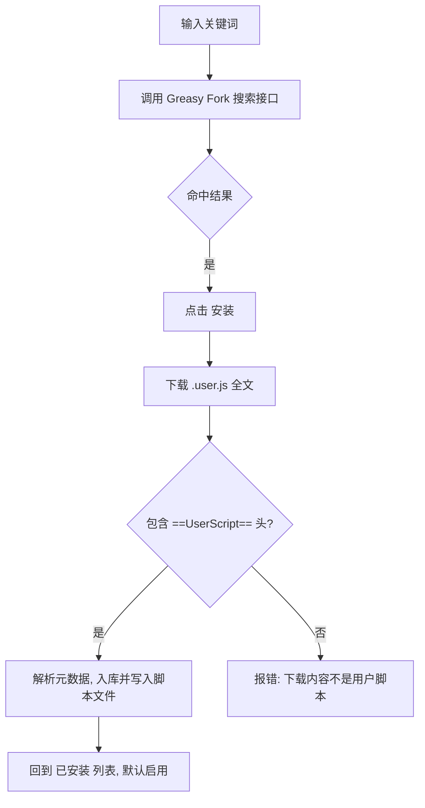

# 22-油猴脚本（Userscripts）

> 适用：内置浏览器（`设置 → 浏览器设置 → 油猴脚本`）。与 [浏览器自动化](6-浏览器自动化.md) 中 AI Agent 操控的 `browser` MCP 工具是**两套独立能力**：本文的脚本只注入内置浏览器的 webview 页面，不会注入 AI `browser` 工具创建的实例。

## 目标

在 Snow 内置浏览器中运行 Tampermonkey 兼容的用户脚本：修改页面 DOM、绕过部分跨域限制、注册右键菜单命令、持久化设置（`GM_*` 值）、下载文件等。脚本按 `@match`/`@include` 规则自动注入匹配的页面。

## 前置条件

- 脚本文件必须包含完整的 `// ==UserScript==` ... `// ==/UserScript==` 元数据头（`@name` 与至少一条 `@match` 或 `@include` 必填，见下文元数据表）。
- 从 Greasy Fork 搜索安装时，需要网络可访问 `https://api.greasyfork.org`，且下载地址必须为 `https://`。
- 脚本以**主世界（页面 `window`）**执行，可访问页面全部对象，等价于直接运行网页脚本，请只安装可信来源的脚本。

## 入口

打开 **设置 → 浏览器设置**（设置页 id：`browser-settings`，agent 可用 `app-control-openSettings page=browser-settings` 打开），切换到 **油猴脚本** Tab。该 Tab 分「已安装」与「搜索下载」两个次级 Tab。

> 注意：与 [17-浏览器设置密码与数据导入](17-浏览器设置密码与数据导入.md) 中的起始页、密码管理同属一个设置面板（`BrowserSettingsPanel`），只是不同 Tab。

## 操作步骤

### 1. 新建脚本

点击 **新建脚本**，编辑器会预填一个最小模板：

```javascript
// ==UserScript==
// @name         My Script
// @namespace    snow-app
// @version      1.0
// @description  Describe what this script does
// @author       You
// @match        https://example.com/*
// @run-at       document-idle
// @grant        none
// ==/UserScript==

console.log("Hello from userscript!");
```

保存后写入应用数据库与脚本文件，并在内置浏览器匹配页面时自动注入（无需重启应用）。

### 2. 编辑 / 启用 / 禁用 / 删除

「已安装」列表展示名称、描述、版本、匹配规则摘要与运行时机，每行支持：

- **启用开关**：立即生效，禁用后不再注入（下次导航即停止匹配）。
- **编辑**：以代码编辑器打开完整源码（含元数据头），保存后重写文件与元数据。
- **删除**：二次确认后删除数据库记录与磁盘脚本文件（不可恢复）。
- **刷新**：重新从数据库与磁盘加载列表（手动改动 `~/.snowapp/browser-script/` 后同步用）。

### 3. 从 Greasy Fork 搜索安装

「搜索下载」Tab 调用 Greasy Fork 搜索接口（按安装量排序），结果含名称、描述、评分、安装量与详情链接：



已安装的脚本（按名称去重）在列表中显示为「已安装」且按钮不可再点。搜索接口不返回总数，分页依赖 `hasMore`（本页结果数是否达到请求条数）判断是否还有下一页。

### 4. 让 AI 帮你安装（config 工具 `userscripts` 域）

除了 UI 操作，可以直接让 AI 通过 `config` 工具管理用户脚本，无需打开设置页：

```text
# 推荐流程：先把完整源码写成文件，再让后端读取文件安装（避免在工具参数里传超大字符串）
filesystem-create 写入 ./scripts/demo.user.js（完整 // ==UserScript== 内容）
config-set scope=userscripts key="new" value={sourcePath: "/abs/path/demo.user.js"}

# 小脚本可直接内联
config-set scope=userscripts key="new" value={raw: "// ==UserScript==\n// @name Demo\n// @match https://example.com/*\n// ==/UserScript==\nconsole.log('hi');"}

# 更新已有脚本
config-set scope=userscripts key="<scriptId>" value={sourcePath: "..." }  // 或 {raw: "..."}

# 启用/禁用
config-set scope=userscripts key="<scriptId>" value={enabled: false}

# 读写 GM_* 持久化值
config-set scope=userscripts key="<scriptId>" value={values: {"k": "v"}}
config-set scope=userscripts key="<scriptId>" value={deleteValues: ["k"]}
config-get scope=userscripts key="<scriptId>"   // 返回元数据 + 完整源码 + GM 值

# 卸载（删除数据库记录 + 磁盘文件）
config-delete scope=userscripts key="<scriptId>" confirmed=true
```

`key` 为脚本 `scriptId`（列表接口返回的 UUID），`"new"` 表示新建。详见 [内置工具参考](../3-参考手册/2-内置工具参考.md) 的 `config` 工具 `userscripts` 域。

## 元数据字段

解析器只识别 `// @` 开头的行，键名转小写匹配；`@name:zh-CN` 等本地化变体在缺失裸 `@name` 时按应用语言回退选择（精确标签 → 主语言 → 首个可用值）。

| 字段 | 必填 | 默认值 | 说明 |
| --- | --- | --- | --- |
| `@name` | 是（除非有本地化变体） | — | 脚本名；支持 `@name:zh-CN` / `@name:en` 等本地化变体 |
| `@match` / `@include` | 至少一个 | — | 匹配规则，可多条；均为空时匹配**所有**网址 |
| `@version` | 否 | `1.0` | 版本号 |
| `@description` | 否 | 空 | 描述 |
| `@namespace` | 否 | 空 | 命名空间 |
| `@author` | 否 | 空 | 作者 |
| `@run-at` | 否 | `document-idle` | `document-start` / `document-end` / `document-idle` |
| `@noframes` | 否 | `true` | 为真时脚本不在 `iframe` 子框架中执行 |
| `@grant` | 否 | 空 | 声明使用的 `GM_*` API，可多条；仅用于展示，不影响实际可用 API |
| `@exclude` / `@exclude-match` | 否 | 空 | 排除规则，优先级高于 `@match`/`@include` |
| `@require` | 否 | 空 | 外部 JS 依赖 URL，异步预热后内联注入（首次导航可能尚未就绪，下次导航生效） |
| `@resource` | 否 | 空 | 外部资源，形如 `@resource <name> <url>`，供 `GM_getResourceText` / `GM_getResourceURL` 读取 |

**通配符规则**（`@match`）：`*` 匹配任意非 `/` 字符；主机部分支持 `*.example.com`（含子域）、`*example.com`（后缀匹配）、`*`（任意主机）；协议支持 `*://`（任意协议）；路径中 `*` 匹配任意字符，`/*` 匹配该路径下全部内容。`@include`/`@exclude` 使用同样的通配符语义，但可不含协议（此时按子串锚定匹配）。

## GM_* API 支持矩阵

脚本在主世界执行前，对应脚本的 `GM_*` API 会先挂载到 `window`（每个脚本独立闭包上下文，`GM_getValue`/`GM_setValue` 等操作只影响当前脚本自己的持久化命名空间）。

| API | 说明 |
| --- | --- |
| `GM_getValue` / `GM_setValue` / `GM_deleteValue` / `GM_listValues` | 持久化键值存储，存入数据库 `userscript_values` 表（按 `scriptId` + `key` 唯一）；`GM_setValue` 同时向其他标签页广播变更（本标签页不触发自己的监听器，对齐 Tampermonkey 语义） |
| `GM_addValueChangeListener` / `GM_removeValueChangeListener` | 监听 `GM_setValue`/`GM_deleteValue` 变更 |
| `GM_getTab` / `GM_saveTab` / `GM_getTabs` | 会话级（按 webContents）内存存储，进程重启即清空 |
| `GM_xmlhttpRequest` | 经主进程发起请求，**绕过页面 CORS 限制**；支持 `text`/`json`/`arraybuffer`/`blob`（二进制以 base64 回传）；仅允许 `http(s)` URL，超时 30 秒 |
| `GM_notification` | 创建系统通知，支持 `onclick` / `ondone` 回调（点击与失败事件回传给脚本） |
| `GM_setClipboard` | 写入系统剪贴板 |
| `GM_addStyle` | 向页面注入 `<style>` 节点 |
| `GM_addElement` | 创建并挂载 DOM 元素 |
| `GM_registerMenuCommand` / `GM_unregisterMenuCommand` | 注册**页面右键菜单**命令，点击时执行对应回调（幂等：同名命令复用同一 id） |
| `GM_openInTab` | 在内置浏览器新开标签页打开 URL（`active:false` 为后台标签） |
| `GM_download` | 发起下载，支持 `onload`/`onerror`/`onprogress`；允许 `http(s)`/`blob:`/`data:` URL |
| `GM_getResourceText` / `GM_getResourceURL` | 读取 `@resource` 声明的外部资源内容 / 生成 data URL |
| `GM_log` | 等价 `console.log` |
| `GM_cookie.list` / `GM_cookie.set` / `GM_cookie.delete` | 操作当前 Electron session 的 Cookie（Tampermonkey beta API） |
| `GM_info` | 只读元信息（`script.name` / `version` / `description` / `scriptMetaStr` / `scriptHandler` / `version`） |

**未完整支持的差异**：
- `window.prompt()` 在 Electron 中不受支持，脚本调用会被替换为同步返回默认值（控制台打印警告），依赖用户输入交互的脚本该分支会直接取默认值继续执行。
- 多个脚本同时匹配同一页面时，共享同一份 `window.GM_*` 单例（指向**最后** `prepare` 的脚本上下文），与 Tampermonkey 的按脚本隔离略有差异，但各脚本的 `GM_*` 持久化值仍按 `scriptId` 独立存储。
- `@require` 内容异步预热：首次导航若依赖尚未下载完成，会以占位注释替代，**下次导航**才内联生效。

## 验证

1. 新建/安装脚本后，切换到内置浏览器打开一条命中 `@match` 的页面；
2. 打开开发者工具控制台查看脚本输出（`console.log` / `GM_log`），或观察脚本预期的 DOM 变化；
3. 若脚本声明了 `GM_registerMenuCommand`，在页面上右键应能看到对应菜单项。

脚本按 `@run-at` 时机注入：`document-start` 在页面任何脚本执行前运行（用于劫持媒体流、提前注入 UI 等场景），`document-end` 在 `DOMContentLoaded` 后，`document-idle`（默认）在 `DOMContentLoaded` 后的下一帧。

## 常见问题与恢复

| 现象 | 排查 |
| --- | --- |
| 脚本未生效 | 确认启用开关已打开；检查 `@match`/`@include` 是否真的匹配当前 URL；确认 `@noframes` 场景（页面本身是 iframe 时） |
| `@require` 依赖第一次没生效 | 属正常现象，异步预热未完成，重新导航一次 |
| `GM_xmlhttpRequest` 报错 | 确认 URL 是 `http(s)` 协议，且没有超过 30 秒超时 |
| 手动改过 `~/.snowapp/browser-script/` 下的文件 | 点「刷新」重新加载元数据；数据库元数据与文件内容不一致时，以重新编辑保存为准 |
| 删除脚本 | UI 与 `config-delete` 都需二次确认，删除后数据库记录与磁盘文件一并移除，不可恢复 |

## 安全边界

- 脚本运行在**页面主世界**，可读写页面全部 `window`/DOM/Cookie，风险等同于直接运行该网页的脚本；只安装可信来源（尤其注意 `@grant` 声明与实际行为的差异）。
- `GM_*` 持久化值以明文字符串存于应用数据库 `userscript_values` 表，备份/分享数据库时注意脱敏。
- `GM_cookie` 与 `GM_setValue` 等操作依赖当前 OS 用户与 Electron session，不具备跨机迁移能力。
- 数据库、脚本文件的完整存储位置见 [数据存储位置](../3-参考手册/4-数据存储位置.md)。

## 实现锚点

- 元数据解析与数据库/文件存储：`native/src/storage/userscripts.rs::parse_meta`、`native/src/storage/userscripts.rs::create_userscript`
- 脚本文件目录：`~/.snowapp/browser-script/{script_id}.user.js`（`native/src/storage/userscripts.rs::browser_script_dir`）
- 注入引擎（webview preload，主世界执行 + GM shim）：`src/preload/userscriptEngine.ts::injectUserscripts`
- 主进程同步匹配缓存（`document-start` 语义，`sendSync` 无 IO 匹配）：`src/main/app/userscriptSyncStore.ts::initUserscriptSyncStore`
- GM_* IPC 桥（存储/网络/通知/剪贴板/Cookie/下载/菜单）：`src/main/ipc/handlers/userscriptHandlers.ts::registerUserscriptHandlers`
- Greasy Fork 搜索/安装：`src/main/ipc/handlers/userscriptHandlers.ts`（`userscripts:search` / `userscripts:install`）
- 设置页 UI：`src/renderer/components/sidebar/browserSettings/UserscriptsSection.tsx`（嵌入 `BrowserSettingsPanel.tsx` 的「油猴脚本」Tab）
- AI 工具入口：`native/src/mcp/servers/config/userscripts_scope.rs::set_userscript`
