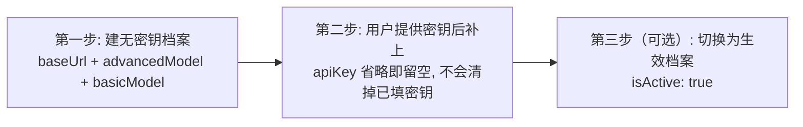

# 3-配置API密钥与模型

Snow App 通过 **API 档案（Profile）** 管理模型服务商的接入信息，
支持多档案并存与一键切换。本文介绍如何在图形界面配置 API 密钥与模型，
以及对应的配置文件位置。

## 1. 认识配置入口

| 入口 | 说明 |
| --- | --- |
| 设置 → API 设置（设置页 id：`api-settings`） | 图形界面：新建/编辑/切换 API 档案 |
| 应用数据库 `api_configs` 表 | **多档案的权威存储**，每行一个档案（`profile_name` 唯一标识） |
| `~/.snow/active-profile.json` 的 `activeProfile` 字段 | 记录**当前生效的档案名**；生效配置 = `api_configs` 中该档案 |
| `~/.snow/config.json` 的 `snowcfg` 字段 | 与 Snow CLI 共享的兼容层/快照，**不是**档案的权威来源 |

> **存储机制速记**：多档案列表存在应用数据库 `api_configs` 表，当前生效档案由
> `activeProfile` 指定。`config` 工具与 UI 读写的是**当前生效档案**；
> `config.json` 中的 `snowcfg` 只是当前档案的 CLI 兼容镜像。

## 2. 图形界面配置（多档案）

打开 **设置 → API 设置**，可以新建多个档案。新建档案需填写：

| 字段 | 必填 | 说明 |
| --- | --- | --- |
| 档案名（Profile name） | 是 | 档案的唯一标识，如 `openai` |
| 显示名（Display name） | 否 | 界面中展示的名称，缺省取档案名 |
| Base URL | 是 | 服务端点地址 |
| Base URL 模式 | 是 | `auto` 自动 / `custom` 手动 |
| API Key | 否（可后补） | 服务商密钥，如 `sk-...` |
| 请求方法（Request method） | 是 | 如 `chat` |
| 高级模型（Advanced model） | 生效档案是（trim 后非空）；inactive 草稿否 | 该 Profile 的默认高级模型；普通会话仍使用会话选定模型 |
| 基础模型（Basic model） | 生效档案是（trim 后非空）；inactive 草稿否 | 会话标题、AI Commit、`@?` 文件搜索和代码库 Agent Review 使用的模型 |
| 视觉模型（Vision model） | 否 | 图像理解模型，可单独配置 |

当档案的 `isActive` 为 `true`（包括保存为生效档案或之后激活）时，
`advancedModel` 和 `basicModel` 在 trim 后必须都非空。inactive 档案可作为草稿保存，
两个模型字段均可留空；API Key 是否为空不属于这项模型完整性校验。

模型输入框聚焦时会自动从当前 Base URL 拉取可用模型列表，也可手动填写。

### 基础/高级模型路由

- Snow App 不会分析提示词复杂度，也不会在 `basicModel` 与 `advancedModel` 之间自动切换；
- 普通会话使用该会话选定的模型；`advancedModel` 只是所属 Profile 的默认高级模型，在调用没有提供非空高级模型时使用。两类模型互不回退：高级入口缺少 `advancedModel` 时不会改用 `basicModel`，基础入口也不会反向兜底；
- 会话标题、AI Commit、`@?` 文件搜索和代码库 Agent Review 使用 `basicModel`。标题请求的供应商与 Profile 跟随会话绑定；绑定档案已删除时，按普通会话规则回退当前 active Profile；
- 视觉理解、图像生成和 embedding 使用各自的独立通道，不受上述 basic/advanced 路由规则影响。

### 视觉模型独立配置

当主模型不支持视觉时，关闭 **Supports vision** 开关，可单独配置
`visionBaseUrl`、`visionApiKey`、`visionRequestMethod`、`visionModel`，
使图像理解请求走独立的服务端点与密钥。
图片会被文本化为文字描述供主模型理解；同时每条**用户消息**中的图片会
附带 `[Reference image #N ...]` 引用（仅含 upload 目录相对路径），
**图生图时仍使用原始图片**，不会被降级为文生图（见
[9-图像生成](9-图像生成.md)）。

### 可选配置

- **系统提示词**：从已保存的系统提示词中选择，也可继承全局档案设置；
- **自定义请求头方案**：选择 `custom-headers.json` 中定义的 scheme，
  可选"继承全局"或"不使用"；
- **自动压缩**：开启 `enableAutoCompress` 后，当上下文用量达到阈值
  `autoCompressThreshold`（百分比）时自动压缩历史消息；
- **1M 上下文（Anthropic）**：当请求方法为 `anthropic` 时，可开启 **1M context**
  开关，开启后所有 Anthropic 请求自动携带 `anthropic-beta: context-1m-2025-08-07`
  请求头，声明 100 万上下文能力，供 Anthropic 官方 API 及要求显式启用 1M
  上下文的网关/中转识别；模型名无需附加任何标记（若模型名带有 Claude Code
  生态的 `[1M]` 后缀，也会自动剥离并同样生效，兼容 cc-switch 等工具）；
- **Google 搜索（Gemini）**：开启 `googleSearch` 后，Gemini 聊天请求会注入
  Google Search 工具实现实时联网接地（Grounding with Google Search）；
  视觉模型独立配置区另有 `visionGoogleSearch` 开关，可单独控制视觉请求；
- **Responses Fast Mode**：当请求方法为 `responses` 时，可开启
  `responsesFastMode` 快速模式，让服务端以快速模式处理响应式请求。

表单会按请求方法校验字段：切换请求方法时，不适用于该方法的字段会被
重置或跳过（如思考强度、Responses 专属选项），避免提交无效组合。

以上字段保存为该档案在应用数据库 `api_configs` 表中的一条记录；
当前生效档案的副本同步到 `~/.snow/config.json` 的 `snowcfg` 字段，与 Snow CLI 共享。

## 3. 多档案切换

在 API 设置中切换 **Enable profile** 开关即可切换当前生效档案；
当前档案名记录在 `~/.snow/active-profile.json` 的 `activeProfile` 字段。
Agent 也可用 config 工具直接切换（见 [5.1 ④](#51-常用操作速查agent-照着做)）。

## 4. 高级选项

部分高级参数可在 UI 的 Runtime 区域配置（如最大上下文、最大生成
token、流式空闲超时、重试次数与延迟），其余参数可直接编辑
`~/.snow/config.json` 的 `snowcfg` 字段：

| 字段 | 说明 |
| --- | --- |
| `maxContextTokens` | 最大上下文 token 数 |
| `maxTokens` | 单次生成最大 token 数 |
| `streamIdleTimeoutSec` | 流式响应空闲超时（秒） |
| `maxRetries` | 请求最大重试次数 |
| `retryDelayMs` | 重试间隔（毫秒） |
| `showThinking` | 是否展示思考过程 |
| `chatThinking.reasoning_effort` | 思考强度（如 `max`） |
| `toolResultTokenLimit` | 工具结果最多占模型上下文的百分比 |

> **提示**：直接编辑 `config.json` 后需重启应用使改动生效。

> **DeepSeek 思考模式兼容**：DeepSeek V4 思考模式下，流式处理会为每条助手消息补齐 `reasoning_content` 字段，避免部分供应商接口因该字段缺失返回 400 错误；`showThinking` 开关与 `reasoning_effort` 设置同样适用于该模式。

## 5. AI / 命令行配置（config 工具）

Snow App 内置 `config` 工具，AI Agent 可读写与 UI 同源的配置。API 档案相关：

| 工具 | 用途 |
| --- | --- |
| `config-list scope=snowcfg` | 查看当前生效档案的全部配置与键 |
| `config-get scope=snowcfg key=baseUrl` | 读取单个键（`apiKey` 自动脱敏，如 `sk-****abcd`） |
| `config-set scope=snowcfg key=baseUrl value="..."` | 写入单个键（白名单 + 类型校验 + 自动备份 + 原子写） |
| `config-list scope=apiProfiles` | 列出**全部档案**（密钥脱敏），含使用引导 |
| `config-get scope=apiProfiles key=<档案名>` | 读取单个档案（密钥脱敏，不存在返回 null） |
| `config-set scope=apiProfiles key=<档案名> value={...}` | 新建/更新档案（写应用数据库，与 UI 同源、立即生效） |
| `config-delete scope=apiProfiles key=<档案名>` | 删除档案（破坏性操作，须先经用户确认再带 `confirmed: true`） |



### 5.1 常用操作速查（Agent 照着做）

#### ① 查看档案

```
config-list scope=apiProfiles   # 全部档案（apiKey/visionApiKey 脱敏，isActive 标出生效档案）
config-list scope=snowcfg       # 当前生效档案的完整配置
config-list scope=app           # activeProfile（CLI 兼容层记录的档案名）
```

#### ② 修改密钥

```
config-set scope=apiProfiles key=档案名 value={"apiKey": "sk-新密钥"}
```

- 密钥为空或省略时**一律保留旧值**——新建无密钥档案后补密钥、或改其他字段时不会丢密钥；
- `apiKey`/`visionApiKey` 读取时一律脱敏，**不要向用户索要或展示明文密钥**；密钥由用户提供后写入。

#### ③ 修改模型 / 其他字段

```
config-set scope=apiProfiles key=档案名 value={"advancedModel": "新模型"}
```

可写字段（全部可选，未提供的字段保留现值）：`displayName`、`baseUrl`、
`baseUrlMode`、`apiKey`、`requestMethod`、`advancedModel`、`basicModel`、
`supportsVision`、`visionBaseUrl`、`visionApiKey`、`visionRequestMethod`、
`visionModel`、`maxContextTokens`、`maxTokens`、`streamIdleTimeoutSec`、
`enableAutoCompress`、`autoCompressThreshold`、`maxRetries`、`retryBaseDelayMs`、
`isActive` 等；`configJson` 自动组装，无需提供。

#### ④ 切换档案

```
config-set scope=apiProfiles key=档案名 value={"isActive": true}
```

- 写应用数据库 `api_configs.is_active`，**对新会话立即生效**（运行时以 DB 为准）；
- **会话隔离**：会话在创建时绑定当时生效的档案（`api_profile_name`），
  **切换全局档案不会改变已绑定档案的已有会话**；子代理会话严格绑定档案名，
  删除档案会使该子代理会话失败（不回退）；
- 旧方式 `config-set scope=app key=activeProfile value="档案名"` 仅写
  `active-profile.json`（CLI 兼容层），不改变运行时生效档案，仅作兼容保留。

#### ⑤ 新建档案（含"无密钥建档 → 用户后补密钥"）

```
# 第一步：先建无密钥档案（apiKey 省略即留空）
config-set scope=apiProfiles key=我的新档案 value={
  "baseUrl": "https://api.example.com/v1",
  "advancedModel": "gpt-4o",
  "basicModel": "gpt-4o"
}

# 第二步：用户提供密钥后补上（空密钥语义不会清掉已填密钥）
config-set scope=apiProfiles key=我的新档案 value={"apiKey": "sk-..."}

# 第三步（可选）：切换为生效档案
config-set scope=apiProfiles key=我的新档案 value={"isActive": true}
```

也可让用户在 **设置 → API 设置**（`app-control-openSettings page=api-settings`）
界面新建档案。

#### ⑥ 删除档案

```
# 先经 user-interaction askUserQuestion 获得用户明确同意，再执行：
config-delete scope=apiProfiles key=档案名 confirmed=true
```

删除后存储层自动保证至少一个生效档案（必要时 seed 默认档案）。

### 5.2 生效方式

- `apiProfiles` 写应用数据库，**立即生效**；
- `snowcfg`/`app` 为文件型配置，写入后**可能需要重启应用或重新保存
  UI 设置**生效（`app.activeProfile` 仅为 CLI 兼容层）；
- `apiKey`/`visionApiKey` 读取一律脱敏，**不要向用户索要或展示明文密钥**；
- 每次写入自动备份到 `~/.snow/.config-backups/`（DB 写入备份对应档案的
  `config_json`）。

## 6. 常见问题

| 症状 | 原因与处理 |
| --- | --- |
| 请求返回 401/403 | 检查 `apiKey` 与 `baseUrl` 是否正确、密钥是否过期 |
| 模型不支持思考 | 关闭 `showThinking` 或调整 `chatThinking.reasoning_effort` |
| 视觉模型不可用 | 单独配置 `visionBaseUrl`、`visionApiKey`、`visionModel` |
| 切换档案不生效 | 用 `config-set scope=apiProfiles key=档案名 value={"isActive":true}` 切换（写 DB 立即生效）；`active-profile.json` 仅为 CLI 兼容层 |

## 6. 参考

- 字段完整说明：[3-参考手册/1-settings.json配置参考](../3-参考手册/1-settings.json配置参考.md)
