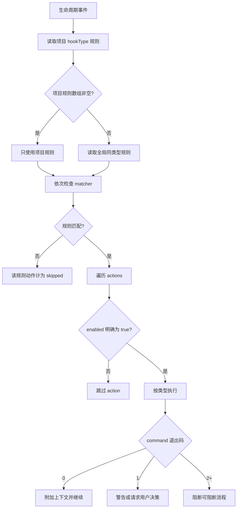
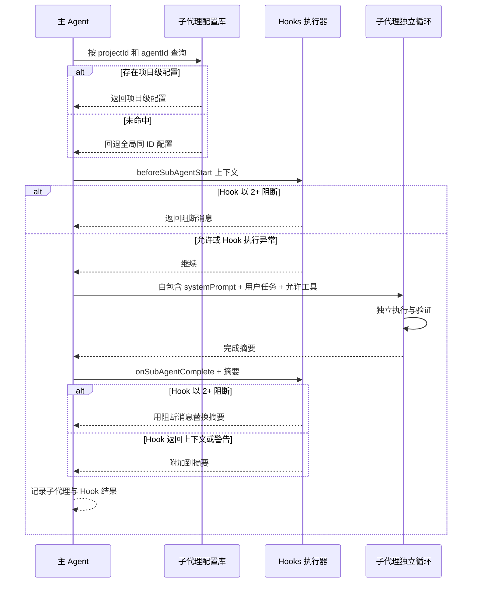

# 5-配置 Hooks 与子代理

Snow App 的 Hooks 和子代理配置存储在应用 SQLite 数据库中，与设置 UI 同源。Agent 可通过内置 `config` 服务读写，成功后立即生效。

## 1. Hooks

### 1.1 作用域与有效规则

- 全局 Hook 对所有项目可用；项目 Hook 需要 `projectId`；
- 执行某个 `hookType` 时，若该项目有**非空规则数组**，使用项目规则；否则回退同类型全局规则；
- 项目规则不会与全局规则合并；即使项目规则中的动作全部禁用，只要规则数组非空，也会阻止回退全局规则；
- 每个 action 只有在 **`enabled` 明确等于 `true`** 时才执行。字段缺省、`null` 或 `false` 都会跳过。设置 UI 保存时会显式写入该字段，通过 config 手写时也必须写。

### 1.2 Hook 类型

| `hookType` | 触发时机 | 允许的 action |
| --- | --- | --- |
| `onUserMessage` | 用户消息进入 AI 前 | `command`、`context` |
| `beforeToolCall` | 工具调用前 | `command` |
| `toolConfirmation` | 工具进入确认流程时 | `command` |
| `afterToolCall` | 工具调用完成后 | `command` |
| `onSubAgentComplete` | 子代理完成后 | `command`、`prompt` |
| `beforeSubAgentStart` | 子代理启动前 | `command`、`context` |
| `beforeCompress` | 上下文压缩前 | `command` |
| `onSessionStart` | 打开已有会话时；fire-and-forget | `command`、`context` |
| `onStop` | 会话停止/清理时；fire-and-forget | `command`、`prompt` |

> `prompt` 是合法配置类型，但当前 native executor 不发起模型调用，而是返回“不支持”的失败记录。不要依赖 `prompt` action 实现生产自动化；优先使用可验证的 `command`，或在允许的触发点使用 `context`。`beforeSubAgentStart` 的 context 目前会被记录，但调用方不会把它追加到子代理 prompt。

### 1.3 Rule 与 action 字段

```json
{
  "description": "为发布检查注入项目规则",
  "matcher": "toolName:bash-*",
  "hooks": [
    {
      "type": "command",
      "command": "node scripts/check-release.mjs",
      "timeout": 5000,
      "enabled": true
    }
  ]
}
```

| 字段 | 位置 | 说明 |
| --- | --- | --- |
| `description` | rule | 必须存在；建议说明意图和失败影响。 |
| `matcher` | rule | 可选。逗号分隔表示 OR；支持 `key:glob`，如 `toolName:bash-*`；无 key 时优先匹配 `toolName`，再检查上下文文本。 |
| `hooks` | rule | 必填 action 数组。 |
| `type` | action | `command`、`context` 或允许位置的 `prompt`。 |
| `command` | command | 通过终端设置中选择的 shell 执行。 |
| `content` | context | 静态文本；JSON 中的 `additionalContext` 或 `prompt` 字段会被提取，否则使用全文。 |
| `prompt` | prompt | 当前 native executor 不执行模型调用。 |
| `timeout` | command | 毫秒；缺省 `5000`。超时会终止子进程并返回错误。 |
| `enabled` | action | **执行必需为 `true`**；缺省不会执行。 |

command action 会把事件上下文 JSON 写入 stdin，并在上下文包含 `cwd` 时使用该目录。stdout/stderr 按退出码解释：

| 退出码 | 结果 |
| --- | --- |
| `0` | 通过；非空 stdout 成为附加上下文。stdout 若为 JSON，可从 `additionalContext` 或 `prompt` 提取。 |
| `1` | 软警告；记录日志。stdout 为 `{"decision":{"message":"..."}}` 时，请求交互式用户决策。 |
| `2+` 或无有效退出码 | 阻断当前可阻断流程，优先展示 stderr，其次 stdout。 |

`onSessionStart` 与 `onStop` 是 fire-and-forget：调用方会把交互式决策降级为普通警告，不能依赖它们阻断流程。

### 1.4 Hooks 执行流程



### 1.5 通过 UI 配置

1. 打开 **设置 → Hooks 设置**（设置页 id：`hooks-settings`）；
2. 选择全局或项目范围；
3. 选择 `hookType`，添加规则与动作；
4. 确认每个应执行动作的开关已打开；
5. 保存并用低风险事件测试；
6. 查看 Hook 执行记录与应用日志。

### 1.6 通过 `config` 配置

全局 command Hook：

```jsonc
config-set scope=hooks key=beforeToolCall value={
  "rules": [
    {
      "description": "运行只读工具审计",
      "matcher": "toolName:filesystem-*",
      "hooks": [
        {
          "type": "command",
          "command": "node scripts/audit-tool-call.mjs",
          "timeout": 5000,
          "enabled": true
        }
      ]
    }
  ]
}
```

项目 context Hook：

```jsonc
config-set scope=hooks key=onUserMessage projectId=<projectId> value={
  "rules": [
    {
      "description": "注入当前项目技术栈",
      "hooks": [
        {
          "type": "context",
          "content": "本项目使用 Electron、React、TypeScript 与 Rust。",
          "enabled": true
        }
      ]
    }
  ]
}
```

包含多个 action 时，每一个都显式设置 `enabled`：

```json
{
  "rules": [
    {
      "description": "压缩前检查并记录上下文",
      "hooks": [
        {
          "type": "command",
          "command": "node scripts/check-context.mjs",
          "timeout": 5000,
          "enabled": true
        },
        {
          "type": "command",
          "command": "node scripts/write-audit.mjs",
          "timeout": 5000,
          "enabled": false
        }
      ]
    }
  ]
}
```

推荐流程：

1. `config-list scope=hooks projectId=<projectId>` 查看现状和 `guidance`；
2. `config-get scope=hooks key=<hookType> projectId=<projectId>` 保存当前值；
3. `config-set` 写入完整 `rules`；
4. 立即 `config-get` 回读，逐个检查 `enabled`；
5. 用低风险事件测试退出码与 matcher；
6. `config-delete` 前展示 scope、key、projectId 和影响并取得明确确认。

Hook 数据库写入会创建写入期间的临时备份，成功后删除本次备份；不要把它当持久历史。

## 2. 子代理

### 2.1 配置字段与作用域

子代理通过 `sub-agents-activate` 运行在独立执行循环中，没有主对话历史。配置字段：

| 字段 | 说明 |
| --- | --- |
| `name` | 展示名称，必填。 |
| `description` | 告诉主 Agent 何时委派。 |
| `systemPrompt` | 必须自包含：使命、输入、流程、工具、安全边界和输出。 |
| `toolsJson` | JSON 字符串或工具名数组。`["*"]` 表示全部，`[]` 表示无工具。 |
| `configProfile` | 留空时继承启动它的主会话本次运行所用 API Profile 和当前模型；非空时固定使用指定 Profile。 |
| `model` | 仅固定 Profile 时生效；非空时固定模型，省略、留空或 trim 后为空时使用该 Profile 的 `advancedModel`。若该 Profile 的 `advancedModel` 也为空则激活失败，不会回退 `basicModel`。 |

激活时先查当前项目的同 ID 配置，未命中才回退全局。内置 `agent_general` 不可通过 config 修改或删除。

主 Agent 的系统提示词会**动态注入当前可用的子代理清单**（含 `agentId`、名称与用途描述）。调用 `sub-agents-activate` 时，主 Agent 应从清单中选择最匹配任务的 `agentId`——存在更合适的配置时**不得默认使用内置 `agent_general`**（它只是通用兜底，仅在无更匹配配置时使用）。清单遵循与激活一致的解析规则：**当前项目的项目级子代理优先**（同 `agentId` 时覆盖全局），未配置项目级的再显示全局/内置。其他项目的子代理不注入。修改配置后新会话立即生效。

启动前会一次性校验工具、Profile 和模型，并生成运行快照。普通循环、工具递归、自动压缩和压缩后续跑都复用该快照，不会在每轮跟随全局配置变化。每次请求仍按固定 Profile 名读取最新凭证，但 Profile 被删除时会严格失败，不会切换到其他供应商。子会话会持久化启动时实际使用的 Profile 和模型，因此历史展示不受后续子代理/API 配置修改影响。

工具规则：

- **显式工具名列表必须传 `projectId`**，因此该子代理是项目级；
- 全局子代理只能使用 `["*"]` 或 `[]`；
- 项目级列表中的每个工具必须是当前项目已启用的完整工具名；
- 外部 MCP 工具的服务器公开名前缀也必须属于当前项目启用的服务器；
- 激活时若配置工具不可用或被禁用，会返回错误，而不是静默扩大权限。

### 2.2 子代理会话视图

子代理运行时以独立会话呈现，打开该会话可看到：

- **顶部标题**：显示**阶段名称**（激活时 prompt 截断到 80 字符，即该子代理被派发的任务阶段）替代项目名；副标题标注**由哪个主会话启动**；
- **信息卡片**：消息列表上方展示 `agentName` 徽章、阶段标题、**跳转主会话**按钮，以及**完整提示词**（默认 3 行截断，悬停显示全文）；
- **数据来源**：会话记录 `title` / `subAgentName` + 首条用户消息（prompt）+ 父会话标题（异步获取）。

### 2.3 通过 UI 配置

1. 打开 **设置 → 子代理设置**（设置页 id：`sub-agent-settings`）；
2. 选择全局或项目范围；
3. 填写名称、描述和完整 system prompt；
4. 全局代理选择全部工具或无工具；项目代理可选择具体工具；
5. 保持“跟随主会话（推荐）”，或选择固定 API 配置；固定后可再选择独立模型，留空则使用该配置的高级模型；
6. 保存后，从主对话发起一个边界清晰的测试任务。

### 2.4 通过 `config` 配置

合法的全局子代理示例：

```jsonc
config-set scope=subAgents key=agent_readonly_reviewer value={
  "name": "只读审查员",
  "description": "需要独立审查并返回问题清单时使用",
  "systemPrompt": "你是只读审查员。先验证输入和文件，再按严重级别输出问题与证据。不得修改文件、运行命令或推测缺失业务规则。没有工具时说明无法验证的部分。",
  "toolsJson": [],
  "configProfile": "",
  "model": ""
}
```

项目级显式工具示例：

```jsonc
config-set scope=subAgents key=agent_project_reviewer projectId=<projectId> value={
  "name": "项目审查员",
  "description": "审查当前项目代码并返回带路径的发现",
  "systemPrompt": "你是当前项目的只读代码审查员。使用允许工具读取事实，按严重级别、文件路径、证据和修复建议输出；不得修改文件。",
  "toolsJson": [
    "filesystem-read",
    "grep-search",
    "codelens-file_outline"
  ],
  "configProfile": "",
  "model": ""
}
```

写入前先 `config-list scope=subAgents projectId=<projectId>` 获取 guidance 和当前工具环境；写入后 `config-get` 回读。`config-delete` 同样需要用户明确确认。

### 2.5 子代理与 Hooks 时序



注意：`beforeSubAgentStart` Hook 执行自身发生异常时，当前调用方会继续激活子代理；因此安全阻断脚本必须可靠、可测试，并用明确的 `2+` 退出码返回阻断。

### 2.6 子代理会话恢复与同会话通信

- **重启后恢复**：子代理会话在应用重启后仍可恢复——`sub-agents-listSubAgents` 列出当前会话的子代理（含本次运行期间已结束的）及其 `status`/`resumable` 状态；`sub-agents-continue` 对已结束的子代理按**原配置（模型、工具、系统提示词）与完整会话历史**重新激活继续执行；
- **同会话通信**：`sub-agents-listTeammates` 查询当前会话中仍在运行的子代理，`sub-agents-sendMessage` 向其投递消息（以 Pending 消息在对方当前轮次结束时送达，并带发送者身份前缀）；并行子代理之间可直接协作，无需经主会话中转；
- **会话隔离**：以上工具只对**当前会话**生效——`listTeammates` 不暴露其他会话的子代理，`sendMessage`/`continue` 跨会话调用会被拒绝。

## 3. 验证与排错

| 症状 | 检查 |
| --- | --- |
| Hook 保存成功但从不执行 | action 是否显式 `"enabled": true`；缺省值会被 native executor 跳过。 |
| 项目 Hook 未回退全局 | 项目规则数组非空即取代全局；删除项目配置或使用空规则数组才会回退。 |
| matcher 不命中 | 核对上下文键名和完整工具名；需要时使用 `toolName:<glob>`。 |
| command 超时 | 默认 5000 ms；检查 shell、PATH、cwd、stdin 读取和合理的正数 `timeout`。 |
| 退出 1 没有决策卡 | stdout 必须是有效 JSON，且包含字符串 `decision.message`；fire-and-forget Hook 只显示警告。 |
| prompt action 没有效果 | 当前 native executor 不执行 prompt 模型调用；改用 command 或受支持的 context。 |
| context 未进入子代理 prompt | `beforeSubAgentStart` 当前只记录结果，不拼接子代理 prompt；把必需内容写入子代理 `systemPrompt`。 |
| 全局子代理显式工具列表被拒 | 显式列表需要 `projectId`；改成项目级，或全局使用 `["*"]`/`[]`。 |
| 子代理找不到工具 | 使用当前项目的完整启用工具名，检查 MCP 服务器与工具开关（全局+项目）。 |
| 子代理行为依赖主对话 | 子代理没有主会话历史；把上下文放进任务 prompt 或自包含 `systemPrompt`。 |
| 同 ID 激活了错误配置 | 项目级优先于全局；分别 `config-get` 并核对 `projectId`。 |
