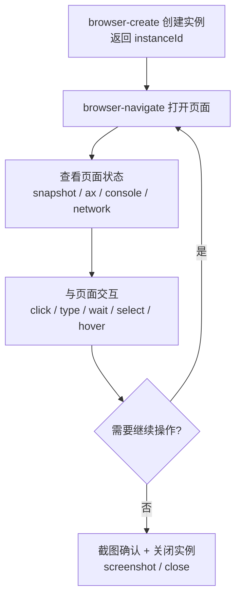

# 6-浏览器自动化（Browser Automation）

Snow App 内置嵌入式 Electron 浏览器，AI Agent 可以直接操控网页完成
测试、抓取、交互验证等任务。本文介绍内置 `browser` 服务器的全部工具
与典型使用流程。

## 1. 工具总览

| 工具 | 用途 |
| --- | --- |
| `browser-create` | 创建浏览器实例（可指定初始 URL） |
| `browser-navigate` | 导航到指定 URL |
| `browser-click` | 以真实鼠标事件点击元素（CSS 选择器 / 可见文本 / 无障碍 ref） |
| `browser-type` | 向元素输入文本（一次性设值或逐键输入，支持 ref 定位） |
| `browser-wait` | 等待文本/元素出现或消失，或等待固定时长 |
| `browser-press_key` | 按下键盘按键或组合键（Enter/Tab/Escape/方向键，支持 `Ctrl+A` 式组合） |
| `browser-select_option` | 下拉框选择选项（按 value 或 label 匹配） |
| `browser-hover` | 悬停元素（触发 hover 浮层） |
| `browser-upload-file` | 上传文件（CDP 直接注入，无对话框） |
| `browser-back` / `browser-forward` | 浏览器历史后退/前进（等待导航） |
| `browser-navigate_back` / `browser-navigate_forward` | 浏览器历史后退/前进（不等待导航） |
| `browser-evaluate` | 在页面执行任意 JavaScript 并返回结果 |
| `browser-screenshot` | 截取页面为 PNG（可整页） |
| `browser-devtools` | 文本/无障碍树快照 / 性能 trace / 控制台消息 / 网络请求与详情 / 离线模拟 / 路由 mock / 登录态加密保存恢复 / cookie 管理 / 弹窗处理 / 打开 DevTools |
| `browser-close` | 关闭标签页 |
| `browser-focus` | 切换到指定标签页 |
| `browser-list` | 列出所有打开的标签页 |

## 2. 典型流程



### 2.1 打开页面

```text
browser-create url=https://example.com
→ 创建实例，返回 instanceId

browser-navigate instanceId=<id> url=https://example.com/docs
→ 跳转到指定页面
```

### 2.2 查看页面状态

```text
browser-devtools action=snapshot instanceId=<id>
→ 页面元数据 + 文本快照（了解页面结构）

browser-devtools action=ax instanceId=<id>
→ 无障碍树快照（结构化可交互元素，带 [uid=eN]；引擎级 AX 树，
  可穿透 closed shadow DOM，元素可 ref 回指）

browser-devtools action=ax verbose=true maxNodes=500 instanceId=<id>
→ 全量节点 + 输入值（token 消耗更大，按需使用）

browser-devtools action=console level=error instanceId=<id>
→ 控制台错误消息（排查页面 JS 报错）

browser-devtools action=network filter=api instanceId=<id>
→ 网络请求记录（观察 API 调用；CDP 记录含 requestId，可查详情）

browser-devtools action=networkDetails requestId=<requestId> instanceId=<id>
→ 单条请求的完整详情：请求/响应头 + 请求体 + 响应体（默认上限 128KB，可用 maxBodyBytes 调整）

browser-devtools action=networkState state=offline instanceId=<id>
→ 模拟离线（所有请求失败）；state=online 恢复
```

### 2.3 接口 Mock（路由拦截）

```text
# 拦截匹配 /api/users 的请求，返回自定义 JSON（pattern 支持 /正则/ 或子串）
browser-devtools action=route pattern="/api/users" body='{"code":0,"data":[]}' contentType=application/json instanceId=<id>

# 返回 500 模拟服务端错误
browser-devtools action=route pattern="/login" status=500 body='{"error":"boom"}' instanceId=<id>

# 清除全部 mock 规则，恢复真实网络
browser-devtools action=routeClear instanceId=<id>
```

同一 pattern 重复调用会覆盖规则；多条规则同时生效（按注册顺序匹配）。

### 2.4 与页面交互

```text
# 点击（用 CSS 选择器、可见文本或无障碍 ref）
browser-click selector="#submit-btn" instanceId=<id>
browser-click text="登录" instanceId=<id>
browser-click ref=e3 instanceId=<id>

# 输入文本（同样支持 ref 定位）
browser-type selector="#username" value="user1" instanceId=<id>
browser-type text="密码框" value="secret" delayMs=30 instanceId=<id>
browser-type ref=e6 value="hello" submit=true instanceId=<id>

# 等待异步内容（SPA 渲染完成后才操作）
browser-wait text="加载完成" instanceId=<id>
browser-wait textGone="Loading..." timeoutMs=15000 instanceId=<id>

# 键盘操作
browser-press_key key="Tab" instanceId=<id>
browser-press_key key="Control+a" instanceId=<id>   # Ctrl+A 全选
browser-press_key key="Escape" instanceId=<id>

# 下拉框 / 悬停 / 上传
browser-select_option selector="#country" values=["CN"] instanceId=<id>
browser-hover text="用户菜单" instanceId=<id>
browser-upload-file selector="input[type=file]" files=["C:/tmp/avatar.png"] instanceId=<id>

# 历史导航
browser-back instanceId=<id>
browser-forward instanceId=<id>
browser-navigate_back instanceId=<id>
browser-navigate_forward instanceId=<id>

# 执行任意 JS（读取/修改页面状态）
browser-evaluate expression="document.title" instanceId=<id>
```

### 2.5 性能分析（trace）

```text
# 录制 3 秒性能数据，返回长任务/事件统计（主线程卡顿指标）
browser-devtools action=trace instanceId=<id>
browser-devtools action=trace durationMs=5000 instanceId=<id>
→ { eventCount, longTasks: { count, totalMs, longestMs }, topEventTypes }
```

长任务（>50ms 的可运行事件）数量与总时长是判断页面卡顿的核心指标；
`topEventTypes` 显示主要事件构成，可据此决定是否需要进一步用
`action=network` 与 `action=console` 排查。

### 2.6 截图与关闭

```text
browser-screenshot instanceId=<id> fullPage=true
→ 返回 PNG 图片

browser-close instanceId=<id>
```

## 3. 登录态保存与恢复（cookie + localStorage）

内置浏览器是持久会话，但登录状态可以显式「存档/取档」，用于多账号切换、
状态备份与还原。文件经系统级加密（safeStorage）保存在 `~/.snow/browser-state/`，
**绝不明文落盘**；恢复前自动加密备份当前状态。

```text
# 保存当前登录态（cookies + 当前页面 origin 的 localStorage）
browser-devtools action=storageSave instanceId=<id>
browser-devtools action=storageSave fileName=github-account1.bin instanceId=<id>
→ 返回文件名与统计（cookie 数 / origin 数），不回显内容

# 恢复登录态（恢复前自动备份当前状态到 backups/）
browser-devtools action=storageRestore fileName=github-account1.bin instanceId=<id>
→ 返回恢复统计 + 备份文件路径

# 查看 cookie（值默认脱敏：只显示前 4 位 + 长度）
browser-devtools action=cookies instanceId=<id>
browser-devtools action=cookies domain=".github.com" instanceId=<id>
# 调试需要明文时显式开启（返回值会附带敏感凭据警告）
browser-devtools action=cookies showValues=true domain=".github.com" instanceId=<id>

# 删除指定 cookie（name + domain 精确定位）
browser-devtools action=cookieDelete name="_gh_sess" domain=".github.com" instanceId=<id>
```

安全要点：

- **加密**：文件经 OS 级加密（Windows DPAPI / macOS Keychain / Linux keyring），
  keyring 不可用时拒绝保存；
- **不回显**：保存/恢复只返回统计，cookie 值不进对话上下文；`showValues=true`
  才返回明文并附带警告；
- **origin 校验**：localStorage 恢复只写入与保存时完全一致的 origin；
- **文件名白名单**：只允许 `[A-Za-z0-9._-]`，实际路径由应用拼接（防路径穿越）；
- **备份**：恢复前自动备份当前状态（同样加密），位于 `backups/` 子目录。

## 4. 弹窗（alert / confirm / prompt）处理

页面弹出对话框时，agent 的后续操作可能被阻塞：

```text
browser-devtools action=dialog instanceId=<id>
→ 列出待处理的弹窗

browser-devtools action=dialog dialogResponse={accept:true} instanceId=<id>
→ 接受（确定）弹窗
browser-devtools action=dialog dialogResponse={accept:false} instanceId=<id>
→ 拒绝（取消）弹窗
browser-devtools action=dialog dialogResponse={accept:true, promptText:"输入内容"} instanceId=<id>
→ 给 prompt 对话框提供输入
```

## 5. 最佳实践

- **先快照再交互**：动态/复杂页面优先 `browser-devtools action=ax` 获取
  结构化无障碍树，用 `ref=<uid>` 确定性定位（避免猜 CSS 选择器）；
  简单静态页面用 `action=snapshot` 文本快照即可；
- **ref 会过期**：页面变化（重渲染/导航）后需重新 `action=ax`，旧 ref
  会报错提示重新截图；
- **多标签页管理**：`browser-list` 查看全部标签页，`browser-focus`
  切换目标；
- **配合网络面板排查**：页面异常时先看 `action=console level=error`
  与 `action=network`，再决定是否重新导航；
- **真实鼠标事件**：`browser-click` 使用真实 Electron 鼠标输入事件，
  与脚本注入不同，能触发依赖真实事件的处理逻辑；
- **无头不可用**：内置浏览器是嵌入式窗口，需要应用正常运行。

## 6. 相关配置

- 浏览器工具可把当前页面弹出为**独立窗口**；独立窗口支持完整的**标签迁移与恢复**——标签页可在独立窗口与主面板之间移动，窗口关闭后重新打开可恢复原有标签与会话状态；
- 代理与浏览器路径在 **设置 → 代理与浏览器**（`app-control-openSettings page=proxy-browser-settings`），字段见 [3-配置文件字段参考](../3-参考手册/3-配置文件字段参考.md) 的 `proxy-config.json`（`browserPath`、`browserDebugPort`）；
- 其余配置见 [17-浏览器设置、密码与数据导入](17-浏览器设置密码与数据导入.md)。
