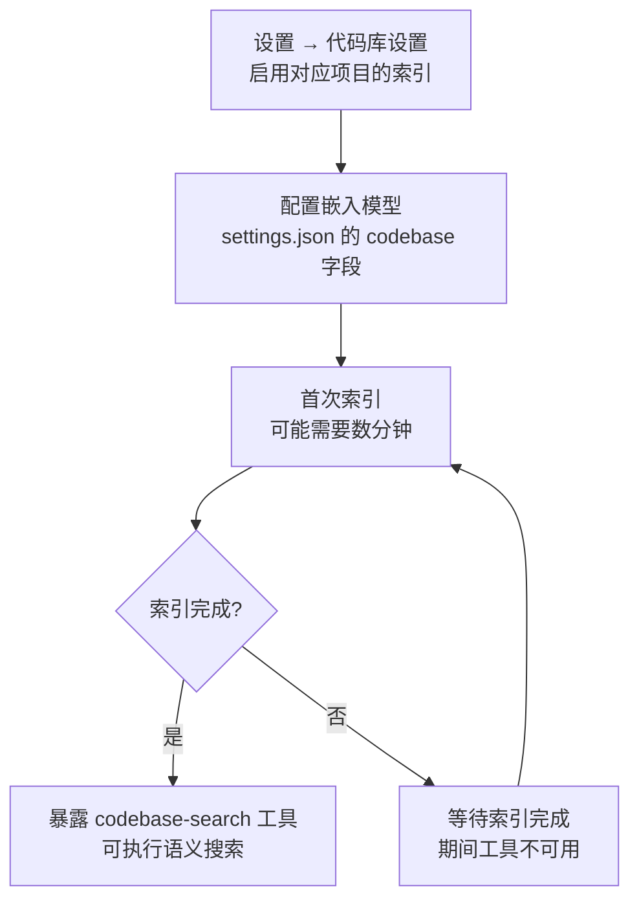

# 7-代码库索引与符号定位（Codebase Index & Symbol Location）

Snow App 提供代码库语义搜索（`codebase` 服务器）与代码符号定位
（`codelens` 服务器）两类内置能力，帮助 Agent 快速理解、定位代码。

## 1. 代码库语义搜索（codebase）

### 1.1 启用与索引

`codebase-search` 仅在**项目启用了代码库索引且已建立索引后**暴露。
在 **设置 → 代码库设置**（`app-control-openSettings page=codebase-settings`）
启用对应项目的索引，并配置嵌入模型（见 `settings.json` 的 `codebase`
字段，`3-配置文件字段参考` 有结构说明）。首次索引可能需要数分钟。



### 1.2 工具

| 工具 | 用途 |
| --- | --- |
| `codebase-search` | 基于嵌入索引的语义搜索 |

参数：`query`（自然语言查询文本，必填）、`topN`（结果数上限，默认 10、
最大 50）。

### 1.3 使用示例

```text
codebase-search query="如何处理配置文件反斜杠转义" topN=10
→ 按语义相似度返回相关代码片段

codebase-search query="retry logic" topN=5
→ 按语义相似度返回相关代码片段
```

### 1.4 与 grep 的取舍

| 场景 | 用哪个 |
| --- | --- |
| 关键词精确匹配、正则、按路径限定 | `grep-search`（更快更准） |
| 语义/意图查询（"查找处理登录的逻辑"） | `codebase-search`（理解含义） |

## 2. 代码符号定位（codelens）

`codelens` 服务器基于 oxc / tree-sitter 提供轻量静态分析（符号解析、
引用定位），无需运行完整 LSP。

### 2.1 工具

| 工具 | 用途 |
| --- | --- |
| `codelens-find_definition` | 查找符号定义位置 |
| `codelens-find_references` | 查找符号在文件内的引用位置 |
| `codelens-file_outline` | 获取文件符号大纲（函数/类/变量等） |

### 2.2 使用示例

```text
# 理解文件结构
codelens-file_outline filePath=src/main/app/bootstrap.ts
→ 顶层符号列表（函数/类/常量）

# 跳转定义（配合 filesystem-read 使用）
codelens-find_definition filePath=src/main/native/types.ts line=414 column=20
→ 符号名 + 定义位置
```

### 2.3 注意事项

- `find_definition`/`find_references` 的定位基于**行号 + 列号**，先用
  `filesystem-read` 确定目标符号的位置再调用。

### 2.4 关于 LSP（lsp-config）

Snow App 的 `lsp` 服务器消费**外部语言服务器**（rust-analyzer / gopls /
pyright 等）提供基于真实语义分析的**诊断**（`lsp-diagnostics`）与**悬停**
（`lsp-hover`）。`codelens` 仍是内置静态分析（符号导航），两者互补。

配置持久化在应用数据库 `lsp_server_configs` 表（**DB-backed，无配置文件**）：

- **agent 配置**：`config-set scope=lsp-config key=servers value={...}`（全量
  替换，深度校验；立即生效，无需重启）。
- **用户配置**：设置 → LSP 设置（`lsp-settings` 页面）。
- 旧 `~/.snow/lsp-config.json`（预留期文件）会在首次启动时一次性迁移导入
  （source=legacy），此后不再读取。

**工具默认不开启**：仅当表中存在「启用且已安装」（enabled 且命令在 PATH 中可执行）的语言服务器时，`lsp-*` 工具才出现在工具列表中（无可用配置不占用 prompt）。种子/迁移写入时已按安装状态设置 enabled（未安装默认停用，设置页显示 ❌未安装 徽标）；用户安装服务器后在设置页手动打开开关即可。SSH/远程项目暂不支持 LSP。

**工具清单**（全部基于外部语言服务器的真实语义分析；按启用语言的能力子集暴露，§8.7）：

| 工具 | 用途 |
|---|---|
| `lsp-diagnostics` | 文件诊断（错误/警告，含 severity/message/精确行列） |
| `lsp-hover` | 符号悬停信息（类型签名/文档，Markdown） |
| `lsp-definition` | 符号定义位置（跨文件语义跳转，比 codelens 更准） |
| `lsp-references` | 全部引用位置 + 单行代码上下文（上限 100） |
| `lsp-symbols` | 文件符号大纲（树形，含类型/可见性 detail） |
| `lsp-rename` | 语义级重命名（dryRun 默认预览多文件 edits；false 写盘） |
| `lsp-type-definition` | 跳转符号「类型」的定义 |
| `lsp-implementation` | 接口/抽象类/trait 的全部实现位置 |
| `lsp-code-action` | 快速修复/重构菜单（apply=true 应用；command 类配合 lsp-execute-command 执行） |
| `lsp-execute-command` | 执行服务器重构/导入命令（WorkspaceEdit 结果可预览/应用） |
| `lsp-call-hierarchy` | **双向调用链**（谁调用它 + 它调用谁，含调用点上下文）——改前影响分析首选 |
| `lsp-type-hierarchy` | **类型层级**（父类型链 + 全部子类型）——重构基类影响面评估（仅 Go/Java 项目暴露） |
| `lsp-workspace-symbols` | 跨项目按名模糊搜索符号（跨启用语言合并，上限 50） |
| `lsp-workspace-diagnostics` | 项目级诊断（LSP 3.17 pull，按文件分组） |

**项目级配置**（Phase 3）：同一语言可按项目覆盖全局——`config-set
scope=lsp-config projectId=<目录 id> key=servers value={...}` 写入项目级
配置；设置 → LSP 设置页有「全局 / 项目」两个 tab。项目配置覆盖同语言的
全局配置（会话粒度 = 语言 × 项目根，各项目独立进程）。

```text
# 示例：agent 为项目配置 rust 服务器（如果已预置可跳过）
config-get scope=lsp-config key=servers            # 查看当前配置
config-set scope=lsp-config key=servers value={...} # 修改/新增语言服务器
# 项目级（按项目覆盖）
config-set scope=lsp-config projectId="local:E:\code\snow-app" key=servers value={...}
# 然后对文件跑诊断 / 语义导航 / 影响分析
lsp-diagnostics  filePath=/path/to/main.rs
lsp-definition   filePath=/path/to/main.rs line=12 column=4
lsp-references   filePath=/path/to/main.rs line=12 column=4
lsp-symbols      filePath=/path/to/main.rs
lsp-call-hierarchy filePath=/path/to/main.rs line=12 column=4  # 改前影响分析：谁调它/它调谁
lsp-type-hierarchy  filePath=/path/to/main.rs line=20 column=8  # 重构基类前：父类型链 + 全部子类型
```

### 2.5 LSP 优先行为与排查（2026-08-15）

配置了 LSP 后，系统会**自动优先使用 LSP 语义分析**（无需额外设置）：

- **系统提示词注入**：项目启用了匹配语言的服务器（且命令已安装）时，系统提示词
  末尾自动注入「Language Servers」章节——列出可用服务器（含运行状态：
  `running` / `crashed; restarts on next use` / `installed; starts on first use`），
  按能力分组列出 `lsp-*` 工具（诊断/定位/符号搜索/调用图等），并给出**强制任务
  分诊规则**：语义查询（符号/类型/定义/引用/调用图/诊断）必须走 `lsp-*`，
  `grep-search` 仅限纯文本搜索，`codelens-*` 会自动转发 LSP。注入条件与工具
  暴露**完全一致**：未配置、命令未安装、scope 禁用、SSH 远程、项目无编程语言、
  服务器语言与项目不一致——任一不满足都不注入。
- **会话预热**：提示词构建时会对匹配的服务器**后台自动启动会话**（幂等复用，
  失败静默降级），消除模型首次调用 `lsp-*` 的冷启动延迟；会话空闲 30 分钟
  回收，只要项目持续使用就会保持常驻。
- **codelens 自动转发**：`codelens-find_definition` / `codelens-find_references` /
  `codelens-file_outline` 在 LSP 可用时自动改走 LSP（结果带 `"engine": "lsp"`，
  输出形状不变）；LSP 不可用/失败时回退内置静态分析，结果带 **`"lspFallback": true`**
  标记——agent 可据此判断结果来源，**需要语义级结果时应改调 `lsp-*` 工具**。

**排查指引**（LSP 未生效/报错时按序检查）：

| 现象 | 检查项 | 处理 |
|---|---|---|
| `lsp-*` 工具不出现 | 配置是否存在且 enabled（`config-get scope=lsp-config key=servers`） | `config-set scope=lsp-config key=servers value={...}` 配置；设置 → LSP 设置页开启开关 |
| 错误「未找到或无法启动」 | 命令是否在 PATH（`which <command>` / 设置页 ❌未安装 徽标） | 按错误附带的 `installCommand` 安装；安装后设置页打开开关 |
| 错误「未为语言 x 配置」 | 文件扩展名是否在服务器 `fileExtensions` 中 | 补扩展名（如 `.tsx` 未配）；确认项目语言与服务器一致 |
| 项目无编程语言/语言不匹配 | 项目是否有对应语言文件（提示词无 Language Servers 章节） | 语言检测=项目标志文件（Cargo.toml 等）+ 扩展名扫描；无匹配不注入不暴露 |
| SSH 远程项目 | `ssh://` 路径 | LSP 仅本地项目，SSH 项目不暴露 lsp-* 工具 |
| `crashed; restarts on next use` | 会话崩溃（连续重启 ≥2 次会报错） | 检查服务器安装/配置；下次调用自动重启 |
| 需要深挖 | 应用日志 | `config-get scope=logs` 读 `~/.snow/log`（主进程日志）；开发模式 native `[lsp]` 前缀降级日志在终端 |

**日志记录**：LSP 的降级/失败原因写入**应用日志（app_logs 表）**——与系统
日志面板同源，按 `module=lsp` 过滤即可定位（提示词注入失败、codelens 转发
失败、scope 检查失败、项目根解析失败均记录 level/warn + 错误详情）；同时
输出到 native stderr（开发模式终端可见）。`~/.snow/log` 保存主进程文件日志
（`config-get scope=logs` 可读），两者互补。

## 3. 典型协作流程

```text
1. 理解项目   → codelens-file_outline + filesystem-read 读关键文件
2. 定位问题   → grep-search（关键词）或 codebase-search（语义）
3. 正式验证   → 项目构建命令（tsc / cargo check / npm run check）
```
