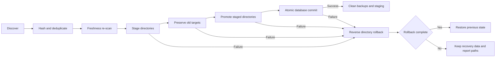
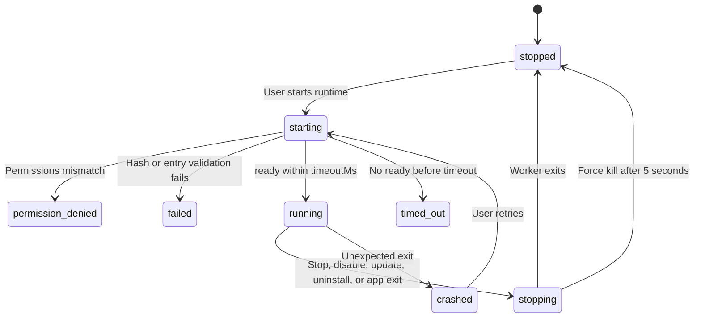

# 8-第三方配置导入

Snow App 可从 Codex、Claude Code 和 OpenCode 发现并导入 MCP、Skills、提示词、命令、代理与插件，也可安装和管理声明式插件。入口为 **设置 → 第三方配置**（页面 id：`import-settings`）。

| 标签页 | 用途 |
| --- | --- |
| 导入配置 | 扫描当前环境中的第三方配置，选择候选并导入 |
| 管理插件 | 启用、禁用、更新、卸载插件，管理市场与插件 runtime |

## 1. 来源与可导入内容

| 来源 | 配置根目录 | 主要扫描文件 | 可导入内容 |
| --- | --- | --- | --- |
| Codex | `CODEX_HOME` 或 `~/.codex` | 全局/项目 `config.toml`、`AGENTS.md`、`AGENTS.override.md` | MCP、提示词、Skills、Plugins |
| Claude Code | `CLAUDE_CONFIG_DIR` 或 `~/.claude` | `~/.claude.json`、`settings.json`、项目 `.mcp.json`、`CLAUDE.md`、rules/commands | MCP、提示词、Commands、Skills |
| OpenCode | `OPENCODE_CONFIG_DIR`、`$XDG_CONFIG_HOME/opencode`、`~/.config/opencode`，兼容 `~/.opencode` | 全局/项目 `config.json`、`opencode.json/jsonc`、`.opencode/...` | MCP、instructions、Commands、Agents、Skills |

扫描结果包括汇总卡片、候选列表、实际源文件路径和警告。候选可能为 New、Already effective、Update available、Conflict、Unsupported 或 Managed。内容完全相同的来源会合并；逻辑 ID 相同但内容不同会形成 Conflict，只能选择一个变体。提交前会重新扫描，新旧内容不一致时必须刷新后再导入。

## 2. local、WSL 与 SSH 发现规则

Snow App 不会无差别扫描所有已注册的远程环境。发现范围由当前活动项目决定，并始终遵守以下规则：

| 当前上下文 | 扫描范围 |
| --- | --- |
| 未传入活动项目 | 只扫描本机 local 全局配置；全局设置页不会主动进入 WSL 或 SSH |
| 普通本地 Windows 项目 | 扫描 local 全局配置和当前本地项目 |
| `\\wsl$\<distro>\...` 或 `\\wsl.localhost\<distro>\...` 项目 | 保留 local 全局扫描，并额外扫描该发行版中的当前活动 WSL 项目 |
| `ssh://...` 项目 | 保留 local 全局扫描，并连接当前活动 SSH 主机，扫描其远端 home 与当前远端项目 |

WSL 环境从 `/etc/passwd` 解析 Linux home，并通过 UNC 映射读取文件；无法解析 home 时给出警告并降级为仅 local。SSH 环境连接当前主机、解析远端 home，在发现结束后关闭 session；连接或解析失败同样警告并降级为仅 local。

额外边界：

- 不扫描所有已注册的 WSL/SSH 项目，只处理当前活动项目对应的环境；
- SSH 中声明的 stdio MCP 命令不能直接在本机执行，会标记为 Unsupported；
- SSH Skill 可以先下载到本地 staging，再进入与本地 Skill 相同的目录事务。

## 3. 选择与导入

1. 选择 Codex、Claude Code 或 OpenCode；
2. 查看源文件、警告与候选状态，必要时点击 **Refresh discovery**；
3. 勾选候选；Conflict 变体互斥；
4. 点击 **Import selected (n)**；
5. 查看 imported、unchanged、skipped、unsupported 汇总。

| 候选类型 | 目标 |
| --- | --- |
| MCP | Snow MCP 设置，保留全局/项目作用域 |
| Skill | `~/.snow/skills` 或 `<项目>/.snow/skills` |
| Prompt / Command / Agent | 系统提示词存储 |
| Plugin | Snow 插件管理与托管组件 |

已存在但内容不同，且不是 Snow 管理的未修改快照时，导入会跳过目标，不覆盖用户目录。

## 4. 可逆目录事务

Skill 和插件不是边扫描边覆盖。Snow App 将目录操作与数据库提交组织成可恢复事务：

1. 将源目录复制到目标同父目录下的 staging；
2. 如果目标存在，先通过同目录原子 rename 保存为 `previous`；
3. 再将 staged `new` 通过 rename 提升为正式目标；
4. 所有目录提交完成后，在一次 native 数据库事务中提交 MCP、托管资源和元数据；
5. 任一步失败，按相反顺序回滚已经提升的目录；
6. 数据库成功后才清理 `previous` 与 staging；
7. 自动恢复不完整时保留 recovery 数据，并在错误中报告路径，供人工处理。

## 5. MCP 的两种启用语义

### 5.1 普通配置导入

从 Codex、Claude Code 或 OpenCode 普通配置导入 MCP 时：

- `enabled` 继承来源声明；
- 来源未声明 `enabled` 时，标准化为 `true`；
- 不经过插件市场的“逐个 MCP 批准”界面。

### 5.2 插件市场安装

从插件市场安装插件时采用更严格的组件批准：

- 安装前预览每个 MCP 的 transport、command、args、env、headers、URL 和声明路径；
- 每个 MCP 默认禁用，用户必须逐项勾选；只有批准的组件写为 `enabled=true`；
- 批准绑定 `componentId + declarationPath + connectionHash` 生成的 `approvalHash`；
- 安装前后都会重新校验，声明变化会使旧批准失效并要求重新审查；
- 插件的 `defaultEnabled` 不代表其 MCP 自动获得批准。

这两条路径不可混用：普通配置导入保留来源启用状态，市场安装则要求对插件携带的每个 MCP 明确授权。

## 6. 插件市场与声明式组件

支持本地目录、`owner/repo[@ref]`、Git URL 和直接指向 `marketplace.json` 的 HTTPS URL。市场缓存位于 `~/.snow/plugin-marketplaces`，已安装插件位于 `~/.snow/plugins/marketplaces`。移除市场会清理市场缓存，但保留已安装插件。

Snow App 支持导入声明式 MCP、Skill、Prompt、Command 和 Agent 组件，**不会执行 install scripts**。Hook 目录或 manifest 声明会被识别，但当前标记为 Unsupported：它们不会被导入成可执行的 Snow 生命周期 Hook，也不会执行插件 Hook 代码。外部代码只能通过插件可选声明的 Snow runtime，在用户明确启动并审查权限后运行。插件导入时保存目录内容 hash，用于后续更新检测与 runtime 完整性检查。

## 7. 插件 runtime 的安全与生命周期

插件可选声明 runtime。未声明 runtime 的插件不能启动。启动前执行以下验证：

- 重新计算插件源目录 hash；若与保存的 `contentHash` 不一致，拒绝运行并要求重新扫描/更新；
- entry 必须存在、位于插件目录内，且扩展名只能是 `.js`、`.mjs` 或 `.cjs`；
- 支持的声明权限只有 `storage`、`network`、`child-process`；正常设置界面会把声明权限原样作为授权列表提交；
- 底层校验要求授权值是无重复字符串数组，并且包含全部声明权限；缺少声明权限、重复项或格式错误会得到 `permission-denied`。当前校验不会因额外字符串而失败，但 Node 权限参数始终只按插件声明生成，因此额外值不会扩大实际 runtime 权限。

runtime 通过 Electron `utilityProcess.fork` 启动隔离 worker，并使用 Node 权限参数收窄能力：

| 权限 | 运行时能力 |
| --- | --- |
| 默认 | 只读插件源、entry 与必要应用路径 |
| `storage` | 允许写入插件专属存储目录；目录名来自插件 ID 的 SHA-256 前 24 位 |
| `network` | 增加 `--allow-net` |
| `child-process` | 增加 `--allow-child-process` |

生命周期状态包括 `unavailable`、`stopped`、`starting`、`running`、`stopping`、`timed-out`、`crashed`、`permission-denied`、`failed`：

1. 启动后必须在 `runtime.timeoutMs` 内发送 `ready`，否则进程被终止并标记 `timed-out`；
2. 停止时先发送 `{type: "stop"}`，5 秒后仍未退出才强制 kill；
3. 禁用、更新、卸载插件前会先停止 runtime；
4. 应用退出时调用 `stopAll()`。

安装声明式组件、不执行 install script、拒绝插件 Hook，与用户主动启动 Snow runtime 是不同的信任边界。只有在核对内容 hash、entry 和声明权限后，才应运行可信插件代码。

## 8. 不支持与故障排查

| 症状 | 处理 |
| --- | --- |
| Source not found | 对应工具未安装或未使用；安装/运行后刷新 |
| Unsupported | 查看警告；常见原因包括 Claude Code `ws`/`sse`、`headersHelper`、无 command/URL 的插件 MCP，或 SSH stdio MCP |
| Import discovery changed | 扫描后源内容已变化，刷新后重新选择 |
| 用户目录未被覆盖 | 内容不同且不属于 Snow 未修改托管快照时会安全跳过 |
| runtime 为 permission-denied | 检查授权值是否为无重复字符串数组并包含全部声明权限；从设置界面重新审查并提交插件声明的权限 |
| runtime 为 timed-out | 插件未在 `runtime.timeoutMs` 内发送 `ready` |

## 9. 参考

- [配置 MCP 服务器](1-配置MCP服务器.md)
- [安装与管理 Skills](2-安装与管理Skills.md)
- [配置文件字段参考](../3-参考手册/3-配置文件字段参考.md)
