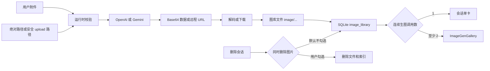

# 9-图像生成

Snow App 内置**图像生成与编辑**能力（工具 `imagegen-generate`），
支持 **OpenAI**（gpt-image / dall-e）与 **Google Gemini**（Nano Banana 家族）
多渠道，可同时启用、按请求切换。生图配置**独立于对话 API 配置**，
无内置默认模型，需在 **设置 → 图像生成** 中至少配置一个可用渠道。

## 1. 认识配置入口

| 入口                                                         | 说明                                      |
| ------------------------------------------------------------ | ----------------------------------------- |
| 设置 → 图像生成（设置页 id：`imagegen-settings`）            | 图形界面：多渠道表格配置                  |
| 应用数据库 `system_settings` 表（code：`imagegen_settings`） | 设置存储位置（与 UI 同源）                |
| `config` 工具的 `imagegen` scope                             | AI Agent 可通过 config 工具读写同一份设置 |

> **按需暴露**：两个渠道都未配置时，`imagegen-generate` 会从 AI 的
> 工具列表中隐藏；配置任意一个渠道后立即恢复可见（无需重启）。

## 2. 图形界面配置（多渠道）

打开 **设置 → 图像生成**，以**渠道表格**管理任意数量的渠道
（OpenAI / Gemini 可混配，多个渠道可同时启用），点击
「添加渠道」创建：

| 字段                                         | 说明                                                                                                                                                                   |
| -------------------------------------------- | ---------------------------------------------------------------------------------------------------------------------------------------------------------------------- |
| 启用（Enabled）                              | 渠道开关；关闭后该渠道不可用。**未配置 API Key 或模型时无法启用**（会提示先补全配置）——只有密钥与模型齐备的渠道才会向 AI 暴露生图工具                                  |
| 渠道名称（Channel name）                     | 自定义显示名（列表与 AI 引用均使用）；留空时回退为协议名（OpenAI / Google Gemini）。在编辑弹窗中修改                                                        |
| API Key                                      | 服务商密钥（OpenAI `sk-...` / Gemini `AIza...`）                                                                                                                       |
| Base URL                                     | 服务端点；留空使用官方默认（OpenAI `https://api.openai.com/v1`，Gemini `https://generativelanguage.googleapis.com/v1beta`）。**OpenAI 兼容端点（含 Snow App 对话 API 使用的 baseUrl）必须带 `/v1` 路径段**（如 `http://host:port/v1`），请求按 `{baseUrl}/images/generations`、`{baseUrl}/images/edits` 拼接，只填主机根地址会 404                                            |
| 模型（Model）                                | 绘图模型；**必填**，留空时该渠道不可用（无内置默认）                                                                                                                   |
| 默认尺寸（Default size）                     | **OpenAI**：比例 × 尺寸联动预设（12 种比例 × 1K/2K/4K 推荐分辨率，或 `auto`），也可直接输入任意分辨率；**Gemini**：宽高比 + 图片尺寸两个独立预设，组合存储为 `16:9@2K` |
| 宽高比（Aspect ratio）                       | Gemini：`1:1`、`5:4`、`4:3`、`3:2`、`16:9`、`2:1`、`21:9`、`4:5`、`3:4`、`2:3`、`1:2`、`9:16` 共 12 种                                                                 |
| 图片尺寸（Image size）                       | Gemini：`512px` / `1K` / `2K` / `4K`（**区分大小写**）；选项**随所选模型自动变化**（见下方模型表）                                                                     |
| 默认质量（Default quality）                  | **仅 OpenAI 渠道显示**：`low` / `medium` / `high` / `auto`；Gemini 渠道不显示该字段（Gemini 仅接受 `low`/`medium`/`high`，面板默认值 `auto` 会被忽略）                 |
| 输出格式（Output format）                    | **仅 OpenAI 渠道显示**：`png` / `jpeg` / `webp`；Gemini 忽略                                                                                                           |
| 最大并发生成数（Max concurrent generations） | 全局设置（1-8，默认 4）：AI 一次请求多张图片时**最多同时生成**的张数，其余排队等待，完成一张补一张；服务商限流较严时调低                                               |
| Gemini 联网搜索                              | 开启后 Gemini 生成时结合 Google Search 实时信息（Grounding）                                                                                                           |
| 流式 / 非流式                                | 高级选项中选择默认模式：**流式**生成过程实时显示中间预览图；**非流式**生成完成后一次性出图；工具参数 `stream` 可覆盖                                                   |

**模型下拉**：聚焦模型输入框时，会从当前渠道的 Base URL 自动拉取模型列表，
并过滤出生图模型（OpenAI 匹配 `gpt-image`/`dall-e`，Gemini 匹配 `-image`/`imagen`），
也可以手动填写。选中模型后自动显示**能力标签**：

| 标签            | 含义                                          |
| --------------- | --------------------------------------------- |
| 4K / 2K / 仅 1K | 最大输出分辨率                                |
| 流式            | 支持生成过程流式预览                          |
| 图生图          | 支持参考图编辑                                |
| 保真度          | 支持编辑保真度控制（inputFidelity）           |
| 思考            | 支持渲染前推理（thinkingLevel）               |
| 图片搜索        | 支持 Google Image Search 联网参考             |
| 图文交错        | 支持文本与图片交错输出                        |
| 最多 3 张       | 单次最多生成 3 张                             |
| 仅文生图        | 不支持图生图                                  |
| 快速            | 生成速度优先                                  |
| 旧版 / 已弃用   | 旧模型或已弃用（Imagen 系列 2026-08-17 关停） |

## 3. 支持的模型

### OpenAI 渠道

| 模型                            | 说明                                                                                        |
| ------------------------------- | ------------------------------------------------------------------------------------------- |
| `gpt-image-2` / `gpt-image-1.5` | 4K、流式、图生图                                                                            |
| `gpt-image-1`                   | 2K、流式、图生图、保真度控制；**唯一支持透明背景输出的模型**（需配合 `outputFormat="png"`） |
| `gpt-image-1-mini`              | 快速、流式                                                                                  |
| `dall-e-3`                      | 仅文生图；**每次仅生成 1 张**（`n>1` 自动收敛为 1）                                         |

### Gemini 渠道（Nano Banana 家族）

| 模型                          | 图片尺寸                  | 参考图     | 说明                                                      |
| ----------------------------- | ------------------------- | ---------- | --------------------------------------------------------- |
| `gemini-3.1-flash-image`      | `512px`、`1K`、`2K`、`4K` | 最多 14 张 | Nano Banana 2，推荐默认：4K、流式、图生图、思考、图片搜索 |
| `gemini-3.1-flash-lite-image` | 仅 `1K`                   | —          | Nano Banana 2 Lite：最快最省                              |
| `gemini-3-pro-image`          | `1K`、`2K`、`4K`          | 最多 14 张 | Nano Banana Pro：专业素材、高分辨率、图文交错             |
| `gemini-2.5-flash-image`      | 约 `1K`                   | 最多 3 张  | 旧版：低延迟、大批量                                      |

> **图片尺寸随模型变化**：设置面板中 Gemini 渠道的「图片尺寸」下拉会
> 根据当前所选模型自动过滤可用选项，并在下方提示
> “当前模型支持：…”，避免选到模型不支持的尺寸。
>
> **模型能力自动校验（400 防护）**：请求发送前服务端会按模型能力
> 自动拦截不支持的组合并给出修复建议，而不是把 400 错误直接抛给
> AI —— `dall-e-3` 与 `imagen-*` 仅支持文生图（传参考图会在本地
> 拦截并提示改用 `gpt-image-1/2` 或 Nano Banana 系列）；`dall-e-3`
> 的 `n` 自动收敛为 1。若仍收到上游 400，错误信息会附带具体修复
> 提示（多图数量 / 图像输入 / 尺寸 / 质量），AI 可一步自愈。
>
> **Imagen 已弃用**：`imagen-*` 系列模型将于 **2026-08-17 关停**，
> 请迁移到上述 Nano Banana 模型。

### OpenAI 推荐分辨率（gpt-image 系列）

设置面板提供 **12 种比例 × 1K/2K/4K** 的联动预设，全部为服务商推荐值
（边长 ≤ 3840px、16px 倍数、长短边比 ≤ 3:1）：

| 比例   | 1K        | 2K        | 4K        |
| ------ | --------- | --------- | --------- |
| `1:1`  | 1248×1248 | 2048×2048 | 2880×2880 |
| `5:4`  | 1440×1152 | 2240×1792 | 3200×2560 |
| `4:3`  | 1472×1104 | 2304×1728 | 3264×2448 |
| `3:2`  | 1536×1024 | 2496×1664 | 3504×2336 |
| `16:9` | 1792×1008 | 2560×1440 | 3840×2160 |
| `2:1`  | 1792×896  | 2880×1440 | 3840×1920 |
| `21:9` | 1904×816  | 3024×1296 | 3696×1584 |
| `4:5`  | 1152×1440 | 1792×2240 | 2560×3200 |
| `3:4`  | 1104×1472 | 1728×2304 | 2448×3264 |
| `2:3`  | 1024×1536 | 1664×2496 | 2336×3504 |
| `1:2`  | 896×1792  | 1440×2880 | 1920×3840 |
| `9:16` | 1008×1792 | 1440×2560 | 2160×3840 |

也可以选择 `auto`（由模型决定）或直接输入自定义分辨率。

## 4. 在对话中使用

配置完成后，直接在对话中提出需求即可，AI 会自动调用 `imagegen-generate`：

- **文生图**：直接描述画面，如“画一只戴着宇航头盔的柴犬，赛博朋克城市背景”；
- **图生图 / 编辑**：在对话中**粘贴参考图片**（或使用 `@` 引用图片），
  再给出编辑指令，如“把背景换成夜晚的东京街头”“改成写实风格”。
  无论主模型是否支持视觉，**原始图片都会作为参考图传给生图服务**，
  走真正的图生图（OpenAI `/images/edits` / Gemini `inlineData`）：

  - **主模型支持视觉**：图片直接以多模态内容随消息发送，AI 调用
    `imagegen-generate` 时把图片数据填入 `images` 参数；
  - **主模型不支持视觉**（图片先经外挂视觉模型文本化为文字描述）：
    文本化时会为每张图附带一个 `[Reference image #N for imagegen-generate:
{"path": "...", "mimeType": "..."}]` 引用块——只含 upload 目录下的
    相对路径（几十字节，不占上下文），AI 把该引用填入 `images` 参数后，
    服务端**自动读取原图文件**完成图生图，不会退化成仅凭文字描述文生图。
    生图卡片上的「N 张参考图」区域展示参考图缩略图：内联 base64 直接显示；
    `path` 引用由主进程读取磁盘后同样显示**真实缩略图**（读取中短暂显示
    占位图标，读取失败时保持占位，不影响图生图本身）；

  **AI 实际收到的引导**（主模型不支持视觉时，文本化消息中注入的完整内容）：

  ```text
  [The user attached 2 reference image(s). When the user asks to generate or
  edit an image based on them, call the imagegen-generate tool and pass the
  corresponding JSON object(s) below in its "images" parameter (image-to-image)
  — do NOT generate from the text description alone.]
  [Image #1]
  [Image description: <视觉模型生成的文字描述>]
  [Reference image #1 for imagegen-generate: {"path":"upload/2026-08-05/a1b2c3.png","mimeType":"image/png"}]
  [Image #2]
  [Image description: <视觉模型生成的文字描述>]
  [Reference image #2 for imagegen-generate: {"path":"upload/2026-08-05/d4e5f6.jpg","mimeType":"image/jpeg"}]
  ```

  细节：引导句（“不得仅凭描述文生图”）**只在有图时注入一次**；引用块编号
  与 `[Image #N]` 一一对应；仅**用户消息**附带（工具结果中的截图不会）；
  极少数未持久化的内联图片回退为 `{"data":"<base64>","mimeType":"..."}` 形式；
  历史消息中的引用块会保留，后续轮次仍可引用之前上传的图
  （如“把刚才那张图改成动漫风”）；

- **多图生成（并行调用）**：一次调用 = 一张图。需要多张图（如不同风格/主题
  的一组）时，AI 会**并行发起多次调用**——每次调用一张图、各自独立的
  `prompt`（编辑场景各自带独立的 `images` 参考图）。并行生成**只能通过多次
  调用实现**，不会在单次调用里塞多个提示词（`n` / `prompts` / `requestImages`
  参数仅作兼容保留，不推荐使用）。多次调用**并行执行**，最多同时进行
  **设置里的「最大并发生成数」**（1-8，默认 4）个调用，超出部分自动排队，
  完成一个补一个，界面卡片会实时显示各自的生成进度；
- **会话内展示**：连续至少 2 个 `imagegen-generate` 调用会合并为 `ImageGenGallery`。2-4 张时列数等于图片数，5-6 张使用 3 列，7-8 张使用 4 列；窄容器会按可用宽度自动降为 3、2 或 1 列。每个网格单元都以 contain 方式完整展示图片、不拉伸变形，画廊内不对超宽或超高图片做通栏特化。多图带序号角标，点击可进入灯箱并下载；生图渠道可用时，系统提示词还会注入 `## Image Generation` 章节，向 AI 明确「一次调用一张图、多图必须并行多次调用、并行结果自动合并为画廊」的规则（详见 [4-Agent运行时与工具编排](../4-架构与开发/4-Agent运行时与工具编排.md) 的「工具域系统提示词注入」）；
- **上游只返回链接也能看**：部分上游（中转）只返回图片的远程 URL
  （如 S3 预签名链接）而非图片数据。此时工具会**自动下载图片并存入图库**
  （落盘 + 索引），画廊照常展示、链接过期也不影响；下载失败时降级为
  「远程图片加载失败」占位卡片，点击可打开原始链接，消息下方仍保留
  「远程图片链接」列表兜底；
- **流式 / 非流式**：流式模式下生成过程实时显示中间预览图，不用干等；非流式模式生成完成后一次性出图。默认模式在渠道的「高级选项」中设置（流式/非流式二选一），工具参数 `stream` 可临时覆盖；
- **指定渠道**：AI 默认按需选择已配置渠道（双启用时优先 OpenAI），
  也可在请求中明确指定，如“用 Gemini 画一张”。

### 参考图路径与运行时限制

`images` 中的参考图可以使用内联 `data`，也可以使用 `path`。`path` 接受两种形式：

1. **绝对磁盘路径**，例如 `C:/Users/name/photo.png`；
2. **安全相对路径**，例如 `upload/2026-07-25/hash.png`。

相对路径必须以 `upload/` 开头，拒绝 `..` 路径穿越，并相对于应用数据库所在目录解析。绝对路径是运行时明确支持的输入，但应只引用可信且有权读取的文件。视觉消息被文本化时生成的 `[Reference image #N ...]` 块始终使用安全的 `upload/...` 相对路径，避免把绝对路径或大段 base64 写入上下文。

输入硬限制以运行时源码和实际错误信息为准。当前版本由 `imagegen.rs` 中的 `MAX_IMAGES` 与 `MAX_BASE64_LEN` 控制：每个 `images` 组（以及 `requestImages` 的每一组）最多 14 张，每张**编码数据**约 20 MiB；通过路径读取后编码的数据也执行同一检查。工具描述建议单次不超过 5 张，是为了兼容限制更严格的上游，并非当前运行时的数量硬上限。模型或服务商可能有更低限制，应以当前模型能力和上游响应为准。

### 工具参数一览（imagegen-generate）

| 参数                | 类型           | 说明                                                                                                                                                                                                                                                                                                           |
| ------------------- | -------------- | -------------------------------------------------------------------------------------------------------------------------------------------------------------------------------------------------------------------------------------------------------------------------------------------------------------- |
| `prompt`            | string（必填） | 生成描述或编辑指令（**一次调用 = 一张图**；需要多张图请并行发起多次调用）                                                                                                                                                                                                                                                                                                     |
| `prompts`           | array          | **兼容保留，不推荐**：逐请求不同提示词数组（1-8 项，覆盖 `n`）。生成多张不同图片请**并行发起多次调用**（每次一张、各自独立的 `prompt`），不要用本参数在单次调用里塞多个提示词                                                                                                                                                                            |
| `images`            | array          | 参考图 `[{data, mimeType}]` 或 `[{path, mimeType}]`；`path` 可为绝对磁盘路径，或安全的 `upload/...` 相对路径（必须以 `upload/` 开头且拒绝 `..`）。当前运行时每组最多 14 张、每张编码数据约 20 MiB；工具描述建议不超过 5 张仅用于兼容更严格的上游。提供 `requestImages` 时本参数被忽略 |
| `requestImages`     | array          | **兼容保留，不推荐**：逐请求独立参考图组（组数 = 请求数，= `prompts` 长度或 `n`）。多张不同源图分别编辑/重绘请**并行发起多次调用**（每次一张、各自带独立的 `images`），不要用本参数                                                                                                                                                                           |
| `model`             | string         | 覆盖配置的模型                                                                                                                                                                                                                                                                                                 |
| `provider`          | enum           | `auto`（默认）/ `openai` / `gemini`，后端切换                                                                                                                                                                                                                                                                  |
| `size`              | string         | OpenAI：`1024x1024` 等分辨率或 `auto`；Gemini：`1K`/`2K`/`4K`（imageSize）或 `16:9` 等宽高比（aspectRatio），可组合 `16:9@2K` 同时设置                                                                                                                                                                         |
| `quality`           | enum           | `low` / `medium` / `high` / `auto`；Gemini 仅接受 `low`/`medium`/`high`（`auto` 会被忽略，即使用服务商默认质量）                                                                                                                                                                                               |
| `outputFormat`      | enum           | OpenAI：`png` / `jpeg` / `webp`                                                                                                                                                                                                                                                                                |
| `outputCompression` | number         | OpenAI JPEG/WebP 压缩率 0-100                                                                                                                                                                                                                                                                                  |
| `n`                 | number         | **兼容保留，不推荐**：1-8（默认 1）。多图应使用多个独立并发调用；`n>1` 只把同一提示词拆成多个子请求并关闭流式预览，`dall-e-3` 恒为 1；传 `prompts` 时请求数由数组长度决定 |
| `personGeneration`  | enum           | Gemini：`dont_allow`（默认）/ `allow_all` / `allow_adult`                                                                                                                                                                                                                                                      |
| `webSearch`         | boolean        | Gemini 联网搜索（Google Search grounding）                                                                                                                                                                                                                                                                     |
| `stream`            | boolean        | 流式预览（默认取设置）                                                                                                                                                                                                                                                                                         |
| `inputFidelity`     | enum           | OpenAI 编辑：`low` / `high` / `auto`（gpt-image-2 不支持）                                                                                                                                                                                                                                                     |
| `background`        | enum           | OpenAI：`opaque`（默认）/ `transparent` / `auto`；模型不支持透明背景（如 `gpt-image-2`）时自动降级为 `opaque`。需要透明背景（贴纸 / 抠图 / 桌面宠物）时请选 **`gpt-image-1`** 并配 `outputFormat="png"`——它是唯一能真正输出透明的模型；`gpt-image-2` 请求透明会被静默降级、`dall-e-3` 与 Gemini 直接忽略该参数 |
| `moderation`        | enum           | OpenAI：`auto`（默认）/ `low`（更宽松过滤）                                                                                                                                                                                                                                                                    |
| `seed`              | number         | 确定性种子，复现结果                                                                                                                                                                                                                                                                                           |
| `thinkingLevel`     | enum           | Gemini 3.1 Flash Image：`minimal`（默认）/ `high`                                                                                                                                                                                                                                                              |
| `imageSearch`       | boolean        | Gemini 3.1 Flash Image：Google Image Search 联网参考                                                                                                                                                                                                                                                           |

> 多个渠道同时启用时，`provider` 参数优先级最高；其次按配置推导。
> OpenAI 图生图走 `/images/edits` 接口（multipart），Gemini 图生图走
> `inlineData` 多模态提示；Gemini Nano Banana 系列走 Interactions API。

## 5. 图像库管理

所有生成的图片都会自动存入**图像库**（磁盘 `~/.snowapp/image/` + SQLite
`image_library` 索引），可在**侧边栏 → 图像库**（或 `app-control-openSettings
page=image-library` 打开）中查看与管理：

| 能力 | 说明 |
| --- | --- |
| 浏览与筛选 | 默认展示**相册卡片墙**（每个相册一张封面卡）；点击进入图片网格。按创建时间倒序列出全部图片（缩略图 + 模型/日期元数据）；可先选“全部”“未分类”或指定相册，再叠加宽高比（横图/方图/竖图）、时间（今天/7 天/30 天）、来源渠道和模型筛选，点击图片进入灯箱 |
| 搜索 | 顶部搜索框对**文件名 / prompt / 模型 / 服务商**做模糊匹配；输入关键词时自动从相册卡片墙切换到图片网格展示结果 |
| 相册归类 | 可创建和重命名相册，并从每张图片的相册下拉框移入指定相册或移回“未分类”；也支持**直接拖拽图片**到相册卡片上完成归类。删除相册前需要确认；删除后相册内图片会**保留**并统一移入“未分类” |
| 批量操作 | 图片可多选进入批量模式，出现批量工具栏：**批量移入相册**（含移出到未分类）与**批量删除**（逐个删除，任一失败不中断其余） |
| 手动导入 | 点击“导入”选择本地图片文件，复制进图库目录并写入索引后出现在列表中；支持多选导入 |
| 下载 | 图库卡片和灯箱工具栏都可把当前图片按原文件名下载到本机 |
| 删除图片 | 删除前需要确认；确认后**同步清理磁盘文件与索引，并重写引用该图的会话消息**（聊天记录中的引用变为失效状态，不保留死链） |
| 自定义保存目录 | 面板顶部显示当前根目录，可**更改**（选择新目录）或**重置**（恢复默认 `~/.snowapp/image/`，对应 `image_library_dir` 设置） |

相册是图库索引上的归类生命周期，不是图片文件生命周期：**删除相册不会删除图片**；移动图片只修改归类；只有“删除图片”或删除会话时明确选择“同时删除图片”，才会删除对应物理文件和索引。

其他关联行为：

- **远程链接落库**：上游只返回 URL 时自动下载存入图库（30s 超时 / 50MB
  上限 / content-type 校验），链接过期也不影响画廊展示；
- **删除会话级联**：删除会话时若选择「不保留图片」，会话引用的图库图片
  会被级联删除（物理文件 + 索引行）；
- **备份注意**：图库目录默认在 `~/.snowapp/image/`，备份时请一并纳入
  （见 [3-参考手册/4-数据存储位置](../3-参考手册/4-数据存储位置.md)）。

### 5.1 生成与落库数据流

每个成功结果都会写入图库目录并在 SQLite `image_library` 建立索引。上游只返回远程 URL 时，工具会下载并落库；下载失败才保留远程 URL 兜底。



删除会话时默认**保留**图库图片；只有在确认框勾选「同时删除图片」后，才删除会话引用图片的物理文件和索引。`upload/...` 是会话上传区，不属于图库 `image/...` 的迁移范围。

### 5.2 更改图库目录的事务边界

图库为空时直接切换目录。有图片时使用可恢复迁移：

1. `prepare` 创建目标目录，仅按 SQLite 索引收集合法 `image/...` 路径并写迁移日志；
2. 分块**复制**文件，提交前尝试补复制迁移期间新落库的图片；
3. `commit` 更新 `image_library_dir`，随后尽力清理旧文件；
4. 用户取消、复制失败或关闭迁移面板时，删除已复制的新副本并保持旧目录设置；
5. 进程中断后，下次启动按日志恢复：未提交则回滚，已提交则继续清理。

迁移拒绝 `..`，新根不能位于当前图库根内部；未被 SQLite 索引的杂项文件和 `upload/...` 不迁移。提交后清理旧文件失败可能留下孤儿文件；迁移期间新增文件的补复制失败只会记录，因此重要图库应另行备份，不能把目录迁移理解为绝对零丢失备份。

## 6. 通过 config 工具管理（AI / 命令行）

`imagegen` 是 `config` 工具的数据库型 scope（与应用数据库同源，立即生效）：

| 操作         | 示例                                                                                                                                                                                                                                            |
| ------------ | ----------------------------------------------------------------------------------------------------------------------------------------------------------------------------------------------------------------------------------------------- |
| 查看渠道状态 | `config-list` + `scope: "imagegen"` → 返回各渠道的 enabled / model / configured，以及全局 `maxConcurrentImages`（最大并发生成数）与 `timeoutSecs`（生成超时，秒）                                                                               |
| 读取配置     | `config-get` + `scope: "imagegen"` + `key: "openai"`（省略 key 返回完整设置）；读取并发数用 `key: "maxConcurrentImages"`，读取超时用 `key: "timeoutSecs"`                                                                                       |
| 写入配置     | `config-set` + `scope: "imagegen"` + `value: {openai: {...}}`（部分更新自动合并，未提供的字段保留原值）；完整示例 `value: {openai: {baseUrl: "https://api.example.com/v1", apiKey: "sk-...", model: "gpt-image-1", enabled: true}}` —— **OpenAI 渠道 `baseUrl` 必须带 `/v1` 路径段**（与 Snow App 对话 API 的 baseUrl 规则一致，如 `http://host:port/v1`），否则拼接 `{baseUrl}/images/generations` 会 404；Gemini 渠道须含版本段（默认 `.../v1beta`）；单独调整并发数用 `value: {maxConcurrentImages: 6}`（自动收敛到 1-8）；单独调整超时用 `value: {timeoutSecs: 600}`（自动收敛到 60-3600） |
| 清空配置     | `config-delete` + `scope: "imagegen"`（清空后生图工具隐藏）                                                                                                                                                                                     |

> **密钥安全**：`apiKey` 读取时一律脱敏返回（如 `sk-e****7890`），
> 绝不返回明文；写入时按渠道合并，未提供的字段保留原值。

## 7. 常见问题

| 症状                       | 原因与处理                                                                                                                                                                                                                                                     |
| -------------------------- | -------------------------------------------------------------------------------------------------------------------------------------------------------------------------------------------------------------------------------------------------------------- |
| AI 看不到生图工具          | 两个渠道均未配置（`enabled`+`apiKey`+`model` 三者缺一不可），配置后自动出现                                                                                                                                                                                    |
| 请求返回 401/403           | 检查渠道 API Key 与 Base URL 是否正确、密钥是否过期                                                                                                                                                                                                            |
| 请求返回 400               | 已内置模型能力校验（`dall-e-3`/`imagen` 图生图、多图数量、尺寸、质量均在发送前拦截或自动收敛）；若仍收到 400，错误信息会附带修复提示，AI 通常会自动重试成功。也可手动检查：`n` 是否超过模型上限、尺寸/质量是否在该模型支持列表内、图生图是否使用了仅文生图模型 |
| 渠道启用但不可用           | 确认模型已填写：模型留空时渠道视为未配置                                                                                                                                                                                                                       |
| 图生图不生效               | 确认已粘贴参考图片且提示词为编辑指令（如“改成…”“加上…”）；主模型不支持视觉时，确认消息中出现 `[Reference image #N ...]` 引用块——AI 调用 imagegen 时会自动携带，无需手动处理                                                                                    |
| 参考图缩略图显示占位图标   | 内联 base64 图片直接显示缩略图；`path` 引用需要主进程读取磁盘文件，读取中或文件缺失时显示占位图标（图生图功能不受影响，原图由服务端直接读取）                                                                                                                  |
| AI 回复正文里的图片显示为破图 | 模型在回复中用 Markdown 引用本地路径（`image/...` 图库路径或 `upload/...` 路径）时，渲染端会经 IPC 读取磁盘解析为 data URL 展示；若仍破图，先确认图片文件还在（图库中删除图片会同步改写引用它的会话消息）                                                                                    |
| 生成慢                     | 关闭流式预览可减少中间传输；改用 `low` 质量或 Lite 模型                                                                                                                                                                                                        |
| 如何控制多图并发           | 多图使用多个独立调用，由「最大并发生成数」（1-8，默认 4）控制；超出部分排队。服务商返回 429 时应调低该值，不建议叠加兼容参数 `n` |
| Imagen 模型报错            | Imagen 已弃用（2026-08-17 关停），改用 Nano Banana 系列                                                                                                                                                                                                        |

## 8. 参考

- 工具完整参数：[3-参考手册/2-内置工具参考](../3-参考手册/2-内置工具参考.md) 的 `imagegen` 章节
- 设置存储位置：[3-参考手册/4-数据存储位置](../3-参考手册/4-数据存储位置.md)
